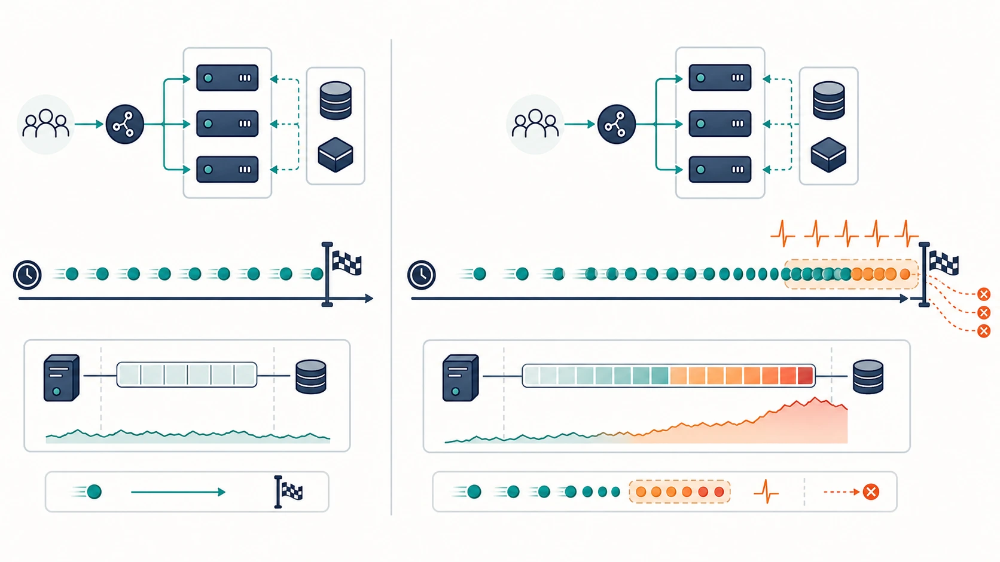
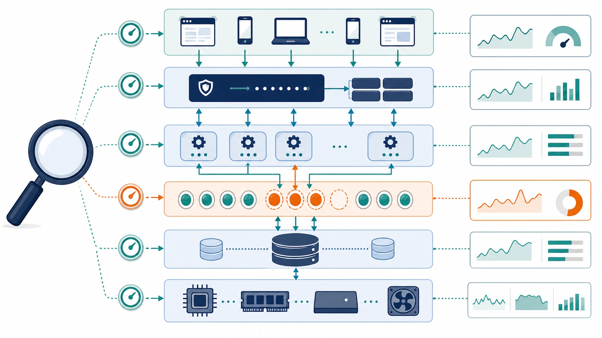
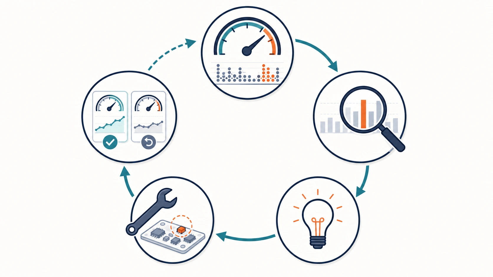

# Benchmark 00: 公式 Rust 初期実装

[チューニング目次へ戻る](../TUNING.md)

## 目的

改善前の再現条件を固定し、「正しさの問題」と「負荷増加で顕在化する性能問題」を分けます。この記録が後続ベンチマークの比較基準です。

> **用語補足**
>
> - **revision**: コードと設定の「ある時点の版」です。hashを指定すると、同じ内容を再び開けます。
> - **statement digest**: 数値やIDの違いを除いて同じ形のSQLをまとめた集計単位です。同種SQLの回数と合計時間を確認できます。
> - **累積時間**: 複数connectionで並行して使った時間の合計です。実時間60秒のベンチでも、合計は60秒を超えることがあります。

## 対象 revision

`jj log` でローカル変更履歴をたどり、最初に公式ソースを取り込んだ
`ef9265541d50`（`feat(isucon14): add Rust Docker benchmark environment`）だけを
一時的な working copy として開きました。公式 ISUCON14 ソースの pin は
`53f8b627e040c30ebec600457c6c97da008b84b0` です。

この revision には、後続で追加した secondary INDEX、通知処理の transaction
削減、SQL の集約、matcher 改善は含まれません。計測後は最新の改善版
`4a07d8d7defd` へ戻しています。

## 結果

| 条件 | 走行時間 | pass | スコア | 主なエラー |
|---|---:|---:|---:|---|
| 初回・共有負荷あり | 10秒 | true | 394 | 非致命のユーザー登録エラー1件 |
| 初回・共有負荷あり | 60秒 | false | 0 | `CODE=32` 長時間マッチングされない |
| 静穏時の再計測 | 60秒 | true | 5,906 | `CODE=26` 1件 |

初回60秒走行時のエラー数は `3:2 25:5 32:10` でした。コンテナは走行中も
healthyでしたが、Webアプリのログでは通常数ms以下のSQLが十数秒以上かかり、
DB接続プールの取得にも待ちが発生していました。

静穏時の再計測は 2026-07-24 11:15:18–11:16:25 UTC に行いました。ホストと
Colima は従来どおり 4 CPU / 4 GiB のままです。外部コンテナによる大きな
共有負荷がないことを確認し、同じ初期実装を build して60秒走らせました。
最終評価数は64、マッチング不満足度は85.9%、乗車地点到達は98.4%、
走行は82.0%でした。

再計測が合格したことは、初期実装が十分に速いことを意味しません。5,906点は
最新改善版の静穏時実測53,198点より大幅に低く、特にマッチング不満足度85.9%は、
割当の遅さが多くの評価機会を失わせていることを示します。

## 再計測で確認したログ

### HTTP 件数

nginx access log を同じ時刻範囲で集計しました。

| 経路 | 件数 |
|---|---:|
| `GET /api/app/notification` | 18,359 |
| `GET /api/chair/notification` | 24,145 |
| `POST /api/chair/coordinate` | 12,762 |
| `GET /api/internal/matching` | 87 |

主な status は `200: 58,727`、`201: 121`、`202: 91`、`204: 346`、
`304: 7,765`、`499: 47` でした。`499` はクライアントが応答を待ち切れず
接続を閉じたことを表します。合格していても、余裕が十分ではないことが分かります。

### transaction 集計

`performance_schema.events_statements_summary_by_digest` を走行直後に確認しました。

| statement | 回数 | 累積時間 | 平均 |
|---|---:|---:|---:|
| `BEGIN` | 147,846 | 10.181秒 | 0.069ms |
| `COMMIT` | 139,960 | 596.482秒 | 4.262ms |
| `ROLLBACK` | 7,875 | 0.792秒 | 0.101ms |

slow statement 警告は104件でした。connection pool 取得待ちの警告は
記録されませんでした。`COMMIT` は1回平均では約4.3msですが約14万回あるため、
累積では約596秒です。ここから「COMMIT 自体だけを速くする」と決めるのではなく、
空の通知pollingを含む不要な transaction の回数を減らせないか、という仮説を
立てました。

### 初期化後の件数

ベンチ終了時は `users: 637`、`chairs: 538`、`rides: 841`、未割当rideは0件
でした。未割当が0件でも、割当まで長く待ったrideが多ければマッチング不満足度は
高くなります。「最後にキューが空だった」と「期限内に素早く割り当てた」は
別の指標として扱います。

## なぜ同じ初期実装で結果が変わったか

初回計測時は、ISUCON環境以外のコンテナも同じ仮想マシンのCPU・memory・I/Oを
使用していました。静穏時の再計測ではその外部負荷が存在しませんでした。
コード、データ、ベンチ時間が同じでも、共有資源の待ち時間が変わればtimeoutの
有無とスコアは変わります。

この差は外部負荷が唯一の原因だと証明するものではありません。ベンチ自体にも
生成される操作の揺れがあります。そのため以後は次を守ります。

- 比較する走行では外部コンテナの有無をそろえる
- ホストとColimaのCPU・memoryを変更しない
- passとスコアだけでなく、エラー、不満足度、HTTP件数、SQL累積時間を残す
- 1回だけの小差は改善と断定せず、必要なら再走して分布を比べる

*短時間の成功だけで判断せず、負荷とデータが増えた後の待ち・timeoutまで観測します。*

## なぜ10秒と60秒を比較するか

初回の共有負荷条件では、同じコードと初期データで10秒は合格し、60秒は時間経過と
ともに失敗しました。この差から、最初からAPI仕様やレスポンス形式が間違っている
可能性より、次のいずれかを優先しました。

- リクエストとデータの増加で全件走査が重くなる
- 高頻度pollingでSQL回数が増える
- transactionやlockの待ちが蓄積する
- 重いAPIがDB接続を占有し、matcherが順番待ちになる
- MySQL、アプリ、ベンチマーカーを同居させたことによるCPU・I/O競合

`docker compose ps` のhealthyは「プロセスがhealthcheckへ応答できた」ことだけを示します。ベンチマーカーのタイムアウト内にすべてのAPIが応答できることは保証しないため、healthcheckだけでは性能上の正常を判断しません。

## どこを、なぜ確認したか

### エラーコードとHTTP経路

致命エラーはmatcherの期限超過ですが、matcherだけが遅いとは限りません。すべてのAPIが同じMySQLと接続プールを共有しているため、オーナー集計や座標更新が接続を占有すると、短いmatcherのSQLも待たされます。

ベンチログでは致命エラーの前に `/api/owner/chairs`、`/api/chair/coordinate`、通知APIの応答遅延が見えました。そのため、最後に失敗したAPIだけでなく、その直前に負荷を作った経路も調査対象にしました。

### 初期データ量とINDEX

`POST /api/initialize` の直後に件数と索引を確認しました。

| テーブル | 行数 | 初期INDEX |
|---|---:|---|
| `chairs` | 500 | 主キーのみ |
| `chair_locations` | 21,209 | 主キーのみ |
| `rides` | 750 | 主キーのみ |
| `ride_statuses` | 4,496 | 主キーのみ |

高頻度APIは `access_token`、`chair_id`、`ride_id` で検索し、`created_at` や `updated_at` で最新1件を選びます。しかし、初期状態ではそれらの検索を支える索引がありません。

### 単発時間と回数

性能影響は、おおむね「1回のコスト × 実行回数 × 同時実行数」です。

- 単発8msでも毎秒数百回ならDB時間を使い切る
- 単発250msでも1分に1回なら影響が限定的な場合がある
- 1本のSQLが速くても、N+1で数百本発行すれば遅い

そのため、`EXPLAIN ANALYZE` の単発時間だけではなく、`performance_schema` の回数・累積時間とHTTPタイムアウトを併せて確認します。

## 使用する計測と限界

| 計測 | 分かること | 限界 |
|---|---|---|
| `EXPLAIN ANALYZE` | operator、実走査行数、sort、一時表、単発時間 | 並行負荷とlock待ちは再現しない |
| `performance_schema` | statement種類ごとの回数、累積時間、平均 | prepared statement本文を十分に集約できない場合がある |
| `SHOW FULL PROCESSLIST` | その瞬間の実行中・待機中SQL | 短いSQLを捕まえにくい |
| Axum/nginxログ | タイムアウトしたHTTP経路 | DB、CPU、ネットワークの原因分離が必要 |
| `docker stats` | CPU、メモリ、block I/O | 瞬間値と累積値を混同しない |

*HTTP、connection pool、SQL、CPU・I/Oを重ねて見ると、「最後に失敗したAPI」と「最初に詰まらせた処理」を分けられます。*

## 最初の仮説

初期スキーマの索引不足により、高頻度の認証、最新位置、最新ライド、最新status取得が毎回全件走査とsortを行い、リクエスト増加とともにMySQLの待ち行列を作っていると仮定しました。

この仮説は、次のいずれかで反証できます。

- 実行計画が変更前からindex lookupになっている
- 索引追加後も走査行数が減らない
- 同じ60秒条件で処理量やスコアが改善しない

*計測→仮説→小さな変更→同条件で再計測を1周ずつ回し、悪化した変更を戻せるようにします。*

結果と変更内容は [01-indexes.md](./01-indexes.md) に記録します。
