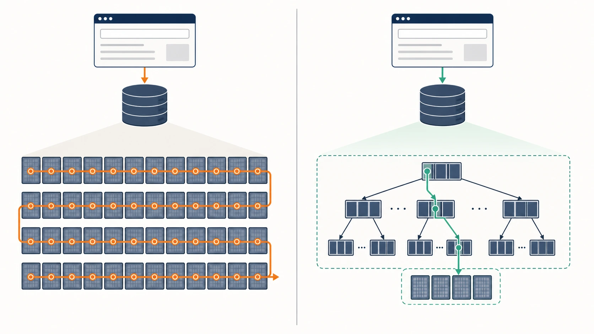
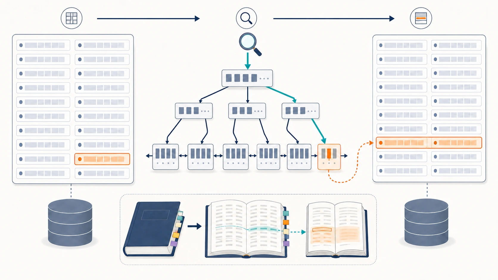
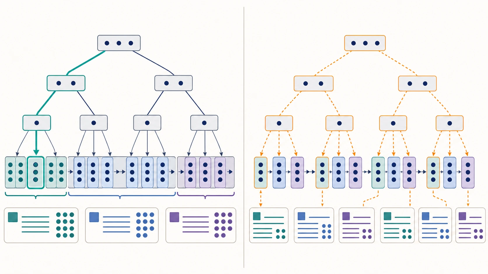
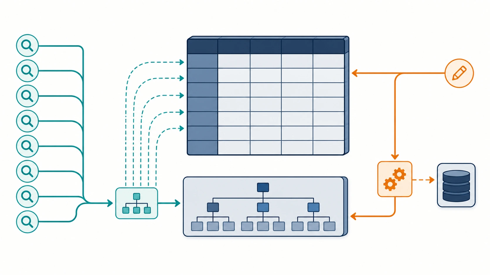

# Benchmark 01: B-tree INDEX 追加

[チューニング目次へ戻る](../TUNING.md)

## この回の目的

[初期ベンチ](./00-baseline.md) で確認した全件走査を、検索条件と並び順に合うINDEXで減らします。

先に結論を書くと、今回の変更は「毎回すべてのデータを読んで探す」処理を、「あらかじめ並べた索引から必要な場所だけ読む」処理へ変えるものです。

## 本の索引にたとえる

500ページの本から「transaction」という語を探す場面を考えます。

- 索引なし: 1ページ目から順に全ページを見る
- 索引あり: 巻末の索引で `transaction → 120ページ` を調べる

DBのINDEXも同じ目的です。ただし、INDEX自体もデータとして保持され、INSERTやUPDATE時には索引の並びも更新する必要があります。検索は速くなりますが、書き込みと保存容量にはコストが増えます。



_左は全ページを順番に確認する全件走査、右はB-treeをたどって必要な範囲だけを読むINDEX検索を表します。_

## MySQLのB-tree INDEX

InnoDBの通常の `INDEX` はB-treeです。キーを大小順に保つ木構造で、比較しながら対象範囲へ降ります。



_INDEXはテーブル本体の複製ではなく、並べたキーと行への手掛かりを持つ別の構造です。rootから比較を繰り返してleafへ降り、候補の主キーから必要な行だけを読みます。_

> **用語補足**
>
> - **root / leaf**: rootは探索を始める木の入口、leafは並べたキーが置かれる末端です。
> - **lookup**: キーを使って目的の行や範囲へ直接たどる検索です。先頭から読むscanと対比して使います。
> - **buffer pool**: テーブルやINDEXのページを保持するMySQLのメモリ領域です。INDEXを増やすと、この領域も追加で使います。

テーブルの行数を `N` とした大まかな計算量は次のとおりです。

| 方法             | 大まかな処理量 | 1万行のイメージ  |
| ---------------- | -------------- | ---------------- |
| 全件走査         | `O(N)`         | 最大1万行を確認  |
| B-treeの位置探索 | `O(log N)`     | 木を十数段たどる |

実際の時間はcache、ディスク、取得カラム数、同時実行数でも変わります。`O(log N)` だから必ず何倍という意味ではありません。重要なのは、データが増えたときに確認行数が同じ割合で増えにくいことです。

### セカンダリINDEXと主キーlookup

主キー以外に作るINDEXをセカンダリINDEXと呼びます。InnoDBのセカンダリINDEXの末端には主キーも入っています。

`SELECT *` の場合は次の2段階になることがあります。

1. セカンダリINDEXで条件に合う主キーを見つける
2. 主キーを使ってテーブル本体から全カラムを読む

INDEXだけで処理が終わるわけではありませんが、2万行をすべて読む代わりに、候補1行の本体だけを読めます。

## 複合INDEXと列順

複数カラムのINDEXを複合INDEXと呼びます。

```sql
INDEX example (chair_id, created_at)
```

これは「椅子IDで並べ、同じ椅子IDの中を作成時刻で並べる」構造です。電話帳を「姓→名」の順で並べるのと似ています。

`INDEX (姓, 名)` なら次の検索が得意です。

- 姓が田中の人を探す
- 姓が田中、名が太郎の人を探す
- 姓が田中の中で、名の順に最初の人を取る

一方、名だけが太郎の人を探すのは苦手です。先頭の「姓」が決まらず、電話帳の広い範囲を見る必要があるためです。これを複合INDEXの左端一致、またはleftmost prefixと呼びます。



*複合INDEXは列の集合ではなく順序を持ちます。先頭列で範囲を狭められる並びをSQLごとに選びます。*

### `WHERE` と `ORDER BY` を同時に助ける

次のSQLを考えます。

```sql
SELECT *
FROM chair_locations
WHERE chair_id = ?
ORDER BY created_at DESC
LIMIT 1;
```

`(chair_id, created_at)` があると、MySQLは次のように処理できます。

1. `chair_id = ?` の範囲へ移動
2. その範囲は `created_at` 順に並んでいる
3. 末尾から1件だけ読む

INDEXがない場合は、全位置履歴から対象椅子を探し、時刻順にsortし、最後の1件を選びます。`LIMIT 1` があっても、どれが最新か分からなければ候補を読む必要があります。

### `NULL` もINDEXへ入る

MySQLのB-treeには `NULL` も格納されます。したがって `(chair_id, created_at)` は未割当ライドにも使えます。

```sql
SELECT *
FROM rides
WHERE chair_id IS NULL
ORDER BY created_at
LIMIT 1;
```

## 修正前の実行計画

初期データで `EXPLAIN ANALYZE` を実行しました。

| SQLの用途        |   行数 | 修正前の処理                  | 単発時間 |
| ---------------- | -----: | ----------------------------- | -------: |
| 椅子のtoken認証  |    500 | chairsをtable scan            |   1.51ms |
| 未割当の最古ride |    750 | ridesをscanしてsort           |  0.193ms |
| 最新ride status  |  4,496 | ride_statusesをscanしてsort   |   3.34ms |
| 椅子の最新位置   | 21,209 | chair_locationsをscanしてsort |   8.07ms |

`table scan` は全件走査、`sort` は条件に合う行を並べ直す処理です。単発8msは小さく見えますが、位置・通知APIから繰り返し呼ばれると、並行数との積でDB時間を消費します。

## 追加したINDEX

### `chairs`

```sql
INDEX idx_chairs_access_token (access_token)
INDEX idx_chairs_owner_id (owner_id)
INDEX idx_chairs_is_active (is_active)
```

| INDEX          | 使う処理                 | なぜ必要か                                                |
| -------------- | ------------------------ | --------------------------------------------------------- |
| `access_token` | 椅子認証middleware       | 座標・通知など、ほぼすべての椅子APIでtokenから1椅子を探す |
| `owner_id`     | オーナーの椅子一覧・売上 | 500椅子から対象オーナーの4椅子だけへ絞る                  |
| `is_active`    | matcherの候補選択        | 稼働中の椅子だけを候補にする                              |

`is_active` はtrue/falseの2値なので、選択性が低いINDEXです。選択性とは「INDEXでどれだけ少ない候補へ絞れるか」です。半数がtrueなら半数を読むため効果は限定的です。また `ORDER BY RAND()` の乱数評価とsortは残ります。後続ベンチで有効性を判断します。

`access_token` を `UNIQUE` にはしませんでした。現行スキーマは一意制約を宣言していないため、性能改善だけを目的にデータ制約まで強くしないためです。

### `chair_locations`

```sql
INDEX idx_chair_locations_chair_created_at
  (chair_id, created_at)
```

最初に椅子を絞り、その椅子の履歴を時刻順に読みます。逆の `(created_at, chair_id)` では、全椅子の時刻順が先になるため、特定椅子の履歴が1か所にまとまりません。

### `rides`

```sql
INDEX idx_rides_user_created_at
  (user_id, created_at)
INDEX idx_rides_chair_created_at
  (chair_id, created_at)
INDEX idx_rides_chair_updated_at
  (chair_id, updated_at)
```

| INDEX                    | 目的                                                             |
| ------------------------ | ---------------------------------------------------------------- |
| `(user_id, created_at)`  | 1利用者のride履歴を作成順に読む                                  |
| `(chair_id, created_at)` | 椅子別ride、または `chair_id IS NULL` の未割当rideを作成順に読む |
| `(chair_id, updated_at)` | 椅子へ現在割り当てられた、最後に状態更新されたrideを読む         |

`created_at` と `updated_at` を1本へまとめなかった理由も左端一致です。`(chair_id, created_at, updated_at)` では、`created_at` の条件がないSQLが3列目の `updated_at` 順を効率よく使えません。

### `ride_statuses`

```sql
INDEX idx_ride_statuses_ride_created_at
  (ride_id, created_at)
INDEX idx_ride_statuses_ride_app_sent_at
  (ride_id, app_sent_at, created_at)
INDEX idx_ride_statuses_ride_chair_sent_at
  (ride_id, chair_sent_at, created_at)
```

用途は次の3つです。

- 最新status: 1rideへ絞り、`created_at` の末尾1件
- 利用者へ未送信の最古status: `app_sent_at IS NULL` の先頭1件
- 椅子へ未送信の最古status: `chair_sent_at IS NULL` の先頭1件

送信時刻を2列目に置くことで、「未送信」の行が連続した範囲になります。その中は `created_at` 順なので、追加sortなしで最古1件を取れます。

## 修正後の実行計画

| SQLの用途        | 修正後                 | 単発時間 |    改善 |
| ---------------- | ---------------------- | -------: | ------: |
| 椅子のtoken認証  | token INDEXで1件lookup |  0.033ms |  約46倍 |
| 未割当の最古ride | `NULL` 範囲の先頭      |  0.010ms |  約19倍 |
| 最新ride status  | ride範囲の末尾         |  0.226ms |  約15倍 |
| 椅子の最新位置   | chair範囲の末尾        |  0.077ms | 約105倍 |

倍率は単発測定の参考値です。重要なのは、データが増えても「全履歴を読む」形から「対象範囲の1件を読む」形へ変わったことです。

## INDEXのコスト

INDEXは検索用の別データなので、増やすほど次の負担も増えます。

- INSERT時にテーブル本体とINDEXへ書く
- UPDATEでINDEX対象カラムが変われば並べ直す
- DELETE時にINDEXからも削除する
- ディスクとMySQLのbuffer poolを使う
- 似たINDEXが増えると、用途と削除判断が難しくなる



*読み取り経路は短くなりますが、書き込み時はテーブル本体と各INDEXの両方を更新します。*

そのため、全カラムへ機械的にINDEXを付けません。高頻度で、実行計画が全件走査で、検索条件と並び順が安定しているSQLだけを対象にしました。

## 他の選択肢

| 選択肢                         | 利点                           | 最初に選ばなかった理由                       |
| ------------------------------ | ------------------------------ | -------------------------------------------- |
| Rustメモリへcache              | DB readを大幅に減らせる        | 更新との同期、再起動、複数プロセス対応が必要 |
| Redis                          | 高速lookupを複数プロセスで共有 | 新サービスと同期処理が増える                 |
| partition                      | 大量履歴を範囲分割できる       | 2万行規模では複合INDEXの方が小さい変更       |
| covering index                 | テーブル本体を読まずに返せる   | `SELECT *` を覆うINDEXは大きすぎる           |
| 現在状態を別カラム・別表へ保持 | 履歴検索をほぼなくせる         | 書き込み時の同期と初期データ移行が必要       |

## 60秒ベンチ結果

| 状態        |  pass | スコア | エラー数                                 |
| ----------- | ----: | -----: | ---------------------------------------- |
| 初期状態    | false |      0 | `3:2 25:5 32:10`                         |
| INDEX追加後 | false |    364 | `1:20 3:2 7:1 17:5 21:2 25:7 30:1 32:10` |

スコアは改善したため、INDEX不足という仮説は一部確認できました。しかし `pass=false` のままで、別のボトルネックが残っています。

次は「INDEXをさらに増やす」のではなく、60秒中に約1.3万回発生したtransaction開始を調べます。続きは [02-notification-transactions.md](./02-notification-transactions.md) を参照してください。
