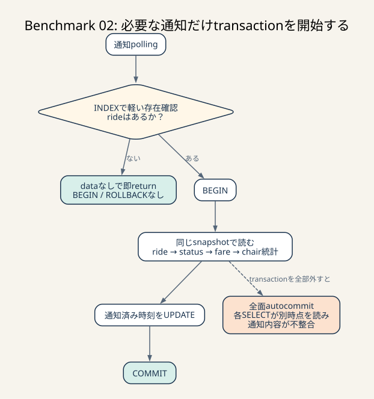

# Benchmark 02: 空の通知pollingではtransactionを開始しない

[チューニング目次へ戻る](../TUNING.md)

## 結果

| 状態 | 走行時間 | pass | スコア | CODE=33 |
|---|---:|---:|---:|---:|
| INDEX追加直後 | 60秒 | false | 364 | 0 |
| 全面autocommit化した失敗実験 | 60秒 | false | 1,588 | 2 |
| 空pollingだけ早期return | 60秒 | true | 2,357 | 0 |

全面autocommit化は速くなりましたが、通知内容が不正になったため採用していません。最終実装は、ライドがない正常系だけをtransaction開始前に返し、通知内容を組み立てる処理はtransactionへ残します。



_rideがなければtransactionを始めず即座に返し、rideがある場合だけ同じsnapshotで通知を組み立てます。_

## 先に要点

transactionは、複数のDB操作を同じ時点のひとまとまりとして扱う仕組みです。銀行振込の「残高を減らす」「相手の残高を増やす」を途中で分割しないために使います。

一方、通知APIは30ms間隔で繰り返し呼ばれます。まだライドがない利用者にも毎回 `BEGIN` し、そのままreturnするとsqlxが `ROLLBACK` していました。

```text
初期実装
  BEGIN
  └─ rideなし → return → ROLLBACK

最終実装
  軽い存在確認
  ├─ rideなし → return
  └─ rideあり → BEGIN → 通知を同じsnapshotで作る → COMMIT
```

「transactionを全部消す」のではなく、「データがなく、まとめる処理もない分岐だけ開始前へ移す」のがポイントです。

> **用語補足**
>
> - **polling**: clientが一定間隔で「新しい通知はあるか」と繰り返し問い合わせる方式です。
> - **snapshot**: transactionが読む、ある時点で整合したデータの見え方です。複数SELECTが同じ時点を基準にできます。
> - **autocommit**: SQLを1文ずつ独立したtransactionとして自動確定する動作です。文と文の間でデータが変わる可能性があります。
> - **rollback**: 未確定の変更を取り消してtransactionを終了する処理です。更新がなくても、開始したtransactionを閉じるために実行される場合があります。

## どのログを確認したか

### MySQLのstatement集計

INDEX追加後の60秒走行で、`performance_schema.events_statements_summary_by_digest` を確認しました。

| 操作 | 回数 | 累積時間 | 平均 |
|---|---:|---:|---:|
| `BEGIN` | 12,979 | 87.784秒 | 6.764ms |
| `COMMIT` | 7,468 | 88.516秒 | 11.853ms |
| `ROLLBACK` | 5,534 | 108.967秒 | 19.690ms |

累積時間は並行connectionの待ちを合算するため、約285秒を60秒の壁時計と直接比較できません。ただし、transaction境界が1万回規模で、特に正常な空polling由来のrollbackが多いことは判断できます。

別走行の累積ログでも、`ROLLBACK 5,666回・平均25.201ms` が上位でした。絶対値は初期化処理を含むためBenchmark間の厳密比較には使わず、「どこを次に調べるか」の根拠にしました。

### ベンチマーカーログ

INDEX追加直後は約20秒後から次のtimeoutが増えました。

- CODE=25: `/api/owner/chairs`
- CODE=1: `/api/chair/coordinate`
- CODE=30: `/api/app/nearby-chairs`
- CODE=32: matcherの期限超過

個別SELECTの実行計画は改善していたため、SQL本文以外にconnection poolを長く占有する処理がないか調べました。

## なぜ空pollingがrollbackになるのか

初期実装は関数の先頭で `pool.begin().await?` を呼びます。ライドがなければ `commit()` を通らずreturnし、`Transaction` のdrop時にrollbackされます。

rollback自体は安全な動作です。しかし「何も更新していない」「ライドがないことが正常」という高頻度経路へ毎回必要な処理ではありません。

Rust / sqlxの型と借用は [80-rust-implementation.md](./80-rust-implementation.md) で説明しています。

## 最初の仮説

通知処理全体を `pool.acquire()` に替え、各SQLをautocommitにすれば、BEGIN・COMMIT・ROLLBACKとpool保持時間を減らせると考えました。

反証条件も先に決めました。

- transaction回数が減らない
- スコアが改善しない
- 通知の正当性エラーが増える

## 失敗実験: 全面autocommit化

### 変更

- `app_get_notification` と `chair_get_notification` の `pool.begin()` を `pool.acquire()` へ変更
- commitを削除
- 椅子通知の `FOR SHARE` を削除

### ログ

```text
結果 pass=false スコア=1588
種別エラー数=map[1:18 8:1 17:2 22:3 25:2 30:3 32:2 33:2]
```

スコアは364から1,588へ伸びました。しかしCODE=33が2件発生しました。

```text
椅子の総乗車回数が一致しません
got: 2, want: 1
```

### どう判断したか

CODE=33は単なるtimeoutではなく、利用者へ返した通知内容が期待値と違う正当性エラーです。アプリ通知は次を複数SQLで読みます。

1. 最新ride
2. 最新または未送信status
3. fareに必要なcoupon
4. chair
5. chairの完了ride数と評価平均

autocommitでは各SELECTが別の時点を見ます。負荷中にride/status/evaluationが更新されると、レスポンス内のstatusと椅子統計が違う時点の値になり得ます。

速度仮説の一部は当たりましたが、反証条件「正当性エラーが増える」に該当したため変更を撤回しました。スコアだけを見て採用しない例です。

## 採用した仮説

通知データがある場合のtransactionは必要です。一方、ライドが1件もない場合は通知データを組み立てません。

そこで、INDEXで支えられた軽い存在確認だけをtransaction前へ置きます。

```sql
SELECT id
FROM rides
WHERE user_id = ?
ORDER BY created_at DESC
LIMIT 1;
```

椅子側は `(chair_id, updated_at)` INDEXを使う同じ形です。

存在した場合はtransactionを開始し、rideを同じsnapshot内でもう一度取得します。1回余分にSELECTしますが、空pollingの多数のBEGIN/ROLLBACKを避ける効果を優先しました。

## なぜ二度rideを読むのか

存在確認で取得したrideをそのまま使えばSQLは1回少なくなります。しかし、そのrideはtransaction開始前に読んだ値です。その後のstatusやchair統計だけをtransaction snapshotで読むと、また異なる時点を混ぜます。

```text
存在確認: transaction外、結果は分岐にだけ使う
BEGIN
ride再取得: ここからレスポンス用
status取得
chair統計
通知済みUPDATE
COMMIT
```

最初のSELECTは「transactionを始める必要があるか」だけに使い、APIレスポンスはtransaction内の値だけで作ります。

## 他の選択肢

| 選択肢 | 利点 | 今回の判断 |
|---|---|---|
| 空poll時も明示commit | rollbackを避ける | BEGIN/COMMITが毎回残る |
| 全面autocommit | 最もtransaction数が減る | CODE=33が発生したため不採用 |
| `FOR UPDATE SKIP LOCKED` | 重複通知を防ぎやすい | 競合時のAPI動作が変わるため別課題 |
| polling間隔を増やす | リクエスト数を直接減らす | 通知遅延がベンチ評価へ影響する |
| SSE / long polling | polling回数を減らせる | APIとfrontendの変更が大きい |
| pool上限を増やす | 一時的に待ちを減らす | DBへの同時SQLが増えて悪化し得る |

## 最終検証

- `cargo fmt`: 成功
- `cargo test`: 3 suite、失敗0
- 60秒ベンチ: `pass=true`
- スコア: 2,357
- CODE=33: 0

この走行では後半にowner、nearby、coordinateのtimeoutが残りました。通知の正当性は回復したため、本変更を採用し、次は最初に詰まったowner SQLをBenchmark 03で扱います。
