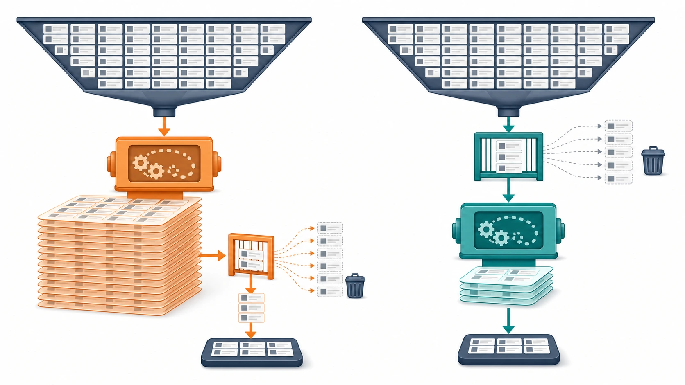
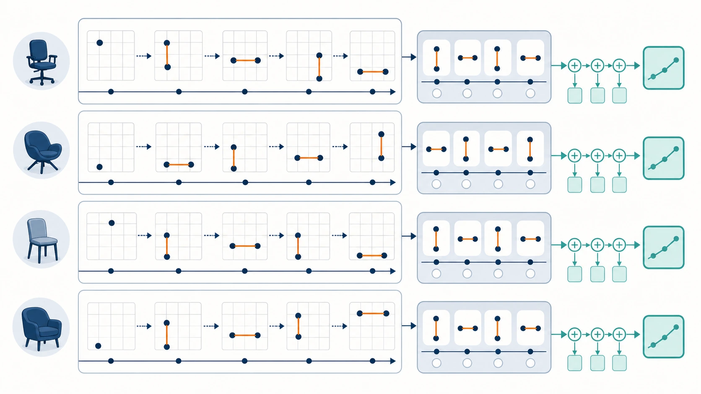
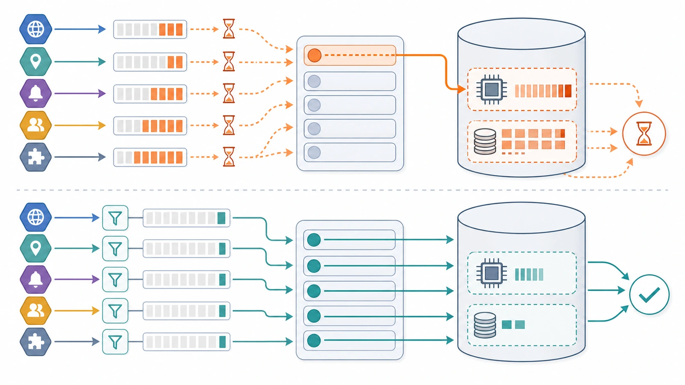

# Benchmark 03: ownerの椅子だけを先に集計する

[チューニング目次へ戻る](../TUNING.md)

## 結果

| 状態 | 走行時間 | pass | スコア | エラー |
|---|---:|---:|---:|---|
| Benchmark 02 | 60秒 | true | 2,357 | CODE=1, 2, 3, 7, 17, 22, 25, 30, 32 |
| owner SQL改善後 | 60秒 | true | 5,601 | 0 |

1つのSQLの処理対象を早い段階で絞った結果、スコアは約2.38倍になり、ベンチマーカーが記録するエラーは0になりました。

## 先に要点

`/api/owner/chairs` は、あるownerが持つ椅子について、登録情報と累積移動距離を返します。

初期SQLは次の順序でした。

```text
全ownerの全椅子について移動距離を計算
  ↓
最後に、依頼されたownerの椅子だけを選ぶ
```

改善後は順序を逆にします。

```text
依頼されたownerの椅子だけを選ぶ
  ↓
その椅子の位置履歴だけで移動距離を計算
```

図書館で「Aさんが借りた本」を調べるために、全利用者の貸出履歴を集計して最後にAさんを探す必要はありません。先にAさんの利用者番号で絞る方が、同じ答えを少ない作業で求められます。



*filterをwindow計算の外側だけに置かず、入力段階へ押し込むとsortと一時表も小さくなります。*

> **用語補足**
>
> - **window関数**: 行を1件にまとめず、各行を残したまま同じグループの前後行や集計値を参照するSQL機能です。
> - **filterの押し込み**: 重いsortや集計より前へ絞り込み条件を移すことです。後段へ渡す行が減るため、計算と一時データが小さくなります。
> - **一時表**: queryの途中結果を置く作業領域です。大きくなるとメモリを使い、収まらなければdisk I/Oも増えます。

## APIと計算内容

椅子の位置は `chair_locations` に履歴として追加されます。隣り合う位置のマンハッタン距離を足して累積距離を求めます。

```text
(0, 0) → (1, 2) → (3, 2)
 距離3      距離2
 合計5
```

SQLの `LAG()` は、同じ椅子の1つ前の位置を参照するwindow関数です。

```sql
LAG(latitude) OVER (
  PARTITION BY chair_id
  ORDER BY created_at
)
```

- `PARTITION BY`: 椅子ごとにグループを分ける
- `ORDER BY`: 位置を時刻順に並べる
- `LAG`: 1つ前の行を取得する



*`PARTITION BY` で椅子ごとに分け、`LAG` で連続する2地点だけを比較して距離を足します。*

## どのログを確認したか

### ベンチマーカーログ

Benchmark 02は前半に処理できたものの、後半で最初に繰り返し現れたのがCODE=25でした。

```text
オーナーの椅子一覧の取得に失敗しました (CODE=25)
GET /api/owner/chairs
context deadline exceeded
```

その後にnearby、coordinate、matcherなどもtimeoutしました。最初にDBを長く占有した処理が、他APIの待ちを連鎖的に増やした可能性があるため、owner SQLの実行計画を確認しました。

### 変更前の `EXPLAIN ANALYZE`

元SQLは全椅子の位置履歴22,078行をwindow関数へ渡し、単発で約246msかかりました。外側に `WHERE owner_id = ?` があっても、内側のsubqueryにはowner条件がないためです。

INDEXは本の索引のように対象行を見つける仕組みですが、SQLが「全員分を集計する」と指定している場合、MySQLは全員分を処理します。INDEXを追加するだけではSQLの要求内容は変わりません。

### 候補SQLの事前計測

対象ownerが4椅子だった計測では、window関数へ渡る行が22,078行から253行へ減り、約25.5msでした。

| SQLの形 | window対象行 | 単発時間 |
|---|---:|---:|
| 変更前 | 22,078 | 約246ms |
| ownerで先に絞る | 253 | 約25.5ms |

行数は約87分の1、実行時間は約9.6分の1です。

### 実装後の再確認

smoke test後の初期データで、選ばれたownerは100椅子を持っていました。改善SQLは次の計画になりました。

```text
idx_chairs_owner_idでownerの100椅子を取得
  ↓
idx_chair_locations_chair_created_atで位置3,972行を取得
  ↓
3,972行だけをwindow計算
  ↓
actual time 約30.3ms
```

事前計測の253行とはデータ条件が違うため、25.5msと30.3msを直接比較しません。重要なのは、全椅子の履歴ではなく対象ownerの履歴だけを処理したことです。

## 仮説

window関数の前に `owner_id` で椅子を絞れば、一時表、sort、window計算が小さくなります。owner APIがDBを占有する時間が減るため、同じMySQLを使う座標更新、nearby、matcherの待ちも減ると考えました。

反証条件は次のとおりです。

- 実行計画が全位置履歴を読む
- CODE=25が同程度に残る
- owner APIだけ速くなり、総スコアが改善しない
- レスポンスの距離または椅子数が変わり、正当性エラーになる

## 修正

window関数の入力subqueryへ `chairs AS owner_chairs` をjoinし、そこでownerを絞ります。

```sql
FROM chair_locations
INNER JOIN chairs AS owner_chairs
        ON owner_chairs.id = chair_locations.chair_id
WHERE owner_chairs.owner_id = ?
```

外側の `WHERE chairs.owner_id = ?` も残します。内側の条件は「距離を計算する位置履歴」を絞り、外側の条件は「APIレスポンスに返す椅子」を絞るため、役割が違います。

Rustの結果型から、APIレスポンス作成に使わない `owner_id`、`access_token`、`updated_at` も外し、SQLの `SELECT *` 相当を避けました。これは転送量を少し減らし、型を「この処理が必要とする列」の仕様書にします。

## なぜ結果が全体へ効いたのか

単発で200ms程度の差でも、owner APIは負荷中に何度も呼ばれます。また、重いwindow計算はCPUだけでなくsort用の一時表やmemoryも使います。

```text
重いowner SQL
  ├─ MySQL CPUを長く使用
  ├─ connectionを長く保持
  ├─ 他SQLが待つ
  └─ HTTP timeoutが連鎖
```

改善後のエラーmapが空になったことから、以前のCODE=1やCODE=30も個別の処理だけが原因ではなく、owner SQLによる共有DBの混雑の影響を受けていたと推測できます。これはログからの推論であり、nearbyのN+1自体が消えたわけではありません。



*対象行を早く絞るとowner APIだけでなく、同じpoolとMySQLを使う短いAPIの待ちも減ります。*

## 他の選択肢

| 選択肢 | 読み取り | 書き込み・整合性 | 判断 |
|---|---|---|---|
| ownerで先に絞って毎回集計 | 対象owner分のみ | 変更なし | 最小変更として採用 |
| `chairs` に累積距離を持つ | 椅子行だけ | 座標更新ごとに差分加算 | 読み取り最速だが更新が増える |
| 集計専用テーブル | 集計済み行だけ | 履歴と同時更新が必要 | 責務は明確だが同期設計が必要 |
| cache | hit時はDB不要 | 失効と再構築が必要 | 複数process化の後に検討 |

## 検証

- `cargo fmt`: 成功
- `cargo test`: 3 suite、失敗0
- Docker incremental release build: Cargo 7.03秒、壁時計11.02秒
- smoke test: 成功
- `EXPLAIN ANALYZE`: 対象ownerの位置履歴だけを処理
- 60秒公式ベンチ: `pass=true`、スコア5,601、エラー0

次は、現在エラーになっていなくても負荷増加時に問題化する `app_get_nearby_chairs` のN+1をBenchmark 04として独立に扱います。
