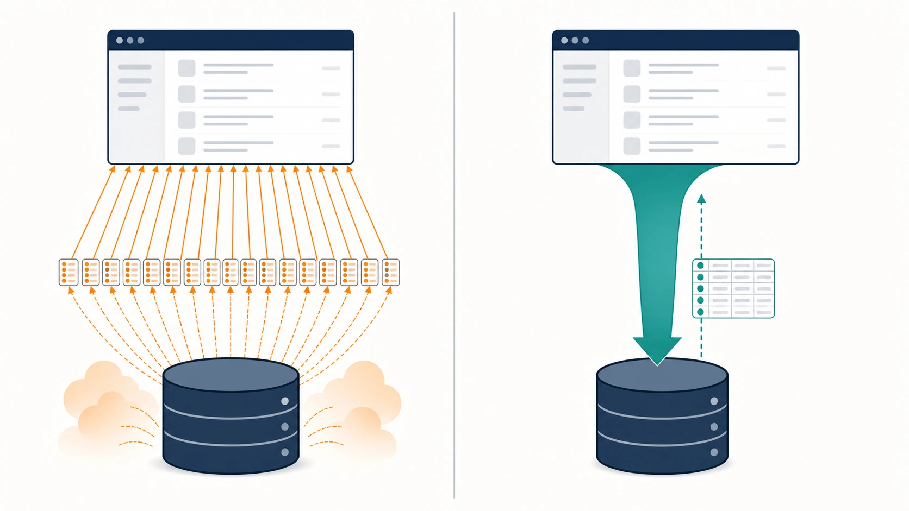
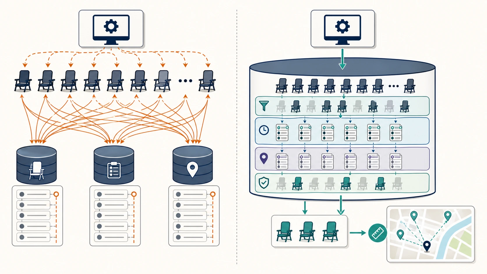
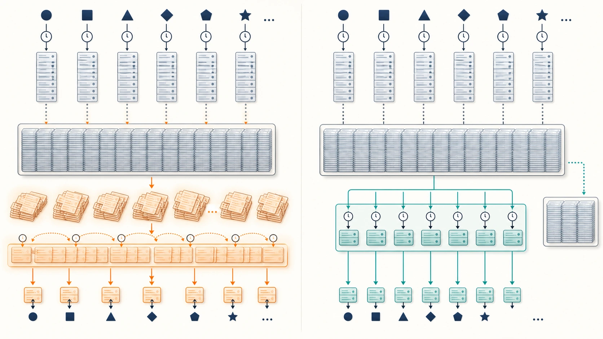

# Benchmark 04: nearby-chairsのN+1を1 SQLへまとめる

[チューニング目次へ戻る](../TUNING.md)

## 結果

| 項目 | Benchmark 03 | Benchmark 04 |
|---|---:|---:|
| 60秒pass | true | true |
| スコア | 5,601 | 4,116 |
| エラー | なし | `CODE=26` 1件 |
| nearbyの主要SQL回数 | `1 + C + C×R + C` | 1 |
| 候補SQL単発時間 | 未計測 | 約1.96ms |

SQLの往復回数は設計どおり1回まで減りました。一方、60秒スコアは直前より下がり、ownerの累積距離反映が遅い `CODE=26` も1件発生しました。この走行だけから「スコアが改善した」とは判断できません。

変更は正当性検査を通過し、後続のmatcher改善後にはエラー0で16,909点まで処理できたため採用しています。ただし、nearby単独の効果を精密に評価するには同一revisionを複数回走らせ、中央値を比較する必要があります。

## N+1とは

最初の1回で一覧を取得し、その一覧の各要素について追加SQLを発行する問題です。

```text
椅子一覧を1回取得
  ├─ 椅子Aのrideを取得
  ├─ 椅子Bのrideを取得
  ├─ 椅子Cのrideを取得
  └─ ...
```

椅子が `N` 台なら、最初の1回に加えて最大 `N` 回のSQLが必要なのでN+1と呼びます。さらに各rideごとにstatusを取ると、SQL回数は `N × ride数` まで増えます。



*各要素からDBへ戻るloopを、必要な集合をまとめて返す少数のSQLへ置き換えます。*

## 変更前に何を確認したか

`app_get_nearby_chairs` は次を直列に実行していました。

1. 全椅子を取得
2. activeな椅子ごとに全rideを取得
3. 各rideごとに最新statusを取得
4. 空いている椅子ごとに最新位置を取得
5. Rustで現在地とのマンハッタン距離を計算

椅子数を `C`、1椅子あたりride数を `R` とすると、SQL回数は概ね次の規模です。

```text
1 + C + (C × R) + C
```

各SQLへINDEXを付けても、RustとMySQLの往復回数は残ります。1回0.2msでも1,000回を直列実行すれば、SQL実行だけで約200msです。実際にはconnection取得、query送信、decode、allocationも加わります。

## 実装した集合SQL

```sql
SELECT chairs.id,
       chairs.name,
       chairs.model,
       latest_location.latitude,
       latest_location.longitude
FROM chairs
INNER JOIN LATERAL (
    SELECT latitude, longitude
    FROM chair_locations
    WHERE chair_id = chairs.id
    ORDER BY created_at DESC
    LIMIT 1
) AS latest_location ON TRUE
WHERE chairs.is_active = TRUE
  AND NOT EXISTS (
      SELECT 1
      FROM rides
      WHERE rides.chair_id = chairs.id
        AND COALESCE((
            SELECT ride_statuses.status
            FROM ride_statuses
            WHERE ride_statuses.ride_id = rides.id
            ORDER BY ride_statuses.created_at DESC
            LIMIT 1
        ), '') <> 'COMPLETED'
  )
```

このSQLは次の順で候補を絞ります。

1. `chairs.is_active = TRUE` で稼働椅子だけを残す
2. `NOT EXISTS` で最新状態が `COMPLETED` ではないrideを持つ椅子を除く
3. `LATERAL` subqueryで椅子ごとの最新位置を1行だけ取得する
4. Rustへ必要なID、名前、モデル、座標だけを返す
5. Rustでマンハッタン距離を計算し、指定距離以内だけをresponseへ入れる



*DBでactive・最新状態・最新位置をまとめて絞り、Rust側は小さな候補集合の距離計算に集中します。*

> **用語補足**
>
> - **`LATERAL`**: 外側queryの1行を参照できるsubqueryです。ここでは「このchairの最新位置」を同じSQL内で取得します。
> - **materialize**: queryの途中結果を実際に作ってから次の処理へ渡すことです。対象行が多いと作成とsortが重くなります。
> - **snapshot**: 1つのstatementまたはtransactionが基準にする、整合した時点のデータです。
> - **p50 / p95 / p99**: 応答時間を短い順に並べた百分位です。p99は99%がその値以下で、遅い側の1%を含む「裾の遅さ」を見る指標です。

## INDEXが効く理由

このSQLはBenchmark 01で追加した次のB-treeを使います。

- `chairs(is_active)`
- `rides(chair_id, created_at)`
- `ride_statuses(ride_id, created_at)`
- `chair_locations(chair_id, created_at)`

たとえば `(chair_id, created_at)` は、電話帳を「椅子ID、時刻」の順で並べた状態に近いものです。MySQLは対象chairの範囲へ直接移動し、その範囲の末尾から最新行を探せます。`created_at` だけのINDEXでは全椅子の時刻が混ざるため、特定chairの最新行へ直接移動できません。

ベンチ後のDBで `EXPLAIN ANALYZE` を確認すると、active chair 40台、rides 103件の時点で約1.96msでした。計測時は全active chairが使用中だったため返却0件でしたが、各椅子・各rideをRustから個別問い合わせする往復は消えています。

## transactionと時刻を変えた理由

変更前は複数SQLの途中で状態が変わらないようread transactionを保持していました。集合SQLなら1 statement内で整合したsnapshotを読めるため、handler全体でtransactionを保持する必要がありません。query完了直後にpoolへconnectionを返せます。

`retrieved_at` のためだけに実行していた `SELECT CURRENT_TIMESTAMP(6)` も削除し、`Utc::now().timestamp_millis()` を使いました。response仕様はミリ秒なので、秒単位の `.timestamp()` ではなく `.timestamp_millis()` が必要です。

## ログをどう判断したか

60秒走行の最終行は次のとおりでした。

```text
結果 pass=true スコア=4116 種別エラー数=map[26:1]
```

途中ログの `CODE=26` は「owner椅子一覧の `total_distance` 反映が遅い」という警告で、nearby responseの内容不一致ではありません。しかし共有MySQLの待ち時間が原因なら変更と無関係とも断定できないため、成功結果から除外せず記録しました。

スコアは乱数で生成される地域、利用者、移動経路にも左右されます。1回の `5,601 → 4,116` だけを回帰と断定せず、次の事実を分けました。

- 検証できたこと: pass、response正当性、SQL 1回化、実行計画
- まだ断定できないこと: nearby単独のスコア寄与、CODE=26との因果関係

## 他に考えられる選択肢

### window関数で最新位置・最新statusを作る

全対象を一度に順位付けでき、queryの形が明示的です。ただし履歴全体をmaterializeしてsortする計画になると、行数増加時に重くなります。owner改善で確認した「絞り込みをwindow関数より内側へ入れる」工夫が必要です。

### 現在状態テーブルを持つ

```text
履歴テーブル: 過去の全位置・状態を保存
現在状態テーブル: 椅子またはrideごとに最新1行だけ保存
```



readは最も短くできますが、履歴INSERTと現在状態UPDATEを同じtransactionで正しく保つ必要があります。initializeや再起動後の再構築方法も必要になるため、今回は小さい変更を先に検証しました。

### 空間INDEXを使う

R-treeなども候補ですが、現在の距離は整数座標のマンハッタン距離です。MySQLの空間型・空間関数へ移すと距離定義や境界条件を変える可能性があります。まず空車候補を少なくし、距離判定は既存Rust関数へ残しました。

## 次の計測

- 同じrevisionを最低3回走らせ、passした走行の中央値とばらつきを比較する
- `/api/app/nearby-chairs` のp50 / p95 / p99を一時middlewareで採取する
- statement digestで旧N+1 queryが走っていないことを確認する
- CODE=26発生時のowner query時間、pool待ち、座標INSERT時刻を同時採取する
