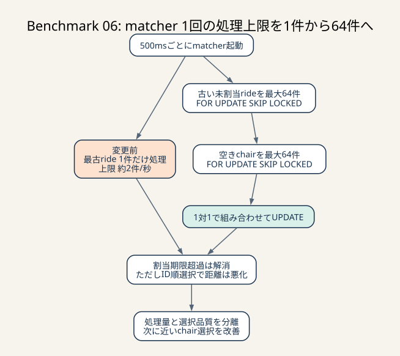
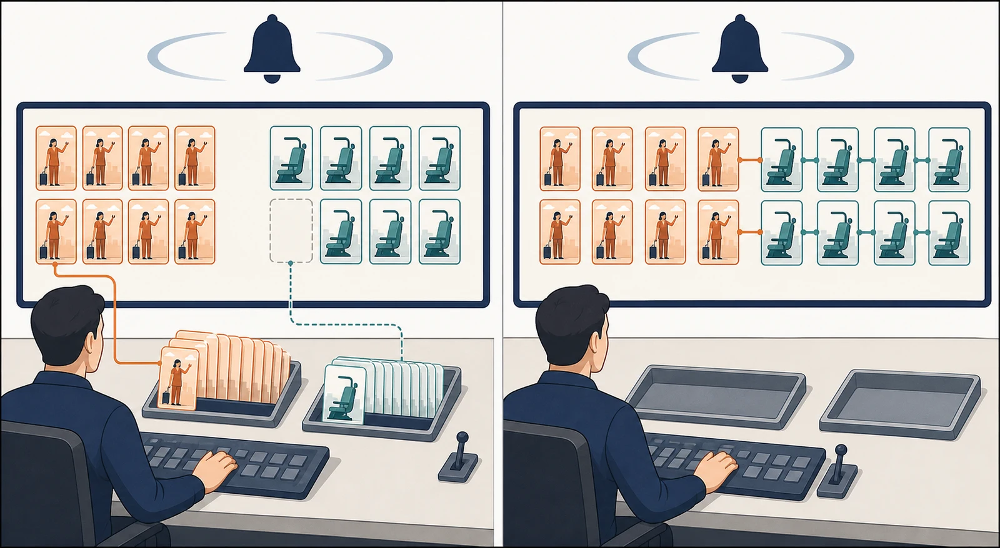

# Benchmark 06: matcherを1件処理からバッチ処理へ変える

[チューニング目次へ戻る](../TUNING.md)

## 結果

| 項目 | Benchmark 05 | Benchmark 06 |
|---|---:|---:|
| 60秒pass | false | true |
| スコア | 4,460 | 2,393 |
| エラー | `CODE=32` 2件 | なし |
| 1回の割当上限 | 1 | 64 |
| matching不満率 | 62.2% | 11.5% |
| 実移動不満率 | 46.7% | 100% |

30秒以内に割り当てられない `CODE=32` は解消しました。一方、椅子をID順で選んだため移動距離が悪化し、passしてもスコアは下がりました。処理量問題と選択方針の問題を分離できたため、バッチ化を残してBenchmark 07で椅子選択だけを改善しました。

## 変更前の処理量上限

matcher containerは500msごとに `/api/internal/matching` を1回呼びます。変更前handlerは1回につき最古rideを1件だけ選び、最大10回ランダムな椅子を試していました。

```text
最大処理量 ≒ 1件 / 0.5秒 = 2件/秒
```

SQLがどれだけ速くても、この上限を超えてrideが作られると待ち行列が伸びます。Benchmark 05の `CODE=32` は、個々のSQLだけでなくこの構造的上限を見る必要があることを示しました。



_batch化はpolling間隔を変えずに1回の処理上限を増やします。期限超過は解消しましたが、ID順のchair選択では距離が悪いため、選択品質は次のBenchmarkで分けて改善します。_

> **用語補足**
>
> - **throughput**: 単位時間に処理できる件数です。ここでは1秒に割り当てられるride数を指します。
> - **batch**: 複数件を1回の処理へまとめる方式です。
> - **claim**: transaction中に行をlockし、「このmatcherが処理する対象」として確保することです。
> - **starvation**: 新しいrideばかり選ばれ、古いrideがいつまでも処理されない状態です。



_左は1回の起動後もrideとchairの待ち行列が残ります。右は同じ起動1回で候補をまとめてclaimし、複数組を割り当てるため、次の起動を待つ件数を減らせます。_

さらに `ORDER BY RAND()` は候補行へ乱数を付けて並べるため、INDEXで先頭1件へ直接移動できません。

## 実装したclaim

1 transaction内で次を行います。

1. `chair_id IS NULL` のrideを古い順に最大64件取得
2. `FOR UPDATE SKIP LOCKED` でride行をclaim
3. activeかつ空いているchairを最大64件取得
4. `FOR UPDATE SKIP LOCKED` でchair行をclaim
5. rideとchairを1対1で組み合わせる
6. `UPDATE ... WHERE chair_id IS NULL` で割り当てる
7. commitする

`FOR UPDATE` は「このtransactionが処理中」と行へ印を付ける操作です。別matcherが同時に来たとき、`SKIP LOCKED` は待たずに別の未claim行を選びます。同じbatch内では使用したchairを候補から除くため、1台を2 ridesへ割り当てません。

`ORDER BY created_at` は最古ride優先を維持します。新しいrideばかり選び、古いrideが永遠に残るstarvationを防ぐためです。

## 空き椅子判定を維持した理由

既存実装は、過去rideごとの `chair_sent_at` 件数が6になった椅子を空きとみなします。これは単にDB上で `COMPLETED` が作られたかだけでなく、椅子clientが一連の通知を受け取ったかを含む条件です。

この条件を同じbenchmarkで変えると、椅子が前rideの完了を認識する前に次rideを割り当てる危険があります。まず処理量だけを変えるため、空き判定の意味は維持しました。

## なぜスコアが下がったか

Benchmark 06では空きchairを `ORDER BY chairs.id` で安定して選びました。ランダムsortをなくし検証しやすくする一方、乗車地点との距離を考慮していません。

最終ログは次のとおりです。

```text
結果 pass=true スコア=2393 種別エラー数=map[]
11.5% ... マッチされるまでの時間に不満
100.0% ... 実移動時間に不満
```

エラー0は競合と期限の正当性を、100%の不満はchair選択policyの悪さを示します。passとscoreは別の指標なので、片方だけを見て成功と判断してはいけません。

## 他の選択肢

- polling間隔を短くする: 1回1件の上限は緩むがHTTP・認証・SQL回数が増える
- ride作成時にその場でmatchする: 遅延は短いがride作成transactionが重くなる
- Tokio background taskへ移す: HTTP往復を消せるが、起動・停止・複数instanceの調停が必要
- current ride列をchairsへ持つ: 空き判定は短くなるが全状態遷移で更新を保つ必要

バッチ化は既存matcher containerを残したまま処理量上限を大きくできるため、最初の変更として選びました。
