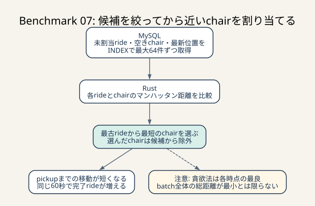
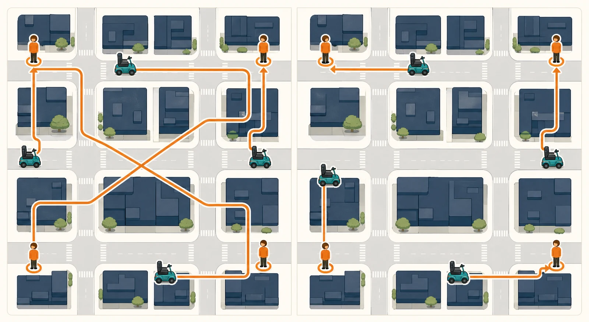

# Benchmark 07: 空き椅子を乗車地点との距離で選ぶ

[チューニング目次へ戻る](../TUNING.md)

## 結果

| 項目 | ID順バッチ | 近傍優先バッチ |
|---|---:|---:|
| 60秒pass | true | true |
| スコア | 2,393 | 16,909 |
| エラー | なし | なし |
| 完了評価数の最終ログ | 25 | 226 |
| matching不満率 | 11.5% | 0.9% |
| pickupまでの不満率 | 96.2% | 61.7% |
| 実移動不満率 | 100% | 78.9% |

スコアは約7.1倍になり、完了評価数は25件から226件へ増えました。バッチ化で待ち時間を減らしたうえで、乗車地点へ近い椅子を選ぶとpickup開始までの時間も短くなり、同じ60秒内により多くのrideが完了します。

## 変更内容

pending rideはIDだけでなく乗車地点を取得します。

```sql
SELECT id, pickup_latitude, pickup_longitude
FROM rides
WHERE chair_id IS NULL
ORDER BY created_at
LIMIT 64
FOR UPDATE SKIP LOCKED
```

available chairは最新位置も一緒に取得します。

```sql
SELECT chairs.id,
       latest_location.latitude,
       latest_location.longitude
FROM chairs
INNER JOIN LATERAL (
    SELECT latitude, longitude
    FROM chair_locations
    WHERE chair_id = chairs.id
    ORDER BY created_at DESC
    LIMIT 1
) AS latest_location ON TRUE
WHERE chairs.is_active = TRUE
  AND NOT EXISTS (/* まだ完了通知を受け取っていないride */)
ORDER BY chairs.id
LIMIT 64
FOR UPDATE SKIP LOCKED
```

Rustは最古rideから順に、候補chairとのマンハッタン距離を計算します。

```text
distance = |ride_latitude - chair_latitude|
         + |ride_longitude - chair_longitude|
```

最小のchairを割り当てたら候補vectorから `swap_remove` し、同じbatchで再利用しません。最大64×64回の整数計算は4,096回で、DB queryを増やすより十分小さい処理です。



_MySQLは正しい候補集合を作り、Rustは最大64×64の距離を比較します。近いchairを選ぶとpickup時間が短くなりますが、貪欲法はbatch全体の距離最小を保証しません。_

> **用語補足**
>
> - **pending ride**: まだchairが割り当てられていないrideです。
> - **available chair**: 稼働中で、前のrideを終えて次の割当を受けられるchairです。
> - **materialize**: DBが組合せなどの途中結果を実際に作ることです。行数が多いとmemoryや一時tableを使います。
> - **局所最適 / 全体最適**: その時点の1組だけに最良なのが局所最適、batch全体の距離合計が最小なのが全体最適です。



_左右は同じ配置です。ID順など位置と無関係な割当ではpickup経路が交差して長くなります。近いchairを選ぶと、利用者へ到着するまでの移動を短くできます。_

## なぜDBだけで最適化しなかったか

SQLでrideとchairの全組合せを作り、距離順に順位を付ける方法もあります。しかし64×64の組合せをDBでmaterializeし、さらに「1 chairは1 rideだけ」という割当制約を解くqueryは複雑です。

今回の責務分担は次のとおりです。

- MySQL: pending・active・空き・最新位置という正しい候補集合を作り、行をlockする
- Rust: 小さい候補集合に対して距離計算と貪欲割当を行う

この形なら既存の `calculate_distance` を再利用でき、距離定義もnearby APIと一致します。

## 貪欲法の性質

最古rideから「その時点で最も近いchair」を選ぶ方法を貪欲法と呼びます。各rideには良い選択ですが、batch全体の距離合計が必ず最小になるとは限りません。

たとえばride Aがchair XとYのどちらにも近く、ride BはXにしか近くない場合、AへXを先に渡すとBが遠いYを使うことがあります。全体最適には二部マッチングやHungarian algorithmなどが候補です。

今回は次の理由で貪欲法を選びました。

- 計算量が最大4,096比較と小さい
- 実装が短く、割当の一意性を確認しやすい
- 最古ride優先を明確に維持できる
- ベンチで完了数とスコアが大きく改善した

## 実行計画で確認したこと

available chair queryは次のINDEXを使いました。

- `chairs(is_active)`
- `rides(chair_id, created_at)`
- `ride_statuses(ride_id, chair_sent_at, created_at)`
- `chair_locations(chair_id, created_at)`

走行終了後はactive 27台がすべてbusyだったため結果0件でした。その状態で `EXPLAIN ANALYZE` は約9.14msです。実行時点のホスト負荷で値は変わるため、絶対値より「全表scanではなく各chair・rideのINDEX lookupになっている」ことを確認しました。

## ログをどう判断したか

```text
結果 pass=true スコア=16909 種別エラー数=map[]
0.9% ... マッチされるまでの時間に不満
```

途中の評価数はtick 600で65、tick 1200で178、最終226まで増えました。ID順版は最終25で止まったため、単に初動だけ速いのではなく、完了したchairが次のrideへ循環する速度も改善しています。

`pickupまでの不満` と `実移動時間の不満` はまだ高いため、16,909点を最終上限とは考えていません。現在はmatcherより、座標更新・通知polling・決済transactionが次の待ち時間候補です。

## 次に考えられる改善

- 同じrevisionを3回以上走らせ、中央値・最小・最大を記録する
- batch全体の距離合計を最小化する割当と貪欲法を比較する
- chair最新位置をcurrent-state列へ持ち、LATERAL lookupをなくす
- `chair_sent_at = 6` の集計をcurrent ride/stateへ置き換える
- matcherをTokio task化し、500ms pollingそのものをなくす
- 座標更新と通知のp95 / p99を採取し、pickup・drive不満の原因を分ける

比較時は完了数だけでなく、matching時間、pickup距離、評価分布、エラーmapを同時に記録します。
