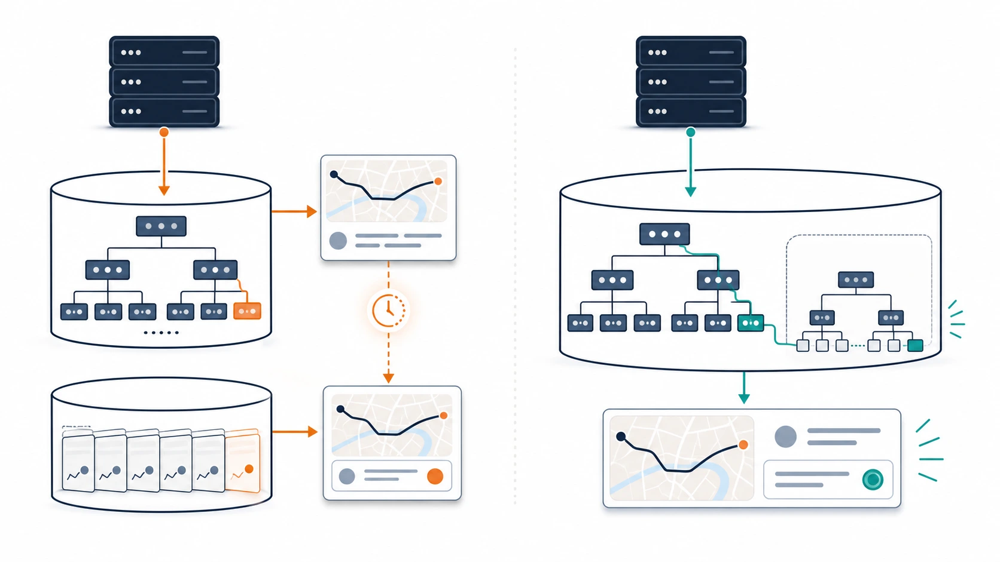

# Benchmark 08: 座標更新のDB往復を減らす

[チューニング目次へ戻る](../TUNING.md)

## 結果

| 項目 | Benchmark 07 | Benchmark 08 |
|---|---:|---:|
| 60秒スコア | 16,909 | 11,599 |
| pass | true | true |
| エラー | 0 | `CODE=17` 2件 |
| 最終評価数 | 226 | 144 |
| matching不満 | 0.9% | 32.7% |
| pickup不満 | 未記録 | 64.6% |
| drive不満 | 未記録 | 73.5% |

この走行だけから「座標更新の変更でスコアが下がった」とは結論づけません。ログを調べると、2件のエラーは座標更新ではなく、利用者登録時のクーポン検索で起きたMySQL deadlockでした。ISUCONのベンチは、初動の割当、ランダムな利用者行動、同居ホストの負荷によって結果が揺れます。そのため、スコアと原因の異なるエラーを分けて扱います。

一方、変更後も `pass=true` で仕様検査を通り、通常の座標更新を4 SQLから2 SQLへ減らせたことは確認できました。性能効果の大きさは、同一revisionの複数回計測とendpoint別p95 / p99を採取して判断する必要があります。

## どこを確認したか

`POST /api/chair/coordinate` は、すべての稼働椅子が移動中に繰り返し呼ぶ書き込み経路です。1回が少し遅いだけでも、椅子数と送信回数を掛けた負荷がMySQL connection poolへ波及します。

変更前の通常経路は次の4 SQLを実行していました。

1. `chair_locations` へ現在位置をINSERT
2. INSERTした行をIDで再SELECT
3. 椅子の最新rideをSELECT
4. そのrideの最新statusをSELECT

pickupまたはdestinationへ到着した場合は、さらにstatusをINSERTします。通常の移動中は状態遷移を起こさないため、最も回数の多い経路から重複SQLをなくすことを優先しました。


_高頻度の座標更新では、小さなSQLでも往復のたびにconnection取得、送受信、decodeが重なります。通常経路を2往復にまとめ、connection poolの占有を減らします。_

## 仮説

- INSERTへアプリ側で確定した `created_at` を渡せば、応答の `recorded_at` を得るための再SELECTは不要
- 最新rideと最新statusを1 SQLへまとめれば、通常経路のDB往復をさらに1回減らせる
- 既存のINDEXを使うため、全件走査を増やさずに実現できる

DB往復では、SQLの実行時間だけでなく、connectionの取得、リクエスト送信、結果受信、行のdecodeが発生します。小さいSQLでも高頻度経路では回数そのものがコストになります。

## 実装

対象は `webapp/rust/src/chair_handlers.rs` の `chair_post_coordinate` です。

### INSERTした時刻をそのまま返す

Rustで1回だけ時刻を作り、INSERTとレスポンスの両方へ使います。

```rust
let recorded_at = chrono::Utc::now().naive_utc();

sqlx::query(
    "INSERT INTO chair_locations \
     (id, chair_id, latitude, longitude, created_at) \
     VALUES (?, ?, ?, ?, ?)",
)
// ...
.bind(recorded_at)
.execute(&mut *tx)
.await?;
```

変更前はMySQLのdefault値で `created_at` を作り、その値を知るために同じ行をSELECTしていました。変更後は「INSERTした値」と「APIで返す値」が同じ変数から作られるため、再SELECTせず一貫性を保てます。


_同じ時刻をDB行とレスポンスへ分岐させることで、書き込んだ時刻を知るためだけのread-after-writeをなくします。_

### rideとstatusを1 SQLで取得する

現在rideに必要な列だけを `CurrentRide` へdecodeし、最新statusは相関subqueryで同時に取得します。

```sql
SELECT rides.id,
       rides.pickup_latitude,
       rides.pickup_longitude,
       rides.destination_latitude,
       rides.destination_longitude,
       (
           SELECT ride_statuses.status
           FROM ride_statuses
           WHERE ride_statuses.ride_id = rides.id
           ORDER BY ride_statuses.created_at DESC
           LIMIT 1
       ) AS status
FROM rides
WHERE rides.chair_id = ?
ORDER BY rides.updated_at DESC
LIMIT 1
```

ここでは次のINDEXが効きます。

- `rides(chair_id, updated_at)`: 対象椅子の最新rideを末尾側から探す
- `ride_statuses(ride_id, created_at)`: 対象rideの最新statusを末尾側から探す



_2本のINDEXを使い、現在rideから最新statusへ1回のquery内でたどります。直列の2往復を、必要な値をまとめた1往復へ変えます。_

実測した単発の実行計画では、最新ride側が約1.5ms、status subquery側が約4.84msでした。値はホスト負荷とデータ量で変わるため、絶対値より、chairまたはrideをキーにINDEX lookupできていることを確認しています。

## 正しさをどう維持したか

- 位置INSERT、現在ride確認、必要なstatus追加は同じtransactionに残した
- pickup座標かつ `ENROUTE` のときだけ `PICKUP` を追加する条件を維持した
- destination座標かつ `CARRYING` のときだけ `ARRIVED` を追加する条件を維持した
- `rides.updated_at` は変更していない
- APIの `recorded_at` は、実際にINSERTした `created_at` から計算する
- 既存と同様に、通常移動ではstatusを追加しない

`rides.updated_at` は完了時刻や売上期間の判定にも使われます。現在状態を簡単に得る目的でride行を更新すると別endpointの意味が変わるため、この変更では触れていません。

## ログをどう確認したか

ベンチマーカーは次を出力しました。

```text
結果 pass=true スコア=11599 種別エラー数=map[17:2]
```

webappログでは、2件とも `POST /api/app/users` の500で、MySQL error 1213（deadlock）でした。`SHOW ENGINE INNODB STATUS` を確認すると、競合対象は `coupons` であり、座標更新が触る `chair_locations`、`rides`、`ride_statuses` ではありませんでした。

この調査から、次の判断をしました。

1. 座標更新の仕様違反ではないため、変更を直ちにrevertする根拠にはしない
2. error mapが空ではないため、11,599点を安定した最終結果とは扱わない
3. 次のBenchmarkでは、観測されたdeadlockの原因であるcoupon検索を独立して修正する

## 効果と限界

通常経路のSQL回数は次のように減ります。

```text
変更前: INSERT location
        + SELECT inserted location
        + SELECT current ride
        + SELECT latest status
        = 4 SQL

変更後: INSERT location
        + SELECT current ride with latest status
        = 2 SQL
```

SQL回数は半減しましたが、スコアがそのまま2倍になるわけではありません。現在の不満率からは、matcherの待ち、pickupまでの距離、通知polling、決済処理も完了数を制限しています。

## 他に考えられる選択肢

| 選択肢 | 期待できる効果 | 注意点 |
|---|---|---|
| chairのcurrent ride/statusを専用表へ保持 | 相関subqueryも不要になる | すべての状態遷移とinitializeで同期が必要 |
| `rides` にcurrent status列を追加 | 読み取りが単純になる | 初期dump互換と `updated_at` の意味を壊さない設計が必要 |
| location INSERTだけautocommitへ分離 | transactionを短くできる | 位置だけ保存されstatus遷移に失敗する状態を許容するか要検討 |
| 座標を一定間隔でまとめてINSERT | write回数を大きく減らせる | 位置反映は3秒以内という検査条件がある |
| endpoint別p95 / p99を計測 | 実際のtail latencyを判断できる | 一時的な計測コードまたはproxyログ整備が必要 |

次は同一revisionの複数回計測に加え、1座標更新あたりのtransaction時間とp99を採取します。
