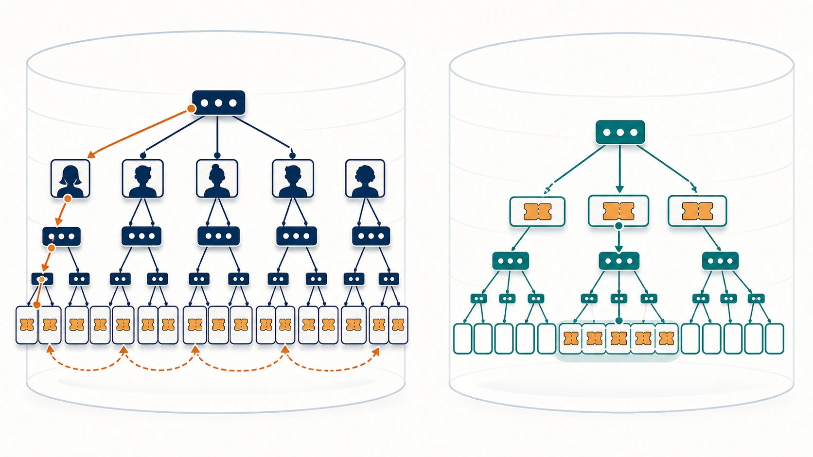
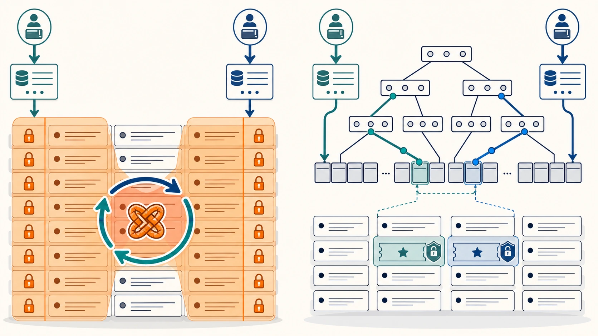
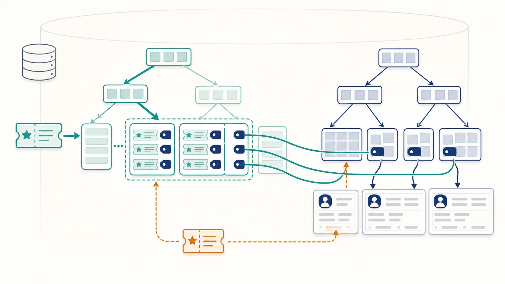

# Benchmark 09: 招待クーポン検索のlock範囲をINDEXで狭める

[チューニング目次へ戻る](../TUNING.md)

## 結果

| 項目 | INDEX追加前 | `coupons(code)` 追加後 |
|---|---:|---:|
| 60秒スコア | 11,599 | 15,415 |
| pass | true | true |
| エラー | `CODE=17` 2件 | 0 |
| 最終評価数 | 144 | 195 |
| matching不満 | 32.7% | 39.0% |
| pickup不満 | 64.6% | 58.5% |
| drive不満 | 73.5% | 72.4% |
| クーポン検索 | 全件走査 | `idx_coupons_code` lookup |

直前走行比ではスコアが3,816、約32.9%増え、エラーが0になりました。ただし、Benchmark 07の16,909点よりは低いため、索引だけでスコアの揺れをすべて説明できません。この変更の強い根拠は、実行計画で全件走査が消えたことと、観測されたdeadlockのlock範囲を原因に沿って狭めたことです。

## 発見のきっかけ

Benchmark 08で、`POST /api/app/users` が2回500を返しました。webappログのMySQL errorは1213で、InnoDBがdeadlockを検出して片方のtransactionをrollbackしたことを示します。

`SHOW ENGINE INNODB STATUS` には、概ね次の待ち関係が記録されていました。

```text
transaction A:
  CP_NEW2024をINSERT済み
  SELECT * FROM coupons WHERE code = 'INV_...' FOR UPDATE
  多数のPRIMARY行をlockし、別のCP_NEW2024行を待つ

transaction B:
  別のCP_NEW2024行をlock済み
  SELECT * FROM coupons WHERE code = 'INV_...' FOR UPDATE
  transaction Aが持つPRIMARY行を待つ
```

互いに「相手が持つlockの解放待ち」になるため、どちらも先へ進めません。これがdeadlockです。

## なぜPRIMARY KEYがあるのに全件走査になるのか

`coupons` の主キーは次の複合INDEXです。

```sql
PRIMARY KEY (user_id, code)
```

B-treeの複合INDEXは、基本的に左端の列から順に並びます。本の索引を「都道府県 → 市区町村」の順で作った場合、都道府県が分かれば市区町村をすぐ絞れます。しかし、市区町村だけを渡されても、各都道府県の範囲を確認する必要があります。

同じ理由で、次の条件は主キーの左端 `user_id` を指定していません。

```sql
WHERE code = ?
```

そのためMySQLは、主キーが存在していても `code` だけでは目的位置へ直接移動できず、テーブル全体を確認していました。



_複合INDEXは列の集合ではなく順序を持ちます。`user_id` ごとに散らばるcodeを横断する代わりに、codeを左端にしたINDEXでは同じ値が連続する範囲へ直接移動できます。_

INDEX追加前の実測は次のとおりです。

```text
coupons: 698行
Table scan on coupons
actual time=0.708..1.73 rows=698
Filter全体 actual time=5.5..6.41 rows=2
```

問題は6.41msという時間だけではありません。query末尾の `FOR UPDATE` は招待数を確認してからcouponを追加するまで対象を保護します。全件走査と組み合わさると、本来無関係な利用者のcouponまで広くlockし、並行登録と衝突しやすくなります。



_検索対象を数行へ絞ると、無関係なcouponまで触る経路がなくなり、並行transaction同士のlock範囲が重なる機会も減ります。_

## 実装

`webapp/sql/1-schema.sql` へ、検索条件の左端が `code` になるsecondary INDEXを追加しました。

```sql
INDEX idx_coupons_code (code)
```

追加後は、全766行のうち対象コード3行だけをINDEXから取得しました。

```text
Index lookup on coupons using idx_coupons_code
actual time=0.387..0.389 rows=3
```

別時点のデータなので単純な厳密比較ではありませんが、全698行の走査から対象3行のlookupへ変わったことが重要です。単発時間も約6.41msから約0.389msになりました。

## secondary INDEXの仕組み

InnoDBのsecondary INDEXは、ここでは概念的に次の順序で値を保持します。

```text
code
  ├─ INV_04ce... → 対応するPRIMARY KEY
  ├─ INV_04ce... → 対応するPRIMARY KEY
  └─ INV_04ce... → 対応するPRIMARY KEY
```

MySQLはB-treeをたどって対象codeの先頭へ移動し、同じcodeが続く範囲だけを読みます。`SELECT *` なので最終的な行本体はPRIMARY KEYを使って取得しますが、入口で対象を数行へ絞れます。



_secondary INDEXはcode順のキーと主キーへの手掛かりを持ちます。該当leafだけを読み、そこから必要な行本体へたどるため、テーブル全体を確認せずに済みます。_

INDEXは「検索を魔法のように速くする設定」ではなく、特定の並び順を追加で維持するデータ構造です。そのためINSERT時にはsecondary INDEXにも項目を追加します。読み取りとlock競合を減らす代わりに、書き込み量と保存領域は少し増えます。

## なぜこの列順なのか

このqueryは招待コード単位で全利用者のcouponを数えます。

```sql
SELECT *
FROM coupons
WHERE code = ?
FOR UPDATE
```

したがって、検索条件の先頭と一致する `(code)` が最小のINDEXです。`(code, user_id)` も検索には使えますが、InnoDBのsecondary INDEXはPRIMARY KEY列を内部的に保持するため、今回の条件だけなら明示的に `user_id` を重ねる利点は小さいと判断しました。

一方、`WHERE user_id = ? AND used_by IS NULL ORDER BY created_at` にはこのINDEXは効きません。queryの条件と並び順が違うためです。INDEXは「テーブルに1本あればすべて速くなる」ものではなく、実際のqueryごとに左端列と選択性を確認します。

## ログをどう確認し、どう判断したか

確認した情報は次の3種類です。

1. webappログ
   - 500になったendpointが `POST /api/app/users`
   - DB errorがMySQL 1213
2. `SHOW ENGINE INNODB STATUS`
   - 競合テーブルが `coupons`
   - 全件走査の `SELECT ... WHERE code = ? FOR UPDATE` 同士が相互待ち
3. `EXPLAIN ANALYZE`
   - 変更前は698行のtable scan
   - 変更後は `idx_coupons_code` で3行のindex lookup

変更後の60秒ベンチは次の結果でした。

```text
結果 pass=true スコア=15415 種別エラー数=map[]
```

走行後のInnoDB statusにも新しいdeadlock記録はありませんでした。この1回だけで「deadlockが将来も絶対に起きない」とは証明できませんが、観測した原因、実行計画、ベンチエラーの3つが同じ方向へ改善しています。

## 正しさと副作用

- couponの一意性は既存の `PRIMARY KEY (user_id, code)` が引き続き保証する
- API処理順、招待上限3件、割引額は変更していない
- initializeでschemaを作り直すたびにINDEXも再現される
- すべてのcoupon INSERTでsecondary INDEX更新が1回増える
- 同じ `code` が多い場合、対象行同士のlock競合は残る
- `FOR UPDATE` の範囲は狭くなるが、gap lockを含むInnoDBのlock規則自体は変わらない

## 他に考えられる選択肢

| 選択肢 | 利点 | 注意点 |
|---|---|---|
| `COUNT(*)` だけ取得 | DBからRustへ返す列とdecodeを減らせる | 上限判定と追加を競合安全にまとめる設計が必要 |
| 招待回数を専用counterへ保持 | 1行の条件付きUPDATEで上限を表せる | 初期化、既存データ、同時更新の設計変更が大きい |
| deadlock時にtransactionをretry | 一時的な競合へ耐えられる | 全件走査と広いlockという原因は残り、負荷も増える |
| 登録処理のlock順を統一 | 別種類のdeadlockも防ぎやすい | すべてのcoupon更新経路を監査する必要がある |
| 利用者登録を直列化 | 実装は単純 | 1プロセスのthroughputを制限し、複数台構成では不十分 |

まずqueryに合うINDEXで不要な行を触らないようにし、その後も競合が残る場合にcounter化やretryを検討します。
