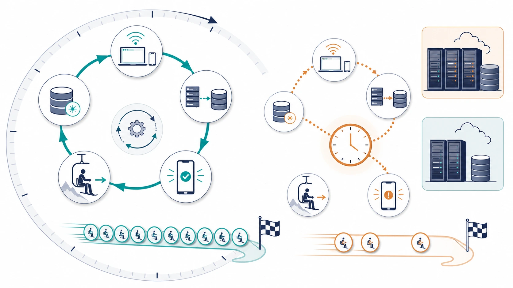
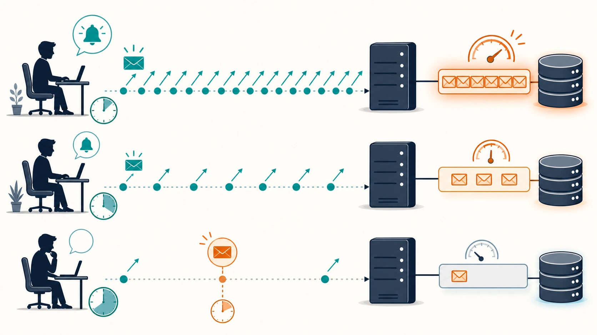
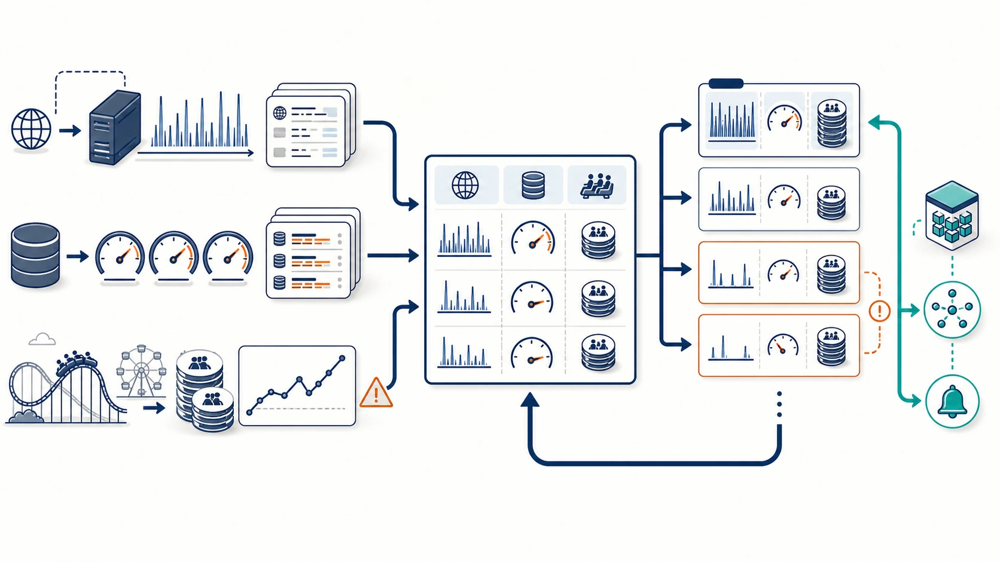

# Benchmark 10: 通知polling間隔を30 / 50 / 100msで比較する

[チューニング目次へ戻る](../TUNING.md)

## 結論

`retry_after_ms` は30msを維持します。50msと100msは通知リクエストとDB transactionを減らしましたが、60秒スコアの改善を確認できませんでした。50ms走行では `CODE=31` も1件発生したため、変更を採用せずコードを元へ戻しました。

失敗した性能実験も残す理由は、同じ値を根拠なく再試行しないためです。また、「DB負荷が下がること」と「ISUCONの総スコアが上がること」は同じではない、という判断材料になります。

## 計測結果

| `retry_after_ms` | 30ms | 100ms | 50ms |
|---|---:|---:|---:|
| pass | true | true | true |
| スコア | 15,415 | 14,611 | 6,986 |
| エラー | 0 | 0 | `CODE=31` 1件 |
| 最終評価数 | 195 | 177 | 88 |
| app通知GET | 18,382 | 11,399 | 6,434 |
| chair通知GET | 15,978 | 9,741 | 7,118 |
| 通知GET合計 | 34,360 | 21,140 | 13,552 |
| COMMIT | 50,526 | 35,194 | 20,108 |
| COMMIT累積時間 | 452.757秒 | 412.027秒 | 410.209秒 |
| matching不満 | 39.0% | 41.0% | 10.0% |
| pickup不満 | 58.5% | 62.8% | 72.2% |
| drive不満 | 72.4% | 74.2% | 80.0% |

各runでは利用者数、椅子数、完了数が異なります。特に50ms走行は早い段階で評価数が伸びなくなったため、通知GETやCOMMITが少ないことのすべてを待機時間変更の効果とはみなしません。単純な回数だけでなく、pass、エラー、評価数、スコアを同時に見て採否を決めています。

## 判断までの思考プロセス

今回の判断を、後から同じログを読んでも追える形に分解します。

### 1. 最初にスコアだけを見なかった

直前の15,415点と最高値16,909点には差がありました。同じコードでも利用者、椅子、ライド距離の展開でスコアが変動するため、「次はこの関数が遅そう」という印象では対象を決めませんでした。

まず、30ms走行のnginx access logをendpoint別に数えました。その結果、app通知とchair通知だけで34,360回あり、座標更新14,644回より多いことが分かりました。さらにperformance schemaではCOMMITが50,526回、累積452.757秒でした。

この2つの観測から、次の因果関係を候補にしました。

```text
短いretry_after_ms
  → 通知GETが増える
  → 認証SQLと通知transactionが増える
  → DB connectionとCOMMIT待ちが増える
  → 座標更新や評価など別endpointも待つ
  → 完了ライド数が伸びにくくなる
```

この時点ではまだ仮説です。通知GETとCOMMITが同じ桁であることは関連を疑う根拠になりますが、通知だけが全COMMITを発生させた証明ではありません。



_通知は次の操作を始める合図です。待機を長くするとDBは空きますが、状態発見の遅れがride全体で積み重なり、同じ計測時間内の完了数を減らす可能性があります。_

### 2. 最小の変更で仮説を検証した

通知処理のSQLやtransaction境界も改善候補ですが、同時に変更すると「回数を減らした効果」と「SQLを書き換えた効果」を分離できません。

そこで、ベンチマーカーが実際に待機へ利用している `retry_after_ms` だけを変更しました。appとchairの両方を同じ値にし、最初に100ms、その結果を見て中間の50msを試しました。

100msで期待した観測は次のとおりです。

- 通知GETが明確に減る
- BEGIN / COMMITも減る
- エラー0を維持する
- 空いたDB資源により評価数またはスコアが増える

最初の2つは確認できましたが、後半のスコア改善は確認できませんでした。

### 3. 100msの結果から仮説を更新した

100msでは通知GETが34,360回から21,140回、COMMITが50,526回から35,194回へ減りました。したがって「待機時間を広げても問い合わせ回数が変わらない」という可能性は否定できました。

一方、スコアは15,415から14,611、評価数は195から177へ下がりました。この結果から、仮説を次のように更新しました。

```text
DB負荷を減らす効果はある。
しかし100msでは、状態変化を発見する追加待ちの損失が
DB負荷削減の利益を上回る可能性がある。
```

そこで「100msは長すぎるが、50msなら両方の中間になる」という次の仮説を立てました。

### 4. 50msが中間結果になるとは限らなかった

50ms走行は6,986点、評価88件、`CODE=31` 1件でした。数値の順序は30ms > 100ms > 50msとなり、待機時間へ単調に比例していません。

これはISUCONベンチが、固定入力を1回ずつ処理するmicro benchmarkではないためです。低評価による利用停止、招待による利用者増加、椅子増加、地域ごとの需給が互いに影響し、そのrunの後半負荷も変わります。50ms走行で通知GETが最少だったのも、間隔だけでなく評価数と稼働主体が少なかった影響を含みます。

そのため、50msの低スコアを「50msという値だけが原因」とは断定しません。ただし、採用候補として必要な「30msより良い結果」と「エラー0」の両方を満たさなかったことは確定しています。

### 5. 採用と調査継続を分けた

今回分かったことは2つあります。

1. 待機時間を広げればHTTPとtransaction回数は減る
2. 50msまたは100msで総スコアが改善する証拠は得られなかった

1だけを理由に100msを採用すると、DBメトリクスをきれいにする代わりにISUCONの目的である総スコアを下げる可能性があります。したがって実装は30msへ戻しました。

一方、通知が最大頻度の経路である事実は残ります。次は待機時間を延ばすのではなく、認証結果cache、payload cache、long pollingのように「状態変化の発見を遅らせず、1回当たりの仕事または空問い合わせを減らす」仮説へ進みます。

## なぜこの箇所を調べたか

30ms走行のnginx access logをendpoint別に数えると、高頻度上位は次のとおりでした。

| endpoint | 60秒のリクエスト数 |
|---|---:|
| `GET /api/app/notification` | 18,382 |
| `GET /api/chair/notification` | 15,978 |
| `POST /api/chair/coordinate` | 14,644 |
| `GET /api/app/rides` | 708 |
| `GET /api/app/nearby-chairs` | 705 |

通知だけで34,360回あり、座標更新よりも多い最大のHTTP経路でした。通知APIはライドが存在するとtransactionを開始し、最新ride、未送信status、料金、椅子情報などを読み、通知済み時刻を必要に応じて更新します。

同じ走行のperformance schemaでは、次の値を確認しました。

```text
BEGIN    50,643回
COMMIT   50,526回、累積452.757秒、平均8.961ms
ROLLBACK    114回
```

COMMITは通知だけの値ではありませんが、通知GETの回数と同じ桁であり、高頻度pollingがDBのtransaction待ちへ影響するという仮説を立てる根拠になりました。

## `retry_after_ms` の仕組み

通知APIはレスポンスに次回問い合わせまでの待機時間を返します。

```json
{
  "data": null,
  "retry_after_ms": 30
}
```

ベンチマーカーの利用者・椅子clientは、この値をミリ秒へ変換して `time.Sleep` した後、次の通知GETを送ります。つまり30msから100msへ変更すると、同じclientが新しい状態を確認する頻度は下がります。

待機時間を広げると、次のトレードオフがあります。

```text
短い待機:
  状態変化を早く発見
  ただしHTTP、認証SQL、通知SQL、COMMITが増える

長い待機:
  空pollingとDB負荷を削減
  ただし状態変化の発見が遅れる
```



_間隔を短くすると状態を早く見つける一方で、HTTP・認証SQL・通知transactionが密になります。長くするとDB負荷は下がりますが、変化直後に次のpollを待つ空白が生まれます。_

通知は単に画面表示を更新するだけではありません。ベンチマーカー側の椅子や利用者は通知された状態を見て次の動作へ進むため、70msの追加待ちもライド全体では複数回累積します。

## 仮説と反証条件

仮説は次のとおりでした。

> 30msを100msまたは50msへ広げれば、通知反映期限を守ったまま空pollingとDB transactionを減らし、他endpointが使えるCPU・connectionを増やせる。

反証条件は次のいずれかです。

- `pass=false`
- 通知やnearbyの正当性エラーが発生する
- 完了評価数または総スコアが30msより悪化する
- SQL回数が減ってもpickup / driveの遅延が増える

100msはエラー0でしたが、スコアと評価数が30msを下回りました。50msはさらに低いスコアとなり、`CODE=31` も発生しました。したがって、この計測では仮説を支持できません。

## ログをどう確認したか

### nginx access log

ベンチ開始・終了時刻をUTCで記録し、その区間だけを `docker compose logs` から抽出しました。動的なride IDを含まない通知pathを数え、appとchairを分けています。

### MySQL performance schema

`events_statements_summary_by_digest` から `BEGIN`、`COMMIT`、`ROLLBACK` の回数、累積時間、平均時間を取得しました。50msと100msでCOMMIT回数は減りましたが、平均COMMIT時間は増えています。負荷が単純に比例して軽くなったわけではありません。

### ベンチマーカーログ

最終行のpass、スコア、error mapに加え、途中の評価数とmatching / pickup / drive不満率を読みました。50ms走行の `CODE=31` はnearbyで期待した台数の椅子が見つからなかった警告です。通知間隔との直接因果は確認できないため、原因と断定せず「採用条件を満たさなかった事実」として扱います。



_問い合わせ数だけでなく、DB待ち、pass、エラー、完了数、スコアを同じ実験単位で比較します。負荷低下が総スコアへつながらなければ元へ戻し、別の仮説を切り分けます。_

## なぜ30msへ戻したか

100msはDB操作数を減らしましたが、ISUCONで欲しいのはDB操作数の最小化ではなく総スコアの最大化です。通知で得た余裕より、状態発見が遅れる損失の方が大きい可能性があります。

また、3回のベンチは異なる利用者・椅子の展開を含むため、間隔だけの厳密な統計比較には不足しています。それでも、50msと100msのどちらにも30msを上回る結果がなく、50msはエラー0でもありません。現時点で値を変更したままにする根拠がないため、最も良い観測値を持つ30msを維持しました。

## 次に試す方法

待機時間を広げるだけでは、状態が変わった直後も次のpollまで待ちます。次は「問い合わせ頻度を下げる」と「状態変化を早く伝える」を両立する方法を検討します。

| 選択肢 | 期待できる効果 | 必要な検証 |
|---|---|---|
| 認証結果cache | 各pollのtoken検索SQLをなくす | initializeと動的登録後も正しい利用者・椅子を返す |
| payload cache | 状態不変時の同じSQL・JSON生成をなくす | status順序、stats更新、invalidate漏れを確認 |
| JSON long polling | 状態不変時はHTTPを待機し、変化時に即時応答 | DB connectionを保持せず、イベント取りこぼしを防ぐ |
| SSE | 接続を維持して状態変化をpushする | 再接続時の未配信status replayとat least onceを維持 |

まずはprotocolを変えず、認証SQLやpayload再構築のような1リクエスト当たりの処理量を減らす施策を単独で計測します。
