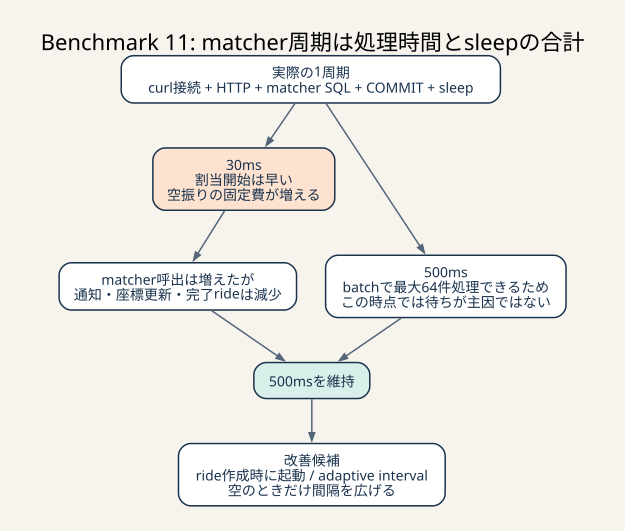

# Benchmark 11: matcher 実行間隔

[チューニング目次へ戻る](../TUNING.md)

## 目的

batch matcher を500msごとに呼ぶ構成について、100msと30msを比較しました。
ライド作成から次のmatcher起動までの待ち時間を短くすれば、割当期限超過と
マッチング不満足度が下がり、完了rideが増えるという仮説です。

## 変更

`compose.yaml` の matcher コンテナが実行するloopで、`sleep` だけを変更しました。

```sh
while true; do
  curl -fsS http://nginx/api/internal/matching >/dev/null
  sleep 0.5 # 比較時は0.1または0.03
done
```

このloopの実際の周期は指定したsleep時間そのものではありません。

```text
実際の1周期 = curlの接続・HTTP・matcher処理時間 + sleep時間
```



_1周期は処理時間とsleep時間の合計です。sleepを短くすると割当開始は早まりますが、空振りでもHTTPやtransactionの固定費が増え、他の処理を圧迫することがあります。_

> **用語補足**
>
> - **batch matcher**: 1回の起動で複数のrideとchairをまとめて割り当てるmatcherです。
> - **固定費**: 対象rideが0件でも毎回発生するHTTP、transaction、SQLなどの処理です。
> - **adaptive interval**: queueがあるときは短く、空のときは長くするよう、実行間隔を状態に応じて変える方式です。
> - **affected rows**: `UPDATE` が実際に変更した行数です。0なら別処理が先に割り当てた可能性を検出できます。

そのため、100msなら60秒に必ず600回、30msなら必ず2,000回呼ばれるわけでは
ありません。処理が重くなるほど次の呼び出しも遅れます。

## matcher 1回の処理

現在のmatcherは、呼び出すたびに次を行います。

1. transactionを開始する
2. 古い未割当rideを最大64件lockして取得する
3. 利用可能なchairと各chairの最新座標を最大64件取得する
4. Rust上でrideごとに最も近いchairを選ぶ
5. 割当件数分の `UPDATE rides` を実行する
6. transactionをcommitする

未割当rideが0件でも、1と2と6は実行します。実行間隔を短くすると割当開始の
待ち時間は減りますが、空振り時にもtransaction、SQL、nginx・AxumのHTTP往復が
増えます。この利益とコストのどちらが大きいかをベンチで判断します。

## 計測条件

- 2026-07-24
- Apple Silicon / Colima 4 CPU・4 GiB
- CPU / memory設定は全走行で変更なし
- 外部コンテナがなく、ISUCON用4コンテナだけが動作する条件
- 60秒、`--fail-on-error`
- Rust、SQL、INDEX、matcherの選択方法は変更せず、sleepだけを変更

500msは直前の最新実装対照、100msは2回、30msは1回を使用しました。500ms走行の
nginxコンテナは初期revision確認のために入れ替えた後だったため、matcher HTTP
件数は保存できていません。スコアと評価ログは実測値ですが、500msの呼出回数は
比較表へ推定値を混ぜず未記録としました。

## 結果

| sleep | run | pass | スコア | 最終tick評価数 | エラー |
|---:|---:|---:|---:|---:|---|
| 500ms | 対照 | true | 53,198 | 745 | 0 |
| 100ms | 1 | true | 54,172 | 712 | 0 |
| 100ms | 2 | true | 53,715 | 714 | 0 |
| 30ms | 1 | true | 41,016 | 560 | 0 |

100msの実測n=2における記述上の中央値は53,943.5点です。推定代表値には使いません。
500msの1回の対照に対して+745.5点、
約+1.40%でした。100msの2走行はいずれも対照を上回りましたが、差が小さく、
対照が1回だけなので改善を確定できる強さではありません。

30msは対照より12,182点、約22.90%低下しました。エラーなしで完走しても、
処理量と得点が低下する変更は採用しません。

## 不満足度

| sleep | run | matching | pickup | drive |
|---:|---:|---:|---:|---:|
| 500ms | 対照 | 9.5% | 38.6% | 84.3% |
| 100ms | 1 | 10.7% | 43.6% | 82.7% |
| 100ms | 2 | 14.9% | 40.4% | 79.6% |
| 30ms | 1 | 0.2% | 45.9% | 84.2% |

30msではmatching不満足度が0.2%まで下がりました。短周期化が「ride作成から
割当開始まで」を短くする仮説には合っています。しかし、最終評価数は560に減り、
総合スコアも下がりました。ISUCONでは1つの局所指標だけでなく、限られたCPU・DB
時間で何件を最後まで完了できたかを評価する必要があります。

100msはmatching不満足度が対照より良くありません。生成されたrideとchairの分布に
走行ごとの揺れがあること、現在のmatcherは1回で最大64件処理できることから、
500msの待ち時間がこの時点の主要ボトルネックではないと判断しました。

## HTTPログ

nginx access logをベンチ開始・終了時刻で切り出しました。

| sleep | run | matcher | app通知 | chair通知 | 座標更新 | 主要3経路合計 |
|---:|---:|---:|---:|---:|---:|---:|
| 100ms | 1 | 322 | 42,202 | 42,650 | 39,216 | 124,068 |
| 100ms | 2 | 338 | 47,797 | 47,189 | 37,824 | 132,810 |
| 30ms | 1 | 642 | 31,014 | 36,555 | 30,048 | 97,617 |

30msではmatcherが642回動いた一方、得点を生むride処理に関係する主要3経路は
100ms走行より少なくなりました。これだけでCPU競合が唯一の原因とは証明できません
が、「matcherを多く呼べば全体の処理量も増える」という仮説には反する結果です。

ベンチ終了後のアイドル状態でも30ms matcherコンテナは `docker stats` で12.8%
CPUを使用していました。外部curlプロセスの起動、nginx、Axum、SQLの経路そのものに
無視できない固定費があると考えられます。

## DBログ

| sleep | run | BEGIN回数 | COMMIT回数 | COMMIT累積 | COMMIT平均 |
|---:|---:|---:|---:|---:|---:|
| 100ms | 1 | 128,785 | 128,574 | 398.574秒 | 3.100ms |
| 100ms | 2 | 137,887 | 137,711 | 443.050秒 | 3.217ms |
| 30ms | 1 | 101,744 | 101,510 | 411.103秒 | 4.050ms |

全走行でslow statement警告とconnection pool警告は0件でした。30msのtransaction
回数が100msより少ないのは、matcherの負荷が軽いからではありません。ベンチ全体の
処理量が落ち、通知や座標更新が減った影響を含みます。回数だけでなく、評価数、
HTTP経路、平均・累積時間を併せて読みます。

## 仮説と実際

### 事前の仮説

- 短い間隔ならrideの未割当時間が減る
- batch化済みなのでmatcher 1回の固定費は許容できる
- 100ms程度ならDBを圧迫せず、完了rideとスコアが増える

### 実際

- 30msはmatching不満足度を下げた
- 30msはmatcher呼出回数を増やしたが、最終評価数とスコアを大きく下げた
- 100msは2回とも小幅に高得点だったが、matching指標は改善しなかった
- slow queryやpool枯渇はなく、500ms待ちが主要ボトルネックとは確認できなかった

### 判断

現在の `sleep 0.5` を維持します。100msは完全に否定されたわけではありませんが、
1.40%の差のためにmatcher呼出回数を約3倍へ増やす根拠としては弱く、対照を含む
複数回計測が必要です。30msは不採用です。

## 次に考えられる選択肢

### ride作成時に通知する

常時pollingする代わりに、rideが作られたときだけmatcherを起こせば、空振りを
減らしながら割当開始を早められます。Tokioのbounded channelを使う場合は、
process再起動時にDBの未割当rideを再走査する回復経路が必要です。

### matcherをアプリ内taskにする

curl → nginx → Axumという外部HTTP往復を削れます。ただし、複数アプリinstanceを
動かす場合は同時matcherを許容するlock設計が必要です。現在の
`FOR UPDATE SKIP LOCKED` と、`UPDATE ... WHERE chair_id IS NULL` のaffected rows
確認を組み合わせます。

### adaptive interval

未割当rideがある間だけ短い間隔、空なら指数的に500msまで戻す方式です。DB負荷と
割当遅延の両方を抑えられる可能性があります。sleepの固定値比較より実装は複雑に
なるため、queue長と実際の呼出回数をmetricとして残す必要があります。

### matcher SQLを軽くしてから再試験する

現在の空きchair判定は、rideごとに `ride_statuses` の
`COUNT(chair_sent_at)` を参照します。この状態判定を明示列へ非正規化できれば、
短周期化の固定費が下がる可能性があります。正当性と再初期化後の再構築方法を
先に決めてから別ベンチとして扱います。
