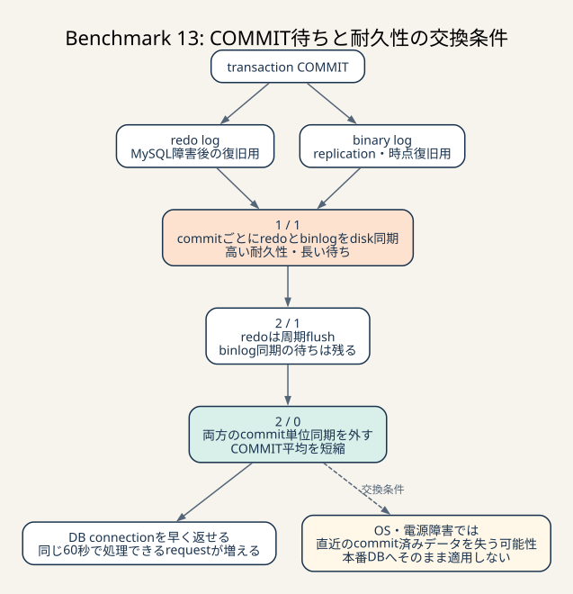
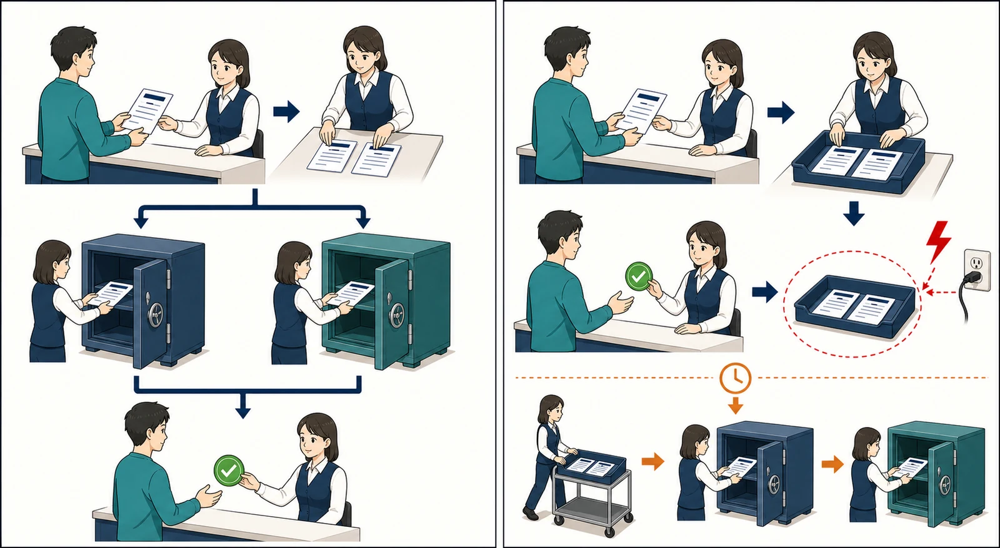

# Benchmark 13: MySQLのCOMMIT永続化

[チューニング目次へ戻る](../TUNING.md)

## 目的

静穏時の最新実装でも、60秒の間に約12万回のtransactionが発生し、`COMMIT` の
累積時間は400秒前後でした。並行requestの時間を合計するため、累積時間は
ベンチの実時間60秒を超えます。

SQLの検索計画だけでなく、transactionを確定するたびにredo logとbinary logを
diskへ同期するコストがボトルネックになっていると考え、MySQLの永続化設定を
段階的に比較しました。

## 変更前の状態

```text
innodb_flush_log_at_trx_commit = 1
sync_binlog                    = 1
log_bin                        = ON
```

`SHOW REPLICAS` に行はなく、このローカル環境には複製先がありませんでした。
binary log自体は有効で、ROW形式で記録されていました。

## COMMIT時に何を書いているか

### InnoDB redo log

redo logは、変更したdata pageそのものより先に「どの変更をしたか」を記録する
write-ahead logです。MySQLが異常終了しても、永続化済みredoから未反映の変更を
復旧できます。

`innodb_flush_log_at_trx_commit=1` はcommitごとにredoをwriteしてdiskへflush
します。値2はcommitごとにwriteしますが、flushは概ね1秒ごとです。この周期は
厳密な保証値ではなく、OS schedulingや内部処理で前後します。

### binary log

binary logは、主にreplicationとpoint-in-time recoveryで使う変更履歴です。
`sync_binlog=1` はcommitごとにbinary logを同期します。値0はMySQL自身による
同期を行わず、OSのflushへ任せます。

redoとbinary logは目的が異なります。そのためredoだけを緩めても、
`sync_binlog=1` の同期がcommit待ちとして残る可能性があります。



_durable設定はredo logとbinary logの同期を待ってからCOMMIT成功を返します。高速設定は同期をまとめて待ち時間を減らしますが、障害時に直近の確定dataを失う時間幅が生まれます。_

> **用語補足**
>
> - **write**: log dataをOSのmemoryへ渡す段階です。この時点ではdiskへ永続化されていない場合があります。
> - **flush / fsync**: OSへ、memory上のdataをdiskなどの永続媒体へ反映するよう要求する処理です。
> - **durability（耐久性）**: COMMIT成功後のdataが障害後にも残る性質です。
> - **replication / point-in-time recovery**: 別DBへ変更を複製する仕組み / backupとlogから特定時点まで戻す復旧方法です。



_左は2つのlogを永続保管してから完了を返します。右は一時領域に置いた段階で完了を返し、後でまとめて保存します。待ちは短くなりますが、保存前の障害では完了済みdataを失う可能性があります。_

参考:

- [MySQL 8.4: innodb_flush_log_at_trx_commit](https://dev.mysql.com/doc/refman/8.4/en/innodb-parameters.html#sysvar_innodb_flush_log_at_trx_commit)
- [MySQL 8.4: sync_binlog](https://dev.mysql.com/doc/refman/8.4/en/replication-options-binary-log.html#sysvar_sync_binlog)

## 段階的な変更

### 段階1: redoだけを緩和

```yaml
command:
  - --innodb-flush-log-at-trx-commit=2
```

`sync_binlog=1` とbinary log有効は維持しました。これにより、redo側のflush削減だけを
確認できます。

### 段階2: binary logの同期も緩和

```yaml
command:
  - --innodb-flush-log-at-trx-commit=2
  - --sync-binlog=0
```

binary logは無効化していません。記録は続けますが、MySQLはcommitごとのdisk同期を
要求しません。

現在のComposeではMySQL imageをdigestで固定し、設定値は環境変数で上書きできます。

```yaml
image: public.ecr.aws/docker/library/mysql@sha256:8dbcf531a03aade657e181b9cf2f1d1803ce621a1d55610cb44cb531ab7d7db6
command:
  - --innodb-flush-log-at-trx-commit=${MYSQL_INNODB_FLUSH_LOG_AT_TRX_COMMIT:-2}
  - --sync-binlog=${MYSQL_SYNC_BINLOG:-0}
```

## 計測条件

- 2026-07-24
- Apple Silicon / Colima 4 CPU・4 GiB
- ホストとColimaのCPU / memoryは変更なし
- 外部コンテナなし
- matcherは採用値の500ms
- Rust、SQL、INDEXは同じ
- MySQL 8.4.10
- image digest `sha256:8dbcf531a03aade657e181b9cf2f1d1803ce621a1d55610cb44cb531ab7d7db6`
- 60秒、`--fail-on-error`

最初の対照と `2 / 0` 2走を採取した後、同じアプリrevisionで
`1 / 1 → 2 / 0 → 1 / 1` と交互に追加計測しました。各条件3走に揃え、
単発の最大値ではなく中央値で比較します。imageをfloating tagのままにすると
将来のpullでMySQLのpatch versionが変わるため、追加計測時に確認したversionと
digestをComposeへ固定しました。

tagは同じ名前のまま中身が更新される識別子です。digestはimage内容に対する固定ID
なので、同じdigestを指定すれば後の計測でも同一内容を取得できます。

## ベンチ結果

| redo flush | binlog sync | run | pass | スコア | 最終tick評価数 | エラー |
|---:|---:|---:|---:|---:|---:|---:|
| 1 | 1 | 1 | true | 53,198 | 745 | 0 |
| 1 | 1 | 2 | true | 30,710 | 449 | 0 |
| 1 | 1 | 3 | true | 60,200 | 853 | 0 |
| 2 | 1 | 1 | true | 52,606 | 713 | 0 |
| 2 | 0 | 1 | true | 66,167 | 926 | 0 |
| 2 | 0 | 2 | true | 60,102 | 877 | 0 |
| 2 | 0 | 3 | true | 58,220 | 802 | `CODE=31` 1件 |

`1 / 1` は30,710–60,200点、中央値53,198点でした。`2 / 0` は
58,220–66,167点、中央値60,102点です。中央値の差は+6,904点、約+12.98%
でした。全走行は `pass=true` で、`2 / 0` のrun 3だけ付近の椅子不足を示す
`CODE=31` が1件ありました。

範囲は58,220–60,200点で重なります。したがって「常に約13%速くなる」とは
結論づけません。一方、`2 / 0` の3走すべてが対照中央値を上回り、後述する
COMMIT待ち時間も全走行で短いため、この初期化可能な競技環境では採用します。

redoだけを値2へ変えた走行は対照より592点、約1.11%低く、スコア改善を確認
できませんでした。`sync_binlog=1` が残っているため、redo fsyncだけの削減では
commit待ちを十分に外せなかったと考えられます。

## COMMITログ

| redo / binlog | run | COMMIT回数 | 累積時間 | 平均 |
|---|---:|---:|---:|---:|
| 1 / 1 | 1 | 125,042 | 418.755秒 | 3.349ms |
| 1 / 1 | 2 | 79,625 | 412.141秒 | 5.176ms |
| 1 / 1 | 3 | 141,118 | 379.179秒 | 2.687ms |
| 2 / 1 | 1 | 128,774 | 394.895秒 | 3.067ms |
| 2 / 0 | 1 | 143,605 | 247.242秒 | 1.722ms |
| 2 / 0 | 2 | 126,227 | 234.622秒 | 1.859ms |
| 2 / 0 | 3 | 141,702 | 217.031秒 | 1.532ms |

`1 / 1` のCOMMIT平均中央値は3.349ms、`2 / 0` は1.722msで、約48.6%
低下しました。`2 / 0` は3走とも1.9ms未満です。処理量が近い追加runでも、
`1 / 1` run 3の141,118回・379.179秒に対して、`2 / 0` run 3は
141,702回・217.031秒でした。

追加計測の `Innodb_os_log_fsyncs` は、`1 / 1` が21,551回と33,552回、
`2 / 0` が736回でした。既存の `2 / 0` 2走でも826回と781回で、redo flushの
頻度が実際に大きく下がったことを確認しました。処理件数が異なるため、
絶対回数をスコアの直接比較には使わず、設定が反映された根拠として扱います。

## HTTP処理量

| redo / binlog | run | app通知 | chair通知 | 座標更新 | 主要3経路合計 |
|---|---:|---:|---:|---:|---:|
| 1 / 1 | 1 | 43,232 | 43,817 | 34,752 | 121,801 |
| 1 / 1 | 2 | 25,582 | 30,673 | 22,341 | 78,596 |
| 1 / 1 | 3 | 51,970 | 47,040 | 38,140 | 137,150 |
| 2 / 1 | 1 | 45,742 | 43,360 | 36,847 | 125,949 |
| 2 / 0 | 1 | 51,713 | 46,455 | 41,490 | 139,658 |
| 2 / 0 | 2 | 46,229 | 41,808 | 34,696 | 122,733 |
| 2 / 0 | 3 | 52,433 | 49,782 | 37,071 | 139,286 |

処理件数自体にも大きな分散があります。ただし追加run同士では主要3経路合計が
`1 / 1` の137,150件と `2 / 0` の139,286件で近く、それでもCOMMIT累積時間は
379.179秒から217.031秒へ短縮しました。得点の差だけでなく、同程度の処理量を
より短いDB待ちで処理できたことを採用根拠にしています。

## 不満足度

| redo / binlog | run | matching | pickup | drive |
|---|---:|---:|---:|---:|
| 1 / 1 | 1 | 9.5% | 38.6% | 84.3% |
| 1 / 1 | 2 | 4.0% | 42.5% | 88.3% |
| 1 / 1 | 3 | 15.9% | 37.5% | 80.5% |
| 2 / 1 | 1 | 14.7% | 42.3% | 80.7% |
| 2 / 0 | 1 | 20.7% | 36.5% | 79.3% |
| 2 / 0 | 2 | 22.3% | 34.5% | 79.5% |
| 2 / 0 | 3 | 22.3% | 43.5% | 78.3% |

matching不満足度は悪化しています。DBが速くなり、ベンチがより多くのrideを
生成・評価できた結果、現在の500ms matcherと割当policyが次のボトルネックとして
目立った可能性があります。総得点は増えているためDB設定は採用し、次はmatcherを
無条件に高頻度化するのではなく、ride作成時の起動やadaptive intervalを検討します。

## 耐久性との交換条件

この変更は無料の高速化ではありません。

- `innodb_flush_log_at_trx_commit=2` では、OS・電源障害時に直近のcommit済み
  transactionを失う可能性がある
- 概ね1秒ごとのflushは保証された正確な周期ではない
- `sync_binlog=0` では、OS・電源障害時にcommit済みtransactionがbinary logへ
  永続化されていない可能性がある
- InnoDBとbinary logの内容がずれた場合、replicationやpoint-in-time recoveryの
  前提が崩れる

このCompose環境は、初期データへ毎回戻せて、replicationを使わないローカル
ISUCON環境です。そのため性能を優先して採用しました。業務データを持つ本番DBへ
同じ設定をそのまま適用してはいけません。許容損失、backup、replication、
復旧目標を先に決める必要があります。

## durable設定へ戻す

一時的に完全なcommit耐久性を優先する場合は、Composeの既定値を環境変数で
上書きしてDBを再作成します。volumeは削除しません。

```sh
MYSQL_INNODB_FLUSH_LOG_AT_TRX_COMMIT=1 \
MYSQL_SYNC_BINLOG=1 \
./scripts/up.sh
```

反映確認:

```sh
./scripts/compose.sh exec -T db \
  mysql -uroot -pisucon -e \
  'SELECT @@innodb_flush_log_at_trx_commit, @@sync_binlog, @@log_bin'
```

shellの環境変数を外して再び `./scripts/up.sh` を実行すると、ローカル既定の
`2 / 0` へ戻ります。

## 他の選択肢

### binary logを無効化する

replicationもpoint-in-time recoveryも使わないため、`--skip-log-bin` で書き込み
自体を削れる可能性があります。ただし今回の `sync_binlog=0` とは別の施策として
測り、初期化・score・起動互換性を確認する必要があります。

### transaction回数を減らす

耐久性を緩めなくても、空pollingのtransactionを開始しない、read-only処理を
transaction外へ出す、複数書き込みをbatch化する方法があります。commit 1回の
待ち時間だけでなく、commit回数そのものを減らせます。

### group commitを活かす

並行transactionのflushをまとめる仕組みです。現在もMySQL内部で利用されますが、
アプリ側のtransactionが細かすぎると固定費は残ります。pool数だけを増やすのでは
なく、transaction境界とlock競合を合わせて測る必要があります。
