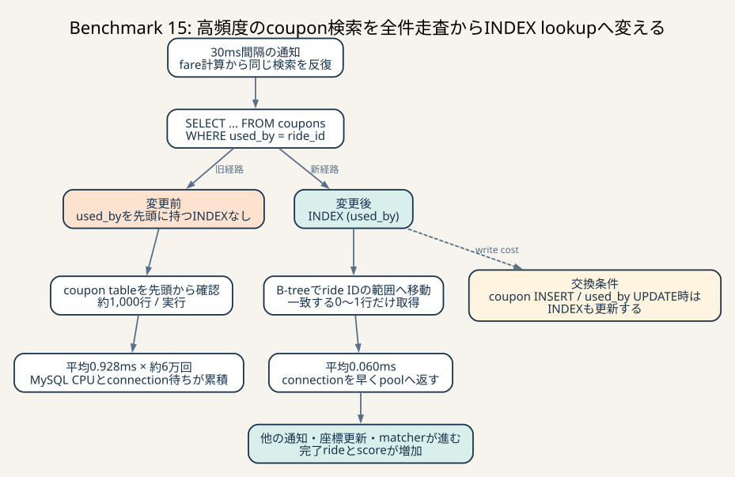
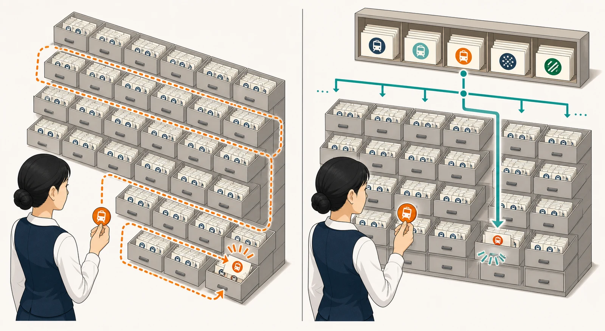

# Benchmark 15: `coupons(used_by)` INDEX

[チューニング目次へ戻る](../TUNING.md)

## 結論

`coupons.used_by` にB-tree INDEXを追加しました。60秒ベンチ3走は
88,805 / 93,606 / 100,606点で、すべて `pass=true`・エラー0でした。

- 観測範囲: 88,805–100,606点
- 推定代表値: 中央値93,606点
- 変更前中央値80,354点との差: +13,252点、約+16.5%
- 変更後の3走すべてが、変更前の最大値88,638点を上回った

対象SQLの平均時間は0.928msから0.060msへ約93.5%減りました。変更前は1回の
検索でcoupon tableの約1,000行を調べていましたが、変更後は一致する行だけを
B-treeから取得しています。正当性を変えず、DB CPUを消費していた高頻度の
全件走査を除去できたため採用します。



_変更前は通知のたびに約1,000行を確認し、DB CPUとconnection待ちが積み上がっていました。`used_by` INDEXを追加すると一致する0〜1行へ直接移動でき、同じ検索を平均0.060msで終えてconnectionを早く返せます。_

## なぜこのTODOを選んだか

決済HTTP client再利用後の構成を、変更せずに60秒走らせました。

- スコア: 83,152点
- `pass=true`
- 最終評価数: 1,149
- エラー: 0

中盤に `docker stats --no-stream` を2回採取したところ、CPU使用率は次の範囲でした。

| container | 1回目 | 2回目 |
|---|---:|---:|
| MySQL | 188.32% | 239.10% |
| Rust webapp | 89.16% | 70.65% |
| nginx | 29.94% | 22.66% |
| benchmark | 39.69% | 32.57% |

4 CPUを全containerで共有する環境で、MySQLが約2 core以上を使っていました。
そこで、Rustの細かなallocationより先にSQL本文ごとの実行回数と累積時間を
確認しました。

## SQLxのqueryをどのログで確認したか

SQLxはMySQLのprepared statement protocolを使います。この構成では
`events_statements_summary_by_digest` を見ると、個々のSQLが
`statement/com/Execute` へまとめられ、SQL本文別の負荷が分かりませんでした。

```text
statement/com/Execute  1,211,575回  累積586.952秒
statement/sql/commit     206,120回  累積205.353秒
statement/sql/begin      206,318回  累積  4.000秒
```

そこで、webappのMySQL connectionに残っている
`performance_schema.prepared_statements_instances` をSQL本文でgroup化しました。
このtableにはprepared statementごとの次の値があります。

- `COUNT_EXECUTE`: 実行回数
- `SUM_TIMER_EXECUTE`: 実行時間の合計
- `AVG_TIMER_EXECUTE`: 平均時間
- `MAX_TIMER_EXECUTE`: 最大時間
- `SUM_ROWS_EXAMINED`: 調べた行数
- `SUM_ROWS_SENT`: clientへ返した行数

実際の集計は次の形です。Performance Schemaのtimerはpicosecond単位なので、秒は
`1e12`、millisecondは `1e9` で割ります。connectionごとの平均を単純平均すると、
実行1回のconnectionと1万回のconnectionが同じ重みになるため、平均は累積時間を
総実行回数で割っています。

```sql
SELECT
  SQL_TEXT,
  SUM(COUNT_EXECUTE) AS executions,
  SUM(SUM_TIMER_EXECUTE) / 1e12 AS total_seconds,
  SUM(SUM_TIMER_EXECUTE) / NULLIF(SUM(COUNT_EXECUTE), 0) / 1e9 AS avg_ms,
  MAX(MAX_TIMER_EXECUTE) / 1e9 AS max_ms,
  SUM(SUM_ROWS_EXAMINED) AS rows_examined,
  SUM(SUM_ROWS_SENT) AS rows_sent
FROM performance_schema.prepared_statements_instances
GROUP BY SQL_TEXT
ORDER BY SUM(SUM_TIMER_EXECUTE) DESC;
```

この観測には制約があります。このtableは、その時点で存在するprepared statement
instanceだけを保持します。statementのdeallocateやconnection終了が起きると行が消える
ため、run途中に閉じたconnectionの実行分は終了時集計から欠ける可能性があります。

最終smoke後の別時点では
`Performance_schema_prepared_statements_lost=0` を確認しました。これはinstrument用の
枠不足で記録作成に失敗していないことを示しますが、計測run終了時点の値ではなく、
connection終了による欠落も否定しません。計測runでは `Connections` の前後差を保存
していなかったため、下表の回数と累積時間は全期間を保証するtraceではなく、終了時に
生存していたinstanceの集計です。変更前後を同じ方法で比較し、hot SQLを選ぶ証拠の
1つとして使います。

変更前の上位は次のとおりでした。

| SQL | 回数 | 累積 | 平均 | 最大 | 走査行数 |
|---|---:|---:|---:|---:|---:|
| nearby chairs | 1,277 | 138.575秒 | 108.516ms | 909.301ms | 5,512,578 |
| `SELECT * FROM coupons WHERE used_by = ?` | 60,993 | 56.615秒 | 0.928ms | 52.557ms | 61,616,755 |
| chair stats | 37,143 | 29.235秒 | 0.787ms | 64.355ms | 116,827 |
| latest ride status | 95,722 | 23.374秒 | 0.244ms | 137.758ms | 95,745 |

nearbyは累積時間が最大ですが、queryの意味と位置履歴の持ち方を一緒に検討する必要が
あります。一方 `coupons.used_by` は、既存の検索条件に対応するINDEXを1本追加する
だけで6,161万行の走査をなくせます。

書込み側で `used_by` が変わるのはcouponをrideへ適用するときだけです。座標のような
毎tickの書込みではないため、INDEX維持コストも比較的小さいと判断して先に選びました。

## このSQLが高頻度になる理由

`calculate_discounted_fare` は、rideにすでにcouponが紐づいている場合、次のSQLで
割引額を復元します。

```sql
SELECT *
FROM coupons
WHERE used_by = ?
```

`?` へ入るのはride IDです。この関数は評価時だけでなく、利用者の通知payloadへ
fareを入れるときにも呼ばれます。利用者は30ms間隔で通知をpollingするため、同じrideの
割引額を短時間に何度も検索します。

単発では1ms未満でも、60,993回実行されると累積56.615秒になります。並行実行の時間を
足すため累積時間はベンチの実時間と一致しませんが、MySQLがこのSQLへ使った仕事量の
比較には使えます。

## 既存INDEXではなぜ検索できないか

変更前のcoupon tableには次のINDEXがありました。

```sql
PRIMARY KEY (user_id, code)
INDEX idx_coupons_code (code)
```

主キーは `(user_id, code)` の順に並びます。B-treeの複合INDEXは、原則として左端の
列から条件が与えられたときに効率よく範囲を絞れます。`used_by` は主キーにも
`idx_coupons_code` にも含まれていないため、MySQLはcoupon tableを先頭から確認する
必要がありました。

INDEXは「tableに何かINDEXがあればすべての検索が速くなる」仕組みではありません。
検索条件、並び順、返す列に対応したキーが必要です。



_左は一致するcouponが見つかるまで多数のdrawerを確認します。右はride IDに対応する索引をたどり、対象範囲だけを読みます。既存の `code` INDEXでは、別の列である `used_by` の目的位置を示せません。_

## 変更

```sql
INDEX idx_coupons_used_by (used_by)
```

`UNIQUE INDEX` にはしていません。アプリの意味として1つのrideに複数couponを
紐づけるべきではありませんが、今回の目的は検索経路の改善です。制約を同時に
追加すると、初期データや並行更新に重複があった場合に挙動まで変わります。
性能変更と制約追加を分離するため、通常の非unique INDEXにしました。

`used_by` はnullableです。InnoDBのB-treeには `NULL` のentryも保持されますが、
今回の等価検索は具体的なride IDを指定するため、そのIDの範囲だけをlookupします。

## `EXPLAIN ANALYZE`

初期化後に実在するride IDを1つ選び、同じSQLを比較しました。

### 変更前

```text
Filter: coupons.used_by = '...'
  actual time=0.153..0.551 rows=1
  Table scan on coupons
    actual time=0.129..0.476 rows=1331
```

返すのは1行ですが、1,331行を読みました。

### 変更後

```text
Index lookup on coupons using idx_coupons_used_by
  actual time=0.0235..0.0248 rows=1
```

単発の壁時計は0.551msから0.025msへ短縮しました。約22分の1ですが、この値は
warm cache上の1回だけの実測です。採否は次の60秒ベンチと高頻度時の集計で決めます。

## 計測条件

- 2026-07-24
- Apple Silicon / Colima 4 CPU・4 GiB
- ホストとColimaのCPU / memoryは変更なし
- Rust、matcher 500ms、通知30msは同じ
- MySQL 8.4.10
- `innodb_flush_log_at_trx_commit=2`
- `sync_binlog=0`
- 決済用 `reqwest::Client` を共有した構成
- 公式ベンチマーカー60秒、静的ファイル検証あり
- 各run前にstackを再起動し、`POST /api/initialize` から開始

## ベンチ結果

### 変更前

| run | pass | スコア | 最終評価数 | matching不満 | pickup不満 | drive不満 | エラー |
|---:|---:|---:|---:|---:|---:|---:|---:|
| 1 | true | 76,761 | 1,038 | 31.2% | 41.5% | 69.7% | 0 |
| 2 | true | 88,638 | 1,224 | 25.8% | 40.4% | 74.7% | 0 |
| 3 | true | 80,354 | 1,112 | 32.3% | 41.4% | 74.2% | 0 |

- 観測範囲: 76,761–88,638点
- 推定代表値: 中央値80,354点

同じ変更前構成の診断runは83,152点・エラー0でした。これはSQLとCPU計測のための
追加実測として残しますが、事前に決めた3走の中央値へ後から混ぜません。

### 変更後

| run | pass | スコア | 最終評価数 | matching不満 | pickup不満 | drive不満 | エラー |
|---:|---:|---:|---:|---:|---:|---:|---:|
| 1 | true | 88,805 | 1,205 | 26.8% | 39.2% | 73.7% | 0 |
| 2 | true | 93,606 | 1,310 | 31.3% | 32.7% | 73.9% | 0 |
| 3 | true | 100,606 | 1,445 | 28.1% | 36.6% | 73.1% | 0 |

- 観測範囲: 88,805–100,606点
- 推定代表値: 中央値93,606点
- 変更前中央値との差: +13,252点、約+16.5%
- 全run: `pass=true`、error map空

変更後最小値88,805点も、変更前最大値88,638点を167点上回りました。差が小さい
境界なので「常に変更前より高い」とは保証しませんが、3走中央値、SQL累積時間、
走査行数、全runの正当性が同じ方向を示したため採用します。

## 変更後のSQLログ

変更後run 3では次の値でした。

| SQL | 回数 | 累積 | 平均 | 最大 | 走査行数 | 返却行数 |
|---|---:|---:|---:|---:|---:|---:|
| `SELECT * FROM coupons WHERE used_by = ?` | 56,383 | 3.386秒 | 0.060ms | 9.892ms | 37,398 | 37,398 |

変更前後でrunの処理量が異なるため、累積時間だけを直接割りません。平均時間は
0.928msから0.060msへ約93.5%減りました。

走査行数を実行回数で割ると、変更前は約1,010行/回です。変更後は約0.66行/回です。
一致するcouponがないrideでは0行、一致する場合だけ1行程度を読むため、B-tree lookupの
期待と整合します。

run 1でも38,569回・累積2.718秒・平均0.070msだったため、run 3だけの偶然では
ありません。

## なぜスコアが上がったか

通知処理は30msごとに呼ばれます。coupon検索が1回あたり1ms弱でも、MySQLで多数の
通知、座標更新、matcherが同時実行されるとCPUとconnectionを奪います。

全件走査をlookupへ変えると、次の連鎖が期待できます。

1. fare計算を含む利用者通知が早く終わる
2. DB connectionがpoolへ早く戻る
3. 他の通知、座標更新、matcherが待つ時間も減る
4. 状態遷移をbenchmarkerが早く観測できる
5. 完了評価数とスコアが増える

最終評価数の範囲は変更前1,038–1,224件から、変更後1,205–1,445件へ上がりました。
run 1同士のように範囲が一部重なるため、INDEXだけで評価数の差をすべて説明するとは
断定しません。SQLの平均時間と走査行数は、内部機序を直接支持する観測です。

## INDEX追加のコスト

INDEXは読取りを速くする代わりに、次のコストを持ちます。

- coupon INSERT時にB-treeへentryを追加する
- `used_by` UPDATE時に旧entryを除き、新しいentryを追加する
- buffer poolとdiskへINDEX pageを保持する
- 初期データ投入時にINDEXを構築する

今回のrun 3では対象SELECTを56,383回観測しました。`used_by` を変更するコード経路は
couponをrideへ割り当てる処理で、座標更新のような毎tickの更新ではありません。
これはINDEX追加を試す仮説としては妥当ですが、今回の計測では対象UPDATE回数、
UPDATE latency、INDEX byte数、buffer pool I/Oを変更前後で保存していません。

したがって「write costを単独計測して小さいと証明した」とは扱いません。60秒ベンチの
中央値と処理量はINDEX込みで改善したため、このworkload全体ではnet positiveと判断
しました。書込みコストの内訳とtableがmemoryへ収まらない規模での効果は未検証として
TODOに残します。

ただしtable全体がmemoryへ収まらない規模、couponを大量更新する別workloadでは
結果が変わり得ます。

## 他に考えられる選択肢

### 1. `(used_by, discount)` のcovering INDEX

queryを `SELECT discount` に変え、INDEXへ `discount` も含めればtable本体を読まずに
割引額を返せます。ただし現在のlookupは平均0.060msまで下がっています。INDEXを
太くしてINSERT / UPDATEを重くする前に、全体の次の律速を優先します。

### 2. rideへ適用discountを保持する

coupon適用時にdiscountをrideまたは別のcurrent-state tableへ保存すれば、通知ごとの
coupon lookupをなくせます。一方、schema変更、初期データbackfill、既存dumpの列順、
更新transactionの整合性を設計する必要があります。

### 3. 通知payloadをcacheする

同じride statusの間はfareも変わりません。status変更時にpayloadをinvalidateする
cacheなら、coupon以外のchair statsや最新status queryもまとめて減らせます。
at least onceの通知順序とprocess再起動時の再構築を別途検証します。

### 4. `UNIQUE (used_by)` にする

1 rideへ1 couponという不変条件をDBで保証できます。ただし性能改善と制約追加を
同時に行わず、初期データの重複検査、並行ride作成、coupon UPDATEの失敗処理を
確認する別タスクにします。

## 次に確認するボトルネック

INDEX後run 3の上位SQLは次のとおりです。

| SQL | 回数 | 累積 | 平均 | 走査行数 |
|---|---:|---:|---:|---:|
| nearby chairs | 1,175 | 129.226秒 | 109.980ms | 6,359,634 |
| chair stats | 33,191 | 23.545秒 | 0.709ms | 115,210 |
| latest ride status | 85,794 | 20.142秒 | 0.235ms | 85,801 |
| app未送信status | 51,918 | 15.404秒 | 0.297ms | 26,956 |

次はnearbyを優先します。現在の相関status subqueryを `rides.evaluation IS NULL` へ
変えた単発 `EXPLAIN ANALYZE` では、26.6msから14.4msへ短縮しました。ただし
残りの約11msは、各chairの位置履歴を平均109行読んで最新1件をsortする処理でした。

したがって次の実験では、次を1つずつ比較します。

1. 未完了判定を `evaluation IS NULL` へ単純化する
2. 既存の `(chair_id, created_at)` がbackward scanに使われるか、sortが残る理由を
   `EXPLAIN ANALYZE` で特定し、必要ならprojectionを狭めたcovering案を比較する
3. 履歴とは別にchairごとのcurrent locationを1行で保持する

MySQLは昇順INDEXを逆向きに読んで `created_at DESC` を処理できるため、既存INDEXと
実質重複するdescending INDEXは先に追加しません。意味変更とINDEX変更を同じrunへ
混ぜず、正当性と寄与を分けます。
