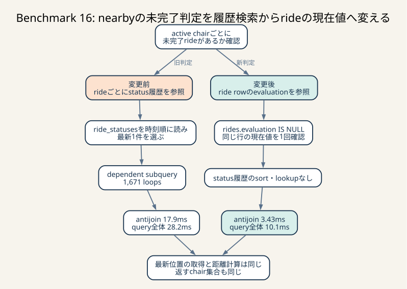
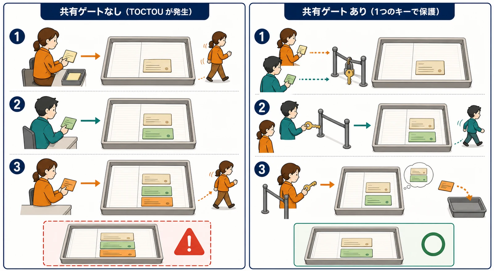
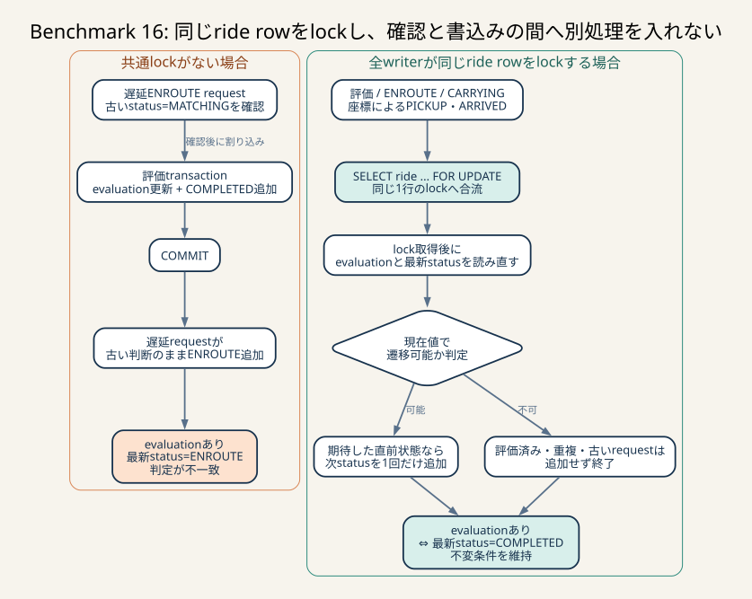

# Benchmark 16: nearbyの未完了ride判定と状態遷移の直列化

[チューニング目次へ戻る](../TUNING.md)

## 結論

`GET /api/app/nearby-chairs` の空き判定から、rideごとに最新statusを引く相関subqueryを
除き、`rides.evaluation IS NULL` を使うようにしました。ただし、SQLの置換だけでは
安全ではありません。評価と同時に進み得る全status書込みをride rowのlockで直列化し、
lock取得後の最新値で状態遷移を判定するところまでを1つの施策として採用しました。

最終版のエラー0の60秒ベンチ3走は98,628 / 98,311 / 98,580点でした。

- 観測範囲: 98,311–98,628点
- 推定代表値: 中央値98,580点
- 直前の採用版中央値93,606点との差: +4,974点、約+5.3%
- 最終評価リクエスト数の中央値: 1,310件から1,367件へ+57件、約+4.4%
- 負荷終了後の旧判定と新判定の差: 0件
- 全run: `pass=true`、error map空

SQLだけを変えた暫定版は中央値100,310点でしたが、完了後に遅延したstatusが追記される
並行実行を防げていませんでした。この値は「queryの上限効果を見る診断値」であり、
採用版のスコアとして扱いません。

## なぜこのTODOを選んだか

Benchmark 15後の上位SQLはnearby検索でした。

| SQL | 回数 | 累積 | 平均 | 走査行数 |
|---|---:|---:|---:|---:|
| nearby chairs | 1,175 | 129.226秒 | 109.980ms | 6,359,634 |
| chair stats | 33,191 | 23.545秒 | 0.709ms | 115,210 |
| latest ride status | 85,794 | 20.142秒 | 0.235ms | 85,801 |

nearby API自体はすでに1 SQLでした。しかし、そのSQLの中で「各椅子の各rideについて
最新statusを取り直す」処理が繰り返されていました。SQLの発行が1回でも、
相関subqueryの内側が外側の行数だけ動けば、DB内部ではN+1に近い反復が残ります。

変更前コードの診断runは次の状態でした。

- スコア96,015点、`pass=true`、エラー0
- 最終評価リクエスト数1,373件
- nearby SQL: 1,736回、累積205.390秒、平均118.312ms
- 走査行数9,447,475、返却行数37,838
- 負荷中のMySQL CPU snapshot: 167.91% / 233.33%
- 同時点のRust webapp CPU snapshot: 94.00% / 67.52%

CPU snapshotだけでは原因を断定できませんが、実行頻度、累積時間、走査行数、
実行計画が同じSQLを指したため、優先度をP0としました。

## 変更前後のSQL

### 変更前

```sql
AND NOT EXISTS (
    SELECT 1
    FROM rides
    WHERE rides.chair_id = chairs.id
      AND COALESCE((
          SELECT ride_statuses.status
          FROM ride_statuses
          WHERE ride_statuses.ride_id = rides.id
          ORDER BY ride_statuses.created_at DESC
          LIMIT 1
      ), '') <> 'COMPLETED'
)
```

内側のqueryは外側の `rides.id` に依存する相関subqueryです。statusが1件もないrideを
未完了とするため、`COALESCE(..., '')` も必要でした。

### 変更後

```sql
AND NOT EXISTS (
    SELECT 1
    FROM rides
    WHERE rides.chair_id = chairs.id
      AND rides.evaluation IS NULL
)
```

`evaluation` はride rowにあるため、status履歴を並べ替えて最新1件を取得する必要が
ありません。nearbyが返す列、距離計算、HTTP responseは変えていません。



_旧判定はrideごとにstatus履歴を並べ替え、最新1件を1,671回取得していました。新判定は同じride rowの `evaluation` を直接確認するため、履歴のsortとlookupを除去できます。最新位置の取得と返すchair集合は変えません。_

## `EXPLAIN ANALYZE`

同じDBで旧queryと新queryを続けて実行し、どちらも31 chairを返すことを確認しました。

| 項目 | 変更前 | 変更後 |
|---|---:|---:|
| 全体 | 28.2ms | 10.1ms |
| antijoin | 17.9ms | 3.43ms |
| latest-status dependent subquery | 1,671 loops | なし |
| latest-locationの対象 | 平均133行/chair | 平均133行/chair |

全体は約64.2%、antijoin部分は約80.8%短縮しました。位置履歴の量は同じなので、
主な差はstatus履歴検索の除去と整合します。単発値はcacheや同時負荷で変わるため、
採否は60秒ベンチとprepared statement統計でも確認しました。

## 最初の仮説に足りなかったこと

最初は、評価handlerが次を同じtransactionで行うため、2つの判定は常に同値だと
考えました。

```text
evaluationを更新
COMPLETEDを追加
決済を含む後続処理
COMMIT
```

同じtransactionは、`evaluation` だけが見えて `COMPLETED` がまだ見えない中間状態を
外部へ公開しません。しかし、原子性が守るのはそのtransaction自身の書込みだけです。
commit後に別transactionがstatusを追加することまでは防ぎません。

### 実際にあり得た反例

修正前は次の順序が可能でした。

```text
評価transaction
  ridesを更新してrow lockを保持
  COMPLETEDを追加
  COMMIT

遅延していたENROUTE request
  SELECT ... FOR UPDATE が待機解除
  evaluationを確認せずENROUTEを追加
  COMMIT
```

最終状態は `evaluation IS NOT NULL` なのに最新statusが `ENROUTE` です。旧nearby判定は
「未完了」、新判定は「完了」と判断するため、新判定だけが椅子を空きとして掲載します。



_左はENROUTE requestが古い状態を覚えたまま待ち、評価完了後に古いstatusを追記します。右は全writerが同じrideのkeyを順番に取得し、lock後の最新状態を読み直すため、評価済みrideへの古い追記をrejectできます。_

座標更新にも同種の競合がありました。あるrequestが最新status=`CARRYING` を読んだ後に
別requestが `ARRIVED` と `COMPLETED` を確定し、遅延した最初のrequestが古い判断のまま
`ARRIVED` を追記できます。この「確認した時点」と「書く時点」の間に条件が変わる問題を
TOCTOU（Time Of Check to Time Of Use）と呼びます。

負荷中sampleの差分0件は、観測した時点で不整合がなかった証拠です。しかし、起こり得る
すべての並行順序を反証するものではありません。コードレビューで見つかった反例を
優先し、SQLだけの版は不採用にしました。

## 不変条件をどう守ったか

守る条件は次です。

```text
evaluation IS NOT NULL
    ⇔ 最新statusがCOMPLETED
```

この条件へ影響する全writerが、同じride rowを同じ順序でlockします。

1. 評価handlerは最初にrideを `SELECT ... FOR UPDATE` する
2. chairの `ENROUTE` / `CARRYING` handlerもrideを `FOR UPDATE` する
3. `evaluation IS NOT NULL` ならstatusを追加せず400を返す
4. `ENROUTE` はlock取得後の最新statusが `MATCHING` の場合だけ追加する
5. 同じ `ENROUTE` の再送は204として扱い、履歴を重複させない
6. 座標による `PICKUP` / `ARRIVED` は、候補座標のときだけrideをlockする
7. lock取得後にstatusを `FOR UPDATE` でcurrent readし、期待した直前状態の場合だけ次を追加する

重要なのは「transactionを使った」ことではなく、同じ不変条件を変更するwriterが
同じlockへ合流し、lock取得後に条件を読み直すことです。



_transactionを開始するだけでは別transactionの遅延書込みを防げません。全writerが同じride rowへ合流し、lock取得後に `evaluation` と最新statusを読み直すことで、確認と書込みの間へ別の状態遷移が入るのを防ぎます。_

## lock範囲をどう決めたか

最初の安全化では、すべての座標更新で現在rideを `FOR UPDATE` しました。正しさは
明快ですが、椅子は高頻度で座標を送るため、評価・状態更新と同じrow lockを通常座標
まで取り合いました。

| 実験 | 60秒スコア | 中央値 | 判断 |
|---|---|---:|---|
| queryだけ変更 | 96,546 / 108,073 / 100,310 | 100,310 | 競合反例があるため不採用 |
| 全座標でride lock | 95,653 / 90,523 / 88,656 | 90,523 | 安全だが過剰lockで不採用 |
| pickup/destination候補だけlock | 90,858 / 107,091 / 92,484 | 92,484 | 安全化の土台、まだ直前版未満 |
| 通常座標のstatus取得も除去 | 94,280 / 102,284 / 95,432 | 95,432 | SQLは改善したがsnapshot競合が残り不採用 |
| statusもlocking read + 完了ride早期除外 | 98,628 / 98,311 / 98,580 | 98,580 | 競合再現、同一座標、3走を通して採用 |

全座標lock版の最終評価数は1,345 / 1,267 / 1,212件でした。正しさのためのlockでも、
頻度と保持範囲を広げすぎれば状態進行を遅くします。pickupまたはdestinationと一致した
約4.5%の座標だけlockする設計へ絞りました。通常座標のquery削減と
`REPEATABLE READ` のsnapshot対策は
[Benchmark 17](./17-coordinate-transition-query.md) に分けて記録しています。

## 結果集合をどう比較したか

変更前revisionの負荷中に、全rideの旧判定と新判定、および旧・新nearby結果を比較しました。

| 時点 | ride総数 | `evaluation IS NULL` | 旧判定の未完了 | 判定差 | 旧nearby | 新nearby | 片側だけ |
|---|---:|---:|---:|---:|---:|---:|---:|
| 初期化後 | 750 | 0 | 0 | 0 | — | — | — |
| 負荷中1 | 943 | 108 | 108 | 0 | 2 | 2 | 0 |
| 負荷中2 | 1,575 | 199 | 199 | 0 | 41 | 41 | 0 |
| 負荷中3 | 2,286 | 236 | 236 | 0 | 79 | 79 | 0 |
| 最終採用版run終了時 | — | — | — | 0 | — | — | — |

診断queryは次です。

```sql
SELECT COUNT(*) AS differing_rides
FROM rides
WHERE (evaluation IS NULL) <> (
    COALESCE((
        SELECT ride_statuses.status
        FROM ride_statuses
        WHERE ride_statuses.ride_id = rides.id
        ORDER BY ride_statuses.created_at DESC
        LIMIT 1
    ), '') <> 'COMPLETED'
);
```

これは正当性確認用であり、hot pathには入れません。

## ベンチ結果

### 比較対象: Benchmark 15

| run | pass | スコア | 最終評価数 | matching不満 | pickup不満 | drive不満 | エラー |
|---:|---:|---:|---:|---:|---:|---:|---:|
| 1 | true | 88,805 | 1,205 | 26.8% | 39.2% | 73.7% | 0 |
| 2 | true | 93,606 | 1,310 | 31.3% | 32.7% | 73.9% | 0 |
| 3 | true | 100,606 | 1,445 | 28.1% | 36.6% | 73.1% | 0 |

推定代表値は中央値93,606点です。

### 最終採用版

| run | pass | スコア | 最終評価数 | matching不満 | pickup不満 | drive不満 | エラー |
|---:|---:|---:|---:|---:|---:|---:|---:|
| 1 | true | 98,628 | 1,343 | 31.8% | 41.1% | 71.1% | 0 |
| 2 | true | 98,311 | 1,369 | 28.1% | 39.7% | 71.6% | 0 |
| 3 | true | 98,580 | 1,367 | 28.7% | 39.6% | 72.5% | 0 |

- 観測範囲: 98,311–98,628点
- 推定代表値: 中央値98,580点
- 比較対象との差: +4,974点、約+5.3%
- 最終評価数中央値: 1,367件
- 不満率中央値: matching 28.7%、pickup 39.7%、drive 71.6%

3走は分布を確定する数ではありません。変更前後の範囲も重なるため、次回も必ず
98,580点になるとは主張しません。正当性、query内部の処理削減、直前版を上回る中央値が
同じ方向を示したため採用しました。

## nearby SQLの内部効果

queryだけを変えた暫定版で、nearby SQLは次のように変化しました。

| 条件 | 回数 | 累積 | 平均 | 最大 | 走査行数 | 1回あたり走査 |
|---|---:|---:|---:|---:|---:|---:|
| 変更前診断 | 1,736 | 205.390秒 | 118.312ms | 724.675ms | 9,447,475 | 約5,442 |
| 暫定run 1 | 1,460 | 50.742秒 | 34.755ms | 283.480ms | 1,188,254 | 約814 |
| 暫定run 3 | 1,700 | 73.324秒 | 43.132ms | 354.593ms | 1,467,299 | 約863 |

最終採用版run 3は1,838回・累積82.451秒・平均44.859ms・走査1,492,575行でした。
status相関subqueryを除いた効果は、安全化後も維持されています。

`Performance_schema_prepared_statements_lost=0` も確認しました。ただし終了時snapshotは、
終了済みconnectionのstatementを保持しないため、完全なtraceではありません。
`EXPLAIN ANALYZE` と複数runの同じ傾向を合わせて内部機序の証拠とします。

## 計測条件

- 2026-07-24
- Apple Silicon / Colima 4 CPU・4 GiB
- ホストとColimaのCPU / memoryは変更なし
- MySQL 8.4.10
- `innodb_flush_log_at_trx_commit=2`
- `sync_binlog=0`
- matcher 500ms、通知30ms
- 決済用 `reqwest::Client` と `coupons(used_by)` INDEXを維持
- 公式ベンチマーカー60秒、静的ファイル検証あり
- 各runで `POST /api/initialize` を実行

## 他に考えられる選択肢

### statusのcurrent-state表

rideごとに現在statusを1行で持ち、履歴INSERTと同じtransactionでcompare-and-swap更新
すれば、最新status queryも減らせます。ただし初期化時の再構築、既存履歴との照合、
全writerの移行が必要です。Phase 3として別に測ります。

### `(chair_id, evaluation)` INDEX

nearbyの `NOT EXISTS` に合う可能性はありますが、ride作成とevaluation更新のwrite costも
増えます。今回のquery単純化と同時に追加すると寄与を分離できないため、rides lookupが
再び上位になった時点で単独比較します。

### DB trigger

2 tableをまたぐ不変条件をtriggerで補強する案です。すべてのwriterへ適用できる一方、
状態順序の知識がDBへ分散し、初期データ投入とwrite latencyにも影響します。まず
applicationのlock順序を統一し、差分queryと競合testで検証します。

### nearby response全体のcache

座標は最大3秒古くてもよい一方、割当可否は即時反映が必要です。response全体のcacheは
割当済みchairを返し得るため採用しません。試す場合は座標だけをcacheし、`is_active` と
未完了ride判定は最新状態を合成します。

## 残ったボトルネック

最終runでもnearbyは累積時間1位でした。各chairについて `chair_locations` の最新1件を
得る `LATERAL` subqueryが、履歴を平均100行以上読みsortします。次は、既存
`(chair_id, created_at)` INDEXの逆順scanでsortが残る理由を確認し、それでも解消しなければ
最新座標を1 chair 1行で保持するcurrent-state表を単独比較します。

## 参照

- [Benchmark 17: 座標状態遷移のquery削減](./17-coordinate-transition-query.md)
- [Rust実装とrelease build](./80-rust-implementation.md)
- [SQLx `Transaction`](https://docs.rs/sqlx/latest/sqlx/struct.Transaction.html)
- [MySQL: Correlated Subqueries](https://dev.mysql.com/doc/refman/8.4/en/correlated-subqueries.html)
- [MySQL: InnoDB Locking Reads](https://dev.mysql.com/doc/refman/8.4/en/innodb-locking-reads.html)
