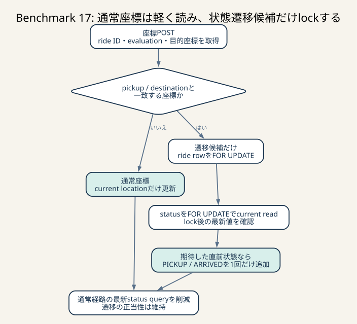

# Benchmark 17: 座標状態遷移のquery削減とcurrent read

[チューニング目次へ戻る](../TUNING.md)



_通常座標はcurrent location更新だけで終え、pickup / destinationに一致する約5%の候補だけrideをlockします。通常経路の最新status queryを削りながら、lock後のcurrent readで重複遷移を防ぎます。_

## 結論

`POST /api/chair/coordinate` が現在rideを取得するたびに最新statusを引く処理をやめました。
通常座標ではrideのID、evaluation、pickup / destinationだけを取得し、未評価かつ
座標が遷移地点と一致した場合だけride rowをlockします。lock取得後のstatusは
`FOR UPDATE` でcurrent readし、期待した直前状態の場合だけ次statusを追加します。

最終版の60秒ベンチ3走は98,628 / 98,311 / 98,580点でした。

- 観測範囲: 98,311–98,628点
- 推定代表値: 中央値98,580点
- 最後に採用済みだったBenchmark 15の中央値93,606点との差: +4,974点、約+5.3%
- 最終評価数の中央値: 1,367件
- 全run: `pass=true`、error map空
- 旧nearby判定との差: 0件
- `PICKUP` / `ARRIVED` のride内重複: 0件

## 仮説

競合対策の途中版では、pickup / destination候補だけrideをlockするところまで絞っても、
現在ride queryは全座標で最新statusの相関subqueryを実行していました。

その版のrun 3では次の値でした。

| SQL | 回数 | 累積 | 平均 | 走査行数 |
|---|---:|---:|---:|---:|
| current ride + latest status | 31,228 | 8.984秒 | 0.288ms | 147,634 |
| latest status全体 | 81,539 | 14.310秒 | 0.176ms | 81,551 |
| transition用ride lock | 1,499 | 0.100秒 | 0.067ms | 1,499 |

遷移候補は全座標の約4.8%でした。残り約95%はpickupでもdestinationでもないため、
statusを取得しても遷移を起こしません。先に座標とevaluationで候補を絞れば、
通常経路のstatus lookupと、目的地に止まっている完了rideのrow lockをなくせると
仮説を立てました。

反証条件は次のとおりです。

- `PICKUP` / `ARRIVED` が欠け、評価数またはスコアが下がる
- 同じ遷移が重複して履歴へ入る
- 完了後に別statusが追記され、旧nearby判定との差が発生する
- pickupとdestinationが同じrideを完了できない
- query時間が減ってもlock待ちが増え、60秒中央値が改善しない

## 変更前

```sql
SELECT rides.id,
       rides.pickup_latitude,
       rides.pickup_longitude,
       rides.destination_latitude,
       rides.destination_longitude,
       (
           SELECT ride_statuses.status
           FROM ride_statuses
           WHERE ride_statuses.ride_id = rides.id
           ORDER BY ride_statuses.created_at DESC
           LIMIT 1
       ) AS status
FROM rides
WHERE rides.chair_id = ?
ORDER BY rides.updated_at DESC
LIMIT 1
```

このqueryは座標とrideの状態に関係なく、毎回status履歴を読みます。

## 変更後

最初のqueryは現在rideの判定に必要な列だけを返します。

```sql
SELECT rides.id,
       rides.evaluation,
       rides.pickup_latitude,
       rides.pickup_longitude,
       rides.destination_latitude,
       rides.destination_longitude
FROM rides
WHERE rides.chair_id = ?
ORDER BY rides.updated_at DESC
LIMIT 1
```

Rust側で次のboolを作ります。

```text
is_pickup      = 現在座標 == pickup
is_destination = 現在座標 == destination
```

`evaluation IS NULL` かつ、どちらかがtrueの場合だけ次へ進みます。

1. `SELECT evaluation FROM rides WHERE id = ? FOR UPDATE`
2. statusを `... LIMIT 1 FOR UPDATE` でcurrent read
3. 最新status=`ENROUTE` かつ `is_pickup` なら `PICKUP`
4. 最新status=`CARRYING` かつ `is_destination` なら `ARRIVED`
5. 座標とstatusを同じtransactionでcommit

statusを読んでから座標条件を `if ... else if` で固定しない理由があります。
pickupとdestinationが同じrideでは両方のboolがtrueです。最新statusが `ENROUTE` なら
`PICKUP`、clientが `CARRYING` を送った後の次座標では `ARRIVED` を選ぶ必要があります。
状態を先に見て遷移を選ぶことで、同一座標rideも完了できます。

## なぜstatusにも `FOR UPDATE` が必要か

ride rowをlockした後に通常の `SELECT` でstatusを読み直すだけでは不十分でした。
MySQLの既定isolation levelである `REPEATABLE READ` では、通常のconsistent readは
transaction内で最初に作ったsnapshotを使います。

座標handlerはrideをlockする前にcurrent rideを通常SELECTしています。そのため、
次の順序が可能でした。

```text
request A: current rideを通常SELECTし、snapshot S1を作る
request B: 同じride rowを先にlockし、PICKUPを追加してcommit
request A: ride lockを取得
request A: 通常SELECTでstatusを再読するが、S1のENROUTEを見る
request A: PICKUPを重複INSERT
```

`SELECT ... FOR UPDATE` はlocking readであり、古いsnapshotではなく、その時点で
commit済みの最新rowを読むcurrent readです。ride row lockがwriterの順番を決め、
statusのlocking readが直前writerの結果を観測します。

「lockを取った後に読み直した」というコードの順番だけでは安全性を説明できません。
isolation levelと、読み直しがconsistent readかcurrent readかまで確認する必要があります。

## なぜ全座標をlockしないのか

すべての座標でride rowをlockした版は3走中央値90,523点でした。座標は約30msごとに
多数のchairから送られ、評価と手動status更新も同じride rowを使います。状態を変えない
通常座標までlockすると、正当性に必要のない待ち行列を作ります。

安全性に必要なのは「遷移を書こうとするwriter同士を直列化すること」です。
readだけで終わる通常座標まで直列化する必要はありません。

## 途中で棄却した版

| 版 | スコア | 判断 |
|---|---:|---|
| 全座標をride lock | 95,653 / 90,523 / 88,656、中央値90,523 | 競合は防げるがlock過多 |
| 遷移候補だけlock、通常座標もstatus取得 | 90,858 / 107,091 / 92,484、中央値92,484 | 通常queryが重く、snapshot競合も残る |
| 通常座標のstatus取得を除去 | 94,280 / 102,284 / 95,432、中央値95,432 | queryは改善したがsnapshot競合と同一座標bugが残る |
| 同一座標修正 + 完了ride早期除外、statusは通常read | 99,584、n=1 | レビューでsnapshot競合が判明し、測定を打ち切り |
| statusもlocking read | 98,628 / 98,311 / 98,580、中央値98,580 | 正当性確認後に採用 |

性能値が高くても、起こり得る並行順序を壊す版は採用しません。99,584点のrunは
最終版の推定値へ混ぜず、問題発見時点で比較を打ち切りました。

## 最終版のSQLログ

run 3の終了時snapshotです。

| SQL | 回数 | 累積 | 平均 | 最大 | 走査行数 |
|---|---:|---:|---:|---:|---:|
| current rideの座標・evaluation | 55,999 | 6.278秒 | 0.112ms | 20.413ms | 55,740 |
| 遷移候補のride lock | 2,493 | 0.135秒 | 0.054ms | 9.058ms | 2,493 |
| 遷移候補のstatus locking read | 2,493 | 0.458秒 | 0.184ms | 14.391ms | 2,493 |

遷移候補は全座標の約4.5%です。変更前のcurrent ride queryは平均0.288ms、変更後は
0.112msで、約61.1%短縮しました。status locking readの累積0.458秒を加えても、
通常座標約95.5%からstatus相関subqueryを除く効果が上回りました。

この集計は `performance_schema.prepared_statements_instances` の終了時snapshotなので、
終了済みconnectionの情報が欠ける可能性があります。
`Performance_schema_prepared_statements_lost=0`、query本文、総合ベンチも合わせて
判断しています。

## ベンチ結果

### 比較対象: Benchmark 15

| run | pass | スコア | 最終評価数 | エラー |
|---:|---:|---:|---:|---:|
| 1 | true | 88,805 | 1,205 | 0 |
| 2 | true | 93,606 | 1,310 | 0 |
| 3 | true | 100,606 | 1,445 | 0 |

- 観測範囲: 88,805–100,606点
- 推定代表値: 中央値93,606点

### 最終版

| run | pass | スコア | 最終評価数 | matching不満 | pickup不満 | drive不満 | エラー |
|---:|---:|---:|---:|---:|---:|---:|---:|
| 1 | true | 98,628 | 1,343 | 31.8% | 41.1% | 71.1% | 0 |
| 2 | true | 98,311 | 1,369 | 28.1% | 39.7% | 71.6% | 0 |
| 3 | true | 98,580 | 1,367 | 28.7% | 39.6% | 72.5% | 0 |

- 観測範囲: 98,311–98,628点
- 推定代表値: 中央値98,580点
- 直前採用版との差: +4,974点、約+5.3%
- 最終評価数中央値: 1,367件
- すべて `pass=true`、error map空

変更前後の観測範囲は98,311–100,606点で重なります。3走だけで分布は確定しませんが、
最終版は3値の幅が317点と小さく、内部queryの削減、正当性、評価数中央値も同じ方向を
示したため採用しました。

## 正当性をどう確認したか

### 同一pickup / destination

同じ緯度・経度をpickupとdestinationへ設定したrideを作り、実際のHTTP endpointで
次の順序を送信しました。

```text
ENROUTE request          -> 204
同一座標のcoordinate     -> 200、PICKUP
CARRYING request         -> 204
同一座標のcoordinate     -> 200、ARRIVED
```

DB履歴は `MATCHING, ENROUTE, PICKUP, CARRYING, ARRIVED` の順でした。

### 並行座標更新

診断用transactionでride rowを5秒lockし、その後ろに同じpickup座標のcoordinate requestを
2本同時に待たせました。lock解放後は両方HTTP 200でしたが、DBの件数は次のとおりです。

```text
ENROUTE  1
PICKUP   1
```

2本目がstatus locking readで1本目の `PICKUP` を確認し、追加INSERTしなかった結果です。

### 負荷終了後

- `evaluation IS NULL` と `latest status != COMPLETED` の差: 0件
- ride内で2件以上ある `PICKUP` / `ARRIVED`: 0件
- `Performance_schema_prepared_statements_lost`: 0
- `cargo fmt --check`: 成功
- `cargo clippy --all-targets --all-features -- -D warnings`: 成功
- `cargo test --all --all-targets`: 成功（test caseは0件）
- Docker release buildとsmoke test: 成功

並行再現は手動統合検証です。自動integration test化はTODOへ残します。

## 他の選択肢

### 1 SQLの条件付きstatus INSERT

期待する最新statusを `INSERT ... SELECT ... WHERE` で表せば往復を減らせる可能性が
あります。ただしride row lockとの順序、同時INSERT、最新行の同率時刻を検証する必要が
あります。まずcurrent readの意味が明確な版を基準にします。

### READ COMMITTEDへ下げる

通常SELECTでも各statement開始時のcommit済みデータを読むため、今回の古いsnapshotは
避けやすくなります。ただしapplication全体のread semanticsが変わります。1箇所の
状態遷移のためにisolation level全体を変えず、対象queryをlocking readにしました。

### ride current-state表

`current_status` とversionを1 ride 1行で持ち、条件付きUPDATEで
`ENROUTE -> PICKUP` をcompare-and-swapできます。履歴の最新行検索もなくせますが、
全status writer、初期化、再起動時の復元を同時に移行する必要があります。

### per-chair queue

座標を椅子ごとに順序付きqueueへ入れればHTTP応答をDB commitから分離できます。
一方、中間座標は累積距離と到達判定に必要であり、dropできません。queue full時の
backpressure、3秒以内の反映、shutdown時flushを先に定義してから別実験にします。

## 次のTODO

nearbyの最新位置 `LATERAL` が引き続き最大の累積SQLです。次は現在座標を1 chair 1行で
保持する案の前に、既存 `(chair_id, created_at)` INDEXでsortが残る理由と、必要列を
含めるcovering案のwrite costを測ります。
