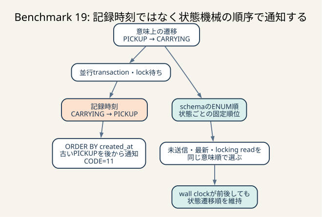

# Benchmark 19: 通知と最新状態を時刻順から状態遷移順へ変更

[チューニング目次へ戻る](../TUNING.md)



_記録時刻はlock待ちで前後しても、状態の意味順は変わりません。通知・最新状態・locking readを同じENUM順で選ぶことで、古いstatusを後から配送する失格を防ぎます。_

## 結論

`ride_statuses.created_at` を状態の順序そのものとして使うのをやめ、schemaで定義した
`status` のENUM順を使うようにしました。

対象は次の4経路です。

1. 利用者へ送る最古の未送信status
2. 椅子へ送る最古の未送信status
3. 通常の最新status取得
4. 座標による `PICKUP` / `ARRIVED` 判定時のlocking read

診断runでは、利用者がすでに `CARRYING` を受信した後に古い `PICKUP` を受信し、
ベンチマーカーがCODE=11で走行を中止しました。DBには同じrideについて次の順序で
記録されていました。

| status | created_at |
|---|---|
| `CARRYING` | `2026-07-24 16:23:56.194779` |
| `PICKUP` | `2026-07-24 16:23:56.213398` |

意味上は `PICKUP -> CARRYING` ですが、`created_at` の昇順では
`CARRYING -> PICKUP` になります。時刻は観測時刻であり、状態機械のversionでは
ありません。並行transaction、lock待ち、同じ時刻、時計の補正を含む環境で、
wall-clockだけを状態遷移の順序へ流用しないことが今回の中心です。

変更後の60秒ベンチは89,539 / 98,338 / 99,895点でした。

- 全run `pass=true`
- 観測範囲: 89,539–99,895点
- 推定代表値: 中央値98,338点
- CODE=11: 全run 0件
- run 3: error map空
- 変更前Benchmark 18の中央値96,926点との差: +1,412点、約+1.5%

観測範囲は大きく重なるため、+1.5%を確定的な速度向上とはみなしません。この施策の
採用理由は、実際に起きた失格を再現でき、修正後に両通知経路の順序と3走の完走を
確認できたことです。INDEXは修正によるsort増加を避けるため同時に合わせています。

## どのログを見て優先度を変えたか

当初は `POST /api/chair/coordinate` のcurrent row更新を測る予定でした。
Performance Schemaのstatement履歴とtransaction履歴を診断runだけ有効にし、
row-lock待ちとp95 / p99を対応付けようとしました。

しかし負荷開始後、次のcritical errorが先に再現しました。

```text
ユーザーに想定していないライドの状態遷移の通知がありました (CODE=11):
ride_id: 01KYAF1E46Y5AZ0EVQ0NN5Y40S,
expect: CARRYING, got: PICKUP (current: CARRYING)
```

診断runの最終値は `pass=false`、13,347点、`map[11:1]` でした。履歴収集を有効にした
診断条件で、critical errorにより早期終了しているため、通常条件の性能比較には
使用しません。

失格はSQL時間の大小より優先します。そこで座標writeの変更を重ねず、次の順で
evidenceを追いました。

1. エラーに含まれるride IDをDBで検索する
2. `ride_statuses` を `created_at, id` 順に並べる
3. 同じ行を状態機械の進行順に並べる
4. app / chair通知SQLと共通の最新status関数を確認する
5. current schemaで `EXPLAIN` を取る
6. 候補INDEXを診断DBへ一時追加し、filesortが消えるか確認する

問題のrideは、時刻順の最新が `PICKUP`、状態順の最新が `CARRYING` でした。
診断run終了時に両方式の最新statusが異なるrideはこの1件だけで、ベンチマーカーが
報告したrideと一致しました。ログ、DB row、読み取りSQLが同じ原因を指しています。

## 仮説と反証条件

仮説は次のとおりです。

> ISURIDEのstatusは後戻りしない直線的な状態機械であり、ENUMの宣言順が状態versionを
> 表す。通知cursorと最新状態をこのversion順で読むと、wall-clockが逆転しても古い状態を
> 新しい状態の後へ配信しない。複合INDEXの末尾もstatusへ変えればfilesortを増やさない。

反証条件は次です。

- appまたはchair通知が `CARRYING` の後に `PICKUP` を返す
- `PICKUP` / `ARRIVED` が欠ける、または重複する
- ENUMの宣言順と実際の状態機械が一致していない
- `EXPLAIN` に `Using filesort` が残る
- status INSERTのsecondary INDEX更新が増え、通常ベンチの中央値が大きく悪化する
- 60秒ベンチがCODE=11または別のcritical errorで失敗する

## なぜ `created_at` だけでは順序にならないか

時刻とversionは用途が異なります。

```text
時刻
  「いつ観測・作成されたか」を表す

version / sequence
  「どちらの状態が先で、どちらが後か」を表す
```

同じtransaction内で時刻を採った順とcommit順が常に一致するとは限りません。
別transactionがrow lockを待つ場合、処理開始、SQL実行、lock取得、commitの順序は
一致しません。また、wall-clockは時刻同期で補正される可能性があり、同一microsecondの
tieも考慮が必要です。

`ORDER BY created_at, id` とすれば同率時刻は決定できますが、今回のように時刻そのものが
状態順と逆なら直りません。IDをtie-breakへ足すことと、状態のversionを持つことは
別問題です。

今回の状態機械は次の一直線です。

```text
MATCHING
  -> ENROUTE
  -> PICKUP
  -> CARRYING
  -> ARRIVED
  -> COMPLETED
```

schemaのENUMもこの順で宣言されています。

```sql
ENUM (
  'MATCHING',
  'ENROUTE',
  'PICKUP',
  'CARRYING',
  'ARRIVED',
  'COMPLETED'
)
```

MySQLのENUMは通常、文字列の辞書順ではなく宣言時の内部index順でソートされます。
そのため、このschemaでは `ORDER BY status ASC` が古い状態から新しい状態、
`ORDER BY status DESC` が新しい状態から古い状態になります。

この方法はすべてのシステムへ一般化できません。状態遷移に分岐、取消、再開、再試行を
追加し、単一の大小関係で表せなくなった場合は、明示的なsequence番号やcurrent-state表へ
移行する必要があります。

- [MySQL 8.0: The ENUM Type](https://dev.mysql.com/doc/refman/8.0/en/enum.html)
- [MySQL 8.0: ORDER BY Optimization](https://dev.mysql.com/doc/refman/8.0/en/order-by-optimization.html)

## SQLの変更

### 未送信通知

変更前は、未送信行を時刻の古い順に1件返していました。

```sql
SELECT *
FROM ride_statuses
WHERE ride_id = ?
  AND app_sent_at IS NULL
ORDER BY created_at ASC
LIMIT 1;
```

変更後は状態の古い順です。chair側も `chair_sent_at` で同じ変更を行いました。

```sql
SELECT *
FROM ride_statuses
WHERE ride_id = ?
  AND app_sent_at IS NULL
ORDER BY status ASC
LIMIT 1;
```

`app_sent_at` / `chair_sent_at` は引き続きDB上の配信cursorです。cacheへ移していないため、
process再起動後もどのstatusが未送信かを復元できます。

### 最新status

変更前:

```sql
SELECT status
FROM ride_statuses
WHERE ride_id = ?
ORDER BY created_at DESC
LIMIT 1;
```

変更後:

```sql
SELECT status
FROM ride_statuses
WHERE ride_id = ?
ORDER BY status DESC
LIMIT 1;
```

座標遷移用の `FOR UPDATE` も同じ順序へ揃えました。通常readだけを変更してlocking readを
時刻順のまま残すと、同じrideについて経路ごとに「最新」の定義が分かれます。

## INDEXの仕組みと変更理由

変更前の3本は次でした。

```sql
(ride_id, created_at)
(ride_id, app_sent_at, created_at)
(ride_id, chair_sent_at, created_at)
```

変更後:

```sql
(ride_id, status)
(ride_id, app_sent_at, status)
(ride_id, chair_sent_at, status)
```

複合B-tree `(ride_id, app_sent_at, status)` は、まず `ride_id`、同じride内で
`app_sent_at`、さらに同じ組の中で `status` の順に並びます。

通知SQLは先頭2列を等価条件で固定します。

```text
ride_id = ?
app_sent_at IS NULL
```

その連続範囲では次の列 `status` がすでに昇順です。MySQLは別のsortを作らず、
先頭1件で止まれます。`IS NULL` もこのqueryでは1つの値への等価条件として使われます。

最新statusは `(ride_id, status)` の対象ride範囲を末尾から読む
`Backward index scan` です。`DESC` 専用INDEXをもう1本増やす必要はありません。

### `EXPLAIN` の変化

app未送信通知:

| 状態 | key | Extra |
|---|---|---|
| 変更前 | `idx_ride_statuses_ride_app_sent_at` | `Using index condition; Using filesort` |
| 変更後 | `idx_ride_statuses_ride_app_sent_at` | `Using index condition` |

最新status:

| 状態 | key | Extra |
|---|---|---|
| 変更前 | `idx_ride_statuses_ride_created_at` | `Using filesort` |
| 変更後 | `idx_ride_statuses_ride_status` | `Backward index scan; Using index` |

`Using filesort` は必ずdiskへ書くという意味ではありませんが、INDEX順をそのまま
使えず、別の並べ替えが必要なことを示します。今回は1rideあたり最大6行程度でも、
通知pollingで数万回繰り返すため、正当性修正に伴うsortを残さないようにしました。

run 3終了時の `prepared_statements_instances` 集計例は次です。

| SQL | calls | 累積 | 平均 | 最大 | rows examined |
|---|---:|---:|---:|---:|---:|
| 最新status | 127,449 | 17.213秒 | 0.135ms | 70.422ms | 127,470 |
| app未送信status | 75,414 | 12.095秒 | 0.160ms | 32.319ms | 39,062 |
| chair未送信status | 55,160 | 9.152秒 | 0.166ms | 153.597ms | 39,730 |
| 遷移用locking read | 2,484 | 0.439秒 | 0.177ms | 5.710ms | 2,484 |

この表は現在残っているprepared statement instanceのsnapshotで、終了済みconnectionの
情報を欠く可能性があります。`Performance_schema_prepared_statements_lost=0` と
実行計画を合わせ、hot pathの順位付けとして使います。

## 自動回帰テスト

`scripts/test-status-notification-order.sh` を追加しました。このスクリプトは
`POST /api/initialize` でDBを初期化し、次の意図的な逆転を作ります。

```text
MATCHING created_at = 00.100
ENROUTE  created_at = 00.200
CARRYING created_at = 00.300
PICKUP   created_at = 00.400
```

時刻順なら `CARRYING -> PICKUP` ですが、期待する状態順は
`PICKUP -> CARRYING` です。実際のHTTP endpointを4回ずつ呼び、次を確認します。

```text
app notification:
  MATCHING -> ENROUTE -> PICKUP -> CARRYING

chair notification:
  MATCHING -> ENROUTE -> PICKUP -> CARRYING

app / chair latest notification fallback:
  CARRYING

destination coordinate locking read:
  CARRYING -> ARRIVED
```

実行コマンド:

```sh
./scripts/up.sh
./scripts/test-status-notification-order.sh
```

このテストは開始時と終了時にローカルDBを初期化します。途中で失敗またはsignal終了
した場合もtrapで初期化を試みます。保持したいデータがある環境では実行しません。
各HTTP requestにはconnect timeoutと全体timeoutを設定し、停止したserviceを
無期限に待ちません。

## 60秒ベンチ結果

条件はApple Silicon macOS、Colima 4 CPU / 4 GiB、同一Dockerホスト、公式
ベンチマーカー、静的ファイル検証ありです。ホストCPU / memoryは変更していません。

| run | pass | スコア | error map |
|---:|---:|---:|---|
| 1 | true | 89,539 | `26:156, 30:1` |
| 2 | true | 98,338 | `26:144, 30:1` |
| 3 | true | 99,895 | 空 |

- 観測範囲: 89,539–99,895点
- 推定代表値: 中央値98,338点
- Benchmark 18の中央値96,926点との差: +1,412点、約+1.5%
- CODE=11: 0件

CODE=26はowner椅子一覧の累積距離差、CODE=30は評価直後のnearby警告であり、
今回修正した状態通知のCODE=11とは分けます。run 3では両方とも0件でした。
CODE=26がrun 1 / 2で多数出たため、次の独立したP0として距離計算の順序と
snapshot境界を調べます。

終了時の検査は次でした。

- 時刻順の最新と状態順の最新が異なるride: 0件
- 同じride / statusが2行以上あるgroup: 0件
- `Performance_schema_prepared_statements_lost`: 0
- release Docker build: 成功
- `cargo fmt --check`: 成功
- `cargo test --all --all-targets`: 7件成功
- `cargo clippy --all-targets --all-features -- -D warnings`: 成功

## 他の選択肢

### `ORDER BY FIELD(status, ...)`

schemaを見なくても順序がSQLへ明示されます。一方、columnへの式を `ORDER BY` に使うと、
通常はB-treeのstatus順をそのまま利用できず、filesortが残ります。状態順がschemaと
一致する今回はENUMの直接比較を選びました。

### `(created_at, id)` の複合順

同一時刻のtieは解決できますが、今回のように異なる時刻が状態順と逆の場合は
解決しません。イベントの作成順が必要な別用途では有効でも、状態versionの代替には
なりません。

### 明示的な `sequence` column

`MATCHING=1` から `COMPLETED=6` の数値を保存する方法です。ENUMの宣言順へ依存せず、
分岐を追加するときの移行も明示できます。ただしstatusとの二重管理になるため、
CHECK制約、全writer、初期data、INDEXを同時に変更する必要があります。

### `rides.current_status`

履歴とは別に1ride 1 rowのcurrent stateを持ち、compare-and-swapで
`PICKUP -> CARRYING` のような遷移を更新します。最新status readをO(1)化でき、
run 3だけでも通常の最新status queryは127,449回あるため、次の大きな候補です。

一方、通知には未送信履歴を順にreplayする必要があります。current stateだけへ置き換えず、
履歴、配信cursor、初期化時の復元を合わせて設計します。

### commit順の連番

DBで単調増加する番号を採番すれば全eventの全順序を表せます。ただしAUTO_INCREMENTの
採番順とcommit順も同じとは限らず、rollbackで欠番が出ます。必要なのが「状態の前後」
なのか「commitの全順序」なのかを先に分けます。

## 次のTODO

今回の正当性修正後、通常条件run 1 / 2でCODE=26が156 / 144件出ました。次は
owner椅子一覧の距離集計について、次を同じchair IDで比較します。

1. ベンチマーカーが送信済みとみなす座標列
2. `chair_locations` を `(created_at, id)` 順にした累積距離
3. DB snapshotに含まれる末尾座標
4. owner APIのtransaction開始・終了
5. 同一chairの座標requestが並行した場合のcommit順

距離差を直すまではcurrent rowのqueue化を重ねず、状態通知とは独立した仮説として
検証します。
