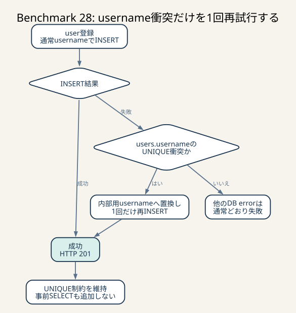

# Benchmark 28: 生成username衝突の限定再試行



_通常INSERTを維持し、usernameのUNIQUE衝突だけ内部名で1回再試行します。他のDB errorは隠さず、事前SELECTも増やさずに稀な登録失敗を防ぎます。_

## 結論

`POST /api/app/users` で、ベンチマーカーが同じ `username` を再生成した場合だけ、
内部用usernameへ置き換えて `INSERT` を1回再試行するようにしました。
`users.username` の `UNIQUE` 制約は維持し、通常の登録経路にはSELECTも追加していません。

決定的な回帰テストでは、同じusernameによる2回目の登録が修正前のHTTP 500から
HTTP 201へ変わりました。通常条件の60秒ベンチ3走でも、原因だった `CODE=17` は
0件でした。一方、スコア中央値は直前Benchmark 26より5,180点、約4.7%低いため、
この変更を高速化とは扱いません。稀な入力衝突で登録scenarioを失わない正当性修正と、
200件しかないsoft error予算を守る施策として採用します。

## 通常60秒ベンチの結果

診断overlayを付けず、Colimaの4 CPU / 4 GiB / 100 GiBを変更せずに3回計測しました。

| run | `pass` | score | 最終評価request数 | error map | 最終不満率（matching / dispatch / 実移動） |
|---:|---|---:|---:|---|---|
| 1 | `true` | 103,738 | 1,457 | 空 | 58.5% / 37.7% / 60.8% |
| 2 | `true` | 107,508 | 1,514 | `CODE=26`: 136 | 50.8% / 38.0% / 61.9% |
| 3 | `true` | 104,263 | 1,467 | `CODE=26`: 142 | 54.3% / 37.6% / 61.0% |

- 観測範囲: 103,738–107,508点
- 推定代表値: 中央値104,263点
- Benchmark 26中央値109,443点との差: -5,180点、約-4.7%
- `CODE=17`: 全3走で0件
- `CODE=26`: 0 / 136 / 142件

scoreは小さい順に103,738、104,263、107,508なので、中央値は104,263です。
同じホスト条件でもrun間の揺れがあり、今回の変更は衝突時以外には実行されません。
そのため約-4.7%を変更による性能劣化とも断定しませんが、少なくとも性能向上を示す
結果ではありません。

run 3のwebapp logには、今回追加した衝突再試行のWARNが1件もありませんでした。
つまり、そのrunのscoreと `CODE=26` は再試行分岐が実行された結果ではありません。
run終了時のMySQL Performance Schemaでも、process起動後の
`ER_DUP_ENTRY`（1062）と `ER_LOCK_DEADLOCK`（1213）はどちらも0件でした。

## 何が起きていたか

Benchmark 27の診断runで `CODE=17` が1件発生しました。時刻、HTTP endpoint、
HTTP status、Rust error log、MySQL errorを突き合わせると、次の経路でした。

1. `POST /api/app/users` がHTTP 500を返した
2. MySQLはerror 1062を返した
3. 重複した値は `users.username='Kulas4628'` だった
4. 同じusernameの利用者は、同一runの約16秒前に作成済みだった
5. InnoDBの最新deadlock履歴には対応するdeadlockがなかった

したがって「coupon検索のlock競合が再発した」という最初の候補は反証されました。
ベンチマーカーのランダム生成usernameが有限時間内に衝突し、DBの一意制約が正常に
拒否したものです。

## はじめに知っておく用語

### UNIQUE INDEX

UNIQUE INDEXは、索引を使った高速検索に加えて、対象値の重複をDBが拒否する制約です。
`users.username` には一意性が必要なので、衝突を避けるためにINDEXを削除すると、
APIの前提をDBが保証できなくなります。

一意性は「たいてい重複しない」ではなく、並行transactionを含めてDBが最後に保証する
不変条件です。アプリが先に `SELECT` して存在しないことを確認しても、その直後に別の
transactionが同じ値をINSERTできます。これは確認時点と利用時点の間に状態が変わる
TOCTOU（time-of-check to time-of-use）競合です。

### MySQL error 1062とSQLSTATE 23000

MySQL 1062はduplicate entryです。SQLSTATE 23000は整合性制約違反という広い分類で、
username以外の一意制約違反も含み得ます。このテーブルにはID、access token、
invitation codeなど別の一意値もあります。

そこで「unique violationならすべて再試行」とはしません。SQLxの
`DatabaseError::is_unique_violation()` を満たし、MySQL固有errorへdowncastした結果が
1062で、message末尾が `for key 'users.username'` の場合だけ再試行します。
IDやtokenの生成不具合までusername衝突として隠さないためです。

SQLx 0.8.2のMySQL実装は `constraint()` から制約名を返さないため、PostgreSQLのように
構造化された制約名だけでは分岐できません。現在はerror番号とkey名のmessage末尾を
併用しています。MySQLやdriverを更新するときは、この判定の回帰確認が必要です。

### statement rollbackとtransaction rollback

MySQL/InnoDBで1つの `INSERT` が一意制約違反になった場合、そのstatementは失敗しますが、
通常はtransaction全体が自動でrollbackされるわけではありません。今回も同じtransactionで
別のusernameを使った `INSERT` を1回だけ実行し、その後のcoupon付与と一緒にcommitします。

再試行回数を無制限にすると、別の障害を隠したままconnectionを長く保持します。
内部usernameはuser ID全体から作るため再衝突の可能性は極めて低く、2回目が失敗した場合は
通常のerrorとして返します。

### reactive retry

先に存在確認をせず、DBが実際に競合を検出した場合だけ処理する方法です。
通常経路は従来どおり1回の `INSERT` で、衝突時だけ2回目を実行します。

これは例外が稀な場合に適しています。毎回SELECTを足す方式と比べて、通常登録のDB往復を
増やさず、並行INSERTとの競合も最終的にUNIQUE制約へ判断させられます。

### error budget

このベンチではcritical errorでなくても、soft errorが合計200件に達すると失敗します。
稀な衝突でも「1件だから無視する」のではなく、同じ原因が乱数次第で繰り返された場合の
予算消費として扱います。今回の `CODE=17` 除去は、平均latencyの改善ではなくscenarioの
脱落とerror budget消費を防ぐ効果です。

### 内部discriminator

同じ表示名を持つ別主体を内部で区別するために付ける一意な識別部分です。今回のfallbackは
26文字のULIDであるuser IDの先頭へ `~` を付けた27文字で、`VARCHAR(30)` に収まります。
requestで指定されたusernameを最初の利用者が保持し、衝突した利用者だけが
`~<user_id>` をDBへ保存します。

## 実装

登録のINSERTを `insert_user` helperへ抽出し、次の順序にしました。

```text
要求されたusernameでINSERT
  ├─ 成功: 従来どおりcoupon付与へ進む
  ├─ users.usernameのMySQL 1062:
  │    "~" + user_id で同じINSERTを1回だけ再試行
  └─ その他のerror: そのまま上位へ返す
```

WARNにはuser IDだけを出し、要求されたusernameは出しません。衝突件数と対象主体は追えますが、
利用者入力を高頻度logへ残さないためです。

## 決定的な赤・緑検証

`scripts/test-username-collision.sh` はDBを初期化して、同じ
`duplicate-regression` というusernameを2回登録します。

修正前:

| 登録 | HTTP status | 結果 |
|---|---:|---|
| 1回目 | 201 | 成功 |
| 2回目 | 500 | MySQL 1062、`users.username` 重複 |

修正後は2回とも201です。ただしstatusだけでは、既存userを誤って再利用した可能性を
除外できません。そこで次も確認します。

- 返された2つのuser IDが異なり、どちらも26文字のULID形式である
- DBに2行あり、usernameも2種類ある
- 要求値を持つ行が1行、`~<user_id>` を持つ行が1行である
- 2人目は1人目のinvitation codeを使い、新規couponと招待couponを各1件持つ
- 1人目には招待報酬couponが1件だけ付く
- 両方のCookieでpayment methodを登録でき、別の認証主体として使える

これにより、単に500を握りつぶしたのではなく、新しいuserと付随データを1 transactionで
作成できたことを確認しています。scriptは開始時と終了時に初期化するため、使い捨ての
ローカル検証stackだけで実行します。

## 効果と限界

効果は、同一usernameの偶発衝突でも登録scenarioを続行でき、`CODE=17` とerror budget消費を
防げることです。通常経路のSQL数は増えません。

一方、衝突した2人目がDBへ保存されるusernameはrequest値と異なります。現在の登録responseは
user ID、access token、invitation codeだけでusernameを返さず、ベンチscenarioも登録成功を
要求するため、この競技実装では処理継続を優先しました。一般的な公開APIでusernameが
利用者の識別名なら、HTTP 409を返して別名の入力を求める方が自然です。

今回の3走ではscore改善を確認できません。衝突が起きないrunでは分岐自体が実行されないため、
これは期待どおりです。また、`CODE=26` は別のowner累積距離検証であり、本変更では解決しません。

## 検討した別案

| 案 | 利点 | 不採用理由 |
|---|---|---|
| `users.username` のUNIQUEを削除 | 1062は発生しない | OpenAPIの一意性とDB不変条件を壊す |
| INSERT前に存在確認SELECT | 分岐を読みやすくできる | 全登録にDB往復が増え、並行処理のTOCTOU競合も残る |
| 既存userを返す | 追加INSERTが不要 | 別人が同じ認証主体になり、couponやrideも混ざる |
| 常にuser IDをusernameへ加える | 衝突を事前に避けられる | 衝突しない通常入力まで保存値を変える |
| ベンチマーカーの乱数生成だけを修正 | ローカルでは衝突を減らせる | 競技者アプリが入力を選べず、実運用側の堅牢性にもならない |
| genericな1062をすべてretry | 実装が短い | tokenやIDの生成不具合を誤分類して隠す |

## ログから次に判断したこと

run 2と3では `CODE=26` が136件と142件発生し、soft error上限200件の68%と71%を
1種類だけで消費しました。ownerの期待累積距離より応答値が大きく、差は4、10、14、22、
36、40など直近1回の移動距離に近い例が多く見えます。

今回の変更箇所は登録INSERTだけで、run 3では衝突分岐も実行されていません。このため
`CODE=26` をusername対策の副作用とはせず、owner responseがベンチマーカーの座標POST
受信境界より1更新先へ進む競合を次のP0仮説にします。次はベンチマーカーのworld更新順、
座標responseの受信時点、`owner_get_chairs` の集計snapshotを同じride/chairで相関します。
