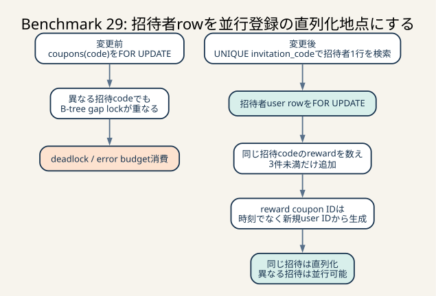

# Benchmark 29: 招待登録の直列化とcoupon識別子の安定化



_coupon INDEXのgapを同期手段にせず、同じ招待codeが必ず同じ招待者rowへ並ぶようにします。上限3件を守りつつ、異なる招待は並行処理できます。_

## 結論

`POST /api/app/users` の招待登録を、招待者の `users` 行を直列化地点として処理するように
変更しました。変更前は `coupons(code)` を `SELECT ... FOR UPDATE` してからcouponを
追加しており、異なる招待コードを使う登録同士でも同じB-treeのgapをlockして
deadlockすることがありました。

変更後は次の順序です。

1. `users.invitation_code` のUNIQUE INDEXで招待者を1行だけ検索し、`FOR UPDATE` でlockする
2. 同じ招待コードから作られた `INV_...` couponを `COUNT(*)` で数える
3. 3件未満なら招待された人と招待者のcouponを追加する

同じ招待コードは同じ招待者行で直列化されるため、3回という上限を並行登録でも守れます。
異なる招待コードは異なる招待者行をlockするため、coupon INDEX上の広いgap lockを
登録処理の同期手段にしません。

この変更を検証する途中で、招待者へのreward couponがミリ秒時刻を識別子に使っており、
直列化された処理でも同じミリ秒になれば主キーが衝突する別の問題も再現しました。
reward codeの末尾を、時刻から新規user IDへ変更して解消しています。

barrier付き並行回帰テストでは、異なる24コードの同時登録がすべてHTTP 201になり、
同じコードの4同時登録は201が3件、400が1件になりました。テスト区間のMySQL
`ER_DUP_ENTRY` と `ER_LOCK_DEADLOCK` の増分はともに0です。

通常条件の60秒ベンチ3走もすべて `pass=true`、error mapは空でした。
一方、中央値はBenchmark 28より約1.6%低いため、高速化とは扱いません。
高負荷時の登録失敗とerror budget消費を防ぐ正当性修正として採用します。

## 通常60秒ベンチの結果

診断overlayを付けず、Colimaの4 CPU / 4 GiB / 100 GiBを変更せずに計測しました。

| run | `pass` | score | 最終評価request数 | error map | 最終不満率（matching / dispatch / 実移動） |
|---:|---|---:|---:|---|---|
| 1 | `true` | 99,775 | 1,386 | 空 | 49.6% / 38.7% / 63.5% |
| 2 | `true` | 105,304 | 1,429 | 空 | 47.5% / 40.5% / 62.3% |
| 3 | `true` | 102,569 | 1,399 | 空 | 48.8% / 37.7% / 63.6% |

- 観測範囲: 99,775–105,304点
- 推定代表値: 中央値102,569点
- Benchmark 28中央値104,263点との差: -1,694点、約-1.6%
- 現在の最高中央値であるBenchmark 26の109,443点との差: -6,874点、約-6.3%
- `CODE=17`: 3走合計0件
- `CODE=26`: 3走合計0件
- run 3終了後のMySQL: `ER_DUP_ENTRY` 0件、`ER_LOCK_DEADLOCK` 0件

scoreを小さい順に並べると99,775、102,569、105,304なので、中央値は102,569です。
変更前のBenchmark 28でも値は103,738–107,508点の範囲で揺れていました。
今回の約-1.6%は3走のばらつきと分離できず、性能向上も性能劣化も断定しません。

招待登録は全requestの一部であり、招待コードを使わない通常登録のSQLは変わりません。
招待時もread query数は変更前と同じ2本です。全列を複数行decodeしていた処理を、
招待者ID 1列と `COUNT(*)` 1値へ縮小したため局所的な処理量は減りますが、
総合scoreへの寄与は今回の3走では確認できませんでした。

## 観測から優先度を上げた理由

Benchmark 28後、`CODE=26` の診断を目的に30秒1回、60秒2回を追加実行しました。

| 走行 | score | error |
|---|---:|---|
| 30秒診断 | 45,651 | 空 |
| 60秒診断1 | 92,901 | 空 |
| 60秒診断2 | 113,212 | `CODE=17`: 1 |

`CODE=26` は3回とも再現せず、座標response境界だけを疑う仮説はこの時点では
強くなりませんでした。一方、3回目の `CODE=17` では次の証拠を同時刻で確認できました。

- webapp logの時刻: `2026-07-24T21:53:06.145341Z`
- endpoint: `POST /api/app/users`
- HTTP status: 500
- SQLxが受け取ったMySQL error: 1213、SQLSTATE 40001
- Performance Schema: `ER_LOCK_DEADLOCK` が1件増加
- `SHOW ENGINE INNODB STATUS`: coupon追加同士のwait-for cycle

Benchmark 27で見つけた `users.username` の1062とは、同じHTTP 500でも原因が違います。
error codeだけで一括してretryすると、lock設計、入力衝突、識別子衝突を区別できません。
そのためHTTP、Rust error、MySQL error番号、Performance Schema、InnoDB deadlock履歴を
同じ時刻軸で照合しました。

## 変更前のdeadlock

変更前の招待処理は概略として次の順序でした。

```text
新規userをINSERT
初回couponをINSERT
INV_<招待コード> を SELECT * ... FOR UPDATE
招待者を SELECT *
INV couponをINSERT
RWD couponをINSERT
COMMIT
```

InnoDBのdeadlock履歴では、一方が `INV_7b3be...`、もう一方が
`INV_7a2e...` を追加しようとしていました。招待コードは異なります。
それでも両transactionは `idx_coupons_code` の同じgap、具体的には
`INV_7bcf...` の直前をlockしていました。

概念的なwait-for関係は次のとおりです。

```text
transaction A
  SELECT INV_7b3be... FOR UPDATE
  └─ 対象gapのX next-key lockを保持
  INSERT INV_7b3be...
  └─ 同じgapへのinsert intention lockを待つ

transaction B
  SELECT INV_7a2e... FOR UPDATE
  └─ 対象gapのX next-key lockを保持
  INSERT INV_7a2e...
  └─ 同じgapへのinsert intention lockを待つ
```

Aが進むにはBのgap lock解放が必要で、Bが進むにはAのgap lock解放が必要です。
MySQLはcycleを検出し、transaction Bをvictimとしてrollbackしました。
アプリはdeadlock限定retryをしていなかったため、登録APIはHTTP 500になりました。

## はじめに知っておく用語

### B-treeとgap

`coupons(code)` のINDEXはcodeを辞書順に並べたB-treeです。INDEXに存在するkeyだけでなく、
隣り合うkeyの間には「まだrowがない範囲」があります。この範囲をgapと呼びます。

たとえばleaf上に次のkeyがあるとします。

```text
INV_7000
  < gap >
INV_8000
```

`INV_7100` と `INV_7900` は異なる値ですが、どちらも同じgapへ挿入されます。
したがって「招待コードが違うからlockも必ず別」とは限りません。

Benchmark 9で `coupons(code)` INDEXを追加したことで全table走査は避けられました。
これは検索量とlock範囲を大幅に減らす有効な改善です。ただし、存在しない値を
locking readすると同じ狭いgapで競合する可能性まではなくなりません。
INDEX追加とlock設計は、別の層の問題です。

### record lock・gap lock・next-key lock

record lockはINDEXに存在するentryを保護します。gap lockはentryの間を保護します。
next-key lockはrecord lockとその直前のgap lockを組み合わせたものです。

InnoDBの既定分離レベルREPEATABLE READでは、range検索や存在しない値のlocking readで
phantom rowの挿入を防ぐため、next-key lockが使われることがあります。
変更前の `SELECT ... FOR UPDATE` は「現在あるcouponを読む」だけでなく、
同じ検索範囲へ別transactionがrowを追加することにも影響していました。

### insert intention lock

InnoDBがgapへINSERTする前に取得するlockです。同じgapでも異なる位置へ挿入する
transaction同士が必要以上に待たないよう設計されています。

ただし、先に互いに競合するgap lockを保持したままinsert intention lockを要求すると、
今回のようなcycleを作れます。INSERT自体が悪いのではなく、
「INSERT前にどのlockを、どの順序で保持したか」が重要です。

### deadlockとlock wait timeout

deadlockは複数transactionの待ち関係がcycleになり、待ち続けても自然には進めない状態です。
MySQLはcycleを検出すると1つをrollbackし、1213を返します。

lock wait timeoutはcycleとは限らず、あるtransactionが長時間lockを保持したため、
待つ側が設定時間を超えた状態です。error番号、待ち時間、InnoDB履歴を確認し、
両者を同じ原因として扱いません。

### 直列化地点

同じ不変条件を更新する処理が、必ず同じ順序で通る1箇所です。
今回守りたい不変条件は「1つの招待コードで成功できる登録は3回まで」です。

招待コードは招待者の `users` 行にUNIQUEで保存されています。同じコードの処理は
必ず同じ1行をlockし、異なるコードは別の行をlockします。このため招待者行は
不変条件の単位とlockの単位が一致する自然な直列化地点です。

### locking readとconsistent read

`SELECT ... FOR UPDATE` は最新のcommit済みrowを読み、対象rowをlockするcurrent readです。
通常の `SELECT COUNT(*)` はREPEATABLE READのconsistent readです。

このtransactionでは、COUNTより前にconsistent readを行いません。競合する同一コードの
登録が招待者行のlock解放を待った場合、lock取得後に初めてCOUNTのsnapshotを作るため、
先にcommitしたcouponを含めて数えられます。自分自身が同じtransactionで行ったwriteも
読み取れます。

この成立条件は、現在の単一MySQL、InnoDB、REPEATABLE READ、処理順に依存します。
COUNTより前に通常SELECTを追加すると、古いsnapshotを再利用する可能性があります。
将来処理順を変える場合は、並行回帰テストを必ず再実行します。

### 複合主キーと衝突領域

`coupons` の主キーは `(user_id, code)` です。userが同じでもcodeが違えば共存できますが、
同じuserへ同じcodeを2回追加すると1062になります。

変更前のreward codeは次の形でした。

```text
RWD_<招待コード>_<現在時刻のミリ秒値>
```

同じ招待者へ続けてrewardを付与すると、2件が同じミリ秒に入ることがあります。
時刻は順序や発生時点の記録には使えても、高並行処理の一意IDとは限りません。
時計の分解能、同時実行、時刻補正を考えると、衝突領域が残ります。

新規user IDは登録ごとに既に生成され、一意制約で保護されています。reward codeを
`RWD_<招待コード>_<新規user ID>` とすれば、追加の乱数生成やSELECTなしで、
どの招待登録に対応するrewardかも追跡できます。

## 実装

変更前:

```sql
SELECT * FROM coupons WHERE code = ? FOR UPDATE;
SELECT * FROM users WHERE invitation_code = ?;
```

変更後:

```sql
SELECT id
FROM users
WHERE invitation_code = ?
FOR UPDATE;

SELECT COUNT(*)
FROM coupons
WHERE code = ?;
```

変更の意味は次のとおりです。

- 招待者の存在確認と直列化を1本のUNIQUE lookupへまとめる
- `SELECT *` をやめ、招待者は必要な `id` 1列だけ取得する
- coupon全rowをRustの `Vec<Coupon>` へdecodeせず、件数1値だけ受け取る
- 同じ招待コードの上限確認を、同じ招待者row lockの内側で行う
- 異なる招待コードの同期に `coupons(code)` のgapを使わない
- reward codeの一意部分には、時刻ではなく新規user IDを使う

招待コードを使わない登録経路にはqueryもlockも追加していません。

## INDEXと実行計画

初期化直後の既存招待コード1件を使い、変更後の2本を `EXPLAIN` しました。

| query | access type | 使用INDEX | 推定row | Extra |
|---|---|---|---:|---|
| `users WHERE invitation_code = ?` | `const` | `invitation_code` | 1 | `Using index` |
| `coupons WHERE code = ?` | `ref` | `idx_coupons_code` | 1 | `Using index` |

招待者検索はUNIQUE INDEXの完全一致なので、optimizerは最大1 rowの `const` lookupとして
扱います。返す列も `id` だけなので、secondary INDEXが保持するprimary keyから返せます。

COUNTは `idx_coupons_code` のcovering index lookupになりました。同じsnapshotの
`EXPLAIN ANALYZE` では、該当couponが0件のlookup部分が約0.0104ms、集約を含む全体が
約0.0435msでした。これは初期化直後の単発値であり、ベンチ中の並行負荷やlock待ちを
含みません。採否はこの単発時間ではなく、並行回帰テストと通常3走で判断しています。

`Using index` は「INDEXが存在する」という意味だけではなく、このqueryでtable本体の
追加readを避けられる手掛かりです。一方、INDEX lookupが速くてもlocking readのgap範囲が
不適切ならdeadlockは起こり得ます。今回、実行計画とlock設計を別々に確認した理由です。

## barrier付き並行回帰検証

`scripts/test-invitation-concurrency.sh` は開始時と終了時に
`POST /api/initialize` を呼び、次の2種類の並行処理を実行します。

### 異なる招待コード

1. 招待者を24人作る
2. workerをstart barrierで待たせる
3. 24種類の招待コードを使った登録を同時に開始する
4. 24件すべてがHTTP 201であることを確認する

異なるコードを多く同時に使うことで、同じB-tree gapへ集中する旧実装の競合を狙います。
単にloopで順番に送るだけでは、deadlockの再現力が不足します。

ただし、このstart barrierが同期するのはcurlを開始する直前までです。各requestがnginx、
Axum、connection poolを通り、同じMySQLのlock区間へ到達する時点までは固定しません。
ランダム生成された招待コードが必ず同じB-tree gapへ入る保証もありません。
したがって、旧実装を毎回失敗させる決定的な再現試験ではなく、競合の再発確率を高める
stress型の回帰試験です。

旧実装の原因判定は、このテスト単独ではなく、実際に1213が出たHTTP時刻、
Performance Schemaの増分、`SHOW ENGINE INNODB STATUS` のwait-for cycleを根拠にします。
変更後の採否も、lock順序の検討、同一codeの上限検証、MySQL error差分、
通常60秒3走を合わせて決めます。

### 同じ招待コード

1. 1人の招待者を作る
2. 同じコードを使う4 workerをstart barrierで同時開始する
3. HTTP 201が3件、HTTP 400が1件であることを確認する
4. `INV_...` と `RWD_...` がそれぞれ3件であることをSQLで確認する

4件すべてが201なら上限競合を防げていません。500が混ざればDB errorをAPIへ漏らしています。
3件成功・1件400とDB件数3件を合わせて確認することで、応答と永続状態の両方を検証します。

### MySQL error counter

並行区間の直前と直後にPerformance Schemaを読み、次を差分で確認します。

```sql
SELECT SUM_ERROR_RAISED
FROM performance_schema.events_errors_summary_global_by_error
WHERE ERROR_NUMBER IN (1062, 1213);
```

最終結果:

```text
distinct=24
shared_created=3
shared_rejected=1
duplicate_delta=0
deadlock_delta=0
```

最初のrow-lock版ではdeadlockは消えましたが、同じコードの検証でreward couponの1062を
再現しました。原因は `NOW(3)` の同一ミリ秒衝突でした。user ID suffixへ変更した後、
同じテストを再実行して1062と1213の増分がともに0になりました。

この途中失敗は破棄せず、「deadlockを直せば登録の並行性問題がすべて解決する」という
最初の仮説が不十分だった証拠として残します。

## 仮説と実際

| 段階 | 仮説 | 実際 | 次の判断 |
|---|---|---|---|
| CODE17再発直後 | username衝突がまだ別形で起きた | MySQL 1213で、1062ではなかった | error番号とdeadlock履歴で別原因へ分離 |
| deadlock解析 | 異なるcodeでもcoupon INDEXの同一gapをlockしている | 2 transactionが同一gapを保持し、相互にinsert intentionを待っていた | 招待者rowを直列化地点に変更 |
| row-lock版の初回検証 | deadlock除去で並行登録は完了する | reward codeの `NOW(3)` が同一ミリ秒で1062 | 時刻を一意IDとして使わない |
| user ID suffix版 | 同じcodeは3件に直列化され、異なるcodeは独立に進む | 24件成功、同一codeは3成功・1拒否、1062/1213増分0 | 正当性修正として採用 |
| 通常60秒3走 | error budgetを守りつつscoreを維持する | 全runエラー0、中央値は前回比-1.6% | 高速化とはせず、次のP0計測へ進む |

## 効果と限界

主な効果は次のとおりです。

- 招待登録のdeadlockによるHTTP 500と `CODE=17` を防ぐ
- 同一コードの3回上限を並行登録でも守る
- reward couponの時刻衝突によるHTTP 500を防ぐ
- 不要な全列転送と複数rowのRust decodeをなくす
- soft error上限200件の消費と登録scenario脱落を防ぐ

限界もあります。

- 1つの招待コードへ極端に集中する負荷は、意図的に1行で直列化される
- 現在のCOUNTはcoupon件数に比例するため、上限が3より大きくなる設計ではcounterの方がよい
- transactionは新規userと初回couponをINSERTした後に招待者lockを待つため、
  同一コード集中時はconnectionと未commit writeを保持する
- genericなdeadlock retryは追加していないため、別のlock cycleが生まれた場合は個別診断が必要
- 通常ベンチ中央値は最高値を更新していない

## 検討した別案

| 案 | 利点 | 今回採用しなかった理由 |
|---|---|---|
| MySQL 1213をtransaction全体でretry | 一時的なdeadlockから復旧できる | 同じlock順を維持したままでは再発し、原因を隠す。生成値・外部副作用のretry設計も必要 |
| `SELECT ... FOR UPDATE` を単に外す | gap lockを減らせる | 同じコードの4並行登録が全員3件未満と判断し、上限を超え得る |
| 分離レベルをREAD COMMITTEDへ変える | gap lockを減らせる場合がある | アプリ全体のread semanticsを変える広い変更。上限競合の直列化は別途必要 |
| named lock / advisory lock | code単位の同期を明示できる | connectionとの結び付き、解放、timeout、複数経路の規約が増える。既存のUNIQUE user行で十分 |
| process内mutex | DB往復なしで同一processを直列化できる | 複数processや再起動をまたげず、DBの不変条件を保証できない |
| `coupons(code)` をUNIQUEにする | 同じcodeを1件へ制限できる | 仕様は同じINV codeを3件まで許すため意味が違う |
| inviterへ使用回数counterを持たせて条件付きUPDATE | COUNT不要で上限判定をO(1)化できる | schema変更、初期dump、既存couponからのbackfill、rollback整合性を別Benchmarkで検証する必要がある |
| reward codeへ乱数を追加 | 時刻衝突を減らせる | 既に一意な新規user IDがあり、乱数生成と衝突検出を増やす必要がない |
| ULIDを別途生成 | 時系列性と高い一意性を得られる | rewardごとの新規IDは不要で、対応する招待登録user IDの方が追跡しやすい |

将来、1コード当たりの上限が大きくなりCOUNTがhot pathになった場合は、
inviter行へcounterを持ち、次のような条件付きUPDATEを比較します。

```sql
UPDATE users
SET invitation_count = invitation_count + 1
WHERE id = ?
  AND invitation_count < 3;
```

affected rowsが1なら成功、0なら上限到達です。ただし初期dumpが列名なしINSERTを含むため、
既存表への列追加方法、初期化時backfill、coupon insert失敗時のrollbackを先に設計します。

## 次に確認すること

この施策では `CODE=26` を直接変更していません。Benchmark 28では0 / 136 / 142件でしたが、
今回の診断3走と通常3走では再現しませんでした。再現しなかったことは解決の証拠ではないため、
TODOのP0に残します。

次は次の順序で進めます。

1. `CODE=26` 再発時に同一chairのcoordinate request、benchmarker world更新、
   owner responseの座標watermarkを相関する
2. 再発しない場合は、既にp95 93.651msを観測したcoordinateの `pool.begin()` を
   pool acquireとSQL `BEGIN`へ分ける
3. pool待ちが支配的なら、DB transaction中に外部決済HTTPを待つ評価経路を
   次の実装候補にする
