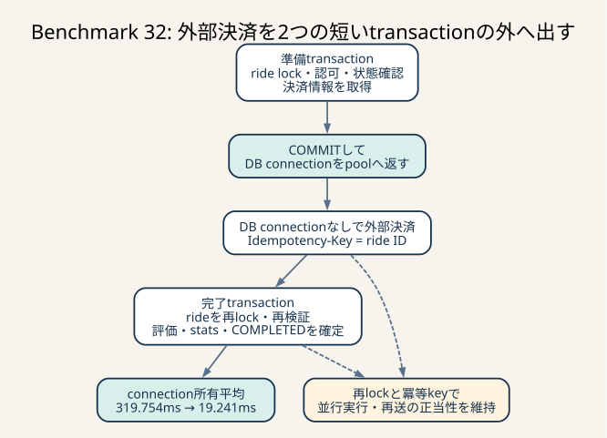
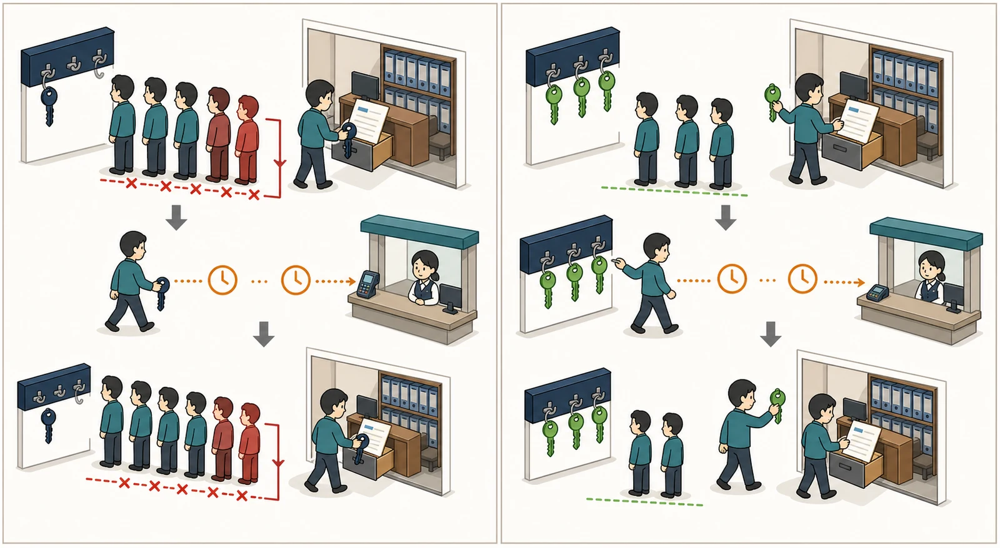

# Benchmark 32: 評価のDB transactionと外部決済を分離



_準備transaction後にconnectionを返し、外部決済をDB外で待ってから完了transactionを開始します。connection所有を平均約320msから19msへ短縮し、冪等keyと再lockで正当性を守ります。_



_左は外部決済の待ち時間にも有限なDBの鍵を持ち続け、他requestの列を伸ばします。右は準備後に鍵を返し、決済中は鍵を使わず、完了更新時だけ再取得します。_

## 結論

`POST /api/app/rides/:ride_id/evaluation` を次の3区間へ分けました。

1. 短い準備transactionでrideをlockし、認可・状態・未評価を確認して決済情報を読む
2. transactionとDB connectionを解放してから、ride IDを冪等keyにして外部決済する
3. 短い完了transactionでrideを再lock・再検証し、評価、chair stats、`COMPLETED`を確定する

診断runでは、評価1件がDB connectionを所有する時間が平均319.754msから
19.241msへ94.0%短縮し、p95も695.556msから36.764msへ94.7%短縮しました。
「DB処理そのものではなく、決済retryとsleep中の資源保持が接続枯渇を作る」という
Benchmark 31の仮説は支持されました。

通常60秒ベンチ3走は99,689 / 106,035 / 99,633点、中央値99,689点、全run
`pass=true`・error map空でした。直近の通常3走中央値102,569点に対して-2.8%であり、
観測範囲も6.4%あるため、この3走だけから得点改善とは判断しません。DB接続とrow lockの
長時間保持を取り除けたこと、異常系と並行実行の不変条件を確認できたことを理由に採用し、
次は残ったpool acquire待ちを独立して検証します。

## はじめに知っておく用語

### transaction

複数のDB操作を「全部成功」または「全部なかったことにする」という1単位へまとめる
仕組みです。途中でエラーになればrollbackし、最後まで成功すればcommitします。

transactionを使えばデータの一貫性を守れますが、長ければよいわけではありません。
transaction中に取得したrow lockやDB connectionは、原則としてcommit / rollbackまで
保持されます。外部HTTPのようにDBが制御できない待ちをtransactionへ含めると、
一貫性を強くするのではなく、有限な資源を待ち時間の間も占有する結果になります。

### row lock

MySQL InnoDBが同じ行への競合更新を直列化するためのlockです。
`SELECT ... FOR UPDATE` は対象行を読みながら排他lockを取り、別transactionの更新を
待たせます。今回のride row lockは「評価済みか」「ARRIVEDか」を確認して完了writeする
区間には必要ですが、決済サーバーのretry sleep中まで必要ではありません。

### connection pool

アプリケーションが再利用するDB connectionの集合です。現在のSQLx pool上限は50です。
51件目の処理は、既存connectionが返るまで`pool.acquire().await`で待ちます。

connection数を増やせば待ちが減る場合はありますが、MySQL側のthread、buffer、lock競合も
増えます。長時間保持が原因なのに上限だけを増やすと、同時に詰まる処理を増やすだけに
なり得ます。このため先に「1件が何ms所有するか」を短縮しました。

### 冪等性と `Idempotency-Key`

同じ操作を複数回実行しても結果が1回分に収束する性質です。決済POSTはride IDを
`Idempotency-Key`にしているため、timeoutやDB更新失敗の後に同じrideを再送しても、
決済側は同じ支払いとして扱えます。

これはtransaction外へ決済を出すための前提です。DB transactionは外部決済をrollback
できないため、決済成功後にDB commitが失敗する「ずれ」は必ず考える必要があります。
同じkeyで再試行できれば、2回目のHTTPは二重課金ではなく、1回目の決済結果へ収束します。

### TOCTOUと再検証

TOCTOUは「確認した時点」と「使用する時点」の間に状態が変わる競合です。
準備transactionのcommit後にride lockを解放するため、決済中に別requestが同じrideへ
進める可能性があります。したがって、準備時の確認結果をそのまま信用して完了writeしては
いけません。

完了transactionでrideをもう一度`FOR UPDATE`し、次を再検証します。

- 認証userが所有する同じrideか
- `evaluation IS NULL`か
- 最新statusが`ARRIVED`か
- 準備時に取得したchair IDと同じか

このlock後再検証により、同じrideの並行評価は一方だけが完了します。

### 2 phaseと分散transactionの違い

今回の「準備・決済・完了」という区間分割は、説明上は複数phaseですが、2相commit
（2PC）ではありません。MySQLと決済サービスを1つの原子的transactionに参加させて
いないためです。

代わりに、決済の冪等keyと完了時の再検証で障害から収束できる構造にしています。
競技環境で2PCを新設するより処理が単純で、既存の決済API仕様にも合います。

## 変更前に確認したログ

Benchmark 30でcoordinateの`pool.begin()`を分けると、SQL `BEGIN`はp95 2.327msなのに、
pool acquireはp95 113.156msでした。78.1%のsampleで取得直前のpoolが
size 50 / idle 0だったため、SQLの開始処理ではなくconnection待ちが支配していました。

Benchmark 31で評価APIをさらに分けた結果は次のとおりです。

| phase | 平均 | p95 | 判断 |
|---|---:|---:|---|
| pool acquire | 49.957ms | 123.528ms | pool枯渇の影響を受ける |
| connection所有全体 | 319.754ms | 695.556ms | 1 requestが長時間connectionを返さない |
| 決済全体 | 302.507ms | 691.875ms | connection所有時間の約94.6% |
| 決済HTTP | 100.785ms | - | 外部応答待ち |
| retry sleep | 201.719ms | - | DBと無関係な待ち |
| 完了write | 6.417ms | 20.904ms | 主因ではない |

203 sampleの決済は合計608 attempts、途中5xx 405回、最終応答はすべて204でした。
つまり「遅いSQLを短くする」より、「DBと無関係な約303msからconnectionとrow lockを
外す」方が直接的です。

## 仮説

評価requestが外部決済中も1本のconnectionを持つため、最大50本のpoolが埋まり、
coordinateや通知など無関係なrequestまでacquire待ちになると考えました。

次の結果になれば仮説を支持します。

- 決済時間は大きく変わらない
- 準備・完了それぞれのconnection所有は短い
- 2区間の合計connection所有が変更前より大幅に短い
- pool acquire待ち、coordinate、nearbyにも改善方向が見える
- 正常系、決済失敗、同一ride並行評価の状態が壊れない

反対に、決済時間まで短くなった場合は計測条件差を疑います。今回の変更は決済サーバーや
retry回数を変えていないからです。

## 実装

### 1. 準備transaction

次をride row lockの下で読みます。

- rideと所有user
- 最新status
- chair ID
- payment token
- fare
- payment server URL

必要値をownedなRust値として取り出してcommitし、`drop(connection)`でhandlerの
connection所有を終えてから決済へ進みます。transactionから借用した値を後段へ持ち出さず、
transaction境界を型とscopeでも明確にしています。

### 2. transaction外の決済

既存どおりride IDを冪等keyにしてPOSTし、retry可能な409 / 5xx / network errorだけを
最大5回再試行します。100ms sleep中もDB connectionとride row lockはありません。

決済が最終的に失敗した場合、完了transactionへ進まないため、評価、chair stats、
`COMPLETED`は変更されません。

### 3. 完了transaction

決済成功後にconnectionを取り直し、rideを`FOR UPDATE`で再取得します。準備時から変わって
いないことを確認した後、次を同じtransactionで実行します。

1. `ride_statuses`へ`COMPLETED`を追加
2. `chair_stats`の件数と評価合計を差分更新
3. `rides.evaluation`と`rides.updated_at`を同じ時刻で更新
4. commit後にprocess cacheのrevisionを更新

3つのDB writeは引き続き原子的です。分割したのは外部決済との境界であり、アプリ内部の
完了状態をばらばらにcommitする変更ではありません。

## 診断runの結果

実行条件はColima 4 CPU / 4 GiB / 100 GiB、60秒、評価診断sample rate 1/8です。
ホストのCPU / memoryは変更していません。

- 実行時刻: 2026-07-25 07:57–07:59 JST
- 結果: `pass=true`
- スコア: 118,204
- error map: 空
- 成功sample: 215
- 決済: 659 attempts、途中5xx 444回、最終204が215回

### phase比較

| phase | Benchmark 31 | Benchmark 32 | 差 |
|---|---:|---:|---:|
| 初回pool acquire平均 | 49.957ms | 27.773ms | -44.4% |
| 初回pool acquire p95 | 123.528ms | 78.674ms | -36.3% |
| 準備connection所有平均 | 319.754ms相当の一部 | 6.501ms | - |
| 完了pool acquire平均 | なし | 27.039ms | 追加 |
| 完了connection所有平均 | 同一transaction内 | 12.740ms | - |
| connection所有合計平均 | 319.754ms | 19.241ms | -94.0% |
| connection所有合計p95 | 695.556ms | 36.764ms | -94.7% |
| 決済平均 | 302.507ms | 308.947ms | +2.1% |
| handler全体平均 | - | 383.020ms | - |

決済平均はほぼ同じまま、DB connectionの所有だけが大幅に短縮しました。これは変更対象と
観測結果が一致しており、因果の説明がつきます。

一方、完了前に2回目のpool acquireが平均27.039ms追加されました。評価API自身は平均
404ms・p95 783msで、Benchmark 31の平均392ms・p95 762msより少し遅く見えます。
1 requestの応答時間だけを見れば追加acquireは不利ですが、待ちの間にconnectionを所有
しないため、他requestが進める余地を作るのがこの施策の目的です。

### pool状態

| 取得地点 | size 50 / idle 0 | 該当群のacquire平均 | idleあり群の平均 |
|---|---:|---:|---:|
| 準備 | 143 / 215（66.5%） | 40.358ms | 2.778ms |
| 完了 | 142 / 215（66.0%） | 39.965ms | 1.895ms |

変更前の初回取得は172 / 203（84.7%）がsize 50 / idle 0でした。比率は下がりましたが、
変更後も約3分の2で全接続使用中です。長時間保持を除去しても短時間requestの同時実行が
pool上限へ達しているため、次の上限比較を行う根拠になります。

ただし、`pool.size()`と`pool.num_idle()`は別々に読むため完全に原子的なsnapshotでは
ありません。また「size 50 / idle 0」は取得直前の観測であり、待ち行列の長さやMySQLの
実行中thread数そのものではありません。

### 他endpoint

同じ診断runの代表値です。ランダムなworldと負荷到達度が異なるため、Benchmark 31との
単純な差をこの施策だけの効果とは断定しません。

| endpoint | Benchmark 31 | Benchmark 32 | 方向 |
|---|---:|---:|---|
| coordinate平均 | 65ms | 55ms | 改善方向 |
| coordinate p95 | 173ms | 162ms | 改善方向 |
| coordinate累積 | 4,916.089s | 4,283.008s | 改善方向 |
| nearby平均 | 34ms | 28ms | 改善方向 |
| nearby p95 | 131ms | 117ms | 改善方向 |
| evaluation平均 | 392ms | 404ms | 2回目のacquire分だけ悪化方向 |

MySQLの累積row lock waitは3,715回・61,520msでした。Benchmark 31の3,285回・50,907ms
より絶対値は増えていますが、Benchmark 32の方が処理量も多く、全endpointのlockを含む
累積値です。ride lock解放の効果をこの総数だけで否定も肯定もできません。次に比較するなら
ride ID別またはrequest数当たりへ正規化します。

## 通常ベンチ3走

| run | score | pass | error map | 最終不満率 matching / pickup / drive |
|---:|---:|---|---|---|
| 1 | 99,689 | true | 空 | 61.2% / 41.3% / 56.9% |
| 2 | 106,035 | true | 空 | 49.9% / 38.4% / 63.2% |
| 3 | 99,633 | true | 空 | 56.6% / 40.9% / 61.4% |

- 観測範囲: 99,633–106,035点
- 推定代表値: 中央値99,689点
- Benchmark 29中央値102,569点比: -2.8%
- 3走すべて正当性検査成功

中央値は最高値を更新していません。したがって「94%短縮したから得点も94%上がる」とは
記載しません。短縮したのは評価がconnectionを所有する時間であり、スコアはmatching、
pickup、drive、完了数を含むシステム全体の結果だからです。

## 正当性と故障注入

### 遅延決済中のlock解放

`scripts/test-owner-sales-response-boundary.sh` の決済mockを8秒遅延させ、mockがrequestを
受理した後の500ms、対象rideのInnoDB row lockが0件であることを繰り返し確認しました。
同時に、決済後の`completed_at`、owner売上の`until`境界、response時刻も維持しました。

### 同じrideの並行評価

`scripts/test-chair-stats-transitions.sh` で同じrideへ2 requestを送信し、両方の決済POSTが
mockへ到達するまで204を返さないbarrierを置きました。これにより2 requestがともに
準備transactionの未評価確認を通過した状態を決定的に作ります。barrier解放後の結果は
HTTP 200が1件、400が1件でした。DBでは次を確認しています。

- `rides.evaluation = 3`
- `COMPLETED`は1件
- `chair_stats.total_rides_count`は1だけ増加
- `chair_stats.total_evaluation_sum`は3だけ増加

両requestがtransaction外で決済へ到達しても、同じ冪等keyなので課金は1回へ収束します。
完了transactionのride lockと再検証により、DB完了writeも1回へ収束します。

### 決済失敗

既存の失敗mockで、決済が成功しなければ評価、chair stats、`COMPLETED`のどれも更新されない
ことを確認しました。決済成功後にDB更新が失敗した場合も、実装上はclientの再試行が
同じride IDの決済keyを使い、決済結果を再利用して完了transactionだけを再実行できます。
ただし204応答後に完了transactionだけを意図的に失敗させるHTTP故障注入はまだ実施して
いないため、検証済みとは扱わずTODOへ残しています。

## なぜ別の案を先に選ばなかったか

### pool上限だけを50から増やす

長時間保持が残ったまま上限を増やすと、外部決済待ちのrequestをより多く抱え、
MySQLの同時接続とmemoryを増やします。保持時間を94%短縮した後なら、上限比較は
「短い処理の並列度」という別の仮説として評価できます。

### ride単位のprocess mutex

同一process内の二重実行は抑えられますが、複数processでは効きません。またmutex mapの
削除、cancel時の解放、initializeとの世代分離が必要です。今回のDB row lock後再検証は
複数processでも正しく、既存の一貫性境界を再利用できます。

### 決済済み状態をDBへ先に保存する

`PAYMENT_PENDING` / `PAID`のような明示状態を追加すれば、process crash後の自動回収を
実装しやすくなります。一方でschema、回収worker、期限、再試行所有権まで設計対象が
広がります。現時点は冪等keyによるclient再試行で収束できるため、回収処理は別TODOに
残します。

### 決済を非同期queueへ送る

APIを早く返せますが、「決済と評価完了後に200」という現在のAPI契約が変わります。
queueのat-least-once配送、再試行、完了通知も必要です。競技仕様を変えずに資源保持だけを
減らす今回の分割を先に採用しました。

## 次の検証

1. SQLx pool上限50 / 75 / 100を同じ通常条件で各3走し、score、acquire p95、
   MySQL `Threads_running` / `Max_used_connections`を比較する
2. pool上限変更だけを独立commit候補にし、悪化した条件は採用しない
3. 決済server URLをinitialize時のmemory snapshotへ移し、準備transactionのsettings readを
   削除できるか正当性を確認する
4. 決済204後に完了transactionを失敗させ、同じkeyの再送でDB完了へ収束することを
   HTTP故障注入する
5. process crash後に「決済済み・DB未完了」を自動回収する必要性と状態設計を検討する

pool比較は[Benchmark 33](./33-sqlx-pool-capacity.md)で完了し、同じhot-path実装による
通常3走中央値が最も高い50を維持しました。上の1と2は完了済みの履歴として残しています。

## 実行したコマンド

```sh
./scripts/up.sh
./scripts/test-owner-sales-response-boundary.sh
./scripts/test-chair-stats-transitions.sh

ISUCON_DIAGNOSTIC=evaluation \
ISUCON_EVALUATION_DIAGNOSTIC_SAMPLE_RATE=8 \
./scripts/benchmark.sh 60
DIAGNOSTIC_SINCE=2026-07-24T22:57:14Z \
  ./scripts/report-evaluation-phases.sh

./scripts/benchmark.sh 60
./scripts/benchmark.sh 60
./scripts/benchmark.sh 60
```
