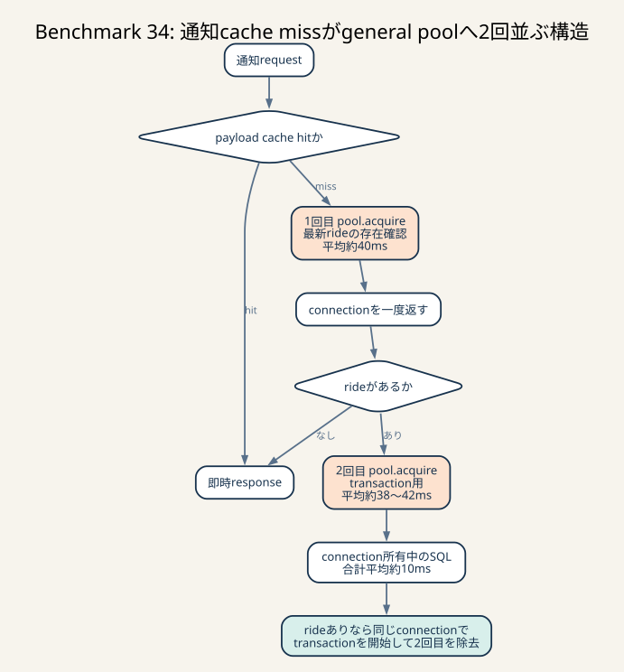

# Benchmark 34: 通知cache missをphase分解

[チューニング目次へ戻る](../TUNING.md)



_cache missはride確認とtransaction開始でgeneral poolへ2回並んでいました。SQL所有時間より2回のacquire待ちが長く、同じconnectionを引き継ぐ仮説へ進みます。_

## 結論

app / chair通知をcache hit、rideなし、未送信status、定常状態へ分け、cache missの
connection取得とSQLを1/64 samplingで計測しました。診断60秒runは
`pass=true`、131,491点、error map空です。診断instrumentation付きの1走なので、
このscoreを通常得点の推定値には使いません。

支配項はSQL実行でもconnection所有でもなく、1回のcache missで行う2回の
SQLx pool acquireでした。

| 指標 | app | chair |
|---|---:|---:|
| 成功sample | 1,859 | 1,334 |
| cache hit | 1,502（80.7%） | 1,013（75.9%） |
| 初回acquire平均 | 40.051ms | 41.001ms |
| transaction acquire平均 | 37.788ms | 41.512ms |
| rideありの2区間connection所有合計平均 | 10.540ms | 10.021ms |
| cache missのtransaction connection所有平均 | 9.625ms | 9.221ms |

appは357件、chairは321件が初回acquireへ進みました。最初に最新rideの有無を確認して
connectionを返し、rideがあれば改めてtransaction用connectionを借りる実装のためです。
chairのrideなしは5 sampleだけで、それ以外の316 sampleは2回目のacquireへ進みました。
appでは初回acquireへ進んだ357 sampleすべてが2回目へ進みました。

したがって次の仮説は、pool上限を増やすことではありません。

> 最新rideが存在したcache missでは、存在確認に使った`PoolConnection`を返さず、
> その同じconnectionでtransactionを開始すれば、2回目のacquire queueを削除できる。

初回SELECTとtransaction内SQLの仕事量、snapshot境界、通知cursorは変えません。
connectionを所有する実時間は既存2区間の合計とほぼ同じで、間の再取得待ちだけを
なくせる見込みです。この実装と通常3走は次の独立Benchmarkで検証します。

ただし、同じrequestから2回目のqueueが消えても、pool全体の待ちが同量減るとは限りません。
約1msの存在確認後にconnectionを一度返す機会がなくなり、rideありでは約10ms連続して
所有するため、別endpointが待つ位置へqueueを移す可能性があります。次の判定では通知だけで
なく、coordinate、nearby、evaluationを含む全endpoint p95、pool状態、通常3走scoreも
確認します。

ホストのCPU / memory / diskは4 CPU / 4 GiB / 100 GiB、SQLx pool上限は50のままです。

## はじめに知っておく用語

### cache hitとcache miss

cache hitは、状態不変と確認済みのJSON bytesをprocess内cacheから返せるrequestです。
cache missは、writerによるrevision更新、process起動、initialize、ride作成、割当、
status追加、評価完了などにより、DBを正本として読み直すrequestです。

cache missは異常ではありません。古い通知を返さないために必要な経路です。重要なのは、
hit率だけでなくmiss 1回の待ち時間と、状態変更の頻度を分けて見ることです。

今回、cache hitのhandler内時間は次のとおりでした。

| endpoint | sample | 平均 | p95 | 最大 |
|---|---:|---:|---:|---:|
| app | 1,502 | 3µs | 1µs | 1.419ms |
| chair | 1,013 | 0µs | 1µs | 244µs |

appの最大値は同期cache lookupやschedulerの一時的な遅れを含む単発値です。p95は
両経路とも1µsで、cache hitのpayload生成は支配項ではありません。

### pool acquire

SQLx poolから1本のDB connectionを借りる処理です。空きがあれば短く終わりますが、
50本すべてが貸出中なら、別requestが返すまで`await`します。

```text
request
  |
  +-- acquire待ち -------- connectionをまだ所有していない
  |
  +-- SQL実行 ------------ connectionを所有している
  |
  +-- connection返却
```

`acquire_us`は「DB queryが遅い時間」ではありません。空き待ち、新規connection作成、
SQLxのconnection検査などを含み得ます。今回の診断では取得直前のpool状態も記録し、
上限50・idle 0との関連を確認しました。

### connection所有時間

`pool.acquire().await`が成功してから`PoolConnection`をdropするまでの時間です。
transactionのSQL実行、row lock待ち、COMMITを含みます。

acquire待ちと所有時間を分ける理由は、対策が異なるからです。

- acquire待ちが長い: connectionを借りる回数、他経路の長い保持、pool全体の並列度を調べる
- 所有時間が長い: query、INDEX、row lock、transaction境界を調べる

app cache missでは、2回のacquire平均の合計が77.839msなのに対し、2区間の所有合計は
10.540msでした。2回目へ進んだchair 316 sampleへ母数を揃えると、82.513ms対10.021msです。
したがってSQLを数百µs削る前に、
同じrequest内の不要な再取得を除く方が影響範囲は大きいと判断できます。

### transactionとsnapshot

通知は最新ride、未送信status、fare、chair、statsまたはuserを読み、返したstatusの
`*_sent_at`を更新します。これらを同じtransaction内で扱うことで、payloadを組み立てる
途中に別時点のデータを混ぜにくくしています。

最新rideの「存在確認」だけはtransaction前です。rideがないrecipientの空pollで
transactionを開始しないための早期returnです。rideがあった場合はtransaction内で
もう一度最新rideを読み、正しいsnapshotの値を使います。

次の施策で同じphysical connectionを再利用しても、transaction開始位置は存在確認の後です。
最初のSELECTをtransactionへ移すわけではないので、このsnapshot境界は変わりません。

### path

同じendpointでも、通った処理によって必要なphaseが違います。

| path | 意味 | DB処理 |
|---|---|---|
| `cache_hit` | revisionとdependencyが現行でcache利用可能 | なし |
| `no_ride` | DBで最新rideが存在しない | 存在確認だけ |
| `pending_status` | 未送信statusを1件返してcursor更新 | 存在確認 + transaction + UPDATE |
| `steady_state` | 未送信なしの最新状態を返してcacheへ保存 | 存在確認 + transaction |
| `unknown` | error / cancellationでpath確定前 | terminal phaseで場所を確認 |

pathを混ぜた全体平均だけでは、cache hitの多さに隠れてmissのSQLやacquireを小さく
見積もります。今回はpath別totalと、到達したphaseだけの分布を両方出しました。

### sampling

全通知requestへJSON logを書けば、stdout I/O自体が負荷になります。appとchairで独立した
単調sequenceを持ち、64 requestごとに1件だけ記録しました。

samplingはoverheadを抑えますが、母集団の完全な記録ではありません。特に開始直後だけに
集中する`no_ride`などは少数になり得ます。cache hit率は「このrunのsampling結果」であり、
将来の固定値とは扱いません。

### 未到達phaseを0にしない

cache hitはDB phaseへ到達しません。`0µs`として平均へ入れると、SQLが速かったのではなく
実行していないrequestによって平均が下がります。

診断JSONは各phaseを`Option<u64>`として持ちます。

```text
Some(845) = phaseへ到達し、845µs
None      = phaseへ到達していない
```

reportは`null`を分布から除外します。実際に時計分解能未満で0µsだったcache lookupは
`Some(0)`なので、未到達とは区別されます。

### RAIIとcancellation

Rustでは値がscopeを離れると`Drop`が呼ばれます。診断guardは正常終了だけでなく、
`?`によるerror returnやfuture cancellationでも、現在のterminal phaseとtotal時間を
出力します。

このrunではappで1 sampleだけ`initial_pool_acquire`中の
`error_or_cancelled`がありました。同じrunのnginxにはapp通知のHTTP 499が41件あり、
clientがresponse完了前に切断したrequestを含みます。ただしsamplingされた1件と
特定の499をrequest IDで1対1対応させてはいないため、同一requestとは断定しません。

## なぜこの計測を優先したか

Benchmark 33ではpool上限50 / 75 / 100を比較し、上限を増やすほどacquireは短くなる一方、
connection所有時間とInnoDB row-lock待ちが増える兆候を確認しました。通常3走中央値も
50が最も高く、上限50を維持しました。

次に減らすべきなのは、pool上限ではなくhot pathがconnectionを要求する回数です。
通知はこのrunでapp 119,020件、chair 85,326件あり、2経路のHTTP累積時間は
約8,441秒でした。評価APIは1,897件、累積約841秒です。

| endpoint | 件数 | 平均 | p95 | 累積 |
|---|---:|---:|---:|---:|
| app notification | 119,020 | 36ms | 195ms | 4,268.113秒 |
| chair notification | 85,326 | 49ms | 218ms | 4,172.885秒 |
| evaluation | 1,897 | 444ms | 832ms | 841.490秒 |

通知はcache hitを含むため平均はmissより短いですが、回数が多く、p95は30ms tickを
大きく超えます。cache missの内側を測らずSQLの見た目だけで修正すると、
支配的なqueueを外す可能性があります。

## 実装した診断

### 共通guard

`notification_diagnostic.rs`へapp / chair共通のsampleとRAII guardを置きました。
endpointごとにsequenceを分け、片方のrequest数がもう片方のsampling位置を変えないように
しています。

記録する主なphaseは次です。

1. process cache lookup
2. 最新ride存在確認用pool acquire
3. 最新ride存在確認SQL
4. appだけchair stats dependency revision
5. transaction用pool acquire
6. SQL `BEGIN`
7. 最新ride再読
8. 未送信status検索
9. 未送信がない場合の最新status検索
10. appのfare / chair / chair stats、またはchairのuser検索
11. sent cursor UPDATE
12. COMMIT
13. JSON生成、cache insert、response生成

各acquire前に`pool.size()`、`pool.num_idle()`、差分のin-useを記録します。sizeとidleは
別々の読み取りなので完全に原子的なsnapshotではなく、状態との関連を見る補助値です。

### 暗黙acquireを分ける

`fetch_optional(&pool)`は内部でacquireしてSQLを実行し、終了後に返します。
`pool.begin()`もacquireとSQL `BEGIN`をまとめて行います。合算時間から待ちを分けるため、
診断対象は次の等価な形へ展開しました。

```rust
let mut connection = pool.acquire().await?;
let value = query.fetch_optional(&mut *connection).await?;
drop(connection);

let mut connection = pool.acquire().await?;
let mut tx = connection.begin().await?;
// transaction内のquery
tx.commit().await?;
drop(connection);
```

明示的に取得した`PoolConnection`は、最初のSQL直後とCOMMIT直後にdropします。
診断JSON生成やcache更新まで保持しません。通常経路のconnection保持を計測のために
延長しないことが重要です。

## 診断run

### 境界

| 項目 | 値 |
|---|---|
| ベンチ開始 | 2026-07-24T23:59:59Z |
| MySQL process開始 | 2026-07-25T00:00:33Z |
| 最初のnotification sample | 2026-07-25T00:00:55.285169194Z |
| 走行時間 | 60秒 |
| score | 131,491 |
| 判定 | `pass=true`、error map空 |
| sampling | app / chairそれぞれ1/64 |
| SQLx pool | 50 |
| ホスト | 4 CPU / 4 GiB / 100 GiB |

開始時刻より後のcontainer logだけを抽出し、
`run開始 <= MySQL開始 <= 最初のsample`もreport scriptで検証しています。

### path別total

| endpoint | path | sample | 平均 | p95 | 最大 |
|---|---|---:|---:|---:|---:|
| app | cache hit | 1,502 | 3µs | 1µs | 1.419ms |
| app | pending status | 204 | 92.648ms | 240.803ms | 431.248ms |
| app | steady state | 153 | 82.708ms | 210.424ms | 250.776ms |
| chair | cache hit | 1,013 | 0µs | 1µs | 244µs |
| chair | no ride | 5 | 44.851ms | 60.483ms | 84.233ms |
| chair | pending status | 181 | 101.141ms | 250.574ms | 412.378ms |
| chair | steady state | 135 | 81.008ms | 225.916ms | 332.326ms |

pending statusはsent UPDATEを含みますが、steady stateにも同程度の待ちがあります。
書込みだけが主因ならsteady stateは大幅に短いはずなので、共通するacquire queueを
調べる根拠になります。

### app phase

| phase | sample | 平均 | p95 |
|---|---:|---:|---:|
| 初回pool acquire | 357 | 40.051ms | 112.995ms |
| 最新ride存在確認 | 357 | 0.914ms | 3.343ms |
| 初回connection所有 | 357 | 0.915ms | 3.343ms |
| transaction pool acquire | 357 | 37.788ms | 98.362ms |
| SQL `BEGIN` | 357 | 0.617ms | 2.334ms |
| ride再読 | 357 | 0.774ms | 2.671ms |
| 未送信status検索 | 357 | 1.353ms | 4.563ms |
| fare | 357 | 1.122ms | 3.085ms |
| COMMIT | 357 | 2.928ms | 9.328ms |
| transaction connection所有 | 357 | 9.625ms | 23.450ms |

chairが割り当て済みの291 sampleでは、chair検索平均0.989ms、stats検索平均0.891msでした。
これらを個別に短縮しても、2回のacquire平均合計77.839msより影響が小さいと分かります。

### chair phase

| phase | sample | 平均 | p95 |
|---|---:|---:|---:|
| 初回pool acquire | 321 | 41.001ms | 121.173ms |
| 最新ride存在確認 | 321 | 0.845ms | 3.842ms |
| 初回connection所有 | 321 | 0.846ms | 3.844ms |
| transaction pool acquire | 316 | 41.512ms | 112.977ms |
| SQL `BEGIN` | 316 | 0.656ms | 2.491ms |
| ride再読 | 316 | 0.836ms | 3.258ms |
| 未送信status検索 | 316 | 1.506ms | 4.624ms |
| user検索 | 316 | 1.174ms | 3.786ms |
| COMMIT | 316 | 3.796ms | 13.363ms |
| transaction connection所有 | 316 | 9.221ms | 22.126ms |

初回acquireへ進んだ全321 sampleのconnection所有合計平均は9.924msです。rideなし5件は
transactionへ進まないため、2回のacquireと比較するrideあり316 sampleだけでは
10.021msになります。異なる母数の平均を直接比較しないよう、採用判断には後者を使います。

### pool状態

| acquire | endpoint | sample | idle 0 | 上限50・idle 0 |
|---|---|---:|---:|---:|
| 初回 | app | 358 | 273（76.3%） | 273 |
| 初回 | chair | 321 | 240（74.8%） | 239 |
| transaction | app | 357 | 270（75.6%） | 270 |
| transaction | chair | 316 | 232（73.4%） | 232 |

多くのsampleが上限50で貸出可能connectionなしでした。Benchmark 33で上限75 / 100を
不採用にしたため、今回はDBへ入る同時実行を増やさず、1 requestがqueueへ並ぶ回数を
減らします。

## 仮説と実際

| 仮説 | 観測 | 判断 |
|---|---|---|
| cache hitがまだ重い | p95はapp / chairとも1µs | 棄却 |
| cache missのSQLが支配的 | 各SQL平均は約0.6–1.5ms、COMMITも約2.9–3.8ms | 主因ではない |
| transactionがconnectionを長時間保持 |所有平均はapp 9.625ms、chair 9.221ms | 主要な改善余地ではない |
| pool acquireが支配的 | 2回の平均合計はapp 77.839ms、chair 82.513ms | 支持 |
| rideなし早期returnが多い | sampled no-rideはapp 0、chair 5 | このrunでは少ない |
| 同一requestの2回目acquireを除ける | rideあり全sampleが2回目へ進む | 次の実装候補 |

## なぜまだlong pollingへ進まないか

long pollingは状態変更までHTTP responseを待たせ、poll request自体を減らせます。しかし、
次の設計が必要です。

- DB connectionを保持せずに待つ
- version確認、waiter登録、version再確認でlost wakeupを防ぐ
- initializeやprocess再起動時に全waiterを安全に起こす
- timeout時に定常payloadを返す
- clientの3秒通知期限を守る

今回見つかった2回目acquireは、API protocolや通知cursorを変えず除ける局所的なqueueです。
先にこの低リスクな余分を減らし、それでもHTTP p95とrequest総数が支配的なら
long pollingを比較します。

## 他に考えられる選択肢

### 存在確認SELECTを削除する

全cache missで最初からtransactionを開始すればacquireは1回になります。しかしrideなしの
空pollにもtransactionとROLLBACK / COMMIT相当の処理が戻ります。現在の早期returnを維持した
ままconnectionだけ再利用できるため、まずそちらを選びます。

### 最新rideを最初のSELECT結果だけで使う

存在確認を`SELECT *`へ広げてtransaction内のride再読を消せますが、存在確認後から
transaction開始までにmatcherや評価が更新すると、payloadへ別snapshotのrideを混ぜます。
再読は平均1ms未満であり、38–42msのacquire待ちより優先度が低いため残します。

### 未送信statusと最新statusを1 SQLへする

Benchmark 21でCTE版を比較済みです。SQL呼出しは減りましたが、関連queryの累積が
約32秒から53.756秒へ増え、94,573点だったため不採用に戻しました。今回も単発SQL数だけで
過去の不採用施策を復活させません。

### pool上限を増やす

Benchmark 33の通常3走中央値は50 / 75 / 100で107,234 / 105,867 / 103,720点でした。
上限追加はconnection所有とrow-lock待ちの増加とも整合したため、50を維持します。

### app / chairでpoolを分ける

通知同士や書込み経路との優先度を分けられますが、単一MySQLへ流す接続総数は減りません。
pool配分、合計上限、initialize時の扱いも増えます。1 request内の再取得を先に除きます。

## 実行方法

```sh
notification_diagnostic_since=$(date -u +%Y-%m-%dT%H:%M:%SZ)
ISUCON_DIAGNOSTIC=1 ./scripts/benchmark.sh 60
./scripts/report-notification-phases.sh "$notification_diagnostic_since"
./scripts/report-endpoint-latency.sh "$notification_diagnostic_since"
```

reportは同じrun直後、DBやwebappを再起動する前に実行します。時刻を省略した場合や
指定境界のsampleがない場合、別MySQL processの累積値を参照しようとした場合は失敗します。

## 次のTODO

1. rideありのapp / chair cache missで、最初の`PoolConnection`をtransactionへ引き継ぐ
2. 通知順序、sent cursor、cache revision / dependencyの既存回帰を実行する
3. 診断runでtransaction acquire phaseが消え、connection所有とSQL分布が悪化しないことを確認する
4. 通知以外へ待ちを移していないか、全endpoint p95、pool状態、評価connection所有を比較する
5. instrumentationなしの通常60秒ベンチを3走し、Benchmark 33のpool 50中央値と比較する
6. 改善後も通知p95が30msを超える場合、cache miss SQLではなくlong pollingのrequest削減を比較する
