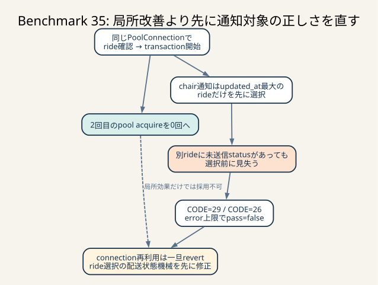

# Benchmark 35: 通知connection再利用を不採用に戻す

[チューニング目次へ戻る](../TUNING.md)



_2回目のacquire削減自体は成功しても、ride選択が別rideの未送信statusを見失い失格しました。局所性能を採用せず、配送状態機械の正しさを先に直します。_

## 結論

app / chair通知のcache missで、最新rideの存在確認に使ったSQLx
`PoolConnection`をそのままtransactionへ引き継ぎました。狙いどおり、
rideありの診断sampleでは2回目のpool acquireが0回になりました。

しかし60秒診断runはエラー上限へ達して途中終了しました。

| 項目 | 実測値 |
|---|---:|
| ベンチ開始 | 2026-07-25 00:10:46 UTC |
| score | 52,564 |
| 判定 | `pass=false` |
| `CODE=26` | 60件 |
| `CODE=29` | 142件 |
| 合計 | 202件 |
| エラー上限 | 200件 |

`CODE=29`は、椅子が現在扱っているrideとは別userの通知を受けたという内容です。
接続再利用そのものはSELECT、transaction開始位置、通知cursorを変更しませんが、
この変更を入れたrunで正当性を満たさなかった以上、スコア改善として採用できません。
接続再利用のRust変更と追加診断項目はBenchmark 34の状態へ戻しました。

この1走は失敗runなので、52,564点を通常構成の推定代表値には使いません。実測
`n=1`、未推定です。ホストは4 CPU / 4 GiB / 100 GiB、SQLx pool上限は50のままで、
CPU / memoryは変更していません。

失敗後のDBには、単なるresponse配送遅延だけでは説明できない状態が残っていました。
25台の椅子で、`updated_at`が最大のrideには未送信statusがない一方、同じ椅子の別rideに
未送信statusがありました。現在のchair通知は最初に
`ORDER BY updated_at DESC LIMIT 1`でrideを1件へ絞るため、その25件を見つけられません。

次はconnection再利用を重ねず、chair通知が「未送信statusを持つrideを先に選ぶ」
という選択規則だけを独立して修正します。回帰と通常ベンチが通った後に、
connection再利用を改めて単独比較します。

## はじめに知っておく用語

### physical connectionとpool acquire

physical connectionはRust processとMySQLの間に張られた1本の接続です。SQLx poolは
複数のphysical connectionを保持し、requestへ一時的に貸し出します。

```text
変更前
  acquire A -> ride存在確認 -> Aを返却
  acquire B -> BEGIN -> 通知処理 -> COMMIT -> Bを返却

今回の候補
  acquire A -> ride存在確認 -> BEGIN -> 通知処理 -> COMMIT -> Aを返却
```

候補実装はSQLを減らしていません。同じrequestがpoolの待ち行列へ2回並ぶところを
1回に減らす変更です。Benchmark 34では2回目のacquire平均がapp 37.788ms、
chair 41.512msだったため、SQLを数百µs短縮するより先に検証しました。

### 正当性gate

性能値を比較する前に、APIの状態とベンチマーカーの期待が一致しているかを確認する
関門です。今回の採用条件は次のすべてでした。

1. `pass=true`
2. error map空
3. 通知状態を順番どおり返す
4. 通知以外のendpointへ待ちを移さない
5. 通常3走中央値が対照を上回る

1走目で2を満たさず、エラー上限で終了したため、通常3走へ進みませんでした。
失敗後も「速かったphase」だけを根拠に採用すると、処理量を増やす代わりに誤った
payloadを返す実装になります。

### `updated_at`の二つの役割

`rides.updated_at`は列定義に`ON UPDATE CURRENT_TIMESTAMP(6)`があり、chair割当で
`chair_id`を更新したときにも進みます。さらに評価確定では、owner売上と履歴が使う
完了時刻を明示的に書きます。

```text
ride作成 -> chair割当でupdated_at更新 -> 評価確定でupdated_at更新
```

通常は最後に割り当てられたrideが新しい値を持ちます。しかし複数rideの評価・通知が
近接すると、以前のrideの評価確定が後からcommitされ、以前のrideが再び最大値になる
ことがあります。したがって`updated_at DESC`は「最後に何らかの更新をしたride」を
選べても、「この椅子へ次に配送すべきstatusを持つride」を直接表していません。

### hidden pending status

この記録では、chair通知の現在queryが選ばないrideに残った
`chair_sent_at IS NULL`のstatusをhidden pending statusと呼びます。

```text
chair
  ├─ ride A: updated_atが最大、全status送信済み  <- 現在queryが選ぶ
  └─ ride B: updated_atは小さい、未送信statusあり <- 配送対象だが隠れる
```

ride Aだけを見て「未送信なし」と判断すると、ride Bのstatusは何度pollしても進みません。
payload cacheを無効化しても、DBから同じride Aを再選択する限り解消しません。

## 仮説

Benchmark 34の計測から、次を仮説にしました。

> rideが存在するcache missでは、存在確認connectionを返さず同じconnectionで
> transactionを開始すれば、SQLとsnapshot境界を変えず2回目のpool待ちを削除できる。

反証条件は次のいずれかです。

- 通知順序または内容エラーが発生する
- 別endpointのp95が悪化する
- 通常3走の中央値が改善しない
- connectionを連続所有することでDB内滞在が増える

このrunでは最初の条件に該当しました。

## 実装した候補

app / chairの両handlerで、存在確認後に`PoolConnection`をdropせず、
その値へ`begin().await`を呼びました。rideなしの早期returnでは従来どおり
存在確認直後に返却しました。

診断には`connection_reused`を一時追加し、初回queryとtransactionの境界で
同じconnectionを使ったかを記録しました。この項目も候補実装と一緒に戻しています。
失敗施策の計測値は本ファイルに残し、通常binaryへ不要な分岐を残しません。

## phase計測

### 接続再利用数

| endpoint | 成功したDB path | transactionへ再利用 |
|---|---:|---:|
| app | 153 | 153 |
| chair | 131 | 126 |

chairの残り5件はrideなしで早期returnしたため、transaction自体がありません。
rideありではapp / chairとも2回目のpool acquireを完全に削除できました。

### path別handler内時間

| endpoint | path | sample | 平均 | p95 | 最大 |
|---|---|---:|---:|---:|---:|
| app | cache hit | 972 | 1µs | 1µs | 471µs |
| app | pending status | 84 | 21.122ms | 50.236ms | 67.314ms |
| app | steady state | 69 | 17.162ms | 41.050ms | 53.400ms |
| chair | cache hit | 427 | 0µs | 1µs | 124µs |
| chair | rideなし | 5 | 13.941ms | 20.662ms | 29.192ms |
| chair | pending status | 67 | 19.307ms | 46.915ms | 78.452ms |
| chair | steady state | 59 | 17.899ms | 45.632ms | 53.017ms |

### rideありのconnection所有

| endpoint | sample | 平均 | p95 | 最大 |
|---|---:|---:|---:|---:|
| app | 153 | 9.050ms | 21.594ms | 46.080ms |
| chair | 126 | 8.634ms | 21.000ms | 54.050ms |

初回pool acquire平均はapp 10.278ms、chair 10.118msでした。Benchmark 34の
40.051 / 41.001msより短いものの、今回はエラー上限で早期終了した別負荷です。
処理量、終了時刻、正当性が異なるため、この差をconnection再利用の改善量とは
断定しません。

## HTTP計測

失敗run開始後のnginx timing logは次のとおりです。ベンチ終了後もmatcher containerは
動くため、matcher回数は比較対象から外します。

| endpoint | count | 平均 | p95 | p99 | 累積 |
|---|---:|---:|---:|---:|---:|
| app notification | 71,972 | 4ms | 22ms | 46ms | 254.402秒 |
| chair notification | 35,704 | 6ms | 34ms | 52ms | 200.105秒 |
| coordinate | 39,390 | 19ms | 49ms | 64ms | 760.761秒 |
| evaluation | 724 | 346ms | 734ms | 774ms | 250.686秒 |
| nearby | 8,852 | 10ms | 41ms | 56ms | 88.790秒 |

app通知にはHTTP 499が13件ありました。499はclientがresponse完了前に切断したことを
示しますが、今回の`CODE=29` 142件と1対1で対応付けるrequest IDはありません。
したがって「499がすべての原因」とは判断しません。

## `CODE=29`をDBで追跡する

ベンチマーカーの`ValidateChairNotificationEvent`は、通知内user IDを、その椅子が
現在保持している`matchingData.User.ID`と比較します。1例は次の不一致でした。

| 項目 | 値 |
|---|---|
| chair | `01KYB9TB67BGECCFZXZABXD876` |
| responseのride | `01KYB9TB994BSHY7RNHHWT9J7Y` |
| responseのuser | `01KYB9TAEXSDHGX5GAZ95C55M2` |
| ベンチが期待したuser | `01KYB9TB9Z4948QENM1RJ5C1P3` |

同じ椅子のDBは次の状態でした。

| ride | user | `updated_at` | sent / status |
|---|---|---|---:|
| `01KYB9TB994BSHY7RNHHWT9J7Y` | `01KYB9TAEXSDHGX5GAZ95C55M2` | 00:11:54.517327 | 6 / 6 |
| `01KYB9TBCFW819X51HPXMQ5S83` | `01KYB9TB9Z4948QENM1RJ5C1P3` | 00:11:54.407772 | 5 / 6 |

現在queryは上のrideを選びます。しかし上のrideは全status送信済みで、下のrideには
`chair_sent_at IS NULL`が1件あります。これを全chairへ広げたqueryでは、
hidden pending statusを持つchairが25台、hidden pending rideも25件でした。

```sql
WITH ranked AS (
  SELECT r.id,
         r.chair_id,
         ROW_NUMBER() OVER (
           PARTITION BY r.chair_id
           ORDER BY r.updated_at DESC, r.id DESC
         ) AS rn
  FROM rides AS r
  WHERE r.chair_id IS NOT NULL
),
pending AS (
  SELECT DISTINCT r.chair_id, r.id
  FROM rides AS r
  INNER JOIN ride_statuses AS rs ON rs.ride_id = r.id
  WHERE r.chair_id IS NOT NULL
    AND rs.chair_sent_at IS NULL
)
SELECT COUNT(DISTINCT pending.chair_id)
FROM pending
INNER JOIN ranked AS latest
        ON latest.chair_id = pending.chair_id
       AND latest.rn = 1
WHERE pending.id <> latest.id;
```

この25台という観測は、同じ失敗run終了後のDB snapshotに限る値です。142件の
`CODE=29`は同じ椅子を30ms間隔で繰り返しpollした回数を含むため、25台と一致する
必要はありません。

## 仮説と実際

| 仮説 | 実際 | 判断 |
|---|---|---|
| 2回目のpool acquireを除ける | rideありapp 153 / chair 126 sampleで0回になった | 支持 |
| 同じconnectionでも通知内容は不変 | `CODE=29`が142件発生 | このrunでは反証 |
| `CODE=29`はresponse ACK境界だけで説明できる | DBにhidden pending rideが25件残った | 単独原因とは断定不可 |
| `updated_at DESC`は配送対象rideを選べる | 最大ride送信済み、別ride未送信の反例25件 | 反証 |
| phase短縮を採用理由にできる | エラー合計202でFAIL | 不可 |

connection再利用がhidden pending状態を新たに作ったのか、既存競合を高い処理量で
顕在化させたのかは、この1走だけでは分離できません。分かっている因果は、
hidden pending状態になると現在のride選択queryが誤ったpayloadを継続して返すことです。
そこで次の実験は、原因を推測してconnection lifetimeをさらに変えるのではなく、
保存した反例を固定fixtureとしてride選択規則を検証します。

## 他に考えられる選択肢

### `created_at DESC`へ置き換える

新しく作られたrideが常に次の割当とは限りません。古いpending rideが長く待った後で
同じ椅子へ割り当てられる場合、作成時刻は以前に完了したrideより古くなります。
`updated_at`を`created_at`へ単純置換するだけでは、別の順序反例を作ります。

### 未送信statusを持つrideを先に選ぶ

現在の`updated_at DESC`をfallbackとして残し、まず
`EXISTS (... chair_sent_at IS NULL)`を優先する案です。今回の25件を直接解消し、
未送信がない定常状態では従来と同じrideを返せます。

次のBenchmarkでは、複数rideのうち古いrideが`updated_at`最大、新しいrideだけが
未送信というfixtureを作り、期待するride / user / statusをHTTPで確認します。
相関subqueryのcostは`idx_ride_statuses_ride_chair_sent_at
(ride_id, chair_sent_at, status)`を使えるか`EXPLAIN ANALYZE`でも確認します。

### current rideを別表へ持つ

`chair_current_rides(chair_id, ride_id, assigned_at)`のような1 chair 1 rowを
matcherと評価で更新すれば、履歴時刻から現在状態を推測せずに済みます。ただし、
initialize backfill、matcherとの同時commit、process crash時のrepairが増えます。
今回の反例を小さな選択規則で直せるか確認してから比較します。

### response body drop後のdelivery lease

DBの`chair_sent_at` commitはHTTP clientの受信ACKではありません。response bodyへguardを
持たせ、drop後も短い期間matcherから除外すれば、送信済みcursorからclient受信までの
隙間を狭められます。

ただし今回のhidden pending状態は「どのrideを選ぶか」の問題であり、leaseだけを追加しても
未送信rideを見つけられません。ride選択修正後も切断・配送遅延の故障注入で再現した場合に、
独立した施策として比較します。

### connection再利用をそのまま残して同時に直す

2変更を同じrunへ入れると、正当性修正とpool待ち短縮のどちらがscoreへ効いたか分かりません。
まず接続再利用を戻し、ride選択を単独検証します。その後、同じ対照へconnection再利用だけを
再適用します。

## 再現・集計コマンド

```sh
diagnostic_since=$(date -u +%Y-%m-%dT%H:%M:%SZ)
ISUCON_DIAGNOSTIC=1 ./scripts/benchmark.sh 60
./scripts/report-notification-phases.sh "$diagnostic_since"
./scripts/report-endpoint-latency.sh "$diagnostic_since"
```

このrunの診断開始境界は`2026-07-25T00:10:46Z`です。reportはMySQL process開始
`00:11:17Z`、最初のsample `00:11:38.327839546Z`が境界後であることを検証しました。

## 次のTODO

この時点で挙げた項目はBenchmark 36、45、46で実施しました。

1. hidden pendingとdelivery gapをHTTP固定fixtureで再現
2. chair通知を配送cursorに基づくcurrent ride状態機械へ変更
3. `EXPLAIN ANALYZE`と既存INDEXを確認
4. 通知順序、cache revision、initialize回帰を実行
5. 通常60秒3走で`CODE=29` 0件を確認
6. connection再利用を再比較し、rideあり878 sampleの2回目取得を全廃

再診断は[Benchmark 45](./45-notification-connection-reuse-diagnostics.md)、採用判定は
[Benchmark 46](./46-notification-connection-reuse-adoption.md)に記録しています。
