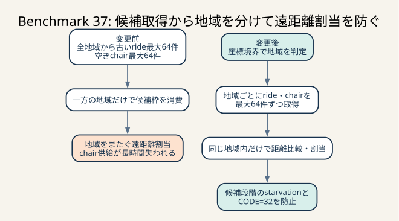

# Benchmark 37: 地域間の遠距離割当を止める

[チューニング目次へ戻る](../TUNING.md)



_globalな最大64件では一地域が候補枠を消費し、遠距離割当でchair供給を失います。候補取得から地域別quotaに分け、同一地域内だけで割り当てます。_

## 結果

`CODE=32` の原因を「matcherが遅い」と一括りにせず、pool待ち、SQL、候補数、
割当距離、最古rideの待ち時間へ分解しました。変更前の診断では、pending数と
空き椅子数の小さい方までUPDATEできている一方で、地域をまたぐ遠距離割当が
212件ありました。

最終実装では、地域内の候補だけへ制限するだけでなく、pending rideと空き椅子を
地域ごとに最大64件ずつ取得します。これにより、一方の地域の古いrideが64件あると
他方の地域が候補へ入れない「候補取得段階」の問題も防ぎました。診断runと通常3走はすべて
`pass=true` で、`CODE=32` は0件でした。通常runには既知の `CODE=26` が残っています。

| 条件 | pass | スコア | 値の扱い |
|---|---:|---:|---|
| 変更前・診断あり | true | 127,520 | scoreは実測n=1。診断件数は終了境界未固定の参考値 |
| 地域制限 + 地域別quota・診断あり | true | 150,696 | `CODE=26: 92`。境界付き診断実測n=1・通常score推定には使わない |
| 最終実装・通常run 1 | true | 143,887 | `CODE=26: 118`、`CODE=32: 0` |
| 最終実装・通常run 2 | true | 140,426 | `CODE=26: 136`、`CODE=32: 0` |
| 最終実装・通常run 3 | true | 137,801 | `CODE=26: 120`、`CODE=32: 0` |

通常3走の観測範囲は137,801–143,887点、推定代表値の中央値は140,426点です。
3走とも `CODE=32` は0件でした。`CODE=26` は118 / 136 / 120件、中央値120件で、
正しさと得点の次の制約として別施策で扱います。

変更前の診断件数は、開始境界とinitialize境界は固定したものの、ログ取得の終了境界を
固定していませんでした。ベンチ終了後もmatcherは動き続けるため、変更前後の件数差や
score差を因果効果として比較しません。変更前ログは「地域間割当が実在した」という
仮説形成にだけ使い、最終実装は終了境界を固定した診断と通常3走で評価します。
Benchmark 36の最終3走も2走が `pass=false` で有効な変更前中央値がないため、
変更前比の推定改善率は出していません。

## 先に確認した症状

Benchmark 36の最終3走では、2走で「rideが30秒以内に割り当てられない」
`CODE=32` が1件ずつ発生しました。考えられる原因は少なくとも次の4つです。

1. SQLまたはDB connection pool待ちでmatcher自体が呼ばれない
2. 64件batchが常に満杯になり、古いrideが処理対象へ入れない
3. 空き椅子queryは候補を返すが、UPDATE競合で割り当てに失敗する
4. 遠い地域へ椅子を送って長時間占有し、後続rideへ供給できない

最終エラーだけでは4つを区別できません。そこで、通常経路へ新しいSQLを足さず、
`ISUCON_DIAGNOSTIC=1` のときだけmatcher 1回ごとに次をJSONで記録しました。

- transaction開始前のpool size / idle / in-use
- pool取得を含む`begin`、pending query、available query、UPDATE群、commitの時間
- pending / available / matched件数とbatch上限到達の有無
- 最古pending rideのID、作成時刻、待ち時間
- 割り当てたpickup距離の合計、最大値、200超の件数
- errorやcancellationで最後に到達していたphase

`scripts/report-matcher-phases.sh` は、明示した開始時刻と終了時刻の間にあるログから、
成功した最後の `POST /api/initialize` の完了時刻より後だけを集計します。開始境界だけ
では、集計commandを実行するまで動き続けたmatcher sampleまで混ざります。終了境界だけ
では、前runのpending rideを現在runの待ち時間として数分単位で誤認します。両方を固定して
初めて、ベンチ負荷区間に対応する再現可能な母集団になります。

## 変更前ログからどう判断したか

変更前の診断runは127,520点で完走しました。終了境界を固定していなかったため、
次の診断件数は厳密な60秒値ではなく、原因候補を探すための参考値です。

| 指標 | 変更前 |
|---|---:|
| 割当件数 | 2,149 |
| 平均pickup距離 | 85 |
| 最大pickup距離 | 715 |
| 距離200超 | 212 |
| 最古pending待ち時間 | 4,935ms |
| tick 1980時点の評価request数 | 1,768 |

距離200超は212 / 2,149、約9.9%です。一方、空き椅子を取得した回は、
取得した候補をすべてUPDATEできていました。負荷中の最古待ち時間も約4.9秒で、
成功runでは30秒へ近づいていません。

この参考ログでは、空き椅子を取得した回のUPDATE件数は候補数と一致していました。
そのため「候補を取得したのにUPDATE競合だけで割当が消える」より、212件あった
地域間割当で椅子を長く占有する仮説を優先しました。ただし、このrunでは
`CODE=32` の30秒待ち自体は再現していません。したがって原因を証明したとは扱わず、
有力仮説を立て、境界付き診断と通常3走で緩和策の再発防止を確認した位置づけです。

## なぜ距離200で地域を区切れるか

公式ベンチマーカーは2地域を次の矩形として生成します。

| 地域 | 中心 | 幅・高さ | 座標範囲 |
|---|---|---|---|
| チェアタウン | `(0, 0)` | `100 × 100` | x / yともに`-50..=50` |
| コシカケシティ | `(300, 300)` | `100 × 100` | x / yともに`250..=350` |

距離はマンハッタン距離です。

```text
distance = |pickup_x - chair_x| + |pickup_y - chair_y|
```

同一地域内の最大距離は、矩形の対角に相当する200です。

```text
|-50 - 50| + |-50 - 50| = 200
```

異なる地域間の最小距離は400です。

```text
|50 - 250| + |50 - 250| = 400
```

したがって200以下は同一地域、200超は少なくとも同一地域の矩形内だけでは
成立しない距離です。200と400の間に空白があるため、境界値で近接した別地域を
誤分類することもありません。

この値は一般的な配車サービスの最適距離ではなく、ISUCON14の固定された世界定義から
導いた値です。地域の数、位置、広さが変わる環境では、地域IDをDBへ保存するか、
設定から境界を読む設計へ置き換える必要があります。

## 遠距離割当が供給を減らす仕組み

椅子のspeedは2、3、5、7座標/tick、1tickは約30msです。距離715のpickupには、
理想的に直進しても次の時間が必要です。

```text
speed 2: ceil(715 / 2) = 358 tick ≒ 10.74秒
speed 7: ceil(715 / 7) = 103 tick ≒ 3.09秒
```

その間、椅子は別rideへ使えません。さらに目的地まで移動し、通知、評価、決済、
`COMPLETED` 配送まで終えて初めてmatcherの再割当候補になります。

遠距離pickupにもスコアは距離の0.1倍だけ入ります。しかし乗車中距離は1倍で、
完了rideにも加点があります。空車を長く走らせて小さい距離点を得るより、
地域内で短く循環させて乗車中移動と完了数を増やす方が、今回の世界では有利です。

またdispatch評価は、割当時の距離が `10 × speed` 未満かを見ます。最大speed 7でも
基準は70なので、400以上の地域間割当は必ずこの評価を落とします。

## 実装

最初の実装はRust側の距離制限だけでした。しかし独立レビューで、全地域を合わせた
`LIMIT 64` には次の候補取得漏れがあると分かりました。

```text
先頭64件: チェアタウンのride。同地域の空き椅子は0台
65件目: コシカケシティのride。同地域の空き椅子は1台
```

全体で64件だけ取得すると65件目はRustへ届かないため、loopを `continue` しても
救えません。そこで最終実装は、公式2地域それぞれについてpending rideと空き椅子を
最大64件取得し、Rustで作成時刻・ID順へmergeします。候補は最大128件ずつ見ますが、
1回に確定する割当は従来どおり最大64件です。500ms polling、MySQL設定、SQLx pool上限、
ColimaのCPU / memoryは変えていません。

```rust
fn nearest_chair_within_region(
    pickup_latitude: i32,
    pickup_longitude: i32,
    available_chairs: &[AvailableChair],
) -> Option<(usize, u64)> {
    available_chairs
        .iter()
        .enumerate()
        .filter_map(|(chair_index, chair)| {
            let distance = matcher_distance(/* ... */);
            (distance <= MAX_SAME_REGION_PICKUP_DISTANCE)
                .then_some((chair_index, distance))
        })
        .min_by_key(|(_, distance)| *distance)
}
```

距離制限内の候補がないrideでは、loop全体を `break` せず `continue` します。

```text
古いチェアタウンride: 同地域の空き椅子なし -> 今回は保留
次のコシカケシティride: 同地域の空き椅子あり -> 割当
```

`break` すると、先頭地域の品切れが別地域のrideまで止めます。`continue` なら
最古rideの順序を変えて削除せず、次回batchでも古いrideを再試行しながら、
今すぐ処理できる別地域のrideを進められます。

使った椅子は従来どおり `swap_remove` で候補から除きます。同一batchで1台を
2 ridesへ割り当てない不変条件は変えていません。

距離計算では座標を先に `i64` へ拡張し、絶対値を `u64` で返します。`i32::MIN` と
`i32::MAX` の差をi32で計算するとoverflowするためです。公式座標は小さくても、
境界入力で負の距離やpanicを生まないことを純粋関数の契約として固定しました。

### 地域条件とINDEXの関係

pending queryの実行計画は次の順序でした。

```text
Index lookup: rides.idx_rides_chair_created_at (chair_id = NULL)
Filter: pickup_latitude / pickup_longitude が地域内
Limit: 64
```

`idx_rides_chair_created_at(chair_id, created_at)` は、B-treeの先頭列を
`chair_id IS NULL` という等価条件で絞り、その中を `created_at` 順に読むために使えます。
緯度・経度はINDEXにないため残余filterです。しかし、例えば
`(chair_id, pickup_latitude, pickup_longitude, created_at)` を追加しても、2つの範囲条件の
後ろにある `created_at` を同時にORDER BY最適化できるとは限りません。B-treeは
多次元距離INDEXではなく、左から並べた辞書順だからです。

空き椅子queryの実行計画では、地域queryごとに `chair_current_locations` 757行を
table scanし、地域filter後に `chairs` をPRIMARY KEYで結合していました。
`SKIP LOCKED` は他transactionが保持するlockを待たないための指定であり、このquery自身が
候補を探すために走査・lockする範囲を64行へ限定する指定ではありません。座標更新との
競合はrows examined、`performance_schema.data_locks`、lock waitで別途確認します。
診断runの `available_query_us` は平均38,409µs、p95 105,623µsです。
`(latitude, longitude, chair_id)` はlatitude rangeには使えても、
longitudeと `ORDER BY chairs.id` の両方を一度に満たさず、全座標更新にINDEX更新コストも
追加します。今回は行数が小さく、全体3走が安定しているため、推測でINDEXを増やしていません。
地域IDを明示列として保持できるなら `(region_id, chair_id)` が等価条件 + ID順になるため、
2次元range INDEXより意図が明確です。追加前後の `EXPLAIN ANALYZE`、書込時間、全体scoreを
同じrevisionで比較してから採用します。

## 変更後に確認したログ

最終診断runは、command開始 `2026-07-25T01:27:02Z`、initialize完了
`2026-07-25T01:27:58.114438934Z`、終了 `2026-07-25T01:29:03Z` を境界として固定しました。
この区間のmatcher 104回はすべて `outcome=success / terminal_phase=complete` でした。

| 指標 | 最終診断 |
|---|---:|
| score | 150,696 |
| CODE=26 | 92 |
| 割当件数 | 2,738 |
| 平均pickup距離 | 28 |
| 最大pickup距離 | 172 |
| 距離200超 | 0 |
| 最古pending待ち時間 | 5,034ms |
| 30秒以上待ったsample | 0 |
| UPDATE競合 | 0 |
| pendingあり・割当0の回 | 0 |
| tick 1980時点の評価request数 | 2,295 |

変更前参考ログには距離200超が212件あり、最終診断では0件です。変更前の終了境界が
固定されていないため、割当件数や待ち時間の差分は効果量として扱いません。一方、
最終実装の不変条件である「地域をまたぐ割当を作らない」は、境界付き母集団2,738件
すべてで成立しました。

地域別の候補取得累計は、region 0がpending 4,044 / available 2,064、region 1が
pending 3,192 / available 1,396でした。両地域が候補へ入り、一方だけが64枠を占有する
候補取得にはなっていないことをログでも確認できます。ただし割当確定は全体の古い順に
最大64件です。一方にmatch可能な古いrideが64件以上続く場合の地域別最低割当枠までは
保証していません。今回の最古待ち5.034秒と通常3走では問題化しませんでしたが、
round-robinまたは地域別最低枠は別施策として比較します。候補取得phaseはpending query平均5,528µs、
available query平均38,409µs、全体平均87,235µsでした。pool取得を含むbeginは平均34,327µs、
p95 121,936µsで、matcherのCPU計算だけを急いでもpool待ちを解消できないことも分かります。

通常3走の最終不満率は次のとおりです。

| run | matching | pickupまで | 実移動 | score | CODE=26 |
|---|---:|---:|---:|---:|---:|
| 1 | 34.5% | 28.5% | 72.5% | 143,887 | 118 |
| 2 | 41.6% | 26.6% | 70.7% | 140,426 | 136 |
| 3 | 45.8% | 29.5% | 68.9% | 137,801 | 120 |

実移動不満率は依然高く、地域制限だけで状態進行全体が最適になったとは判断しません。
またmatching不満率は34.5–45.8%まで残っています。次は `CODE=26` の座標watermarkを
正しくした上で、speedを含むpickup予測時間と古いrideの期限を目的関数へ入れる余地があります。

## 回帰テスト

純粋な候補選択・割当計画関数へ分け、次の境界を固定しました。

1. 同一地域の複数候補から最短を選ぶ
2. 別地域の候補しかなければ割り当てない
3. 距離200は採用し、201は除外する
4. i32の最小値と最大値でも距離計算がoverflowしない
5. 割当不能なrideが64件続いても、65件目の別地域rideを処理する
6. 同じ椅子を1 batch内で再利用しない

検証コマンドは次のとおりです。

```sh
cd webapp/rust
cargo fmt --check
cargo clippy --all-targets --all-features -- -D warnings
cargo test --all --all-targets

cd ../..
shellcheck scripts/report-matcher-phases.sh
sh -n scripts/report-matcher-phases.sh
```

Rustは36テストすべて成功しました。集計scriptは開始・終了の両方を必須にし、
境界付き60秒診断で104 sampleだけを抽出できることを実動確認しました。

## 他に考えられる選択肢

### rideとchairへ地域IDを保存する

距離のmagic numberをなくし、`WHERE region_id = ?` とINDEXで候補を絞れます。
地域定義が増えても扱いやすい方法です。一方、公式schema、初期dump、動的登録、
現在位置が地域をまたいだ場合の扱いをすべて更新する必要があります。今回は固定世界で
原因を1つだけ変えるため、Rustの候補選択へ限定しました。

### 地域別quotaを1 SQLへまとめる

最終実装は地域ごとにpending queryとavailable queryを1回ずつ実行するため、2地域で
合計4 queryです。`ROW_NUMBER() OVER (PARTITION BY region ORDER BY ...)` を使えば取得を
まとめられますが、現在はregion列がなく、座標の `CASE` 分類、window sort、
`FOR UPDATE SKIP LOCKED` のlock範囲が複雑になります。まず単純な2地域queryで正しさと
実行時間を固定しました。地域数が増えるなら、region IDの永続化と
pending用の `(chair_id, region_id, created_at, id)` と、現在位置用の
`(region_id, chair_id)` の複合INDEXを先に設計します。pendingでは `chair_id IS NULL` を
先頭の等価条件に置かないと、割当済み履歴まで地域内で走査するためです。

### speedを含む予測pickup tickで選ぶ

距離30のspeed 2と距離50のspeed 7では、後者の方が早く到着します。
`ceil(distance / speed)` を目的関数にするとpickup時間を直接最小化できます。
現在のavailable queryはmodel speedを取得していないため、列追加と候補policyを
単独の次施策として比較します。

### batch全体の最小費用マッチング

現在は古いrideから順に最近傍を取る貪欲法です。Hungarian algorithmやmin-cost
matchingなら、地域内の64 ridesと64 chairsについて距離合計を小さくできます。
ただし古いrideの期限、公平性、未割当penaltyを目的関数へ正しく入れる必要があります。
単に距離合計だけを最小化すると、救いにくい古いrideを未割当にする危険があります。

### matcherのpollingを短くする

500msを短くすれば新規rideを早く見つけられますが、Benchmark 11では100msと30msを
比較し、DB競合と全体scoreの悪化を確認しています。今回のログでもpool idle 0の
sampleが多いため、poll回数を増やす前に1回の割当品質とDB資源保持を改善します。

## 残るリスクと次の計測

- threshold 200は公式2地域の固定geometryに依存する
- 旧実装で地域間へ移動済みの椅子が残るDBへprocessだけ再起動すると、どのpickupからも
  200超になり再割当できない可能性がある
- 地域数に比例してquery数が増えるため、固定2地域以外へそのまま一般化しにくい
- 候補最大128件同士の貪欲探索は小さいが、地域やbatchを増やすなら計算時間を再計測する
- 候補取得は地域別でも割当上限64は全体共通なので、地域別最低割当数は保証しない
- 診断runと通常3走では `CODE=32` が0でも、将来の乱数runで再発しない保証ではない

公式ベンチは各runの開始時にinitializeし、椅子を所有地域へ配置するため、今回の採用条件は
満たします。任意の既存DBから安全に移行する要件を加える場合は、ownerの地域IDを
永続化し、stranded chairの再配置または一時的な帰還policyを設計します。

次の優先項目は、毎run多発している `CODE=26` のowner累積距離です。座標requestの
受信境界、current-state row、owner集計snapshotを同じchair IDで相関し、距離の過大値が
どのlocation IDまでを含んだ結果かを計測します。
