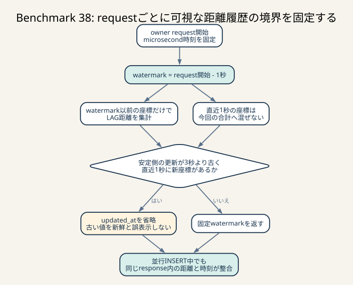

# Benchmark 38: owner累積距離の可視watermarkを固定する

[チューニング目次へ戻る](../TUNING.md)



_request開始時に1秒前のwatermarkを固定し、それ以前の座標だけで距離を集計します。並行INSERT中でも、同じresponseの距離と更新時刻が同じ可視範囲を表します。_

## 結果

`GET /api/owner/chairs` が返す累積距離を、request開始の1秒前までに記録された
座標から計算するようにしました。ただし、安定側の更新時刻が3秒より古く、
1秒以内に新しい座標が存在する短い区間では、optionalな
`total_distance_updated_at` を返しません。

最終実装は通常60秒を3回実行し、すべて `pass=true`、error map空でした。

| 条件 | run | score | CODE=26 | 値の扱い |
|---|---:|---:|---:|---|
| Benchmark 37 | 1 | 143,887 | 118 | 変更前の比較対象 |
| Benchmark 37 | 2 | 140,426 | 136 | 変更前の比較対象 |
| Benchmark 37 | 3 | 137,801 | 120 | 変更前の比較対象 |
| 1秒lagだけの途中案 | 1 | 132,553 | 49 | すべて「反映が3秒より遅い」。不採用 |
| ms境界のレビュー前候補 | 1 | 138,050 | 0 | sub-ms境界穴があり不採用 |
| ms境界のレビュー前候補 | 2 | 134,202 | 0 | sub-ms境界穴があり不採用 |
| ms境界のレビュー前候補 | 3 | 131,593 | 0 | sub-ms境界穴があり不採用 |
| 最終watermark | 1 | 132,225 | 0 | microsecond精度 |
| 最終watermark | 2 | 134,428 | 0 | microsecond精度 |
| 最終watermark | 3 | 137,075 | 0 | microsecond精度 |

最終3走の観測範囲は132,225–137,075点、推定代表値の中央値は134,428点です。
Benchmark 37中央値140,426点との差は-5,998点、約-4.3%です。乱数を含む別3走の
比較であり、性能改善とは扱いません。一方、`CODE=26` は118 / 136 / 120件から
3走合計0件になりました。error上限200件の約60%を使っていた正当性問題を解消する
変更として採用します。

| 最終run | matching不満 | pickup不満 | drive不満 |
|---:|---:|---:|---:|
| 1 | 36.3% | 31.6% | 69.7% |
| 2 | 36.6% | 28.0% | 70.7% |
| 3 | 36.9% | 28.9% | 71.0% |

レビュー前候補はSQLの `DATETIME(6)` をRustでmillisecondsへ切り捨ててから
抑制判定していました。snapshot直後の最大999マイクロ秒を見逃すため不採用とし、
同じ精度の `DateTime<Utc>` 比較へ直したrevisionで3走を取り直しています。

変更前revisionを追加で2回走らせたときは136,723点と131,526点で、どちらも
error map空でした。ここから直接いえるのは、`CODE=26` が同じrevisionでも
非決定的に再現することです。並行処理の順序を主因とする説明は、公式コードと後述の
固定fixtureを合わせた仮説であり、乱数データとの差を完全に分離した結果ではありません。

## `total_distance` とwatermark

累積値だけを返すと、利用者は「どの時点まで足した値か」を判断できません。
そこでowner一覧は次の2値を組にして返します。

| field | 意味 |
|---|---|
| `total_distance` | 隣接する座標のマンハッタン距離を合計した値 |
| `total_distance_updated_at` | その合計へ含めた最後の座標時刻 |

watermarkは「ここまでの入力は集計へ含まれている」という境界です。合計値と
watermarkが同じ入力集合を表していれば、読み手は古い値でも整合性を検証できます。
値が新しいことと、境界が明確であることは別の性質です。

ISUCON14のOpenAPIでは `total_distance` はrequiredですが、
`total_distance_updated_at` はoptionalです。ベンチマーカーも更新時刻がある場合だけ
距離と3秒以内の鮮度を検証します。更新境界を安全に示せない短い区間では、誤った時刻を
付けるよりoptional fieldを省略する方がAPIの意味に合います。

## ベンチマーカーは何を検証するか

公式実装の `ValidateChairs` は、返された更新時刻があるときに次を行います。

1. owner GET開始前に把握していた最新座標との差が3秒以内か確認する
2. `total_distance_updated_at` までの既知の座標距離を `want` とする
3. server時刻の反映がchair側で間に合わない場合に備え、現在の全移動距離も許容する
4. `got` が `want` と現在の全移動距離のどちらにも一致しなければ `CODE=26`

この許容は、座標commitとHTTP response処理のごく短い差を考慮しています。しかしowner検証と
chairの次tickも並行するため、中間値が残ります。

```text
chair座標AをDBへcommit
        |
        +---- owner SQLはAまで集計し、got=Aを返す
        |
chair側がAのresponseを処理
        |
chairが次のBへ移動し、world内の全距離はBまで進む
        |
owner検証時: 時刻付きwantはAより前、現在の全距離はB、gotだけがA
```

実際のgoroutine順を直接記録したものではなく、公式コード、直後可視性の赤テスト、
エラーがrunごとに揺れることから立てた仮説です。最終修正で3走合計0件になったことは
仮説と整合しますが、特定の1回のスケジュールを完全に再生したという意味ではありません。

## 先に棄却した仮説

### 履歴が順不同になっている

変更前の同一revisionを60秒実行し、2026年に追加された全56,856 stepについて、
隣接距離とchair modelのspeedを比較しました。

| 指標 | 値 |
|---|---:|
| 新規step | 56,856 |
| model speed超過 | 0 |
| 最大step距離 | 7 |
| 最大model speed | 7 |

古い座標が新しい座標の後へcommitされて往復しているなら、通常は1tickのspeedを超える
stepが現れます。このrunでは0件だったため、恒常的な履歴順序異常を原因から外しました。

この結論は「当該runでは0件」までが証拠の範囲です。後続の
[Benchmark 47](./47-owner-distance-recurrence-diagnostics.md)では、
同じchairの`recorded_at`が約81ms逆行し、speed 2のstepがDBの時刻順で6〜8へ
並び替わる例を直接観測しました。単一runの0件を非決定的な時刻逆行の恒久的な否定へ
広げられないため、原因候補から外した判断を修正します。

### 同じchairで`created_at`が同値になっている

window関数は当初 `ORDER BY created_at` だけだったため、同一時刻の複数行があれば
`LAG` の順序が不定になります。全履歴を `chair_id, created_at` で集計した結果は次でした。

| 指標 | 値 |
|---|---:|
| timestamp重複group | 0 |
| 重複group内の行 | 0 |

このrunではtieがなく、固定差の説明にはなりませんでした。将来の安全性として
`ORDER BY created_at, id` を使う余地はありますが、今回の原因修正とは分離します。

## 赤から緑にした固定回帰

[`test-owner-distance-watermark.sh`](../scripts/test-owner-distance-watermark.sh) は次を行います。

1. initializeし、既存ownerとchairを1組選ぶ
2. owner APIからbaseline距離と更新時刻を取得する
3. 座標履歴とcurrent-stateを同じtransaction、同じ時刻で1件進める
4. 直後のowner応答が新しい座標を公開せず、更新時刻field自体を省略することを確認する
5. transaction開始前から3秒以内に、新しい距離とfixture時刻以上の更新時刻が
   field付きで公開されることを確認する
6. 終了時にinitializeしてfixtureを片付ける

修正前は次のように失敗しました。

```text
owner response exposed the unacknowledged coordinate immediately
baseline=132  1732607162000
immediate=133 1784944484153
```

最終実装では次のように成功します。

```text
baseline: 132  true   1732607162000
immediate: 132 false  null
eventual: 133 true    1784946277055 after 1.382s
```

中央列は `total_distance_updated_at` fieldの有無です。`false null` はJSONへ
`null` を出す意味ではなく、Rust側の `skip_serializing_if = "Option::is_none"` により
field自体を省略したことを表します。

## 失敗した途中案

最初は単純に「request開始の1秒前まで」を集計しました。距離不一致は減る方向でしたが、
60秒runで `CODE=26` が49件発生し、内容はすべて
`total_distanceの反映が遅いデータがあります` でした。

chairが3秒以上idleだった後に動くと、1秒前には新しい座標がなく、安定側の最新時刻は
idle前まで戻ります。値と時刻は一致していても、鮮度制約を破ります。

```text
古い安定行 -------- 3秒以上idle -------- 新しい行
                                         ^
                                  1秒lagで除外
```

lagを50msや10msへ短くすれば発生確率は下がりますが、commitとresponseの隙間も
同時に狭くなり、正しさを乱数へ戻します。そのため時間を調整して通す方法は採りませんでした。

## 最終実装

requestごとに2つの境界を1回だけ計算します。

```text
request_started_at
├── 3秒前: freshness boundary
└── 1秒前: stable distance snapshot
```

SQLのwindow入力はstable snapshot以前へ限定します。

```sql
WHERE owner_chairs.owner_id = ?
  AND chair_locations.created_at <= ?
```

さらに `chair_current_locations` を主キーで結合し、DBが持つ本当の最新時刻を取得します。
Rust側の判定は次のとおりです。

```text
stable更新時刻がrequest開始の3秒より前
AND
current-stateの最新時刻がstable snapshotより後
    -> total_distance_updated_atを省略
otherwise
    -> stable更新時刻を返す
```

これにより3つの状態を区別できます。

| 状態 | 応答 |
|---|---|
| 古い履歴だけで、その後の座標もない | 従来どおり古い更新時刻を返す |
| 継続走行中で1秒前にも座標がある | 1秒前までの距離と更新時刻を返す |
| 長いidle後に動き、安定側だけが3秒より古い | 安定距離を返し、更新時刻だけ一時的に省略 |

SQL bind用の時刻とRust側の抑制判定は、同じ `request_started_at` から導き、
MySQLの `DATETIME(6)` と同じマイクロ秒精度の `DateTime<Utc>` のまま比較します。
JSONのepoch millisecondsへ変換するのは、返却する更新時刻が確定した後だけです。
判定前にミリ秒へ切り捨てると、snapshot直後の最大999マイクロ秒にある行を
「新しくない」と誤判定できます。ループ中に `Utc::now()` を取り直すとchairごとに
境界がずれるため、requestごとに1回だけ取得します。

## INDEXと実行計画

既存INDEXは次です。

```sql
INDEX idx_chair_locations_chair_created_at (chair_id, created_at)
```

owner 1件、chair 65台、対象位置12,061行の終了DBで `EXPLAIN ANALYZE` を比較しました。

| 条件 | 実時間 | 主なaccess |
|---|---:|---|
| 変更前query | 72.5ms | ownerのchairをINDEX取得し、chairごとに位置履歴をlookup |
| 最終query | 54.6ms | 同じlookup + `created_at <= cutoff` のindex condition + current-state主キーlookup |

最終queryでは、`chair_id = ?` がB-tree先頭列の等価条件、`created_at <= ?` が次列の
range条件になります。そのため全表scanではなく、ownerの各chairについて必要な時刻範囲を
INDEXから読めます。`chair_current_locations` は `PRIMARY KEY (chair_id)` なので、
65回のsingle-row lookup全体はこの点観測で約0.125msでした。

54.6msと72.5msはcache状態も異なる単発計測です。18ms短縮を性能効果とは推定しません。
通常3走中央値も約4.3%下がっているため、この施策はINDEX高速化ではなくwatermarkの
正当性修正です。

### なぜ`created_at`単独INDEXではないか

queryは最初にownerのchair ID集合へ絞り、各chairの時系列を作ります。
`(chair_id, created_at)` なら1台の連続範囲を読み、その中でcutoffまで進めます。
`(created_at, chair_id)` では時刻範囲の全chairが混ざり、owner外の履歴も広く読みます。
複合INDEXは列を含むだけでなく、等価条件、range条件、並べたい単位の順に設計します。

## 他に考えられる選択肢

### coordinate ACKを永続化する

chair clientがresponse受信後にACK endpointを呼び、serverがACK済みlocation IDだけをownerへ
公開すれば境界は最も明確です。しかし公式clientは追加ACKを送らないため、API protocolを
変更できない今回の条件では使えません。

### 累積距離をcurrent-stateへ差分更新する

window関数を毎回実行せず、coordinate transactionで累積値を加算すればowner queryは
O(chair数)になります。ただしcommit直後・response受信前の可視性問題は残ります。
`total_distance` current-stateと公開watermarkを分けて設計し、このBenchmarkの境界を
維持した上で次の性能施策として比較します。

### owner応答を短時間cacheする

仕様が3秒遅延を許すため、owner単位またはchair単位で1秒程度cacheする方法もあります。
高負荷時のwindow計算を削減できますが、新規chair、長いidle後の再移動、initialize世代、
複数process間の共有を扱う必要があります。今回は原因を1つだけ直すためcacheを加えません。

### 更新時刻を常に省略する

ベンチ検証を通すだけなら可能ですが、API利用者が距離の境界を一切判断できなくなります。
最終実装は「古い安定時刻 + 新しい未安定行」という矛盾した短時間だけ省略し、それ以外は
更新時刻を維持します。

## 残るリスクと次の計測

- 1秒と3秒は公式ベンチの許容値とローカル負荷に依存する
- `total_distance_updated_at` を省略した応答数をまだ計測していない
- window関数はowner requestごとに位置履歴を再集計している
- current-state累積距離へ移す場合も公開watermarkを別に保持する必要がある
- `recorded_at` はcommit前に決まるため、timestamp決定からcommitまで1秒以上lock待ちすると
  安定側へ早く入る。`recorded_at`からcommitまでのp99 / maxを計測する必要がある
- 複数webapp processではwall clock差を計測し、1秒lagを食い潰さないことを確認する必要がある
- 同一chair・同一`created_at`は今回の56,856 stepで0件だったが、schemaは禁止していない。
  発生時の正規順序を `(created_at, id)` として固定する検証を別施策で行う

次は診断時だけ、owner request数、対象chair数、履歴行数、更新時刻を省略したchair数、
query時間、`recorded_at`からcommitまでのp99 / maxを記録します。その後、
`CODE=27` のnearby座標watermarkと同じ根本原因かを同じchair IDで確認します。
