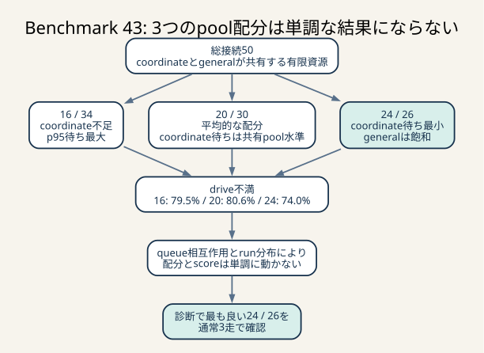

# Benchmark 43: coordinate 20 / general 30の中間比較



_20 / 30はgeneral待ちを減らしてもcoordinate待ちが戻り、drive不満は最悪でした。配分とscoreは単調ではないため、診断上最良の24 / 26を通常3走で確認します。_

## 結論

20 / 30はgeneral待ちを24 / 26より減らしましたが、coordinate pool待ちは共有pool時と
ほぼ同じ水準へ戻りました。診断runは145,732点、`pass=true`、error map空です。

両側を平均的にする配分でしたが、drive不満率は80.6%で3条件中もっとも高く、
24 / 26の通常3走を先に確認する判断としました。

## 実行条件

```sh
ISUCON_DB_COORDINATE_CONNECTIONS=20 \
ISUCON_DIAGNOSTIC=1 \
BENCHMARK_OUTPUT_FILE=/tmp/isucon14-b43.log \
./scripts/benchmark.sh 60
```

- Colima: 4 CPU / 4 GiB memory / 100 GiB disk
- benchmark: 60秒
- score: 145,732
- `pass=true`
- error map: 空
- 診断queue: `dropped_lines=0`

## drive相関sampleによる3配分の比較

| 指標 | 34 / 16 | 30 / 20 | 26 / 24 |
|---|---:|---:|---:|
| score | 128,038 | 145,732 | 152,128 |
| 完了ride | 1,979 | 2,327 | 2,386 |
| drive不満率 | 79.5% | 80.6% | 74.0% |
| client coordinate平均 | 108.937ms | 102.466ms | 103.005ms |
| client coordinate p95 | 343.301ms | 273.452ms | 293.770ms |
| server coordinate pool平均 | 69.832ms | 64.373ms | 33.852ms |
| server coordinate pool p95 | 245.659ms | 179.983ms | 112.942ms |
| coordinate endpoint平均 | 107ms | 96ms | 69ms |
| coordinate endpoint p95 | 295ms | 243ms | 216ms |

左の表記は `general / coordinate` です。

表のclient / server phaseはhashで選んだdrive中rideです。ride状態に依存しない周期sampleの
pool取得平均は16 / 20 / 24本で71.623 / 62.854 / 30.414ms、p95は
242.474 / 178.578 / 108.400msでした。

20本では周期sample 936件中712件、76.1%がpool 20本・idle 0でした。idle 0時の
acquire平均は81.826msです。24本ではidle 0割合69.6%、そのときの平均42.739msでした。
20と24の4本差が、burst時のqueue長へ大きく効いています。

### general側

| 指標 | general 34 | general 30 | general 26 |
|---|---:|---:|---:|
| app通知 initial acquire | 6.129ms | 23.129ms | 54.826ms |
| app通知 transaction acquire | 6.538ms | 22.561ms | 54.023ms |
| chair通知 initial acquire | 7.978ms | 22.908ms | 55.658ms |
| chair通知 transaction acquire | 7.211ms | 22.428ms | 55.338ms |
| 評価 preparation acquire | 8.791ms | 27.412ms | 62.607ms |
| 評価 completion acquire | 6.754ms | 23.798ms | 63.541ms |
| matcher pool begin | 6.137ms | 18.670ms | 44.028ms |

general 30は予想どおり中間でした。しかし、general 30の通知sampleでも約72–76%がidle 0で、
完全な余裕はありません。

## なぜ配分とdrive不満が単調に動かないか

coordinate pool待ちだけなら、16 → 20 → 24で概ね改善しています。一方、drive不満率は
79.5% → 80.6% → 74.0%で、20が16より悪く見えます。

drive評価には次のfeedbackがあります。

1. matcherがどのrideをどのchairへ割り当てるか
2. 通知が `PICKUP` / `CARRYING` をいつclientへ見せるか
3. coordinateが何tick止まるか
4. 完了数が増えると、後半により多くのrideとchairが同時に動く
5. world生成とchair modelの組合せがrunごとに変わる

したがって、異なる1走のdrive不満率を接続数だけの決定関数として扱えません。
pool phaseは局所的な因果を示し、通常3走scoreは全体効果を示す、と役割を分けます。

## ログからの判断

- pool phase
  - drive相関sampleではcoordinate 20が64.373msで、共有50の64.349msとほぼ同じ
  - general 30は26より改善したが、34より悪い
- drive tick
  - 完了2,327、drive不満80.6%
  - 抽出78 rideの余分3,139 tickに対しblocked見積り3,105 tick
- endpoint
  - coordinate p95 243ms
  - app通知p95 164ms、chair通知p95 179ms
  - evaluation p95 780ms
- 正当性
  - 全endpoint 5xx 0
  - benchmark error map空
  - traced diagnostic failure 0

20 / 30は安全なfallback候補ですが、最高得点を狙う比較では24 / 26を通常モードへ進めます。

## 他の選択肢

static partitionには、片側がidleでももう片側へ貸せない欠点があります。20 / 30のような
中間値を探し続けても、workloadの比率が変われば最適点が動きます。

より柔軟な案はshared pool 50を維持し、general用途へ同時実行permitを置くことです。
coordinateは空いている全接続を使えますが、general burstが全50本を占有することを防げます。
ただし全general経路とbackground taskが同じpermit規則を守る必要があり、部分適用では
保証になりません。static partitionを先に小さく検証した理由は、適用漏れを避けて仮説を
短い変更で確認できるためです。
