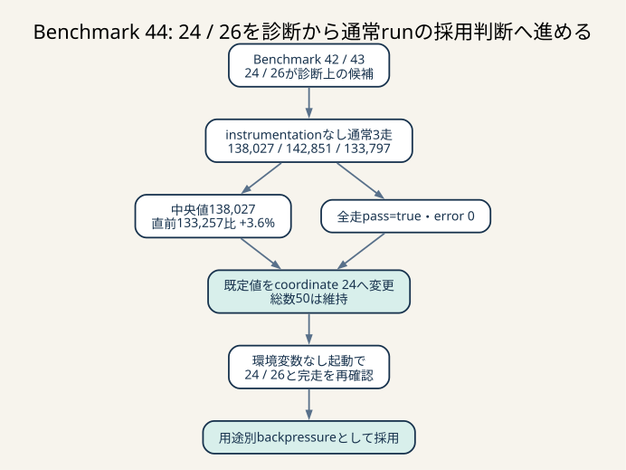

# Benchmark 44: coordinate 24 / general 26を通常runで採用判定



_診断で選んだ24 / 26をinstrumentationなしの3走で比較し、中央値と正当性を確認しました。総数50を増やさず、用途別backpressureとして採用します。_

## 結論

総DB接続50をcoordinate 24 / general 26へ分ける実装を採用しました。

診断なしの比較3走は138,027 / 142,851 / 133,797点、中央値138,027点で、
全走 `pass=true`、error map空でした。直前の通常3走中央値133,257点に対して
+4,770点、約+3.6%です。

既定値を24へ変更した後、環境変数を付けない最終確認runも実施し、起動ログで
`total=50 general=26 coordinate=24`、benchmarkで132,756点、`pass=true`、
error map空を確認しました。

比較3走と最終確認を合わせた同じ実効設定4走の範囲は132,756–142,851点です。
4走の記述中央値は135,912点で、直前中央値比+2.0%です。比較開始前に決めた3走中央値と、
追加確認を含む記述値を混同しないよう両方を残します。

## なぜこの施策を行ったか

Benchmark 40で、drive中coordinate requestのserver時間平均76.515msのうち64.349ms、
約84.1%が接続取得待ちでした。椅子はcoordinate POSTのresponseを待つ間、次の30ms tickで
移動できません。pool待ちは単なるAPI latencyではなく、drive評価の余分tickへ直接つながります。

総接続数を75 / 100へ増やす実験は過去の通常3走中央値を悪化させました。そこで接続を増やさず、
高頻度coordinateの待ち行列を通知・評価・matcherから分けました。

## 採用した実装

### 接続予算

```text
ISUCON_DB_MAX_CONNECTIONS=50
ISUCON_DB_COORDINATE_CONNECTIONS=24

coordinate pool = 24
general pool    = 50 - 24 = 26
total maximum   = 50
```

`ISUCON_DB_MAX_CONNECTIONS` は2つのpoolそれぞれへ50を設定する値ではありません。
process全体の予算です。

Rust起動時に次を検証します。

- totalは正整数
- coordinateは正整数
- `coordinate < total`
- generalを最低1本残す

不正な設定は起動時にerrorにし、暗黙に0本や総数超過へ丸めません。
coordinate設定を省略した場合は `min(24, total / 2)` で導出します。これにより、
従来から有効だった小さいtotal設定を、独立した既定値24だけを理由に拒否しません。
2 poolへ1本ずつ必要なためtotal 1だけは、移行を明示するerrorとして拒否します。

### poolの責務

| pool | 接続上限 | 処理 |
|---|---:|---|
| coordinate | 24 | `POST /api/chair/coordinate`だけ |
| general | 26 | 認証、通知、status、評価、ride、owner、matcher、initialize refresh、reconciliation |

initializeはmaintenance write lockを取るため、破壊的なDB再構築中にどちらのAPIも進みません。
cache load / refreshとbackground reconciliationはgeneral側へ置き、coordinate予約を定常
hot pathのために残します。

### `sqlx::MySqlPool`を2つ持つ意味

`MySqlPool`のcloneは既存poolへのhandleを複製するだけです。別の待ち行列を作るには、
`MySqlPoolOptions::connect_with` を2回呼び、2つのpoolを作る必要があります。

接続設定 `MySqlConnectOptions` はcloneしてもDB connection自体を複製しません。
generalとcoordinateが同じhost、user、databaseを使うための設定値を再利用しているだけです。

## 検証順序

### 1. 34 / 16

coordinateが小さすぎ、score 128,038、完了1,979、drive不満79.5%でした。
一方general待ちは大幅に短縮し、用途分離の効果は確認できました。

詳細: [Benchmark 41](./41-db-pool-partition-16.md)

### 2. 26 / 24

drive相関sampleのcoordinate pool平均は69.832msから33.852msへ短縮し、
周期sampleは71.623msから30.414msへ短縮しました。完了2,386、drive不満74.0%、
score 152,128でした。general側は飽和したため、この1走だけでは採用しませんでした。

詳細: [Benchmark 42](./42-db-pool-partition-24.md)

### 3. 30 / 20

generalは中間まで回復しましたが、drive相関sampleのcoordinate pool平均64.373msで
共有pool時とほぼ同じ、drive不満80.6%でした。

詳細: [Benchmark 43](./43-db-pool-partition-20.md)

### 4. 24 / 26を通常3走

```sh
for run in 1 2 3; do
  ISUCON_DB_COORDINATE_CONNECTIONS=24 ./scripts/benchmark.sh 60
done
```

| run | score | pass | error map | 最終ログのmatching不満 | pickup不満 | pickup + drive合算不満 |
|---:|---:|---|---|---:|---:|---:|
| 1 | 138,027 | true | 空 | 58.7% | 29.5% | 66.2% |
| 2 | 142,851 | true | 空 | 53.2% | 29.5% | 67.0% |
| 3 | 133,797 | true | 空 | 37.5% | 30.4% | 69.2% |
| 中央値 | 138,027 | - | - | 53.2% | 29.5% | 67.0% |

最終ログの3つ目はbenchmark実装上、pickupとdriveの2判定を合算した値です。
drive単独の不満率ではありません。drive単独比較には診断runの
`DRIVE_BENCHMARK_DIAGNOSTIC` を使います。

### 5. 既定値を使う最終確認

```sh
./scripts/benchmark.sh 60
```

```text
configured database connection pools total=50 general=26 coordinate=24
結果 pass=true スコア=132756 種別エラー数=map[]
```

このrunは設定配線の確認です。比較用3走を終えた後に追加したため、事前に定めた3走中央値へ
後付けで混ぜません。一方、同じ実効設定の観測として範囲と4走記述中央値には含めました。

レビュー後、coordinate未指定時の小さいtotalとの互換性を修正した最終sourceでも
`./scripts/benchmark.sh 10`を実行し、6,287点、`pass=true`、error map空、起動logの
`total=50 general=26 coordinate=24`を確認しました。10秒runはwarm-up比率が異なるため、
60秒scoreの代表値には含めません。

## 直前通常runとの比較

| revision / 条件 | scores | 中央値 | pass / error |
|---|---|---:|---|
| Benchmark 39、共有pool 50 | 134,611 / 126,948 / 133,257 | 133,257 | 全走true / 空 |
| Benchmark 44、24 / 26 | 138,027 / 142,851 / 133,797 | 138,027 | 全走true / 空 |

中央値差:

```text
138,027 - 133,257 = 4,770
4,770 / 133,257 ≒ 3.6%
```

両群は同じ4 CPU / 4 GiB、60秒、通常モードです。runごとのworld生成は異なるため、
3.6%を絶対的な因果効果とは断定しません。phase診断でcoordinate待ちが短縮し、
通常中央値も同じ方向へ動いたことを合わせて採用根拠にします。

## どのログを確認し、どう判断したか

| ログ | 確認した値 | 判断 |
|---|---|---|
| benchmark最終行 | score、pass、error map | 正当性を壊さず中央値が改善したか |
| drive診断 | 完了ride、drive不満、実 / 余分tick | coordinate待ちの影響が採点へ届いたか |
| client coordinate | request平均 / p95、30ms以上、失敗数 | chairが実際に待つ時間 |
| server coordinate | pool / SQL / COMMIT / total | 改善箇所がpool待ちか |
| pool state | size、idle、in-use、idle 0時latency | 平均値の背後にある飽和度 |
| notification | 2回のacquire、cache hit、499 | generalを狭めた副作用 |
| evaluation | 準備 / 完了acquire、決済時間 | DB待ちと外部決済待ちを分離 |
| matcher | pool begin、oldest pending、割当数 | general starvationで割当が止まっていないか |
| nginx endpoint | count、p95、p99、status | sampled phaseと全requestの傾向が一致するか |
| webapp起動log | total / general / coordinate | Compose既定値がRustへ届いたか |

## 効果と限界

効果:

- coordinateがgeneral burstに50本すべてを奪われない
- generalもcoordinateに全50本を奪われない
- 総接続数を増やさないため、75 / 100で見たMySQL競合悪化を避ける
- 用途別のpool size / idle / acquireを診断できる

限界:

- static partitionなので、片側のidle接続をもう片側が借りられない
- 24 / 26ではgeneralの通知・評価・matcher p95が悪化するrunがある
- workload比率が変わると最適配分も変わる
- processを複数に増やす場合、総接続数はprocess数倍になる
- 今回はpool sampleのsize / idle / in-useとfresh MySQL process累積row-lockを取得したが、
  `Threads_connected` / `Threads_running`の1秒時系列は未取得

## 他に考えられる選択肢

### shared pool + admission control

poolは50本共有し、general用途だけ同時取得数を制限します。generalが上限へ達しても
coordinate用の余地を残し、coordinateが少ない時間はgeneralが50本を使えます。

static partitionより資源効率はよい可能性がありますが、認証、handler、matcher、
reconciliation、initialize refreshを含む全general取得が同じpermitを守る必要があります。
一部だけに適用すると「予約」の保証になりません。

### 通知の2回acquireを1回にする

app / chair通知はride存在確認とtransactionで2回poolを借ります。1 connectionへまとめれば、
general 26本でも待ち行列を短くできる可能性があります。ただしconnection所有時間が伸びるため、
pool待ちの合計と所有時間を同時に比較します。

### coordinate非同期queue

HTTP response前にDBへ全座標を書く現在の構成を、per-chair順序付きqueueへ変える案です。
30ms tickを直接解放できますが、次を壊しやすい大きな変更です。

- chairごとの座標順序
- `chair_locations` の全履歴
- 累積距離
- pickup / destination一致によるstatus遷移
- 3秒以内の反映
- 再起動時の未処理データ

pool分割後の計測を先に行ったことで、この大きな変更へ進む前に小さい改善を採用できました。

## 次のTODO

1. notificationの2回acquireを1 connectionへまとめ、general待ちと所有時間を再比較する
2. shared pool 50 + general admission controlをstatic 24 / 26と比較する
3. admission control比較では `Threads_connected` / `Threads_running`を1秒ごとに採取する
4. coordinate p95が残る場合だけper-chair queueを設計する
5. 各施策で通常3走、error map、drive tick、general endpointを同じ基準で確認する
