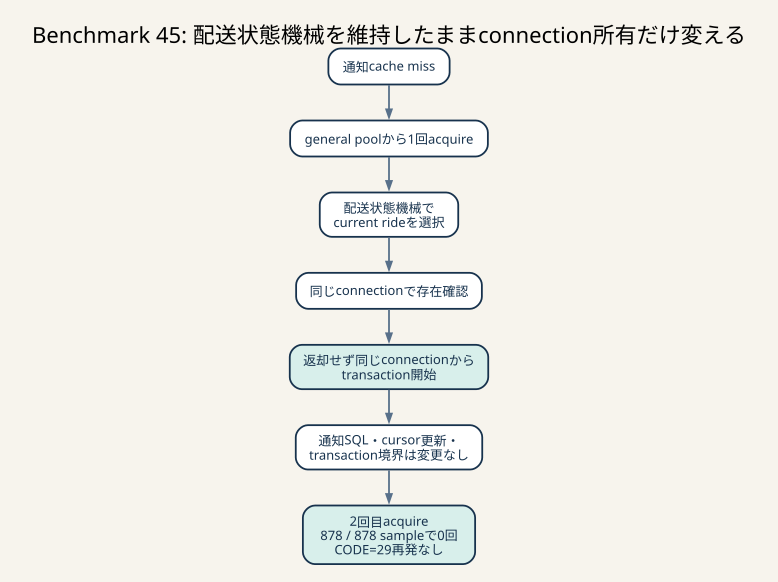

# Benchmark 45: 通知の二重pool取得を現在の配送状態機械で再診断

[チューニング目次へ戻る](../TUNING.md)



_配送状態機械と通知cursorを変えず、ride確認に使ったconnectionからtransactionを開始します。全sampleで2回目acquireを消し、以前のCODE=29も再発しませんでした。_

## 結論

app / chair通知のcache missで、ride存在確認に使ったSQLx connectionを返却せず、
同じconnectionからtransactionを開始しました。rideありの周期sampleでは、
app 436件、chair 442件のすべてで2回目のpool取得を0にできました。

| 項目 | 実測値 |
|---|---:|
| 開始境界 | 2026-07-25 04:08:48 UTC |
| score | 146,532 |
| 判定 | `pass=true` |
| error map | 空 |
| 評価API成功数 | 2,305 |
| matching不満 | 40.8% |
| pickup不満 | 30.5% |
| pickup + drive合算不満 | 69.6% |
| 診断log drop | 0行 |

Benchmark 35でも2回目の取得自体は除去できましたが、当時はchair通知が
`updated_at`最大のrideを選んでおり、別rideの未送信statusを見失いました。その結果、
`CODE=29` 142件を含む202件のerrorで失格しました。

その後のBenchmark 36で、chair通知は`MATCHING`と`COMPLETED`の配送cursorからcurrent
rideを選ぶ状態機械へ変更しています。今回はその状態機械、通知SQL、送信済みcursorの
更新位置を変えず、connectionの所有方法だけを再比較しました。以前の
`CODE=29`は再発していません。

この走行は診断instrumentation付きの実測1回です。146,532点を通常構成の推定代表値には
使わず、phaseと正当性の判定に使います。通常得点は
[Benchmark 46](./46-notification-connection-reuse-adoption.md)の3走で別に評価します。

## はじめに知っておく用語

### physical connection

Rust processとMySQLの間に張られる1本の通信路です。SQLxのpoolは複数のconnectionを
保持し、requestへ一時的に貸し出します。借りられる本数が上限へ達すると、
SQLが速くても`pool.acquire().await`で待ちます。

### queueへ並び直す

変更前のrideあり通知は、同じHTTP requestが一般poolへ2回並びました。

```text
変更前
  acquire A
    -> ride存在確認
  Aをpoolへ返却
  acquire Bの待ち行列へ並び直す
    -> BEGIN
    -> payload構築
    -> sent_at更新
    -> COMMIT
  Bをpoolへ返却
```

一般poolは26本です。空きがない場合、Aを返したrequestが次にBを直ちに取れる保証は
ありません。すでに待っている通知、評価、matcher、owner requestの後ろへ並ぶため、
同じrequest内で待ち時間を2回支払います。

変更後は次の形です。

```text
変更後
  acquire A
    -> ride存在確認
    -> BEGIN
    -> payload構築
    -> sent_at更新
    -> COMMIT
  Aをpoolへ返却
```

SQL数は減りません。削除するのは2回目のqueue待ちです。

### transaction開始前のSELECT

ride存在確認はtransactionの外にあります。同じconnectionを使っても、最初のSELECTまで
同じtransaction snapshotになるわけではありません。MySQLのautocommit下で存在確認を
実行し、その後に`BEGIN`する順序は変更前と同じです。

変更しているのはphysical connectionの個体だけです。

```text
SELECT（autocommit）
BEGIN
SELECT / UPDATE
COMMIT
```

この区別は重要です。「同じconnection」と「同じtransaction」は同じ意味ではありません。

### connection所有時間

connectionをpoolから借りて返すまでのwall-clock時間です。今回の案は再取得待ちを消す一方、
存在確認後にconnectionを返さないため、1 requestが連続してconnectionを所有します。

したがって採否は次の両面を確認します。

- request自身はqueueへ2回並ばずに済むか
- 長い連続所有によって他requestの待ちが悪化しないか

SQLやCOMMIT自体が長い場合は、再利用だけではpool全体の仕事量を減らせません。

## 仮説

Benchmark 42のgeneral 26 / coordinate 24では、通知の平均pool取得時間は次の値でした。

| endpoint | 初回 | transaction前 | 合計 |
|---|---:|---:|---:|
| app通知 | 54.826ms | 54.023ms | 108.849ms |
| chair通知 | 55.658ms | 55.338ms | 110.996ms |

一方、Benchmark 34で測った2区間のconnection所有合計はapp 10.540ms、
chair 10.021msでした。SQL処理より、poolへ2回並ぶ時間の方が大きい状態です。

そこで次を仮説にしました。

> rideあり通知では存在確認connectionをtransactionへ引き継ぐと、SQL・snapshot・
> 配送状態機械を変えずに2回目のpool待ちを削除できる。

反証条件は次のとおりです。

- rideありsampleに2回目のpool取得が残る
- `CODE=12/29`など通知対象・順序のerrorが発生する
- 固定HTTP回帰で別rideへ切り替わる
- 通常3走の得点中央値または他endpoint遅延が明確に悪化する

## 実装

app / chairの両handlerで、最初のquery結果が「rideなし」の場合だけconnectionを
その場で返します。rideがある場合は同じ`PoolConnection<MySql>`へ`begin()`を呼びます。

app通知ではpayloadに含むchair statsのdependency revisionをtransaction前に取得します。
これはprocess内cacheの同期readであり、DB queryや`.await`を増やしません。
その短い処理中はconnectionを所有したままにします。

```rust
let mut initial_connection = pool.acquire().await?;
let latest_ride = find_latest_ride(&mut initial_connection).await?;

let Some(ride) = latest_ride else {
    drop(initial_connection);
    return no_ride_response();
};

let dependency_revision = notification_cache.chair_stats_revision(...);
let mut tx = initial_connection.begin().await?;
// 既存の通知SELECT、sent_at UPDATE、COMMIT
```

診断sampleには`connection_reused`を追加しました。再利用時の
`transaction_pool_acquire_us`は`Some(0)`、cache hitやrideなしでtransactionへ
到達しない場合は`None`です。

`None`と0を分けることで、未到達phaseを「0µsで取得できた」と誤集計しません。

connection所有時間は次の2区間へ分けたまま、合計も記録します。

- `initial_connection_owned_us`: 初回取得から存在確認・dependency取得まで
- `transaction_connection_owned_us`: `BEGIN`直前から`COMMIT`後まで
- `connection_owned_us`: 2区間の合計

物理的には途中で返却していません。診断上の区切りは、時間の内訳を比較するための
論理的な境界です。

## 回帰検証

実コンテナへrelease buildを反映し、ベンチ前に次を実行しました。

| 検証 | 結果 |
|---|---|
| Rust unit test | 46件成功 |
| `cargo clippy --all-targets --all-features -- -D warnings` | 成功 |
| `cargo fmt --check` | 成功 |
| `sh -n scripts/*.sh` | 成功 |
| `shellcheck scripts/*.sh` | 成功 |
| 通知状態順 | app / chairとも`MATCHING → ENROUTE → PICKUP → CARRYING` |
| 座標遷移 | `CARRYING → ARRIVED`、両通知のfallbackも`ARRIVED` |
| hidden pending | 未送信`MATCHING`を持つcurrent rideを選択 |
| delivery gap | current rideのfallbackを維持 |
| current ride継続 | `ENROUTE`中に別rideへ切り替わらない |
| 完了後の古いpending | stale `MATCHING`を選ばない |
| initialize / auth cache | stale世代を復元せず初期userを再読込 |
| 診断filter fixture | periodic / drive window / commit filter成功 |

ここで重要なのは、単にHTTP 200を確認していないことです。ride ID、user ID、status順、
終端後のfallbackまで確認し、Benchmark 35の失敗条件を固定fixtureにしています。

## phase計測

### connection再利用

| endpoint | rideありsample | 再利用 | transaction再取得 |
|---|---:|---:|---:|
| app | 436 | 436 | 0 |
| chair | 442 | 442 | 0 |

rideあり878 sampleすべてで目的を達成しました。chairのrideなし5 sampleは存在確認後に
connectionを返し、transactionへ進んでいません。

### pool取得

| endpoint | phase | sample | 平均 | p95 | 最大 |
|---|---|---:|---:|---:|---:|
| app | 初回取得 | 436 | 82.235ms | 234.505ms | 326.571ms |
| app | transaction再取得 | 436 | 0ms | 0ms | 0ms |
| chair | 初回取得 | 447 | 82.547ms | 244.057ms | 332.997ms |
| chair | transaction再取得 | 442 | 0ms | 0ms | 0ms |

初回取得は依然として長いままです。appは436 sample中338件、chairは447 sample中349件で、
取得直前がgeneral pool size 26 / idle 0でした。

この結果から「pool飽和を解消した」とは判断しません。正確な結論は、
飽和したqueueへ同じ通知requestが2回並ぶ構造を1回へ減らした、です。

### connection所有

| endpoint | rideありsample | 平均 | p95 | 最大 |
|---|---:|---:|---:|---:|
| app | 436 | 9.875ms | 24.951ms | 43.007ms |
| chair | 442 | 10.906ms | 26.471ms | 58.853ms |

初回取得待ちの平均約82msに対し、取得後の所有平均は約10–11msです。
待ち行列の長さが主要因であり、存在確認SQLそのものはapp平均0.780ms、
chair平均0.700msでした。

### path別handler時間

| endpoint | path | sample | 平均 | p95 |
|---|---|---:|---:|---:|
| app | cache hit | 1,312 | 0.002ms | 0.001ms |
| app | pending status | 230 | 95.742ms | 256.865ms |
| app | steady state | 206 | 88.074ms | 241.544ms |
| chair | cache hit | 824 | 0.004ms | 0.001ms |
| chair | pending status | 241 | 99.915ms | 269.342ms |
| chair | steady state | 201 | 87.059ms | 241.403ms |

cache hit率はapp 75.0%、chair 64.8%でした。cache hitはDB connectionを借りないため、
今回の変更対象ではありません。

## endpointへの影響

| endpoint | count | 平均 | p95 | 5xx |
|---|---:|---:|---:|---:|
| app通知 | 111,883 | 51ms | 239ms | 0 |
| chair通知 | 81,320 | 75ms | 267ms | 0 |
| coordinate | 62,838 | 68ms | 222ms | 0 |
| 評価 | 2,305 | 533ms | 1,008ms | 0 |
| nearby | 13,877 | 47ms | 233ms | 0 |
| chair status | 4,954 | 129ms | 301ms | 0 |

app通知にHTTP 499が69件ありました。499はclientがresponse完了前に切断したことを示します。
benchmark error mapは空であり、`CODE=29`との対応はありません。499を0にする施策ではなく、
client timeoutとserver latencyの結果として別に追跡します。

## 仮説と実際

| 仮説 | 実際 | 判断 |
|---|---|---|
| rideありの2回目取得を消せる | 878 / 878 sampleで0ms | 支持 |
| 配送状態機械を維持できる | 固定回帰成功、`CODE=12/29` 0件 | 支持 |
| SQL処理が支配的 | 所有約10–11ms、初回待ち約82ms | 反証 |
| general pool飽和自体が消える | 初回取得の約77–78%がidle 0 | 反証 |
| 他endpointを含めて採用できる | 診断1走だけでは分散不明 | 通常3走へ進む |

## 他に考えられる選択肢

### 存在確認SQLを削除する

最初からtransactionを開始してrideを検索すればSQLを1本減らせる可能性があります。
しかしrideなしpollingまでtransactionを開始し、空pollingが多い初期段階の負荷を戻します。
今回の存在確認はrideなしを軽く返す役割があるため維持しました。

### 2本のSQLを1つのCTEへまとめる

存在確認とpayload用ride取得を1 SQLへまとめても、fare、chair、stats、status更新を同じ
transactionで扱う必要があります。Benchmark 21では通知statusのCTE化で対象SQL累積が
約32秒から53.756秒へ悪化しました。SQL本数だけで採否を決めません。

### general poolの上限を増やす

Benchmark 33で総上限75 / 100は50よりスコア中央値が悪化し、connection所有時間と
InnoDB row-lock waitも増えました。今回も総接続50、general 26 / coordinate 24を
維持しています。

### shared pool + admission control

static partitionはgeneralが待っていてもcoordinate側のidleを借りられません。
共有poolへ戻し、coordinate以外だけpermitで制限する案ならidleを共有できます。
ただしpermit待ちとpool待ちの二重queueを作るため、別benchmarkで比較します。

## 再現コマンド

```sh
diagnostic_since=$(date -u +%Y-%m-%dT%H:%M:%SZ)
ISUCON_DIAGNOSTIC=1 ./scripts/benchmark.sh 60
./scripts/report-notification-phases.sh "$diagnostic_since"
./scripts/report-endpoint-latency.sh "$diagnostic_since"
```

診断開始境界は`2026-07-25T04:08:48Z`、MySQL process開始は
`2026-07-25T04:09:14Z`、最初の通知sampleは
`2026-07-25T04:09:34.740479861Z`です。DB再起動がrun開始後かつ最初のsample前であることを
reportが検証しています。

## 次のTODO

1. 通常60秒を3走し、score中央値とerror mapを比較する
2. `CODE=29`が再発しないことを確認する
3. `CODE=26`など通知外のerrorが出た場合は同じ`main`対照で因果を分離する
4. 採用後も初回pool待ちが残るため、owner距離の正当性を直してからadmission controlを比較する
