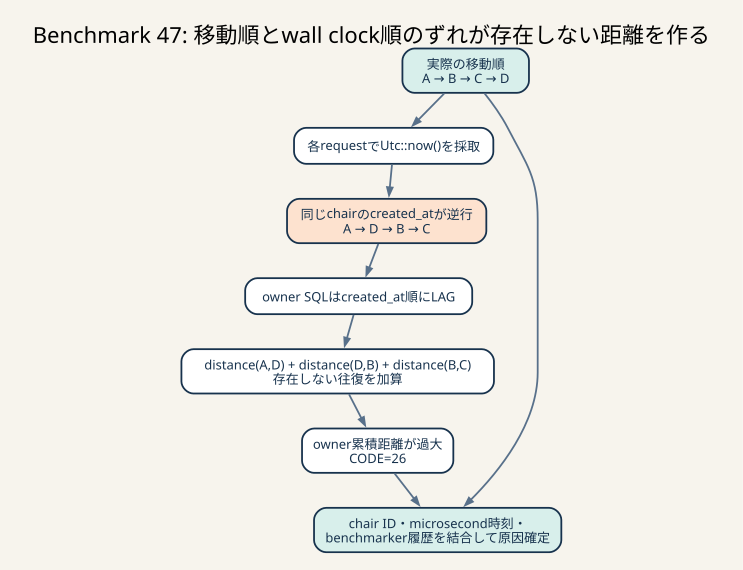

# Benchmark 47: owner距離再発をchair単位の順序まで追跡する

[チューニング目次へ戻る](../TUNING.md)



_実際の移動はA→B→C→Dでも、同じchairのwall clockが逆行するとA→D→B→Cにsortされます。LAGが存在しない往復を距離へ加える原因を、chair単位の時系列結合で特定しました。_

## 結果

Benchmark 46で再発した`CODE=26`を、owner応答、座標transaction、ベンチマーカー内部の
移動履歴を同じchair IDとマイクロ秒時刻で結合しました。原因は
`recorded_at`からcommitまでが1秒を超えたことではありませんでした。

同じchairの座標は移動順に送信されていましたが、`Utc::now()`から採った
`created_at`が途中で逆行しました。owner SQLは`created_at`順に`LAG`を取るため、
座標が実際とは異なる順序に並び、存在しない往復距離を加算していました。

```text
椅子の移動順: A -> B -> C -> D
wall clock順: A -> D -> B -> C

owner SQLの距離:
distance(A,D) + distance(D,B) + distance(B,C)
```

診断runは原因特定用であり、通常得点の推定には使いません。

| run | 時間 | score | pass | CODE=26 | 用途 |
|---|---:|---:|---|---:|---|
| 診断1 | 60秒 | 156,043 | true | 71 | 最初の相関。owner JSONがログ行上限を超えた |
| 診断2 | 60秒 | 145,128 | true | 94 | chair単位の短い行へ修正した主要計測 |
| 履歴診断 | 30秒 | 65,908 | true | 42 | 最初の不一致chairだけ全移動履歴を保存 |
| `Instant`修正後 | 60秒 | 159,936 | true | 0 | commit窓を単調時計で再計測し、厳格相関を確認 |

通常3走ではないため、観測範囲、中央値、推定改善率は作りません。このBenchmarkは
APIの返却規則を変えない診断であり、スコア改善の主張もしません。診断用の
`COUNT(*)`とlatest location IDは通常時もowner SQLのprojectionへ残るため、集約と転送に
小さな追加costがあります。Benchmark 48の通常3走では、このcostを含む同じrevisionを
比較基準にします。

## はじめに知っておく用語

### wall clock

`Utc::now()`やOSの現在時刻が返す「何月何日何時何分何秒」という時刻です。
ログの照合やAPIの更新日時には必要ですが、必ず増え続けるとは限りません。
時刻同期、仮想マシンの補正、suspendからの復帰などで、直前より小さい値を返すことが
あります。

### monotonic clock

処理時間の計測に使う、後戻りしない時計です。Rustの`Instant`が該当します。
「SQLに何マイクロ秒かかったか」の計測には適しますが、Unix時刻へ変換できないため、
そのままAPIの`recorded_at`にはできません。

### 単調増加と全順序

同じchairのイベント`e1, e2, e3`について、保存する順序値が
`order(e1) < order(e2) < order(e3)`を満たす性質を単調増加と呼びます。
全順序は、任意の2イベントについてどちらが先かを一意に決められる順序です。

距離計算は隣り合う点を使うため、単に全行が保存されているだけでは足りません。
chair内の移動順を再現できる全順序が必要です。

### watermark

「この時刻以前の座標までを集計した」という公開境界です。
`total_distance`と`total_distance_updated_at`は同じ入力集合を表す必要があります。
ただし、入力の並べ方自体が壊れている場合、watermarkを1秒遅らせても距離は直りません。

### window関数の`LAG`

`LAG(value) OVER (ORDER BY key)`は、`key`で並べた1行前の値を取得します。
今回の距離は次の形です。

```sql
ABS(latitude - LAG(latitude) OVER (...))
+ ABS(longitude - LAG(longitude) OVER (...))
```

`LAG`は指定された順序を正しいものとして計算します。INDEXがあって高速でも、
`ORDER BY`のkeyが実際の移動順を表さなければ、誤った結果を高速に返すだけです。

## 最初の仮説

Benchmark 38では、request開始1秒前を安定watermarkにしました。残っていた仮説は、
coordinate handlerが`recorded_at`を決めてからcommitするまで1秒以上待ち、
commit直後の行がすでに安定側へ入ることでした。

検証のため、周期sampleに次を加えました。

- `recorded_at_unix_us`
- `committed_at_unix_us`
- `recorded_to_commit_us`
- chair ID、location ID、座標
- 1秒以上かかった座標は周期bucket外でも強制出力

最初の実装では`recorded_at`とcommit後の2つのwall clock値を引いていました。しかし、
調査対象であるwall clock自体が逆行すれば、負の差を0へ丸めて外れ値を隠します。
独立レビュー後、`recorded_at`を決める直前に`Instant`も保存し、commit後の
`Instant::elapsed()`で測り直しました。

`Instant`修正後60秒runの結果は次です。

| 指標 | 値 |
|---|---:|
| coordinate sample | 2,983 |
| p95 | 26,250µs |
| p99 | 123,156µs |
| 最大 | 304,287µs |
| 1秒以上 | 0 |

1/64 sampleだけなら遅い外れ値を取り逃がします。そのため1秒以上を強制出力する分岐を
併用しました。強制出力の判定も同じ`Instant`を使います。それでも0件だったので、
「時刻決定からcommitまでが1秒を超えた」という仮説はこのrunでは棄却します。

修正前の診断2ではwall clock差で最大278,237µs、1秒以上0件と出ていました。この数値は
参考値としてrun表に残しますが、逆行時にも外れ値を捕捉できる証拠には使いません。

## owner requestで確認したログ

owner診断はrequestごとに、境界、SQL時間、chair数、更新時刻を省略した数を出します。
各chairについては別の短いJSON行にし、Docker logging driverが長い1行を分割する問題を
避けました。

`CODE=26`が94件再発した診断2の集計は次です。

| metric | samples | avg | p50 | p95 | p99 | max |
|---|---:|---:|---:|---:|---:|---:|
| owner query | 125 | 218.002ms | 117.492ms | 660.307ms | 853.533ms | 908.359ms |
| response build | 125 | 13µs | 2µs | 11µs | 15µs | 1.013ms |
| handler total | 125 | 218.178ms | 117.528ms | 660.365ms | 853.601ms | 908.420ms |

| 公開境界 | 値 |
|---|---:|
| owner request | 125 |
| 返却chair総数 | 4,590 |
| 更新時刻を省略したchair | 270 |
| 1件以上省略したrequest | 40 |

省略率は`270 / 4,590 = 約5.9%`です。省略分岐が死んでいたわけではありません。
しかし再発94件はすべて、更新時刻を返したchairで発生しました。

query p95が660msなので、owner距離のwindow集計は性能上も重いままです。ただし、
正しくない値をcurrent-state化すると誤差を永続化するため、先に順序を直します。

相関scriptは、単に時刻が最も近いrequestを選びません。各benchmark不一致について、
次をすべて満たすserver requestがちょうど1件のときだけ採用します。

- server request開始がbenchmark request開始以後、かつ1秒以内
- chair IDと返却距離が一致
- serverのmicrosecond更新時刻をAPIと同じmillisecondへ切り捨てるとwatermarkが一致
- benchmarkの比較直後snapshotと診断snapshotが一致
- benchmark不一致件数と相関結果件数が一致

欠落、複数候補、逆方向の時刻、1秒超、watermark不一致は集計を失敗させます。
履歴診断の42件はこの厳格化後にも全件相関しました。`Instant`修正後runは不一致0件で、
空の相関を明示的に`mismatches=0`として完了しました。

## 1件を最後まで追った結果

履歴診断runの最初の不一致は次でした。

| field | 値 |
|---|---:|
| chair ID | `01KYBS934KZZ140CW29X5556SX` |
| response watermark | `1784954536587000µs` |
| serverが返した距離 | 465 |
| watermark時点のベンチ期待値 | 429 |
| ベンチ側の現在距離 | 461 |
| `got - want` | 36 |

同じchair、同じwatermarkで終了DBをwindow集計すると465になりました。したがって
owner responseのdecodeやJSON変換ではなく、DBの順序で既に36増えています。

ベンチマーカーの全履歴には、次の時刻逆転がありました。client tickは移動順です。

| client tick | 座標 | server `recorded_at` |
|---:|---:|---:|
| 446 | `(-17, 8)` | `04:42:16.270276` |
| 447 | `(-18, 9)` | `04:42:16.301547` |
| 448 | `(-20, 9)` | `04:42:16.337426` |
| 449 | `(-22, 9)` | `04:42:16.256056` |
| 450 | `(-22, 11)` | `04:42:16.297831` |
| 451 | `(-23, 12)` | `04:42:16.318312` |

tick 448から449で`recorded_at`が約81.37ms戻っています。DBは当然
`created_at`の小さいtick 449を先へ並べます。

| DBの`created_at`順 | 座標 | 直前からの距離 | DB累積 |
|---:|---:|---:|---:|
| 1 | `(-22, 9)` | 8 | 410 |
| 2 | `(-17, 8)` | 6 | 416 |
| 3 | `(-22, 11)` | 8 | 424 |
| 4 | `(-18, 9)` | 6 | 430 |
| 5 | `(-23, 12)` | 8 | 438 |
| 6 | `(-20, 9)` | 6 | 444 |

chair modelのspeedは2です。本来は各stepが最大2ですが、並べ替え後は6または8の
往復になりました。その後の座標は再び1〜2ずつ進み、watermarkでDB 465、
ベンチ429という36の差が残りました。`CODE=26`の差と一致します。

## なぜBenchmark 38で見落としたか

Benchmark 38では1回のrunについて「新規stepの距離がmodel speedを超えた件数0」を確認し、
恒常的な順序異常を原因から外しました。そのrunで0件だった事実は変わりませんが、
別runでも発生しないとはいえませんでした。

今回のrunでは明確にspeed 2に対して距離6〜8の並び替えを観測しました。
時刻逆行は非決定的なので、単一runの0件を原因の恒久的な否定へ広げた判断を修正します。

Benchmark 38の1秒watermarkは「新しすぎるcommitを公開しない」対策としては意味があります。
しかし過去行の順序keyが逆転した後は、時間を待っても順番は直りません。

## INDEXとの関係

現在のINDEXは次です。

```sql
INDEX idx_chair_locations_chair_created_at (chair_id, created_at)
```

owner queryはownerのchair IDで等価検索し、`created_at <= cutoff`をrange検索できます。
これは対象行を速く絞る正しいINDEXです。一方、B-treeはkey順に並べるだけで、
keyの意味が正しいかは検証しません。

将来`(chair_id, sequence)`へ変えるなら、chair単位の等価条件と単調sequenceのrange・順序を
同じINDEXで満たせます。今回まず試す「chair内で`recorded_at`を単調化する」案なら、
既存INDEXを維持したまま時系列の意味を修復できます。

同時刻tieへの`ORDER BY created_at, id`追加は決定性を上げますが、時刻が逆転した2行を
元の順序へ戻せません。tie対策と逆行対策は分けて考える必要があります。

## 次に比較する実装

最初の候補は、process内でchairごとの発行済み時刻を持ち、wall clockが直前値以下なら
`直前値 + 1µs`を採用する方法です。

```text
candidate = wall_clock_now
recorded_at = max(candidate, last_recorded_at + 1µs)
```

候補を選ぶ理由は次です。

- OpenAPIのepoch millisecondsを維持できる
- 既存の`DATETIME(6)`と複合INDEXを維持できる
- wall clockが正常な通常経路では値を変更しない
- 逆行時だけ最小1µs進め、chair内の全順序を守る

ただし、複数webapp processではprocess内状態だけでは不十分です。その場合はDBに
chairごとのsequenceまたはlast timestampを置き、row lockまたはatomic updateで発行する
必要があります。現在のComposeはwebapp 1 instanceなので、まずローカル実測で効果と
lock overheadを比較します。

## 他の選択肢

### `total_distance_updated_at`を常に省略する

ベンチマーカーの距離検証は回避できますが、利用者は値の境界を判断できません。
順序不整合を隠すだけなので採用しません。

### `ORDER BY id`へ変える

ULIDは時刻成分を持ちますが、`Ulid::new()`の呼び出し元もwall clockに依存し、
同時刻内のrandom部分は生成順を表しません。単独の順序keyにはしません。

### AUTO_INCREMENTの全体sequenceを追加する

DBが一意な全順序を発行でき、複数processにも強い案です。一方で全chairが同じ
AUTO_INCREMENTを更新し、schema変更とwrite集中が増えます。process内単調化が
正しさと性能を満たさない場合の次候補にします。

### chair単位のDB sequenceをcurrent-stateへ持つ

複数processでもchairごとに直列化でき、全体AUTO_INCREMENTの集中を避けられます。
ただしhistory INSERT前にcurrent rowの採番・lockが必要です。現在のcoordinate p95は
pool待ちが支配的なので、SQL往復とlock保持を増やす案は実測して選びます。

## 再現・集計コマンド

```sh
owner_diagnostic_since=$(date -u +%Y-%m-%dT%H:%M:%SZ)
owner_benchmark_log=$(mktemp /tmp/isucon14-owner-distance.XXXXXX)

ISUCON_DIAGNOSTIC=1 \
BENCHMARK_OUTPUT_FILE="$owner_benchmark_log" \
./scripts/benchmark.sh 60

./scripts/report-owner-distance.sh \
  "$owner_diagnostic_since" \
  "$owner_benchmark_log"
```

出力にはchair ID、location ID、座標、時刻、距離を含みます。Cookie、access token、
決済情報は含みません。通常スコアrunでは`ISUCON_DIAGNOSTIC`を付けません。

## 判断

- `CODE=26`再発原因の計測: 完了
- 1秒超のcommit遅延仮説: `Instant`で再計測して棄却
- chair内`created_at`逆行によるwindow順序破壊: 実測で支持
- owner queryのcurrent-state化: 順序修正後へ延期
- 次のP0: chair内の発行時刻を単調化し、固定回帰・診断・通常3走で検証
