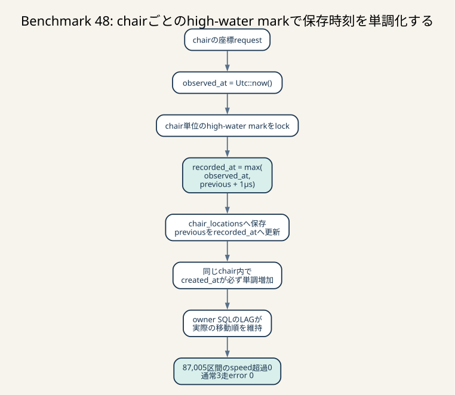

# Benchmark 48: chair内の記録時刻を単調増加させる

[チューニング目次へ戻る](../TUNING.md)



_chairごとのhigh-water markをlockし、観測時刻が前回以下なら前回+1µsへ進めます。追加SQLなしでcreated_at順と実移動順を一致させ、距離の過大計算を防ぎます。_

## 結果

Benchmark 47で実測した同一chairのwall clock逆行に対し、1 webapp process内で
`recorded_at`のhigh-water markを管理しました。新しい座標の観測時刻が直前値以下なら、
保存時刻を`直前値 + 1µs`へ進めます。

```text
observed_at = Utc::now()
recorded_at = max(observed_at, previous_recorded_at + 1µs)
```

最終revisionの診断runでは、DBに残った87,005区間を
`(chair_id, created_at, id)`順で再計算し、chair modelのspeedを超えた区間は0件でした。
通常60秒3走もすべて`pass=true`、error map空です。

| run | score | pass | error map |
| --- | ---: | --- | --- |
| 通常1 | 141,228 | true | 空 |
| 通常2 | 146,999 | true | 空 |
| 通常3 | 139,218 | true | 空 |
| 推定代表値 | 141,228 | - | 3走中央値 |

観測範囲は139,218–146,999点です。Benchmark 46の推定代表値139,198点に対する
推定改善率は`(141,228 - 139,198) / 139,198 = +1.46%`です。中央値は改善しましたが、
run間のばらつきより小さい差なので、時刻単調化が得点を上げたとは断定しません。
追加SQLなしで、実際に距離不一致を作った順序破壊を直接防ぎ、最終3走で
正当性errorを0件にできたため採用します。

3走は小さなsampleであり、Benchmark 46の観測範囲134,732–150,117点と今回の範囲は
重なります。mutexやµs正規化が得点差の原因だと断定できるprofileもありません。
得点差を実装効果と決めつけず、次のP0ではpool待ちとendpoint分布を再計測します。

## 診断run

最終コードへ`ISUCON_DIAGNOSTIC=1`を付けた60秒runは次の結果でした。

| 項目 | 値 |
| --- | ---: |
| score | 158,260 |
| pass | true |
| error map | 空 |
| owner request | 111 |
| owner query p50/p95/p99/max | 141.745/715.911/1,048.523/1,244.137ms |
| 座標commit sample | 2,996 |
| 座標commit p95 / p99 / max | 24.650 / 76.030 / 197.062ms |
| commit 1秒以上 | 0 |
| wall clock補正 | 0 |
| DBの移動区間 | 87,005 |
| model speed超過区間 | 0 |
| `CODE=26`相関対象 | 0 |
| 診断queue drop | 0 |

補正0件は「実装が不要」という意味ではありません。Benchmark 47でも時刻逆行はrunごとに
再現数が変わりました。非決定的なOS時刻補正を待つ代わりに、固定テストで逆行、同時刻、
正常な未来時刻、別chairを再現しています。

## 途中で見つかった別の`CODE=26`

最初の候補revisionを通常3走したときの値は132,642、131,290、140,742点でした。
3走目だけ`CODE=26`が2件出ました。終了DBを調べると、対象chairの時刻は単調で、
各移動距離もmodel speed以下でした。Benchmark 47の「順序逆転による距離不一致」と
同じ証拠はありませんでした。

ベンチマーカーの`CODE=26`には次の2種類があります。

1. `total_distance`がwatermark時点の期待距離と一致しない
2. 返したwatermarkが最後の移動から3秒を超えて古い

既存診断は1だけをJSONへ出していたため、2を同じ原因と誤認する余地がありました。
そこで両方を同じsnapshot形式で記録し、`reason`と
`response_lag_from_move_us`を追加しました。

```text
total_distance_mismatch
  距離そのものが不一致

total_distance_stale
  距離は正しくても公開watermarkが3秒より古い
```

追加後の最終診断runと通常3走ではどちらも再発しませんでした。2件だけの現象を
再現できていないため、staleness境界は推測で変更していません。再発時に測る項目として
診断を残します。

## はじめに知っておく用語

### high-water mark

これまで観測した最大値です。今回はchair IDごとに最後に発行した`recorded_at`を持ちます。

```text
chair A -> 12:00:00.100000
chair B -> 12:00:00.080000
```

全chairで1つの時刻を共有すると、Aの更新がBの時刻まで不要に進めます。必要な順序は
chair内だけなので、値はchair IDごとに分けます。

### strict monotonicity

次の値が必ず直前値より大きい性質です。

```text
t1 < t2 < t3
```

`max(now, previous)`だけでは同時刻tieが残ります。MySQLの`DATETIME(6)`は
マイクロ秒まで保存できるため、観測値を先にマイクロ秒へ切り捨て、
`normalized_now <= previous`なら1µs進めます。

Rust / Chronoの`Utc::now()`はナノ秒を持てます。100nsと200nsをRust上では別時刻として
通しても、MySQLでは同じ0µsへ保存されます。比較前の正規化がないと、アプリで成立した
単調性が永続化境界で失われます。

### wall clockとmonotonic clockの役割分担

Rustの`Instant`は後戻りしないため処理時間の計測に使います。しかしカレンダー時刻を
表さず、APIのepoch millisecondsへ変換できません。

`Utc::now()`はAPI時刻に使えますが後戻りする可能性があります。今回はwall clockを
捨てず、直前に公開した値を下回った場合だけ補正します。

| 目的 | 使用する時計 |
| --- | --- |
| APIとDBの`recorded_at` | 補正した`Utc::now()` |
| `recorded_at`決定からcommitまでの処理時間 | `Instant` |

### mutexのcritical section

mutexを取得してから解放するまでの、同時に1つのthreadだけが実行できる区間です。
今回のcritical sectionはHashMapのlookup、時刻比較、1µs加算、値更新だけです。
DB queryや`.await`は含みません。

```text
lock
  HashMap lookup
  max calculation
  HashMap update
unlock
await history INSERT
```

短い同期処理なので`std::sync::Mutex`を使います。guardを保持したまま`.await`すると、
executor threadを塞ぐだけでなくAxum handlerのfutureが`Send`でなくなる可能性があります。
そのため、予約関数は同期関数として完結させ、時刻だけを返します。

### reservation

DBへINSERTする前に時刻を確保する処理です。同じchairの2 requestが並行しても、
mutex内で異なる時刻を受け取ります。

```text
request A: reserve 100µs ---- INSERT ---- COMMIT
request B:       reserve 101µs -- INSERT -- COMMIT
```

commit順が入れ替わっても、owner SQLは`created_at`順でA、Bと並べられます。

予約後にtransactionがrollbackすると100µsの行はDBへ残らず、次が101µsになります。
sequenceに穴はできますが、距離計算が必要とするのは連番ではなく順序なので問題ありません。

### reconciliation

process cacheとDB current-stateを定期的に突き合わせる処理です。DB snapshotを読んでいる間に
新しい座標がcommitする可能性があるため、取得したsnapshotをそのままcacheへ上書きすると
新しい値を失います。

今回の時刻high-water markも同じです。DBから読んだ最大時刻で前進はできますが、
予約済みでまだcommitしていないprocess内時刻を後退させてはいけません。

## 実装

### 起動・initialize時

`LatestChairLocationCache::refresh`がDB current-stateから最新座標を読み、同じ値で
時刻high-water markを作ります。initialize後はDBが初期状態へ戻るため、古いrunの
未来時刻を持ち越さず、high-water markも置き換えます。

### 通常の座標更新

`reserve_recorded_at(chair_id, observed_at)`は次を行います。

1. `observed_at`をMySQLと同じマイクロ秒精度へ切り捨てる
2. high-water markのmutexを取る
3. chairが初登場なら正規化済み時刻を保存する
4. 登録済みなら`max(normalized_at, previous + 1µs)`を同じentryへ上書きする
5. mutexを解放する
6. 返した時刻をhistory INSERT、current UPDATE、HTTP responseへ共通利用する

登録済みchairでは`String`を作り直さず`get_mut`で更新します。初回だけ
`chair_id.to_owned()`を行います。また、commit後のcache updateで同じhigh-water markを
再度lockする処理は不要なので入れていません。

### 2秒ごとの再同期

`reconcile`はDBと最新座標cacheを先にmergeし、その結果から時刻候補を作ります。
high-water markへは`max(process_value, db_value)`をmergeし、値を後退させません。

lock順は次で固定しています。

```text
reconciliation_lock
  -> latest location RwLock
  -> RwLockを解放
  -> high-water mark Mutex
```

座標の予約はhigh-water mark Mutexだけを取り、latest location RwLockを同時に取りません。
逆順に2 lockを待つ経路を作らないことでdeadlockを避けます。

### owner SQLのtie-break

window順を次へ変更しました。

```sql
ORDER BY chair_locations.created_at, chair_locations.id
```

単調化が正常なら同じchairで`created_at`は重複しません。ただし、初期データ、別process、
手動投入などからtieが入っても、同じ入力を常に同じ順に並べるための防御です。
これは逆行を直す処理ではありません。

## INDEXをなぜ変更しなかったか

既存INDEXは次です。

```sql
INDEX idx_chair_locations_chair_created_at (chair_id, created_at)
```

owner queryは次の順に使います。

1. `chairs(owner_id)`でownerのchairを絞る
2. `chair_locations(chair_id, created_at)`で各chairのcutoff以前をrange lookupする
3. 対象行へwindow関数を適用する

最終run DBの約3,972対象行で`EXPLAIN ANALYZE`を比較した結果は次です。

| window順 | 実時間 |
| --- | ---: |
| `(chair_id, created_at)` | 27.7ms |
| `(chair_id, created_at, id)` | 23.4ms |

後者が速いという結論ではありません。先に実行したqueryがcacheを温めた可能性があり、
1回ずつの値だからです。ただし、`id`追加で明確に遅くなった証拠はありませんでした。

InnoDBのsecondary INDEX leafには主キーが行locatorとして含まれます。そのため
`(chair_id, created_at, id)`を明示した別INDEXをすぐ追加すると、既存INDEXとほぼ同じ
情報を持つB-treeを増やし、座標INSERTのwrite amplificationとmemory消費を増やします。
終了DBの77,904行では同一chair・同一`created_at`のgroupも0件でした。

今回の問題はINDEX不足ではなく、INDEXへ渡した時刻の意味が壊れていたことです。
正しいkeyを作る前にINDEXを増やしても、誤った順序を高速に処理するだけです。

## 仮説と実測

| 仮説 | 確認方法 | 実測 | 判断 |
| --- | --- | --- | --- |
| commitが1秒を超え、公開境界へ早く入る | `Instant`で決定からcommitを計測 | 最大197.062ms、1秒超0 | 棄却 |
| wall clock逆行がwindow順を壊す | chair全履歴とDB距離を照合 | 約81ms逆行、誤差36 | 支持 |
| 単調化後もspeed超過stepが残る | 終了DBをmodel speedと全件照合 | 87,005区間中0 | このrunでは棄却 |
| tie-breakでqueryが退行する | 同じDBで実行計画を比較 | 27.7ms対23.4ms | 証拠なし |
| 単調化で`CODE=26`を防げる | 診断1走 + 通常3走 | 全4走error map空 | 観測範囲で支持 |
| 推定代表値も改善する | 通常3走中央値比較 | 139,198→141,228 | +1.46%、因果未確定 |

## テスト

固定回帰は次を確認します。

- 正常に進むwall clockはそのまま採用する
- 逆行時は直前値より1µs進める
- 同時刻でも1µs進める
- 100nsと200nsがMySQLで同じµsへ落ちても、保存値は1µs進む
- 同じchairの32並行予約が重複せず、1µs刻みの連続した集合になる
- wall clockが再びhigh-water markを超えたら観測時刻へ戻る
- 別chairのhigh-water markを混ぜない
- 古いDB snapshotとの再同期がprocess内予約を後退させない
- owner距離のbaseline / immediate suppression / eventual公開
- latest-locationの起動修復、再同期、同時刻ID tie

実行コマンドは次です。

```sh
cd webapp/rust
cargo fmt --check
cargo clippy --all-targets --all-features -- -D warnings
cargo test --all --all-targets

cd ../..
go test ./bench/...
./scripts/test-owner-distance-watermark.sh
./scripts/test-latest-location-reconciliation.sh
shellcheck scripts/report-owner-distance.sh
```

Rustはlibrary 45件とbinary 5件、Goは全package、2つのDB連携fixtureが成功しました。

## 他の選択肢

### sharded mutex

chair IDのhashで複数のHashMapへ分ければ、異なるchairの予約を並列化できます。
今回の診断ではmutex待ちだけを分離計測しておらず、DB pool待ちとSQLが大きいため、
複雑性を増やしていません。profileでglobal mutexの競合が見えた場合の候補です。

### `tokio::sync::Mutex`

lock待ちを`.await`できますが、critical sectionはDB I/Oを含まない短い同期処理です。
async mutexはwake-up管理を増やすため、この用途では標準mutexを選びました。

### DBのchair単位sequence

複数webapp processでも正しい順序を発行できます。一方、coordinateごとにcurrent rowの
atomic updateまたはrow lockが必要です。現在は1 processなので、追加SQLとlockを避けました。
水平分割する前には必ず置き換えを検討します。

### 全体AUTO_INCREMENT

DBが一意な順序を発行できますが、全chairのwriteが1つの採番器を共有します。
必要なのはchair内順序なので、全体順序は保証が強すぎます。

### Hybrid Logical Clock

wall clockと論理counterを組み合わせ、複数nodeの因果順を表せます。複数process・複数hostへ
拡張する場合は候補ですが、永続化とnode間mergeが必要です。1 processの競技構成には
過剰です。

### owner距離のcurrent-state化

座標INSERT時に累積距離を更新すれば重いwindow集計を除去できます。ただし、順序と
冪等性が壊れた状態で導入すると誤差をcurrent rowへ永続化します。単調化後の次の
独立施策として、1秒公開watermarkを維持できる差分集約を比較します。

## 制約

- 保証は1 webapp process内だけ
- process再起動時はDB current-stateから復元する
- 複数processが同じchairを処理するとprocess間の順序は保証しない
- wall clockが大きく逆行すると、補正時刻が実時間より未来に留まる期間がある
- 予約後rollbackでは時刻に穴が開くが、順序は維持する
- `NaiveDateTime`の上限では1µs加算できず直前値を返す

最後のoverflowは現実の日付では到達しません。無言のwraparoundを避けるため
`checked_add_signed`を使っています。厳密には上限値でstrict monotonicityを失うため、
将来永続sequenceへ変える際は上限errorを明示する必要があります。

## 再現コマンド

```sh
diagnostic_since=$(date -u +%Y-%m-%dT%H:%M:%SZ)
diagnostic_log=$(mktemp /tmp/isucon14-owner-monotonic.XXXXXX)

ISUCON_DIAGNOSTIC=1 \
BENCHMARK_OUTPUT_FILE="$diagnostic_log" \
./scripts/benchmark.sh 60

./scripts/report-owner-distance.sh \
  "$diagnostic_since" \
  "$diagnostic_log"
```

通常スコアは`ISUCON_DIAGNOSTIC`を付けず、独立に3回実行します。診断runと通常runを
同じ母数へ混ぜません。Colimaは全runで4 CPU / 4 GiB / 100 GiBのままです。

## 判断

- chair内wall clock逆行対策: 採用
- 同時刻の決定的tie-break: 採用
- 得点改善: 推定代表値+1.46%、run間分散より小さく因果未確定
- `CODE=26`: 最終診断1走 + 通常3走で0件
- owner距離current-state化: 次の独立施策
- shared pool + general admission control: 次のP0
- 複数process対応: DB sequenceまたはatomic current rowを比較してから実施
