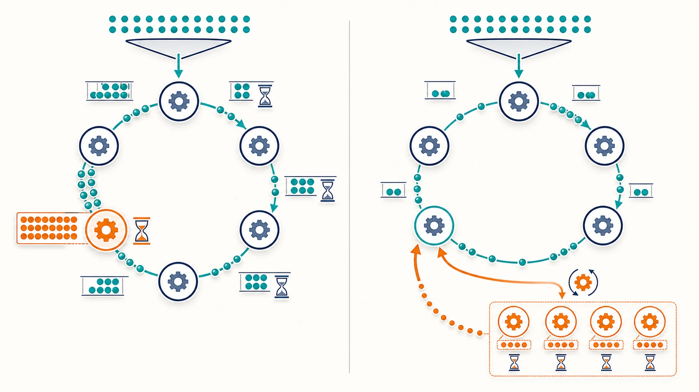
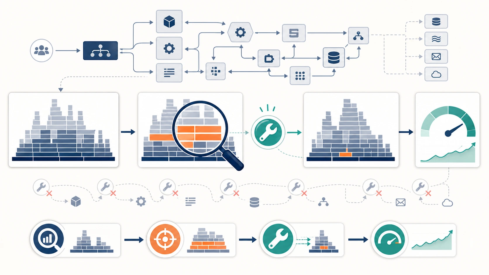
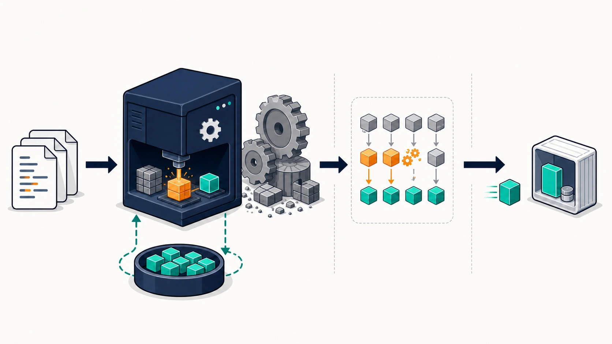

# Rust / sqlx 実装から学べること

[チューニング目次へ戻る](../TUNING.md)

この文書はベンチマーク結果ではなく、ISUCON14 の Rust 実装を読み、変更し、検証するときに役立つ Rust 固有の知識をまとめたものです。スコアの変化は各 Benchmark 文書へ分離します。

## `Pool`、`Connection`、`Transaction` の違い

3つは似ていますが、責務が違います。

| 型・概念 | 役割 | たとえ |
|---|---|---|
| `MySqlPool` | 再利用可能な接続を管理する | 複数の窓口を管理する受付 |
| `PoolConnection<MySql>` | poolから一時的に借りた1接続 | 今使っている1つの窓口 |
| `Transaction<'_, MySql>` | 1接続上の複数SQLをcommit/rollbackまでまとめる | 途中で分割できない一連の手続き |

`&pool` をqueryへ渡すと、sqlxが必要な接続をpoolから借りて返します。複数SQLが同じ接続・同じtransactionになるとは限りません。

```rust
let chair = sqlx::query_as("SELECT ...")
    .fetch_one(&pool)
    .await?;
```

`pool.acquire().await?` で接続を明示的に借りると、複数SQLに同じ通信路を使えます。しかし、それだけではtransactionではありません。MySQLのautocommitが有効なら、各SQLは文ごとに確定します。

```rust
let mut conn = pool.acquire().await?;
query_a.execute(&mut *conn).await?;
query_b.execute(&mut *conn).await?;
```

`pool.begin().await?` は接続を借り、さらにtransactionを開始します。

```rust
let mut tx = pool.begin().await?;
query_a.execute(&mut *tx).await?;
query_b.execute(&mut *tx).await?;
tx.commit().await?;
```

## `&mut *tx` は何をしているのか

sqlxのquery実行には、`Executor` として使える可変参照が必要です。`Transaction` は内部にDB接続を持ち、`DerefMut` を通してその接続を参照できます。

```rust
query.fetch_one(&mut *tx).await?;
```

読み方は次のとおりです。

1. `*tx`: `Transaction` が保持する接続を参照する
2. `&mut`: その接続への可変参照を作る
3. queryへ渡し、同じtransaction上でSQLを実行する

これは「値をコピーしている」のではありません。借用なので、queryの実行後もtransactionは同じ接続を保持します。

ヘルパー関数へ `&mut Transaction` を渡している場合は、関数内でさらに `&mut **tx` が必要になることがあります。参照が一段増えるためです。型エラーが出たときは記号を闇雲に増やさず、現在の変数が `Transaction` 本体か、その可変参照かを確認します。

## transactionを `await` をまたいで保持する意味

Rustの非同期処理では、`.await` 中にOSスレッドを占有し続けるとは限りません。しかし、transactionが借りたDB接続はcommit/rollbackまでpoolへ戻りません。

```text
リクエストA: BEGIN ─ SQL ─ await ─ SQL ─ COMMIT
                    ↑ この区間は接続を保持する ↑
リクエストB: poolに空きがなければ待つ
```

したがって「asyncだから接続待ちは問題にならない」とは言えません。スレッドを空けられても、限られたDB接続という別の資源は占有します。

一方、速さだけを理由にtransactionを外すと、複数SELECTが別時点のデータを見る可能性があります。Benchmark 02では実際に通知の椅子統計が期待値とずれるCODE=33を検出しました。

判断手順は次のとおりです。

1. 複数SQLが同じ時点のデータを見る必要があるか確認する
2. 複数更新を全部成功または全部失敗へまとめる必要があるか確認する
3. 不要な分岐だけをtransaction開始前へ移せないか考える
4. ベンチマーカーの正当性エラーを確認する

## `Option` と早期returnで正常な「データなし」を表す

sqlxの `fetch_optional` は、0行なら `None`、1行なら `Some(row)` を返します。「ライドがまだない」はサーバー障害ではないため、`Option` と相性がよい処理です。

```rust
let ride: Option<(String,)> = sqlx::query_as("SELECT id FROM rides ...")
    .fetch_optional(&pool)
    .await?;

if ride.is_none() {
    return Ok(Json(response_without_notification));
}
```

今回の通知処理では、この軽い存在確認をtransactionの前へ置きます。空pollingだけを早期returnし、通知データを組み立てる複数SQLはtransaction内へ残します。

## N+1をRustのloopだけで解決しない

初期実装の椅子統計は、最初にridesを取得し、Rustの `for` 内でrideごとのstatusを取得します。

```text
1回: 椅子のrides一覧
N回: 各rideのstatus一覧
```

コードは直感的ですが、対象rideが増えるほどSQL往復も増えます。計算を1つの集約SQLへ寄せられる場合は、MySQLがINDEXと集合演算を使えます。

ただし、書き換え前に次を確認します。

- `ARRIVED`、`CARRYING`、`COMPLETED` がすべて必要という元の条件
- `evaluation` がNULLのrideをどう扱うか
- 0件時の平均値が `0.0` になること
- 同じtransaction snapshotで評価する必要があるか

「SQLを1回にした」だけでは正しさの証明になりません。元の分岐を真理値表またはテストケースへ落としてから集約します。

## Rustの型をSQL結果の仕様書として使う

`sqlx::query_as` の結果はRustの構造体またはtupleへ変換されます。集約SQLでは、MySQLの `COUNT` が符号なし整数、`AVG` がNULLになり得るなど、型の違いに注意します。

```rust
#[derive(sqlx::FromRow)]
struct ChairStatsRow {
    total_rides_count: i64,
    total_evaluation_avg: f64,
}
```

APIレスポンスが `i32` を要求するなら、無条件な `as i32` より `i32::try_from` を使うと、将来件数が範囲を超えた場合に壊れ方を明示できます。ISUCONでは速度だけでなく、変換失敗をどのHTTPエラーへするかも設計対象です。

## 実行時queryとcompile時検証を区別する

Benchmark 16のnearby検索は、関数版の `sqlx::query_as` を使っています。

```rust
let chairs: Vec<NearbyChair> = sqlx::query_as(
    r#"
    SELECT ...
    "#,
)
.fetch_all(pool)
.await?;
```

関数版はSQL文字列を実行時にDBへ渡し、返った行を `FromRow` でRust型へ変換します。
各列は `Decode` でき、対象Rust型と `Type::compatible()` を満たす必要があります。
列名、型、NULL可否が合わなければrequest実行時にエラーになります。

一方 `query_as!` macroは、build時にDBまたはoffline metadataを使ってSQLと型を検証
できます。名前が似ていますが、次の違いがあります。

| 方法 | SQLを検証する時点 | 利点 | 注意点 |
|---|---|---|---|
| `sqlx::query_as` | request実行時 | 動的SQLを扱え、build時DB接続が不要 | compile成功だけではSQL成功を証明しない |
| `sqlx::query_as!` | compile時 | 列名・型の不一致を早く検出 | build時DBまたはoffline metadataの管理が必要 |

今回変更したのは `WHERE` 条件だけで、`SELECT` の列、列順、alias、Rustの
`NearbyChair` は変えていません。そのためRustの結果型を変える必要はありません。
ただし、関数版である以上、`cargo check` や `cargo clippy` だけではMySQL構文と実行時
mappingを確認できません。Docker上のMySQLへ接続するsmoke test、結果集合の比較、
公式ベンチを組み合わせました。

### `SELECT *` を避ける理由

`FromRow` がstructへ名前で対応付ける場合でも、`SELECT *` は不要な列の転送とdecodeを
増やし、table変更時の影響範囲を広げます。tupleでは先頭から列順に対応するため、
joinを含む `SELECT *` はさらに壊れやすくなります。

hot queryでは必要な列を明示すると、次の3つを同時に管理できます。

- MySQLから送るbyte数
- SQLxがdecodeして所有値へ変換する仕事量
- covering INDEXを検討するときに必要な列

ただし、projectionを狭めただけで速くなるとは限りません。行走査やsortが支配的なら、
`EXPLAIN ANALYZE` と60秒ベンチで寄与を確認します。

## 履歴と現在状態を使い分ける

`ride_statuses` は状態遷移の履歴、`rides.evaluation` は評価確定後に値が入る現在状態
です。履歴は「いつ何が起きたか」を復元できますが、現在状態を知るたびに履歴から
最新1件を選ぶ必要があります。

現在のstatusは `ORDER BY status DESC LIMIT 1` で選びます。schemaのENUMが
`MATCHING -> ENROUTE -> PICKUP -> CARRYING -> ARRIVED -> COMPLETED` の状態進行順に
定義されているためです。以前使っていた `created_at DESC` は、並行transactionの
lock待ちでwall-clock順と状態順が逆転し、`CARRYING` の後に古い `PICKUP` を通知する
失格を再現したため変更しました。時刻は履歴の観測時刻として保持し、状態versionとは
分けます。詳細は
[Benchmark 19](./19-status-semantic-order.md) を参照してください。

Benchmark 16の変更前は、nearby検索のたびに各rideの最新statusを履歴から復元し、
1回の実行計画で相関subqueryが1,671回動いていました。変更後は次の条件を使います。

```sql
rides.evaluation IS NULL
```

現在状態の列を読む利点は、履歴のsortとlookupを省けることです。ただし速さと引き換えに、
履歴と現在状態を同時に更新する責任が生まれます。

### この高速化が依存する不変条件

評価handlerは1つのSQLx transactionで次を行います。

```text
SELECT ride ... FOR UPDATE
決済処理
UPDATE rides SET evaluation = ..., updated_at = completed_at
INSERT ride_statuses (..., 'COMPLETED')
UPSERT chair_stats
COMMIT
```

SQLxの `Transaction` は明示的な `commit` または `rollback` で終了します。どちらも
呼ばれずにスコープを抜けた場合はrollbackされます。そのため、決済失敗や後続処理で
`?` が早期returnさせても、evaluationだけがcommitされることはありません。
ただし、外部決済はMySQL transactionのrollback対象ではありません。決済成功後のSQLや
commitが失敗した場合まで原子的に戻せるわけではないため、idempotency keyと
payment intentは別途必要です。

ただし、同じtransactionに入れただけでは次の同値性は保証できません。

```text
evaluation IS NULL
    ⇔ 最新statusがCOMPLETEDではない
```

原子性は評価transactionの途中だけを隠します。評価のcommitを待っていた古い
`ENROUTE` requestが、その後でstatusを追加することまでは防ぎません。実際、最初の
queryだけの版はこの並行順序を防げていなかったため不採用にしました。

最終版では、この不変条件を変更し得るwriterを同じride row lockへ合流させます。

```text
評価handler             ┐
chair status handler    ├─ SELECT rides ... FOR UPDATE
座標の遷移候補          ┘       ↓
                         lock取得後のevaluationを再確認
                         statusをFOR UPDATEでcurrent read
                                ↓
                         条件を満たす場合だけstatusを追加
```

座標handlerは高頻度なので、すべての座標でlockしません。現在座標がpickupまたは
destinationと一致した場合だけlockし、待機中に状態が変わった可能性を考えて最新statusを
読み直します。通常座標はrideのID、evaluation、4座標だけを読み、status queryなしで
commitします。

MySQLの `REPEATABLE READ` では、通常SELECTの再読は、lock待ちの間にcommitされた
statusではなく、transactionの古いsnapshotを返す場合があります。そのため座標遷移の
status queryにも `FOR UPDATE` を付け、current readにしています。ride row lockが
writerの順番を作り、statusのcurrent readが直前writerの結果を観測します。

この設計から得た要点は次です。

1. transactionの原子性と、複数transactionの実行順制御は別問題
2. 不変条件に関与するwriterを列挙し、同じlock順序へ揃える
3. lock前に読んだ値を信用せず、lock取得後にcurrent readする
4. 状態を変更しない高頻度経路までlockしない
5. 同じ `ENROUTE` の再送は追加INSERTせず成功扱いにする

これはRustの型システムだけで保証される条件ではありません。handlerのtransaction境界、
DBのrow lock、状態遷移の期待値を含むアプリケーション全体の不変条件です。

### なぜ差分queryも必要か

コード監査は「現在の書込み経路なら一致する」ことを説明しますが、手動SQL、過去の
bug、初期データ、別の書込み経路による不整合までは否定しません。そこで初期状態と
負荷中3時点に、旧判定と新判定のXORを数え、すべて0件であることを確認しました。

`evaluation IS NOT NULL` なのに最新statusが `COMPLETED` でないrideがあれば、新判定は
椅子を誤って空きと判断します。高速な現在状態を使うときは、次の3層を組み合わせます。

1. 同一transactionで履歴と現在状態を更新する
2. 全writerを同じride row lockへ合流させ、lock後に条件を再確認する
3. 旧ロジックとの結果集合を実データで比較する
4. official benchmarkerと競合再現でAPI全体の不整合を検証する

詳細な反例、比較SQL、実行計画は
[Benchmark 16](./16-nearby-evaluation-filter.md) に記録しています。

### Rustの所有権が助ける部分と助けない部分

`&mut Transaction` を同時に2箇所へ貸せないため、1つのtask内ではtransaction操作を
順番に書けます。これは同じconnectionを誤って並行使用しにくくする助けになります。

一方、別HTTP requestは別task・別connectionで動きます。Rustがdata raceを防いでも、
DB上の論理raceは残ります。`FOR UPDATE` と期待する直前statusの確認は、型ではなく
database protocolで守る部分です。「Rustだから競合安全」と「同じmemoryを未定義動作
なく触れる」は同じ意味ではありません。

## `Cargo.lock` と再現可能なDocker build

このRust実装はアプリケーションなので、`Cargo.lock` をコミットします。Dockerfileは次のオプションを使います。

```sh
cargo build --release --locked --frozen
```

- `--locked`: `Cargo.lock` を勝手に更新しない
- `--frozen`: lock更新とnetworkアクセスが必要なら失敗する
- `--release`: 最適化した本番向けバイナリを作る

`Cargo.lock` が履歴にないのにローカルだけに存在すると、自分のマシンでは成功してfresh cloneでは `COPY Cargo.lock` または `--locked` が失敗します。Dockerが再現性を保証するのではなく、build contextへ必要な入力をすべて含めて初めて再現可能になります。

## debug buildとrelease buildを混同しない

`cargo test` は通常debug profileを使います。テストが速く回る一方、最適化レベルやコード生成はreleaseと異なります。

品質確認と性能確認の役割を分けます。

```sh
cargo fmt -- --check
cargo clippy --all-targets --all-features -- -D warnings
cargo test --all --all-targets
cargo build --release --locked
```

- fmt: 書式
- clippy: Rustで起きやすいバグや読みにくい表現
- test: 期待動作
- release build: 本番と同じ最適化でbuild可能か
- benchmark: 実際の負荷下での正しさと性能

どれか1つだけで他の性質まで保証することはできません。

## 実測: Docker内のrelease再ビルドを高速化する

### 症状

Rustソースを変更した後のlegacy Docker buildで、次の時間がかかりました。

| 段階 | 時間 |
|---|---:|
| `lib.rs` のrelease生成 | 約14分35秒 |
| libとbinを含む `cargo build --release` 全体 | 30分52秒 |

このときbuild contextは `.dockerignore` により約32KBまで削減済みでした。したがって、遅い場所はDockerへのファイル転送ではなく、コンテナ内のRustコード生成とlinkです。

`docker top` と `docker stats` では、次も確認しました。

- buildコンテナ内で `rustc -C opt-level=3` が実行中だった
- 既存matcherが旧アプリへpollingし、約141% CPUを使用していた
- 既存MySQLが約1.4GiBを保持していた
- buildコンテナは約53% CPU、約320MiBだった

ここから「build cacheが使えない」問題と「旧stackとの資源競合」を分けて直しました。

### 公式資料から確認したこと

[Cargoのrelease profile](https://doc.rust-lang.org/stable/cargo/reference/profiles.html) の既定値は、`opt-level=3`、`incremental=false`、`codegen-units=16`、`lto=false` です。incrementalを有効にすると追加情報を `target/` へ保存し、同じcrateの再コンパイルで再利用できます。

[Cargoのbuild性能ガイド](https://doc.rust-lang.org/cargo/guide/build-performance.html) は、実際のworkflowを計測すること、代替linkerとしてLLDやmoldを検討することを案内しています。特にLinuxの `x86_64-unknown-linux-gnu` 以外はsystem linkerが遅い場合があると説明しています。今回のコンテナは `aarch64-unknown-linux-gnu` です。

[Dockerのcache最適化ガイド](https://docs.docker.com/build/cache/optimize/) は、Rust向けにCargo cacheと `target/` を `RUN --mount=type=cache` で永続化する例を示しています。通常のlayer cacheと違い、ソースCOPYでbuild命令が再実行されてもcache directoryの内容を再利用できます。

### 根本原因

初期Dockerfileも、Cargo.tomlとCargo.lockを先にCOPYし、依存crateのlayerを分けていました。これは依存の再コンパイルを避けますが、アプリ自身の過去の `target/` は次のsource変更へ引き継ぎません。

```text
legacy layer cache
  ├─ dependencies: 再利用できる
  └─ isuride crate: source変更でlayerごと無効 → libとbinを全生成
```

さらに、認証情報を空にするプロジェクト専用 `DOCKER_CONFIG` がHomebrewのCLI plugin directoryも見えなくしていました。ComposeはBuildxを発見できず、legacy builderへフォールバックしていました。

### 修正

1. プロジェクト専用Docker設定へHomebrewのplugin directoryを追加
2. Dockerfile frontendをBuildKitへ変更
3. Cargo registry、Cargo Git、Rust `target/` を別々のcache mountへ保存
4. Docker build内だけ `CARGO_INCREMENTAL=1` を有効化
5. Rust toolchain同梱のLLDを使い、追加packageをinstallせずlink
6. `cargo build --timings` で毎回timing reportを生成
7. cache mount外の `/usr/local/bin/isuride` へ完成binaryをinstall
8. ベンチ前のbuild中だけ、前回のISUCON stackを正常停止

`target/` はcache mountなので、その中のbinaryはimage layerへ自動では残りません。そのため同じ `RUN` の中でcache外へcopyする必要があります。

```dockerfile
RUN --mount=type=cache,target=/home/isucon/webapp/rust/target \
    CARGO_INCREMENTAL=1 cargo build --release --locked --frozen --timings \
    && install -m 0755 target/release/isuride /usr/local/bin/isuride
```

releaseの `opt-level=3` は変更していません。コンパイルを速くするためにアプリの実行時最適化を下げると、前後のISUCONスコアを同じ条件で比較できないためです。

### 途中で失敗したこと

manifestだけをCOPYして `cargo fetch` した最初の試行は、270.98秒後に失敗しました。

```text
no targets specified in the manifest
either src/lib.rs, src/main.rs, a [lib] section, or [[bin]] section must be present
```

Cargoはtargetのないmanifestをpackageとして解決できません。依存fetchの間だけ最小の `src/main.rs` を作り、fetch後に削除する形へ修正しました。

また、matcherを `docker pause` した試行は、Composeがpaused containerをstartできず失敗しました。現在は `docker compose stop` で正常停止し、`up.sh` で再開します。

### 結果

ホストおよびColimaの4 CPU / 4 GiBは変更していません。

| build | Cargo時間 | Docker build壁時計 | 備考 |
|---|---:|---:|---|
| 変更前のsource再build | 30分52秒 | 30分超 | legacy builder、旧stack稼働 |
| BuildKit cache初回作成 | 4分08秒 | 6分15.24秒 | 全依存compileとcrate取得を含む |
| owner SQL変更後の再build | 7.03秒 | 11.02秒 | incremental target cache hit |
| nearby SQL変更後の再build | 6.79秒 | 未分離 | 小さいsource変更、cache hit |
| chair stats変更後の再build | 10.34秒 | 未分離 | 小さいsource変更、cache hit |
| batch matcher変更後の再build | 42.89秒 | 未分離 | 同じcacheでもホスト負荷により増加 |
| 近傍優先matcher変更後の再build | 39.77秒 | 未分離 | 同じ4 CPU / 4 GiB、cache hit |
| 座標更新変更後の再build | 13.36秒 | 未分離 | query統合と結果型追加、cache hit |
| nearby未完了判定変更後の再build | 3.45秒 | 未分離 | WHERE条件だけの変更、cache hit |
| 全座標ride lock版の再build | 4.40秒 | 未分離 | 競合安全だがhot pathのlock過多 |
| 遷移候補だけlockする版の再build | 4.06秒 | 未分離 | lock範囲をpickup / destinationへ限定 |
| 通常座標のstatus取得除去後 | 4.52秒 | 未分離 | current rideのprojectionと分岐を縮小 |
| 同一座標ride対応後 | 4.67秒 | 未分離 | statusを見てpickup / destination遷移を選択 |
| status locking read対応後 | 3.63秒 | 未分離 | `REPEATABLE READ` の古いsnapshotを回避 |

最良の実測では、source変更後のDocker build壁時計は約168分の1になりました。その後のCargo時間は3.45〜42.89秒と幅があります。nearby未完了判定の変更は3.45秒で再buildできました。cache hitは「必ず同じ秒数になる」という意味ではなく、変更範囲、link対象、同じホストのI/O・CPU負荷でも変わります。それでもlegacy buildの30分52秒より大幅に短く、チューニングの再計測を現実的な時間で回せました。

初回と再buildを混ぜると誤解を招くため、fresh cloneでは最初にcache作成時間が必要なこと、再build時間は複数回の分布で見ることを明記します。

生成したbinaryは次を通しました。

- `cargo test`: 成功（test caseは0件のため、ここではtest profileのcompile確認）
- Docker smoke test: `GET /` 200、`POST /api/initialize` 正常
- owner SQL時点の60秒公式ベンチ: `pass=true`、スコア5,601、エラー0
- 近傍優先matcherまで含む60秒公式ベンチ: `pass=true`、スコア16,909、エラー0
- 座標更新とcoupon code INDEXまで含む60秒公式ベンチ: `pass=true`、スコア15,415、エラー0
- 決済HTTP client再利用まで含む60秒公式ベンチ: 3走中央値80,354点、全run `pass=true`・エラー0
- nearby queryだけの暫定版: 3走中央値100,310点。ただし完了後status追記の競合反例により不採用
- ride row lockで全writerを直列化し、通常座標のstatus取得を除き、遷移時statusを
  current readする最終版: エラー0の3走中央値98,580点、全run `pass=true`
- 同一pickup / destinationのHTTP遷移: `MATCHING -> ENROUTE -> PICKUP -> CARRYING -> ARRIVED`
- ride lock後ろへ同時に待たせた2座標request: 両方200、`PICKUP` は1行

### 注意点と他の選択肢

| 方法 | 利点 | 注意点 |
|---|---|---|
| BuildKit cache mount + incremental | source変更後の再buildが非常に速い | builderのcache削除後は初回compileが必要 |
| LLD | GNU system linkerより速い | C/C++依存を含むprojectでは互換性確認が必要 |
| `opt-level` を下げる | code generationが速い | runtime性能が変わるため今回不採用 |
| `codegen-units` を増やす | 並列化しやすい | 生成コードが遅くなる可能性 |
| crateを分割する | 変更していないcrateを再利用しやすい | 設計変更が大きく、境界設計が必要 |
| sccache | CIや複数buildで再利用しやすい | changed crate全体が必ずhitするわけではない |

cacheは正しさの前提にしません。Docker公式資料が説明するように、cacheは消去されてもbuildが成功する必要があります。`Cargo.lock` と `--locked --frozen` は引き続き再現性のために必要です。

## 警告を性能変更へ混ぜない

未使用フィールドの削除や括弧の整理は大切ですが、SQL変更と同じコミットへ混ぜると、ベンチ結果の原因を追いにくくなります。

この作業では次の単位に分けます。

1. 動作を変えないRust品質修正
2. 1つの性能仮説に対応する実装修正
3. その仮説のベンチマーク記録

小さいコミットは単に行数が少ないだけでなく、「なぜ変えたか」「何で確認したか」を1つに説明できる単位であることが重要です。

## この実装での高速化の優先順位

2026-07-24時点のlockfileでは、主な実行時依存は `sqlx 0.8.2`、`tokio 1.42.0`、`axum 0.7.9` です。現在の処理を見ると、Rustの数命令を減らすより、まずDBとの境界を短くする方が改善余地は大きいと考えられます。

| 優先度 | 観測・変更候補 | 理由 |
|---:|---|---|
| 1 | SQL回数、走査行数、実行時間を減らす | N+1や集約SQLは1リクエストで数十〜数百回の往復差になり得る |
| 2 | transactionとconnectionの保持時間を短くする | pool待ちはDBを使う全APIへ波及する |
| 3 | 同じ結果を返す重複queryと `SELECT *` を減らす | 通信量、decode、所有する `String` 等をまとめて減らせる |
| 4 | request単位のログ量と同期I/Oを確認する | 高頻度経路ではログの整形・出力先待ちが累積する |
| 5 | Tokio workerを止めるblocking処理を探す | 1つの長い同期処理が同じworker上のtaskを遅らせる |
| 6 | CPU profileに現れたallocationやcloneを減らす | 根拠なく借用を増やすと複雑さだけが増えやすい |
| 7 | LTO、codegen units、CPU固有命令を比較する | I/O待ちが支配的な間は改善がスコアに現れにくい |

この順序は固定ではありません。CPU使用率が1 coreに張り付き、MySQLとpoolに余裕があるという観測が得られたら、CPU profileの優先度を上げます。

## 「asyncにしたから並列」ではない

`.await` は「この処理の完了まで他のtaskを動かしてよい」という中断点です。次のloopは非同期I/Oを使っていますが、query自体は1件ずつ直列です。

```rust
for ride in rides {
    let status = get_latest_ride_status(&pool, &ride.id).await?;
    // 次のrideは、このqueryが完了してから処理する
}
```

独立した処理なら `tokio::try_join!` 等で同時に待てますが、ISUCONのN+1を機械的に並列化するのは危険です。

- 同じ `&mut Transaction` は同時に可変借用できず、1本のMySQL connectionもqueryを同時実行する通信路ではない
- `&pool` からqueryごとに別connectionを借りれば並列化できるが、同じtransaction snapshotではなくなる
- N本を一斉実行するとpoolとMySQLへN本分の仕事を押し込み、他のHTTP requestを遅らせる
- query回数とDBの総仕事量は減らない

まずJOIN、subquery、集約、bulk queryで往復そのものを減らします。意味を保ったままSQLへまとめられず、かつ独立性が確認できた場合だけ、同時数を制限して並列化します。

## Tokio workerをblocking処理で止めない

Tokioはtaskが `.await` へ到達することで他のtaskを進めます。async handler内で長いCPU計算、同期ファイルI/O、同期HTTP client、`std::thread::sleep` 等を実行すると、その間はworker threadが他のtaskを進められません。

Tokioの [`spawn_blocking`](https://docs.rs/tokio/1.42.0/tokio/task/fn.spawn_blocking.html) は、終了する同期処理をblocking専用threadへ逃がすためのAPIです。ただし、何でも包めば速くなるわけではありません。

- sqlxとreqwestのasync APIは、そのまま `.await` する。`spawn_blocking` で包まない
- 数回の整数演算である `calculate_distance` は移動コストの方が大きくなり得るため、包まない
- CPU-bound処理を多数投げる場合はSemaphore等で同時数を制限する
- 開始済みの `spawn_blocking` は通常のasync taskのようにはcancelできない
- 長時間常駐する処理は専用threadや別processを検討する

現在の `post_initialize` は `tokio::process::Command` を使っているため、子processの終了待ち自体はasyncです。将来、handlerへ圧縮、画像処理、大量JSON変換、同期SDK等を追加した場合に再確認します。



*async workerは短いtaskを進める役割に保ち、長い同期処理だけを制限付きのblocking poolへ分離します。*

## connection poolは「50なら速い」わけではない

現在は `max_connections(50)` です。[sqlxのPool](https://docs.rs/sqlx/0.8.2/sqlx/struct.Pool.html) は上限に達して全connectionが貸出中なら、返却されるまで `acquire()` を待たせます。上限は同時処理の目標値ではなく、防波堤です。

上限を増やしたときに起きることは、次のどちらかです。

1. MySQLに余裕があり、Rust側だけが絞りすぎていたなら待ちが減る
2. MySQLがすでに飽和しているなら、同時queryが増えて各queryが遅くなる

したがって `50 → 100` のような変更だけを先に行いません。ベンチ中に次を同じ時系列で観測します。

```rust
let size = pool.size() as usize;
let idle = pool.num_idle();
let in_use = size.saturating_sub(idle);
```

毎requestでログへ出すと観測自体が負荷になります。1秒ごとのsampling、または一時的なmetrics endpointで `size`、`idle`、`in_use` を採取します。合わせてMySQLの実行中thread数、CPU、statement時間を見ます。

[`PoolOptions`](https://docs.rs/sqlx/0.8.2/sqlx/pool/struct.PoolOptions.html) には次の診断・調整手段があります。

- `acquire_timeout`: connection取得全体の待ち時間上限
- `acquire_slow_threshold`: 遅い取得をログにする閾値
- `min_connections`: 起動時に一定数をwarm upする候補
- `max_connections`: このprocessが保持する上限

`acquire_timeout` は遅い処理を速くする設定ではなく、長時間待つ代わりに失敗を早く返す設定です。ベンチの正当性エラーを増やす可能性があります。`min_connections` も開始直後の接続確立を減らすだけで、定常状態のSQL量は減らしません。

## `reqwest::Client` はrequestではなくprocessで再利用する

`reqwest::Client` は単なる1 request分の値ではなく、送信先ごとのHTTP connection
poolを管理するhandleです。変更前の決済処理はPOSTと確認GETのたびに
`Client::new()` を呼び、request終了後にclientを破棄していました。

```rust
// 変更前: 呼出しごとに別poolになる
reqwest::Client::new().post(url).send().await?;

// 変更後: AppState内の同じpoolを使う
payment_client.post(url).send().await?;
```

`AppState` にclientを保持してAxumのhandlerへ渡すと、同じhostへの次のrequestで
idle connectionを再利用できる可能性があります。TCPやTLSの確立を毎回省けるだけで
なく、socketの作成・破棄も減らせます。

```rust
#[derive(Debug, Clone)]
pub struct AppState {
    pub pool: sqlx::MySqlPool,
    pub payment_client: reqwest::Client,
}
```

`reqwest::Client::clone()` は内部状態を共有する軽量なhandleです。Bearer token、
header、JSON bodyは各request builderに属するため、clientを共有しても別利用者の
認証情報が自動的に混ざるわけではありません。

この変更後の60秒ベンチは76,761 / 88,638 / 80,354点、中央値80,354点で、
直前の3走中央値60,102点から約33.7%増えました。全runは `pass=true`・エラー0です。
これは3走から推定した代表値であり、将来の保証値ではありません。

一方、connection再利用は相手のkeep-aliveやidle timeoutにも依存します。同じclientを
使えば必ず同じTCP connectionになるとは限りません。`strace -e connect`、`ss`、
packet captureなどの診断runで新規接続数を確認し、最終スコアrunとは分けます。
実装、仮説、ログの詳細は
[Benchmark 14](./14-payment-client-reuse.md) に記録しています。

## ログは消す前に量と出力先を測る

`main.rs` は `TraceLayer::new_for_http()` を追加し、環境変数がなければ `tower_http=debug` を有効にします。一方、ローカルの `compose.yaml` は既定で `RUST_LOG=info` を渡します。どのlevelが実際に出ているかは、起動方法を含めて確認する必要があります。

比較は同じbinary、同じベンチ条件で行います。

```sh
RUST_LOG=info ./scripts/benchmark.sh 60
RUST_LOG=warn ./scripts/benchmark.sh 60
```

確認するのはスコアだけではありません。

- 60秒間のlog行数とbyte数
- webappのCPU使用率
- p50 / p95 / p99 latency
- エラーの種類と件数

`warn` で改善した場合も、必要なエラーまで無条件に捨てません。request成功log、SQL debug log、エラー時のbacktraceを分け、負荷走行用filterを明示します。逆に差がなければ、ログ削除を主要な高速化として扱いません。

## release binaryをprofileする

Rust Performance Bookは、最適化対象を推測せずhotな箇所をprofilerで特定することを勧めています。debug binaryは本番とコード生成が違うため、release binaryへ最低限の行情報を付けます。

```toml
[profile.release]
debug = "line-tables-only"
```

Linuxなら `perf` / `cargo-flamegraph`、macOSならInstrumentsや `samply` が候補です。stackが欠ける場合だけ、次のようにframe pointerを残したbinaryを別に作ります。

```sh
RUSTFLAGS="-C force-frame-pointers=yes" cargo build --release --locked
```

profile用instrumentationにはoverheadがあります。profile採取runと、最終スコアを記録するrunは分けます。[Tokio Console](https://tokio.rs/tokio/topics/tracing-next-steps) は長くpollされるtaskやresource待ちの調査に使えますが、現在の依存へ一時的なfeatureとsubscriberを追加するため、診断用変更を入れたままスコア比較しません。

flame graphを読むときは、次の境界を区別します。

- `mysql`、socket、poll待ちが中心: SQLとpoolを調べる
- serdeや文字列処理が中心: response構築と返す列を調べる
- `malloc` / `free` が中心: allocation箇所を調べる
- tracingの整形・writerが中心: filterと出力先を調べる
- 特定の純粋Rust関数が中心: algorithmとデータ構造を調べる



*細かな最適化を広く試す前に、release profileで時間を占める箇所を絞ります。*

## allocationとcloneはhot pathだけ直す

heap allocationにはコストがありますが、すべての `String` や `clone()` が問題ではありません。[Rust Performance Bookのheap allocationの章](https://nnethercote.github.io/perf-book/heap-allocations.html) も、profileでhotと判明した箇所を対象にするよう勧めています。

この実装で先に確認する候補は次です。

- `SELECT *` で使わない文字列列までdecodeしていないか
- 件数が分かっているresponse `Vec` に `Vec::with_capacity` を使えているか
- loop内の `format!`、`to_string()`、所有 `String` がprofileへ現れるか
- 大量rowを一度 `Vec` に集めずstream処理すべきか

一方、`AppState` 内の `MySqlPool::clone()` は接続群を複製しません。sqlxのpoolは参照countされたhandleで、cloneは安価です。Router構築時の `app_state.clone()` を借用へ直すことは優先しません。

`SELECT *` の削減はallocationだけでなく、MySQLからの転送量、sqlxのdecode、Rust structの所有値を同時に減らせます。細かな `clone` 削除より先に、必要な列だけを返すqueryを検討します。

## Cargoのrelease profileは候補ごとに比較する

現在のDocker buildは `cargo build --release` なので、Cargo既定の `opt-level = 3`、`lto = false`、`codegen-units = 16` を使います。[Cargo profileの公式資料](https://doc.rust-lang.org/stable/cargo/reference/profiles.html) によると、LTOはcrateをまたいだ最適化を増やす代わりにlink時間が伸び、codegen unitsを減らすと並列compileが減る代わりに最適化しやすくなります。

比較候補は、通常のrelease profileを基準に1項目ずつ試します。

| 候補 | `Cargo.toml` へ追加する設定 |
|---|---|
| A | `[profile.release]` の `lto = "thin"` |
| B | `[profile.release]` の `codegen-units = 1` |

AとBを同時に入れず、それぞれ既定releaseと比較してから、両方を組み合わせる価値があるか判断します。

予想ではなく、次を記録します。

| 指標 | 既定release | 候補profile |
|---|---:|---:|
| clean build時間 | 計測 | 計測 |
| source 1行変更後のbuild時間 | 計測 | 計測 |
| binary size | 計測 | 計測 |
| 60秒スコア | 計測 | 計測 |
| p95 latency / error | 計測 | 計測 |

`panic = "abort"` はbinary sizeを小さくできる候補ですが、handler内のpanicでprocess全体が終了する意味変更を伴います。通常経路を速くする設定として先に入れません。

`RUSTFLAGS="-C target-cpu=native"` はbuild hostのCPU向け命令を使います。[rustcの資料](https://doc.rust-lang.org/rustc/codegen-options/index.html#target-cpu) にあるとおり、別CPUでは動かないbinaryを作る可能性があります。大会サーバー上でbuildしてそのサーバーだけで実行する場合に限って比較し、Apple Silicon上で作ったimageをamd64環境へ持ち込むような運用とは混ぜません。

PGOは代表的な負荷から分岐情報を集めて再buildする手法ですが、手順とbuild時間が大きく増えます。基本的なSQL、pool、ログ、profile由来のhotspotを解消した後の候補です。

## Dockerfile高速化は3種類に分ける

Dockerfileの「高速化」は、同じものを指していません。

| 指標 | 速くする対象 | 60秒ベンチへの直接効果 |
|---|---|---|
| build context | Docker builderへ送るfile量 | なし |
| image build | crate downloadとcompileの反復時間 | なし |
| final image | pull、展開、配布、起動前準備 | 通常はなし |
| application runtime | 起動後のHTTP/SQL処理 | あり |

buildが10分から1分になれば試行回数を増やせますが、それ自体をスコア改善として記録しません。final imageを小さくしても、起動済みprocessのSQLが速くなるわけではありません。



*この検証で試したDockerfileは、左側のBuildKit cache再利用までを採用しました。右側のruntime stage分離は、image縮小を目的に追加できる別の候補です。*

### 変更前Dockerfileが使っていたlayer cache

変更前の `development/dockerfiles/Dockerfile.rust` は、先に `Cargo.toml` と `Cargo.lock` だけをcopyし、ダミーの `src/main.rs` で依存crateをrelease buildしていました。

```dockerfile
COPY ./Cargo.toml ./Cargo.lock ./
RUN mkdir src \
 && echo 'fn main() {}' > ./src/main.rs \
 && cargo build --release --locked \
 && rm src/main.rs target/release/deps/isuride-*

COPY ./src/ ./src/
RUN cargo build --release --locked --frozen
```

sourceだけを変えた場合、前半の依存build layerを再利用できるのが利点でした。この検証では [実測: Docker内のrelease再ビルドを高速化する](#実測-docker内のrelease再ビルドを高速化する) で説明したとおり、ダミーsourceの依存buildをやめ、`cargo fetch` とBuildKit cache mountを試しました。

変更前方式には次の注意点がありました。

- package構成、binary、build script、workspaceが増えるとダミーsourceの保守が難しくなる
- release成果物を同じstageへ残すため、Rust toolchainと巨大な `target/` layerがfinal imageにも残る
- Docker layer cacheが消えたfresh buildでは全依存を再download・compileする

2026-07-24のローカルimageでは、`docker image ls` の表示は約3.7GBでした。これは転送・保存・展開の問題であり、起動後のHTTP throughputを示す数値ではありません。

### `cargo-chef` はダミーsource方式の保守性を上げる

[`cargo-chef`](https://github.com/LukeMathWalker/cargo-chef) は、`cargo chef prepare` でmanifestとtarget構成から `recipe.json` を作り、`cargo chef cook` で依存だけをbuildする外部toolです。変更前のダミー `main.rs` と目的は同じですが、workspace member、複数binary、`src/lib.rs` 等の構成をrecipeへ自動反映します。

```dockerfile
FROM lukemathwalker/cargo-chef:latest-rust-1.83-bookworm AS chef
WORKDIR /home/isucon/webapp/rust

FROM chef AS planner
COPY . .
RUN cargo chef prepare --recipe-path recipe.json

FROM chef AS build
COPY --from=planner /home/isucon/webapp/rust/recipe.json recipe.json
RUN cargo chef cook --release --recipe-path recipe.json
COPY . .
RUN cargo build --release --locked \
 && cp target/release/isuride /tmp/isuride
```

`cargo chef cook` と最終 `cargo build` は同じ `WORKDIR`、同じRust versionで実行します。絶対pathやcompiler versionが変わると、期待した依存cacheを使えないためです。

`latest-rust-1.83-bookworm` tagのmanifestは2026-07-24時点で確認できましたが、`latest` は将来別の `cargo-chef` を指し得ます。採用時は実際にbuildできたimage digestへ固定します。

現在は単一crateなので、追加toolを入れずBuildKit cache mountだけを使う方が単純です。workspace化やbinary追加で依存buildの再現が難しくなった場合、またはCIでDocker layer cacheを共有する場合の候補として、source rebuild時間を比較して選びます。

### BuildKit cache mountでCargo cacheを再利用する

Docker公式の[build cache最適化資料](https://docs.docker.com/build/cache/optimize/)は、Rust向けにCargo homeと `target/` をcache mountする例を示しています。

```dockerfile
# syntax=docker/dockerfile:1
FROM rust:1.83-bookworm AS build

WORKDIR /home/isucon/webapp/rust
COPY Cargo.toml Cargo.lock ./
COPY src ./src

RUN --mount=type=cache,target=/home/isucon/webapp/rust/target,sharing=locked \
    --mount=type=cache,target=/var/cache/cargo,sharing=locked \
    CARGO_HOME=/var/cache/cargo \
    cargo build --release --locked \
 && cp target/release/isuride /tmp/isuride
```

通常のlayer cacheは命令と入力が一致したときだけ再利用されます。cache mountはbuild命令が再実行されても、Cargoが前回download・compileした変更のない部分を再利用できます。

重要なのは、cache mountの中身がfinal image layerへ保存されないことです。そのため同じ `RUN` の中で、完成binaryをmount外の `/tmp/isuride` へcopyします。これを忘れると、次のstageからbinaryをcopyできません。

cacheは正解データではなく、消えてもbuildできる補助データとして扱います。BuildKitのgarbage collectionで消える可能性があるため、cacheが空でも `Cargo.lock` から再構築できる必要があります。この例で `--frozen` を付けないのは、空cacheからはnetwork downloadが必要だからです。事前の `cargo fetch --locked` で依存を揃える構成なら、その後のbuildだけを `--frozen` にできます。CIのbuilderが毎回使い捨てなら、`buildx --cache-to` / `--cache-from` によるexternal cacheを別途検討します。

### multi-stage buildでcompilerをfinal imageから外す

[Dockerのmulti-stage build](https://docs.docker.com/build/building/multi-stage/) は、build用stageから必要な成果物だけをruntime stageへcopyします。このアプリでは `scratch` をそのまま使えません。

- `post_initialize` が `../sql/init.sh` を起動する
- `init.sh` がMySQL CLIを使う
- 現在のGNU/Linux向けbinaryはglibc等のruntime libraryを必要とする

したがって、まずは同系統の `debian:bookworm-slim` をruntime stageにして必要packageだけを入れる案が小さい変更です。

```dockerfile
# syntax=docker/dockerfile:1
FROM rust:1.83-bookworm AS build

WORKDIR /home/isucon/webapp/rust
COPY Cargo.toml Cargo.lock ./
COPY src ./src
RUN --mount=type=cache,target=/home/isucon/webapp/rust/target,sharing=locked \
    --mount=type=cache,target=/var/cache/cargo,sharing=locked \
    CARGO_HOME=/var/cache/cargo \
    cargo build --release --locked \
 && cp target/release/isuride /tmp/isuride

FROM debian:bookworm-slim AS runtime

RUN apt-get update \
 && apt-get install --no-install-recommends -y \
      bash \
      ca-certificates \
      default-mysql-client-core \
      gzip \
 && rm -rf /var/lib/apt/lists/*

WORKDIR /home/isucon/webapp/rust
COPY --from=build /tmp/isuride ./isuride
EXPOSE 8080
CMD ["./isuride"]
```

これは設計例であり、未計測・未適用です。採用前に次を確認します。

```sh
# binaryが要求する共有library
ldd target/release/isuride

# 初期化scriptを含む起動確認
./scripts/up.sh
./scripts/benchmark.sh 10

# image size
docker image ls isucon14-rust-webapp
```

ローカルComposeは `webapp/sql` を `/home/isucon/webapp/sql` へmountするため、`WORKDIR` と `../sql/init.sh` の相対位置を変えません。公式環境ではvolume mountではなくホスト上の配置を使う可能性があるため、systemd起動も別に確認します。

Alpineや `scratch` まで小さくするにはmusl向けbuild、TLS証明書、DNS、timezone、shell、MySQL clientの扱いが変わります。imageをさらに小さくする目的だけで、競技中にruntime互換性まで同時に変更しません。

### Docker buildの比較条件

cacheの有無で数字の意味が変わるため、最低3種類を分けます。

| 条件 | 測るもの |
|---|---|
| fresh build | base image以外のcacheがない状態からの再現時間 |
| source rebuild | `.rs` だけを1行変更した反復時間 |
| dependency rebuild | `Cargo.toml` / `Cargo.lock` 変更後の時間 |

各buildで次を残します。

- build contextのbyte数
- `cargo build` stepの時間
- cache hit / missしたstep
- final image size
- build hostのarchitecture
- application benchmarkとは別の記録であること

`docker builder prune` は他projectのcacheも消す破壊的な操作です。fresh buildを測るために共有builder全体を無造作に消さず、専用builderや別cache keyを使います。

## ISUCON14 Rust実装の確認順

次の順序なら、効果の大きい境界から狭められます。

1. `performance_schema` とaccess logで、回数と累積時間が大きいendpoint / SQLを特定する
2. `app_handlers.rs` のrides・nearby、`owner_handlers.rs` のsales・chairsにあるloop内queryを集合SQLへ寄せる
3. `chair_handlers.rs` のcoordinate・notificationでtransactionとconnectionの保持区間を測る
4. `middlewares.rs` の認証queryが高頻度経路で占める割合を測る
5. poolの `size` / `num_idle` とMySQLの同時実行数を同時採取する
6. `RUST_LOG=info` と `warn` を同条件で比較する
7. release binaryのCPU / allocation profileを採る
8. profileに出た箇所だけ、列削減、capacity確保、clone削減、algorithm変更を行う
9. 最後にrelease profileを1設定ずつ比較する
10. Docker buildはsource rebuild、dependency rebuild、final image sizeを別々に測る

## `Arc<RwLock<HashMap>>` とDB current-state表を組み合わせる

Benchmark 18では、nearbyのたびに `chair_locations` 履歴をsortする代わりに、
最新座標1件をprocess内へ保持しました。ただしprocess cacheだけではcommit後のtask
cancellationで更新を失うため、DBにも1 chair 1 rowのcurrent-state表を持ちます。

### `Arc` が共有するもの

`AppState` はAxumのrouter、middleware、handlerへcloneされます。`HashMap` 自体を
cloneすると、それぞれ別のcacheになり更新が伝わりません。

```rust
#[derive(Clone)]
struct LatestChairLocationCache {
    inner: Arc<RwLock<HashMap<String, LatestChairLocation>>>,
}
```

`Arc` のcloneはHashMap全体を複製せず、同じallocationを参照する所有者数を増やします。
thread間共有に必要なatomic reference countを使うため、単なる `Rc` ではありません。

### `RwLock` を選んだ理由

nearbyはread、座標更新はwriteです。`RwLock` は複数readerを同時に許し、writerだけを
排他にします。今回のcritical sectionはHashMap lookupまたは1 entryの更新だけです。

```rust
let coordinates = cache
    .coordinates_for(chairs.iter().map(|chair| chair.id.as_str()))
    .await;
```

呼び出し側へ `RwLockReadGuard` やHashMapを公開せず、copy可能な `Coordinate` だけを
返します。型の境界でlockの保持範囲を狭めると、handlerがguardを持ったままsqlx query、
外部HTTP、sleepをawaitする誤用を防げます。

起動とinitializeはmaintenance gateで通常requestを止めたうえで全置換します。定期再同期は
MySQL待ちの間にwrite lockを持たず、DB snapshot取得後にwrite lockを取ります。その間に
commit後cache更新された値はversion比較でsnapshotへmergeします。これなら古いsnapshotで
更新を消さず、DB await中に全nearby readerを止めません。再同期元は履歴8万行ではなく、
current-state表のchair数だけで、最終run 3の観測平均は1.039msでした。このinterleavingは
「古いDB snapshotを取得した後に新しいcache更新が入る」順序のunit testで固定しています。

### commit順と記録順は同じではない

2本の座標requestが同時に動くと、先に記録時刻を作ったrequestが後からcommitすることが
あります。cache write lockを取った順だけで上書きすると、古い座標へ戻り得ます。

```text
A: recorded_at=10 ───────── commit ─ cache update
B: recorded_at=20 ─ commit ─ cache update
```

そこで `recorded_at`、同一時刻ならlocation IDを比較し、新しいversionだけを採用します。
DB backfill、matcher、cacheをすべて `(created_at DESC, location_id DESC)` に統一し、
この性質をunit testで固定しました。

### cacheは永続化ではない

process内cacheは再起動で消え、`Arc` もprocessを越えません。そこで履歴INSERTと
`chair_current_locations` の更新を同じtransactionに入れ、commit後は同processを
即時更新、全processは2秒ごとにDBから収束する構成にしました。

故障注入ではAPIのcache更新を通さずDBだけを更新し、最終再実行で1.693秒以内に
nearbyへ反映されました。同一時刻のtie-breakも1.651秒で高いlocation IDへ収束しました。
これは「通常APIが成功した」テストと異なり、commit後にfutureが止まる反例を直接試す
integration testです。

同じscriptでcurrent rowを1件削除し、別の1件を古い値へ変えてwebappだけを再起動しました。
起動時backfillを表全体が空の場合だけに限定すると部分移行を直せません。canonical latestを
冪等upsertし、欠損と古いrowの両方を修復する形にしています。

### RAII、単調revision、期限付きleaseでresponse境界を表す

評価APIはDB transaction内で外部決済を待ちます。DBのevaluation commit後からhandlerが
responseを送り終えるまでにnearbyが走ると、DBだけを見たrequestはchairを空きと判断できます。
最初は `rides.updated_at` から1秒待つ方法を試しましたが、更新時刻は外部HTTPより前に
決まるため、決済が遅ければcommit時点で期限切れになります。

`ActiveRideEvaluationTracker` とRAII guardを使い、成功時はguardをresponse bodyへ
moveします。

```rust
let active_evaluation = ride
    .chair_id
    .clone()
    .map(|chair_id| tracker.begin(chair_id, ride.id.clone()));

let response = Json(result).into_response();
hold_active_evaluation_until_response_drop(response, active_evaluation)
```

handlerローカルだけに置く試作は、handlerが `Json` を返した時点でguardがdropし、
その後の `IntoResponse`、body送信、client decodeまでを保持できませんでした。最終版の
`ActiveRideEvaluationBody` は内側のAxum bodyへ `poll_frame`、`is_end_stream`、
`size_hint` を委譲しつつguardを所有します。正常消費ではbody処理後、client切断では
body drop時にcleanupされます。commit前の `?` による早期returnでもhandler側のguardが
dropするため、分岐ごとにcleanupを書きません。

tracker本体は同期的な短いHashMap操作だけなので `std::sync::Mutex` を使い、そのguardを
保持したまま `.await` しません。

同じchairのguardが重なっても片方のdropで消さないよう、valueはboolではなく参照数です。
しかし、後続の高負荷診断ではbody guardだけの `CODE=30` が27件出て、そのすべてで
benchmarkerは評価HTTPレスポンスをまだ待っていました。body dropからclient受信完了までを
同じride IDで相関すると約55–677msの差がありました。Rust値の所有期間をresponse bodyへ
延ばすことはserver内のlifecycleを表しますが、clientのapplication stateまで所有権を
延ばすことではありません。

そこでtrackerの値を次の状態へ拡張しました。

```rust
struct ActiveRideEvaluationState {
    active_counts: HashMap<String, usize>,
    active_ride_counts: HashMap<String, usize>,
    completed_evaluations: HashMap<String, CompletedRideEvaluation>,
    completed_ride_evaluations: HashMap<String, CompletedRideEvaluation>,
    live_snapshot_revisions: BTreeMap<u64, usize>,
    revision: u64,
    generation: u64,
}

struct CompletedRideEvaluation {
    revision: u64,
    unavailable_until: Instant,
}
```

`revision` は最後のactive guardがdropするたびに増えます。nearbyはSQLの前に
`ActiveRideEvaluationSnapshot { revision, chair_ids, ride_ids }` を取り、SQL後に現在のstateと
合成します。

```text
開始snapshotにいたchair
  UNION 現在activeなchair
  UNION 開始revisionより後に完了したchair
  UNION 現在もdelivery lease中のchair
```

なぜSQL前後のactive集合だけでは足りないのでしょうか。SQLがpool connectionを待っている
間に評価が開始し、bodyまで送り終わると、前後どちらのactive集合にも現れません。
completion revisionが開始revisionより大きいことを見れば、その区間内で完結した評価も
拾えます。開始snapshotへ入ったleaseはSQL中に期限が切れても残すため、確認時点と
response構築時点のTOCTOUも避けます。

body guardのdrop時には、`Instant::now() + Duration::from_secs(1)` を期限として保存します。
`Instant` は経過時間用の単調時計であり、NTP補正やwall-clock変更で逆戻りしません。
UTC日時をlogへ出す用途には向きませんが、「今から1秒」のleaseには適しています。
1秒は診断最大約677msへ約323msの余裕を加えた実測値であり、protocol上の保証では
ありません。

この1秒はBenchmark 23で不採用にした `rides.updated_at` 起点のcooldownとは異なります。
当時の `updated_at` は外部決済より前に決まり、決済中に期限を消費していました。
Benchmark 24で完了writeを決済後へ移した後も、固定cooldownではprotocol上のclient ACKを
保証できません。delivery leaseはbody drop時に始まり、評価処理時間ではなく
server→clientの配送差を対象にします。

`completed_evaluations` は評価イベントごとに増やさず、chair IDごとに最新記録を上書き
します。さらにliveなnearby snapshotの最小revisionを参照数付き `BTreeMap` で追跡し、
lease期限切れかつ全snapshotから不要になった記録を次のsnapshot開始時に回収します。
snapshot自身が開始時のchair IDを所有するため、開始前に完了した記録は期限後にmapから
消しても安全です。開始後に完了した記録はcompletion revisionが最小revisionより大きい間
だけ残します。

initializeでDBを全置換するときは、maintenance write lock内でtrackerも `clear()` します。
ここにはRustの所有権だけでは防げない世代交差があります。middlewareのread lockはhandlerが
`Response` を返すまでで、body内の旧guardはその後も生存できます。旧guardのdropが同じ
chair IDの新guardを減らさないよう、state、guard、snapshotへgenerationを持たせ、現在の
generationと一致するdropだけを反映します。

serverが観測できるのはbody lifecycleまでで、clientがJSON decode後に更新するatomic flagの
application ACKではありません。完全なend-to-end ACKが必要ならprotocol変更が必要です。
現在の1秒leaseは単一process、固定4 CPU / 4 GiB環境での実測に基づきます。水平分割する
場合はDB / Redis上の共有lease、世代、process crash後の回収を設計します。

unit testでは、参照数、正常body消費、切断相当のbody drop、開始中に完結した評価、
lease期限、SQL中に期限が切れるsnapshot、initialize相当のclear、旧guardと新guardの
世代交差、期限切れ記録の回収を個別に確認します。
generationとpruneを含む公式60秒ベンチ3走は105,002 / 103,046 / 96,542点、
中央値103,046点で、全run error map空、`CODE=30`は3走すべて0件でした。
詳細な時系列と代替案は
[Benchmark 23](./23-code30-response-delivery.md)を参照してください。

### 1つの完了時刻をDBとresponseで共有する

Benchmark 24では、owner salesの `until` と評価APIの `completed_at` を同じ時点へ
そろえました。

```rust
let completed_at = chrono::Utc::now();
sqlx::query("UPDATE rides SET evaluation = ?, updated_at = ? WHERE id = ?")
    .bind(req.evaluation)
    .bind(completed_at)
    .bind(&ride_id)
    .execute(&mut *tx)
    .await?;

let response = AppPostRideEvaluationResponse {
    fare,
    completed_at: completed_at.timestamp_millis(),
};
```

DBへ `CURRENT_TIMESTAMP(6)` を書いてから再SELECTする方法もありますが、SQL往復が
1本増えます。Rustで `DateTime<Utc>` を1回作ってbindすれば、DBとresponseを同じ値から
導出できます。MySQLの `DATETIME(6)` はマイクロ秒、APIはミリ秒なので精度は異なりますが、
別々の時計読み取りによる順序ずれは入りません。

ここで重要なのは、時刻だけを後から更新するのではなく、既存のevaluation UPDATE自体を
決済成功後へ移したことです。

```text
試作:
  UPDATE evaluation
  payment await
  UPDATE updated_at       ← SQLが1本増える

最終版:
  payment await
  UPDATE evaluation + updated_at
```

さらに、最初の `SELECT ... FOR UPDATE` で得た `Ride` は所有値として変数に残ります。
同じtransaction内でuser IDや座標を使うために `SELECT * FROM rides` を再実行する必要は
ありません。Rustの借用期間とDBのデータ鮮度は同じ概念ではありませんが、ride row lockを
保持し、自分自身もまだrideを変更していない区間なら、この所有値を再利用できます。

一方、`.await` をまたいで `Transaction` を保持しているため、外部決済中もDB接続と
ride row lockは占有したままです。完了時刻の順序は直せても、この資源占有は直りません。
外部HTTPをtransaction外へ出すには、二重決済とprocess crashを回復できる状態機械を
先に設計します。

決定的な回帰テストでは、修正前にpending rideの時刻が既知完了rideより約151ms古く、
owner salesが436,200円から436,900円へ増える状態を再現しました。修正後はpendingの
時刻がknownより後になり、同じ `until` の売上は436,200円のままです。
公式60秒3走は94,173 / 104,048 / 93,408点、推定代表値の中央値94,173点で、
すべて `pass=true`、error map空、`CODE=24` 0件でした。直前中央値より約8.6%低いため
性能改善とは扱わず、追加SQLなし・冗長SELECT 1本削減の正当性修正として採用しました。
詳細は[Benchmark 24](./24-owner-sales-completion-boundary.md)を参照してください。

### ride IDで決済retryを冪等にする

Benchmark 25では、決済関数の引数へ `idempotency_key: &str` を追加し、呼出し側から
ride IDを渡します。

```rust
pub async fn request_payment_gateway_post_payment(
    client: &reqwest::Client,
    payment_gateway_url: &str,
    token: &str,
    idempotency_key: &str,
    param: &PaymentGatewayPostPaymentRequest,
) -> Result<(), Error>
```

所有する `String` を関数へ移動せず `&ride_id` として借用するため、決済完了後も
同じhandlerでDB bindやresponse trackerへride IDを使えます。reqwestは `.header()` で
値をrequestへコピーしてからfutureを実行するため、呼出し側の `String` を永続化用に
複製する必要はありません。

retry loop内で新しいULIDを作らず、関数引数の同じ `&str` を毎回使うことが重要です。
「request ID」と「論理的な決済ID」は別物です。通信requestごとのIDはretryごとに
変わってよい一方、決済のidempotency keyは同じrideの全retryで変えてはいけません。

statusはretry可能性も分類します。network error、同じkeyを別requestが処理中の409、
5xxはretryし、認証・payload不正の400や同じkeyでpayloadが異なる422は即時に返します。
同じ入力を再送しても変わらない4xxを5回待つと、DB connectionとride row lockの保持時間
だけが増えるためです。

変更前の決済関数は、非204時にDB callbackを呼ぶため、higher-ranked trait boundを
使っていました。

```rust
F: for<'a> PostPaymentCallback<'a>
```

これは、どのtransaction borrow lifetimeでもcallbackを呼べることを表します。
冪等POSTへ変更した後はDB callback自体が不要になり、trait、関連する `Future`、
`Ride` import、user ID、transaction引数を削除できました。抽象化を残すこと自体を
目的にせず、責務が消えた型境界も一緒に消すと、関数の正しさを局所的に確認できます。

unit testは追加crateを使わず、`std::net::TcpListener` で2 requestだけ受けます。
1回目は500、2回目は204を返し、両方が同じheaderを持つPOSTであることを確認します。
別testでは422を1回返し、永久エラーをretryしないことを確認します。
Tokioの非同期test内でblocking listenerを直接動かすとruntime workerを止めるため、
listener側は `std::thread::spawn` へ分け、reqwest側だけをasync taskで実行します。

idempotency keyは決済とDBを1つのtransactionにする機能ではありません。決済成功後、
MySQL確定前にprocessが落ちても再送時の二重課金を防ぎますが、未完了rideを探して再送する
回収処理は別に必要です。

### 同じtrackerでchair IDとride IDを別の規則で扱う

`ActiveRideEvaluationTracker` は、nearby向けのchair IDとowner売上向けのride IDを
同じevaluation guardで登録します。ただし完了後の扱いは同じではありません。

```text
chair ID:
  active + body drop後1秒lease
  nearbyへ割当可能な椅子を早く再掲載しないため

ride ID:
  active + owner snapshot開始後のcompletion revision
  owner requestと実際に重なったrideだけを売上から除外するため
```

ownerにも1秒leaseを流用すると、benchmark clientが既に計上したrideを売上から隠し、
下限より小さい値を返す可能性があります。型が同じtracker内にあるからといって、
同じ時間規則が正しいとは限りません。

snapshotは開始時のactive ride IDを所有し、開始revisionを記録します。SQL中にguardが
dropするとactive mapからrideが消えますが、drop時のcompletion revisionがsnapshotより
新しければoverlap集合へ加えます。

```rust
completed.revision > snapshot.revision
```

この比較により、次の3種類を区別できます。

- owner開始前に完了: 除外しない
- owner開始時にactive: snapshotが保持して除外
- owner SQL中に完了: completion revisionから除外

`completed_ride_evaluations` はwall-clock leaseを持たず、古いlive snapshotが必要な間だけ
保持します。最後のsnapshotがdropしたあと、次のsnapshot開始時のpruneで回収されます。
これにより、固定時間の推測ではなくrequestの重なりという条件で寿命を決めます。

完了時刻のUPDATEも、`COMPLETED` INSERTとchair stats UPSERTの後ろへ移し、
transactionの最終SQLにしました。transaction内の変更はcommitまで公開されないため、
論理的な更新順を壊さず、時刻取得からcommitまでの区間だけを短くできます。

最終レビュー反映後の公式60秒3走は95,596 / 101,037 / 115,968点、
推定代表値の中央値101,037点で、
すべて `pass=true`、error map空でした。詳細は
[Benchmark 25](./25-payment-idempotency.md)を参照してください。

### maintenance gateでinitializeと通常APIを分ける

`POST /api/initialize` はtableをdropして作り直すため、単なるcache refreshではありません。
通常requestや定期再同期と並行すると、旧cacheと空のcurrent-state表を同時に観測できます。

全通常APIは `Arc<tokio::sync::RwLock<()>>` のread guard、initializeはwrite guardを取り、
resetからcache再読込までを排他します。read同士は並行できるため、通常時に全APIを
直列化しません。定期再同期もread guardを先に取り、lock順序を
`maintenance -> reconciliation -> cache` に揃えます。

このgateは安全性を上げますが、read lock取得とinitialize待ちを全APIへ追加します。
無視できると推定せず、Tokio Consoleまたはmetricsで待機時間を次の診断対象にします。

### `UPDATE 0 rows -> INSERT` がdeadlockした理由

存在しないcurrent rowへ `UPDATE` すると、MySQLのREPEATABLE READでは検索範囲のgap lockを
取ります。多数の新規chair transactionがgap lockを持ったままINSERTへ進むと、PRIMARY
INDEXのsupremumに対するinsert intentionが循環待ちになりました。

```text
transaction A: missing key UPDATE -> gap lock -> INSERT wait
transaction B: missing key UPDATE -> gap lock -> INSERT wait
```

短時間ベンチではMySQL error 1213が24件出ました。新規chairは最初からatomic upsert、
既存とcacheで分かるchairだけ主キーUPDATEに分けるとdeadlockは消えました。

ここから得られる一般則は、「影響行数0ならINSERT」は単一requestでは自然でも、
REPEATABLE READのgap lockと多数の並行transactionを含めると安全とは限らないことです。
SQLの行数だけでなく、lockを取る順序を `SHOW ENGINE INNODB STATUS` で確認します。

### 定期taskの作り方

再同期は `tokio::time::interval` を使い、`MissedTickBehavior::Skip` を指定します。
DB遅延で1回遅れたとき、溜まったtickを連続実行してさらにDBへ負荷をかけず、古いtickを
飛ばして次の周期へ戻すためです。

```rust
let mut interval = tokio::time::interval(Duration::from_secs(2));
interval.set_missed_tick_behavior(MissedTickBehavior::Skip);
```

task内のDB errorはprocessをpanicさせずwarnへ記録します。ただしwarnを握りつぶして
正しいとは扱いません。3秒収束を超える連続失敗を検知するmetricsは今後必要です。

## revision付き通知payload cacheをRustで実装する

Benchmark 26では、状態不変のapp / chair通知をMySQLから毎回組み立てず、serialize済みの
JSON bytesをprocess内で再利用しました。cross-user chair stats dependencyを含む最終版の
3走中央値は101,037点から109,443点へ約8.3%上がりました。

### `Arc<Mutex<State>>` の責務

```rust
#[derive(Clone, Default)]
struct NotificationCache {
    inner: Arc<StdMutex<NotificationCacheState>>,
}
```

`Arc` は、Axum routerと各requestへcloneされる `AppState` が同じcacheを共有するために
使います。`Mutex` はpayload mapとrevision mapを1つの更新単位として守ります。

同期mutexを使ってよいのは、critical sectionが次の短い処理だけだからです。

- `HashMap::get`
- `HashMap::insert`
- `HashMap::remove`
- `u64` revisionの加算

mutex guardを保持したままSQL、JSON serialization、response送信、`.await` は行いません。
I/O待ちをlock内へ入れると、1 requestのDB遅延が全notification cache hitを止めます。

### `Bytes` をvalueにする

cache valueはresponse structではなく `axum::body::Bytes` です。

```rust
let payload = Bytes::from(serde_json::to_vec(&response)?);
cache.insert_app_if_current(user_id, revision, chair_stats_revision, payload.clone());
```

`Bytes::clone` は通常、buffer全体をcopyせず参照countを増やす軽量操作です。cache hitごとに
複数の `String` をcloneして `serde_json` で再serializeする仕事を避けられます。

responseへはJSONのContent-Typeを明示します。

```rust
Response::builder()
    .header(CONTENT_TYPE, "application/json")
    .body(Body::from(payload))
```

`axum::Json<T>` から生bytes responseへ型を変えると、Content-Typeを自動設定してくれる
wrapperを通らなくなります。bodyだけ同じでもheaderを落とさないことが必要です。

### borrowしたIDと所有するIDを分ける

lookupとinvalidationはIDを所有する必要がないため `&str` を受けます。

```rust
fn invalidate_app(&self, user_id: &str)
```

cacheへ新しいkeyを保存する場合だけ `String` を受け取り、`HashMap` がownershipを持ちます。

```rust
fn insert_app_if_current(&self, user_id: String, ...)
```

すべてのmethodで `String` を要求すると、30ms pollingのhot pathで不要なallocationが
増えます。一方、mapへborrowed `&str` を保存する設計は元のモデルより長いlifetimeを
保証しにくいため、保存時だけownedにします。

### revisionでstale insertを拒否する

notification handlerはcache miss時にrevision snapshotを取ります。DB query中にwriterが
commitすると、writerはrevisionを進めてpayloadを削除します。

```rust
if state.generation == snapshot.generation
    && current_revision == snapshot.revision
{
    state.app_payloads.insert(user_id, payload);
}
```

handlerが古いDB snapshotを読み終えても、revisionが変わっていればinsertしません。
「writerがcacheをremoveしたから安全」ではなく、removeより前に始まったreaderが後から
書き戻す順序まで扱う必要があります。

`u64::wrapping_add` はdebug/releaseでoverflow挙動を変えないために使っています。64 bitを
使い切る現実的なrunはありませんが、overflow時にprocess panicしてcacheの補助処理が
service停止へ広がることを避けます。厳密な永続versionではないため、process再起動時は
DBへfallbackします。

### recipientをまたぐ依存関係もrevisionにする

app通知のkeyはuser IDですが、valueには割り当てられたchairの累積乗車回数と平均評価も
含まれます。同じchairを後で利用した別userが評価すると、最初のuser自身にはwriteがなくても
payloadは変わります。cache keyとwriterのIDが一致するとは限らない例です。

```text
past-user cache ──参照──> shared-chair stats revision 7
new-user evaluation       shared-chair stats revision 8へ更新
past-user lookup          7 != 8なのでcache miss
```

全past userを逆引きしてentryを削除する代わりに、app entryへ
`ChairStatsCacheRevision { chair_id, revision }` を保存します。lookup時とinsert時の両方で
現在revisionと比較するため、すでに保存済みのstale hitだけでなく、DB読取り中に評価が
commitした後のstale再挿入も拒否できます。

dependency snapshotは最新rideのchair IDを事前に読んだ後、通知transactionを開く前に取ります。
実際のtransactionでchair IDが変わっていたらcacheしません。ride作成やmatcherのinvalidationと
組み合わせ、別snapshotのchair statsを長期保存しないためです。このようにcacheを設計するときは、
「keyのownerが書いたか」ではなく「JSONの各fieldがどのwriterで変わるか」を列挙します。

### generationでinitialize前後を分ける

recipient revisionだけをclearすると、initialize前のsnapshotがrevision 0、
initialize後もrevision 0となり、古いinsertが通るABAに似た問題が起きます。

```text
old generation: user-1 revision 0
initialize: map clear
new generation: user-1 revision 0
old reader: revision 0なので一致したように見える
```

global generationも比較すれば、同じID・同じrevision番号でもDB世代が違うことを判定できます。
initializeはmaintenance write lockを持ち、cache clear、DB再作成、他cache refreshを行います。

### writerのcommit後にinvalidateする

transactionがrollbackされたのにcacheだけ消えても、次回DBから正しい値を作り直すため
正当性は壊れません。ただし不要なmissになります。現在は成功したcommit後にinvalidateし、
実際に公開状態が変わった場合だけcacheを捨てます。

commitとinvalidateの間には短い区間があります。その間に開始したpollは旧payloadを返し得ますが、
次のinvalidateでentryは消えます。writerがDB commit前にrevisionを進め、commit失敗時に
元へ戻す方式は、rollbackと並行readerをさらに複雑にします。現在の3秒反映要件、単一process、
直後の明示的invalidationを前提にcommit後を選びました。

複数processでは別processのmemoryをinvalidateできません。DB version、共有message bus、
または短いversion確認を追加するまで、process cacheを共有cacheのように扱いません。

### `Option` の状態をcache条件に使う

未送信status queryの結果は `Option<RideStatus>` です。`Some` のときはそのstatusを返して
sent時刻を更新しますが、cacheしません。`None` のときだけ最新status fallbackを含む
定常payloadをcacheします。

```rust
let cacheable = ride_status_id.is_none();
```

sent更新ではIDを後でも使えるよう、所有権を移さず参照でpattern matchします。

```rust
if let Some(ride_status_id) = &ride_status_id {
    update_sent_at(ride_status_id).await?;
}

if ride_status_id.is_none() {
    // still available here
}
```

`if let Some(id) = ride_status_id` と書くと、`String` をOptionからmoveし、その後
`ride_status_id.is_none()` を呼べません。参照patternにすることで、SQL bindとcache条件の
両方へ同じOptionを使えます。

### server内cursorとclientへの配送完了は別

`app_sent_at` / `chair_sent_at` はtransaction内で更新され、その後にJSONを生成してHTTP bodyを
返します。Rust handlerがcursorをcommitできたことは、clientがbodyを受け取ったことを
意味しません。commit後にtaskがcancelされたり接続が切れたりすると、未受信statusを次回
pollで選び直せません。

cacheは未送信statusを保存しないため状態遷移を途中から最新payloadで上書きしませんが、
既存cursorをat-least-onceへ変えるものでもありません。厳密な保証にはclient ACK、または
次回requestで前回statusをACKしてからcursorを進めるprotocolが必要です。型安全なRust実装でも、
process境界を越えた配送保証はownershipだけでは表現できない点に注意します。

### cacheとpoll間隔を同時に見る

最初の30ms固定cacheはDB queryを減らしましたが、3走中央値が88,757点へ悪化しました。
responseが速くなるとclientが次requestを早く始めるclosed-loop loadだったためです。

未送信status中は30ms、cacheableな定常responseだけ100msにしたdependency追加前版は
中央値112,156点、cross-userのstale statsを修正した最終版は109,443点でした。
Rust内部のallocationやlockだけでなく、responseがclientの次の行動をどう変えるかまで含めて
API性能を考える必要があります。

詳細なHTTP分布、失敗run、全invalidation点は
[Benchmark 26](./26-notification-payload-cache.md)を参照してください。

## 頻繁に読む集計値は変更点で更新する

Benchmark 20では、app通知のたびに履歴をJOINしていたchair statsを
`chair_stats` の主キー1行へ移しました。Rust handler側で重要なのは、単に
`HashMap` へcacheすることではなく、どのtransactionで値が変わるかを見つけることです。

この実装では次を同じMySQL transactionに置いています。

1. `rides.evaluation` の確定
2. `COMPLETED` statusの追加
3. `chair_stats` の件数と評価合計の加算

途中の決済やSQLが失敗すれば3つともrollbackされます。commit後にTokio taskへ更新を
投げる方式はHTTPを早く返せますが、process停止やtask失敗で履歴と集計がずれるため、
厳密一致が必要な値には使いませんでした。

差分更新の条件もbackfillと揃える必要があります。評価APIは最新statusが `ARRIVED`
であることを確認しますが、それだけでは履歴途中の `CARRYING` が必ず存在するとは
限りません。差分SQLでも `CARRYING` の存在を確認し、同じtransactionで追加する
`COMPLETED` と合わせて、再構築時と同じ3 statusを完了条件にしました。

起動時のrepairもUPSERTだけでは不十分です。履歴集計に現れない余分なrowはUPSERTの
対象にならず残るためです。transaction内の `DELETE` と履歴からの `INSERT` で全体を
置換すると、欠損、誤値、余分なrowを同じ定義へ戻せます。回帰scriptではこれらの故障と
決済失敗時rollback、再送時の非加算を実際に注入して確認しています。

平均をcacheするときは平均そのものではなく、整数の件数と合計を持つと再計算できます。

```text
average = total_evaluation_sum / total_rides_count
```

これにより浮動小数点の丸めを更新ごとに累積せず、履歴からのbackfillとも整数で
比較できます。RustではSQLから `i64` と `f64` を受ける型を分け、最後にAPI型の
`i32` へ変換しています。件数が `i32` の上限へ近づく運用では、API schemaを含めて
overflow方針を先に決める必要があります。

## 認証のcache-asideをRustで実装する

Benchmark 22では、middlewareが毎request発行していたtoken検索を、`AppState` が共有する
`AuthCache` へ移しました。60秒で約13.9万回あった認証SQLは657回まで減り、3走中央値は
98,452点から104,612点へ約6.3%上がりました。

### `Arc<RwLock<HashMap<...>>>` の役割を分けて考える

```rust
struct AuthCache {
    users: Arc<StdRwLock<HashMap<String, User>>>,
    owners: Arc<StdRwLock<HashMap<String, Owner>>>,
    chairs: Arc<StdRwLock<HashMap<String, Chair>>>,
}
```

- `HashMap`: access tokenから認証主体を探す
- `RwLock`: 多数の同時readと、miss・refresh時の排他的writeを調整する
- `Arc`: Axumがcloneする `AppState` 間で同じmapを共有する

このlockを同期版にしたのは、guard中の処理が `get + clone` または `insert` だけだからです。
DB queryはcache missを確認してread guardをdropしたあとに `.await` します。同期lockの
guardを保持したまま `.await` すると、I/O待ちの間も他requestを止めるので避けます。

### cache missを正本確認へ戻す

```rust
let user = if let Some(user) = auth_cache.user(access_token) {
    user
} else {
    let user = query_user_by_token(pool, access_token).await?;
    auth_cache.insert_user(user.clone());
    user
};
```

cache-asideでは、cacheにないことを「認証失敗」と決めず、MySQLへfallbackします。
これによりprocess起動後に動的登録された主体や、別processが登録した主体も最初の1回で
認証できます。

同じ新tokenへ完全に同時に複数requestが来ると、複数がmissして同じSQLを発行する
cache stampedeは残ります。ただし登録直後の最初の短い区間だけで、同じ値のinsertは
最終状態を変えません。singleflightを入れて全tokenの通常hitへlock負荷を追加する前に、
実際の重複miss回数を測ります。

### refresh失敗時は前世代へ戻さない

initializeはtableを作り直すため、途中失敗時に前のcacheを残すと、DBから消えたtokenを
cache hitだけで認証できます。maintenance write lock取得後、初期化scriptより前に
cacheを空へ切り替えます。

scriptまたはrefreshが失敗しても旧entryは復元しません。通常APIが再開したあとはcache
missとなり、現在DBに存在する主体だけを認証します。故障注入testでは動的userをDBから
削除し、初期化scriptを意図的に起動失敗させても、旧cookieが401になることを確認しました。

3つのmapは1命令で同時置換されません。しかしinitializeはmaintenance write lockを持ち、
通常APIはread lockを取得できません。外側のgateにより、clientはusersだけ新しく
chairsが古い途中状態を観測しません。

cache単体のmethodだけを見て「atomic refresh」と判断せず、呼出し側のlock順序と
公開タイミングまで追う必要があります。複数processではこのprocess内gateを共有できない
ため、世代管理や共有invalidateが別途必要です。

### `Debug` でcredentialを漏らさない

`HashMap` を含む構造体に自動 `Debug` を付けると、keyのaccess tokenとモデル内tokenを
すべて表示できます。`AuthCache` は独自 `Debug` で3種類の件数だけを出します。
diagnostic logへstateを追加する将来変更でも、credential本文を出さないためです。

### 可変データを認証identityと混ぜない

既存のextension型を保つため今回はモデル全体をcacheしていますが、chairの
`is_active` は更新されます。現在のhandlerはcached chairからIDだけを使い、active判定は
DBで行うため正しさへ影響しません。

将来cache値から `is_active` を認可判断するとstale snapshotになります。長期的には
`AuthenticatedChair { id }` のような不変identityへ縮め、可変属性は必要なhandlerで
正本から読む方が境界を明確にできます。

## async handlerの待ち時間をRAIIで計測する

### `pool.begin()` を分ける

`pool.begin().await` の1区間だけを測ると、poolからconnectionを借りる待ちと、
MySQLへ `BEGIN` を送る時間を区別できません。SQLxの `Acquire` traitを使うと、次の
2区間へ分けられます。

```rust
use sqlx::Acquire;

let mut connection = pool.acquire().await?;
let mut tx = connection.begin().await?;
```

これは診断のために別のtransactionを追加する変更ではありません。`Pool::begin()` が
内部で行う取得と開始を呼出し側へ展開し、それぞれの前後で `Instant` を読む変更です。

ただし `acquire()` の時間をすべてqueue待ちとは呼べません。SQLxのconnection検査、
新規接続、返却側のprotocol処理などが含まれる可能性があります。`pool.size()` と
`pool.num_idle()` も別々に読むため、完全に原子的なsnapshotではありません。

### `Drop` で早期returnとcancelを記録する

正常系の最後だけlogを書く実装は、遅いerrorやtimeoutを集計から消します。診断objectへ
現在のterminal phaseを持たせ、未出力のままdropされたときにも1件出力します。

```rust
impl Drop for EvaluationDiagnostic {
    fn drop(&mut self) {
        if !self.emitted {
            self.emit_record();
        }
    }
}
```

handler内の `?`、明示的な `return Err(...)`、futureのcancelはいずれもscopeを抜けるため、
RAIIで同じ終了処理へ集約できます。正常終了時はoutcomeを `success` に変更して先に出力し、
`emitted` flagで二重出力を防ぎます。

### 未観測と実測0を型で分ける

pool状態やHTTP terminal statusは `Option` にします。phaseへ到達しなかったrequestは
`None`、到達して実測0だった値は `Some(0)` です。

```rust
pool_idle_before: Option<u64>,
payment_terminal_status: Option<u16>,
```

すべてを0初期化すると、pool観測前にcancelされたrequestを「idle 0」、network errorを
「HTTP status 0」と誤集計します。JSONでは `null` と0を分け、集計側も
`select(.field != null)` を明示します。

### 子のasync処理へ診断objectだけを渡す

決済関数のattempt時間とretry sleepをhandler外から分けることはできません。一方、
決済moduleを評価handler専用のlog形式へ結合すると再利用しにくくなります。

今回は値だけを持つ `PaymentGatewayDiagnostic` をoptionalなmutable referenceで渡し、
決済関数はattempt、status分類、sleep時間だけを更新します。JSON出力とsamplingの判断は
呼出し側に残します。

```rust
let payment_diagnostic = evaluation_diagnostic
    .as_mut()
    .map(|diagnostic| &mut diagnostic.payment_diagnostic);

request_payment_gateway_post_payment(
    client,
    url,
    token,
    ride_id,
    request,
    payment_diagnostic,
)
.await;
```

診断なしの通常requestでは `None` です。子へ渡すobjectは親の評価診断objectが所有します。
HTTPまたはretry sleepの途中でfutureがcancelされても、親の `Drop` が同じobjectから
開始済みattempt、分類済みerror、進行中phaseの経過時間をsampleへ同期できます。
`.await` 完了後だけ別の一時objectからコピーする設計では、cancel時に値を失います。

`Instant::now()` も診断objectが `Some` のときだけ呼びます。JSONを出さない通常runへ、
attemptごとの不要な時計読取りを持ち込まないためです。

### connectionをdropした時点の意味

SQLx 0.8.2のpool connectionはdrop時に同期的にidleへ戻るとは限りません。返却時のpingや
protocol flushを行う非同期taskが開始されます。そのため計測名は
`connection_available_us` ではなく、handler側の所有範囲を表す
`connection_owned_us` としました。

計測名は実装できた値ではなく、実際に表す境界に合わせます。誤った名前は、精密な数値を
出しても誤った施策へ導きます。

## `.await`をまたぐtransactionを分割する

### async処理ではscopeが資源保持時間になる

Rustの`Transaction<'_, MySql>`や`PoolConnection<MySql>`を変数として生存させたまま
`.await`すると、待っている間もその値はfutureのstateへ保存されます。threadを占有して
いなくても、DB connectionとrow lockは所有したままです。

```rust
let mut tx = connection.begin().await?;
let ride = lock_and_read_ride(&mut tx).await?;
request_payment(&ride).await?; // DBと無関係でもtxは生存中
write_completion(&mut tx).await?;
tx.commit().await?;
```

「asyncだから待ち時間は軽い」は、CPU threadについての説明です。pool connection、
mutex guard、file descriptorなど、futureが所有する有限資源まで自動的に解放される
わけではありません。`.await`の前後で何を所有しているかを確認する必要があります。

### commitとdropを境界として明示する

評価handlerでは必要値をownedな値へ取り出し、準備transactionをcommitしてconnectionを
dropしてから決済へ進みます。

```rust
let payment_context = {
    let mut connection = pool.acquire().await?;
    let mut tx = connection.begin().await?;
    let context = read_payment_context(&mut tx).await?;
    tx.commit().await?;
    context
}; // connectionを後段へ持ち出さない

request_payment(&payment_context).await?;
```

実装では診断計測のため明示的な`drop(connection)`も使っています。scopeで解放する方法と
動作は同じ方向ですが、「この時点からpayment」という計測境界をコード上でも示せます。

ただしSQLx poolへの返却には非同期の後処理があり得るため、`drop`時刻は
「handlerが所有をやめた時刻」であって「別requestが取得可能になった厳密な時刻」では
ありません。そこで診断名を`connection_owned_us`としています。

### 分割後は古い読取り結果を信用しない

transactionを分けると、間に別requestが状態を変更できます。Rustのownershipが値の
メモリ安全性を保証しても、その値が現在のDB状態と一致することまでは保証しません。

完了transactionではrideをもう一度`FOR UPDATE`で読み、次を再検証します。

```rust
let completion_ride = lock_owned_ride(&mut tx, &ride_id, &user_id).await?;
let completion_status = get_latest_ride_status(&mut tx, &ride_id).await?;

if completion_ride.evaluation.is_some()
    || completion_status != "ARRIVED"
    || completion_ride.chair_id.as_deref() != Some(expected_chair_id.as_str())
{
    return Err(Error::BadRequest("not arrived yet"));
}
```

この再検証がないと、準備時には未評価だったrideへ2つのrequestが同時に決済し、両方が
chair statsを加算するTOCTOU競合が起きます。`FOR UPDATE`で直列化した後に条件を見る
順序が重要です。lock前に条件を見てからlockしても、待っている間に条件が変わります。

### 冪等性はDB transactionの外側を補う

MySQL transactionは外部HTTP決済をrollbackできません。決済成功後に完了transactionが
失敗する可能性は残ります。ride IDを`Idempotency-Key`にしておけば、clientの再送は
同じ支払い結果へ収束し、完了transactionだけを再試行できます。

これは原子性を完全に得たという意味ではありません。process crash後にclientが再送しない
場合の自動回収には、決済中・決済済みなどの永続状態とworkerが別途必要です。今回の変更は
API契約内で二重課金を避けつつ、長いDB資源保持をなくす設計です。

診断runではconnection所有平均319.754msから19.241ms、p95 695.556msから36.764msへ
短縮しました。一方で完了前に2回目のpool acquireが平均27.039ms追加されています。
個々のhandler latencyとシステム全体の資源効率は同じ指標ではないため、両方を記録します。
詳細は[Benchmark 32](./32-evaluation-transaction-split.md)に記載しています。

## SQLx pool上限を設定値として安全に扱う

### 上限は型・範囲・既定値を起動時に確定する

pool上限を比較するため、`ISUCON_DB_MAX_CONNECTIONS`を追加しました。requestごとに環境変数を
読む必要はなく、起動時に1回だけ`u32`へ変換します。

```rust
fn parse_db_max_connections(value: Option<&str>) -> anyhow::Result<u32> {
    let Some(value) = value else {
        return Ok(50);
    };
    let max_connections = value.parse::<u32>()?;
    anyhow::ensure!(max_connections > 0, "must be greater than zero");
    Ok(max_connections)
}
```

0や非数値を黙って既定値へ戻すと、設定したつもりの比較が別条件で動きます。起動失敗に
すればhealthcheckで気づけます。純粋関数へ分けたため、process全体の環境変数を書き換えて
testを並行不安全にせず、None、75、0、非数値をunit testできます。

### `max_connections`はtask数でもthread数でもない

SQLx pool上限50は、MySQL connectionを同時に最大50本まで貸す設定です。Tokio taskは
それ以上存在でき、51件目は`acquire().await`で待ちます。待機中のtaskはOS threadを
占有しません。

```text
Tokio task数 >= 同時HTTP request数
SQLx貸出connection数 <= 50
Tokio worker thread数 ≈ CPU上でfutureをpollするthread数
```

これらを同じ「並列数」として一緒に増やすと、どの資源が効いたか分かりません。
Benchmark 33ではCPU / memory、Tokio runtime、MySQL設定を固定し、pool上限だけを
50 / 75 / 100へ変えました。

### acquire短縮だけで採用しない

診断では上限を増やすほど初回acquire平均が32.447→24.173→20.848msへ短縮しました。
一方、connectionを取得してから返すまでの平均は18.637→26.527→30.410msへ増えました。
MySQLへ入るqueryが増え、row lockや実行待ちが長くなったためと考えられます。

同じhot-path実装による通常3走中央値は50 / 75 / 100で
107,234 / 105,867 / 103,720点でした。上限を増やすほど中央値が下がっています。
asyncコードの局所latencyだけでなく、下流DBの滞在時間とシステム全体のscoreを
同時に見る必要があります。詳細は
[Benchmark 33](./33-sqlx-pool-capacity.md)に記録しています。

## 未到達phaseを`Option`で表す

Benchmark 34では、app / chair通知のcache hitとcache missを同じ診断型で記録しました。
cache hitはDBへ到達しないため、すべてのphaseを`u64`の0で初期化すると意味が曖昧になります。

```rust
struct NotificationDiagnosticSample {
    cache_lookup_us: Option<u64>,
    transaction_pool_acquire_us: Option<u64>,
    pending_status_query_us: Option<u64>,
}
```

`Some(0)`はphaseへ到達したがµs単位で0、`None`はphaseへ到達していないことを表します。
集計時は`null`を除外するため、cache hitを「0µsでDB処理したrequest」としてSQL平均へ
混ぜません。分岐の多いasync handlerでは、値の0と状態の不在を型で分けることが
計測の正確さにつながります。

### 暗黙のpool取得を計測可能な境界へ展開する

SQLxの`fetch_optional(&pool)`は内部でconnectionを借り、query後に返します。
`pool.begin()`もconnection取得とSQL `BEGIN`をまとめます。合算値だけではqueue待ちと
DB処理を区別できないため、診断対象では明示的な`PoolConnection`へ展開しました。

```rust
let mut connection = pool.acquire().await?;
let row = query.fetch_optional(&mut *connection).await?;
drop(connection);

let mut connection = pool.acquire().await?;
let mut tx = connection.begin().await?;
// snapshot内の読み書き
tx.commit().await?;
drop(connection);
```

明示化すると所有期間も自分で管理します。COMMIT後のJSON serializeやcache更新まで
`connection`変数を生かすと、元の`pool.begin()`より返却が遅くなります。SQL直後または
COMMIT直後に`drop`し、計測のためにhot pathを悪化させないようにします。

### cancellationでもterminal phaseを残す

診断guardは`Drop`で未出力sampleを記録します。正常終了では`emit_success(self)`が
guardを消費し、errorやclient切断によるfuture cancellationでは`Drop`が現在の
`terminal_phase`とtotal時間を出します。

connection取得後に中断した場合は、diagnostic guardが保持する取得時刻から所有時間も
確定します。実際の`PoolConnection`はRustのdrop順で返却され、診断guardはDB接続そのものを
所有しません。計測用の構造がconnection lifetimeを延ばさないことが重要です。

診断runではcache missの2回のpool acquire平均合計がapp 77.839ms、chair 82.513msなのに対し、
rideありの同じ母数による2区間のconnection所有合計は10.540 / 10.021msでした。
Rustの抽象化を展開する目的は
「低水準に書けば速い」ことではなく、どの`await`が何の資源を待つかを観測可能にすることです。
詳細は[Benchmark 34](./34-notification-phase-diagnostics.md)に記録しています。

## `PoolConnection`を返さずtransactionへ引き継ぐ

Benchmark 45では、通知の存在確認に使った`PoolConnection<MySql>`を、rideありの場合だけ
同じrequestのtransactionへ引き継ぎました。

```rust
let mut connection = pool.acquire().await?;
let ride_exists = find_ride(&mut connection).await?;

if ride_exists.is_none() {
    drop(connection);
    return Ok(no_ride_response());
}

let mut tx = connection.begin().await?;
// payloadを同じsnapshotで読み、sent_atを更新
tx.commit().await?;
drop(connection);
```

`PoolConnection`に対する`begin()`は、poolからもう1本を取得する処理ではありません。
現在借りているphysical connectionへSQL `BEGIN`を送ります。そのため2回目の
`pool.acquire().await`を削除できます。

ただし、最初のSELECTがtransactionへ入るわけではありません。実行順は次のままです。

```text
autocommit SELECT -> BEGIN -> transaction内SELECT / UPDATE -> COMMIT
```

同じconnectionと同じtransactionを混同すると、snapshot境界を誤って説明することに
なります。

### 所有時間とqueue回数は別の指標

再利用すると、1 requestのconnection所有時間は連続します。代わりにpool queueへ並ぶ回数が
2回から1回になります。

```text
返却して再取得:  所有A -> pool待ち -> 所有B
連続再利用:      所有A ----------------> 所有B
```

どちらがよいかは、所有時間と再取得待ちの比で変わります。今回の通知は連続所有が平均
約10–11ms、削除対象の再取得待ちは変更前診断で平均約54–55msでした。評価APIのように
外部HTTPを数百ms待つ処理では逆にconnectionを返すべきです。

診断ではphysical connectionを返さない境界でも、内訳を比較できるよう論理的に
`initial_connection_owned_us`と`transaction_connection_owned_us`へ分けます。
`connection_reused=true`と`transaction_pool_acquire_us=0`を同時に記録し、
「未到達」と「再取得せず0ms」を区別します。

rideなしでconnectionを返し忘れると、空pollingが一般poolを占有します。Rustでは
scope終了でもdropされますが、早期returnの直前で明示的にdropし、診断の返却時点とも
一致させています。

詳細なphaseは[Benchmark 45](./45-notification-connection-reuse-diagnostics.md)、
通常3走の採用判断は[Benchmark 46](./46-notification-connection-reuse-adoption.md)に
記録しています。

## SQLの`CASE`で配送状態機械を表す

Benchmark 36では、chair通知の対象rideを`updated_at`だけで選ぶ実装を、
`MATCHING`と`COMPLETED`の配送cursorから選ぶ実装へ変更しました。

Rust側で全rideを`Vec<Ride>`へ読み、ループでstatusを追加取得して並べることもできます。
しかしその形はride数に応じたN+1 queryとheap allocationを生み、transaction中の
connection所有時間を延ばします。今回の分類はSQLのJOINと`CASE`でDBへ寄せます。

```sql
ORDER BY CASE
    WHEN matching_status.chair_sent_at IS NOT NULL
     AND completed_status.chair_sent_at IS NULL THEN 0
    WHEN matching_status.id IS NOT NULL
     AND matching_status.chair_sent_at IS NULL
     AND completed_status.chair_sent_at IS NULL THEN 1
    ELSE 2
END,
matching_status.chair_sent_at DESC,
rides.updated_at DESC,
rides.created_at DESC,
rides.id DESC
LIMIT 1
```

`CASE`の0、1、2は単なる高速化用のmagic numberではありません。

- 0: 椅子へ導入済みで、完了をまだ届けていないcurrent ride
- 1: `MATCHING`をまだ届けておらず、`COMPLETED`も配送済みではない新しい割当
- 2: 完了履歴

最後の`created_at DESC, id DESC`は、前のsort keyがすべて同じ異常状態でも
`LIMIT 1`の結果を決定的にします。DBがたまたま返す行順へ依存すると、同じfixtureでも
実行計画や統計更新で別rideを選び得ます。

Rustの`enum`で書けば名前を付けられますが、SQLのsort keyへそのまま渡すには結局、
query側に表現が必要です。意味がずれないように、3群の不変条件を回帰テストと
[Benchmark 36](./36-chair-notification-delivery-state.md)へ明記しています。

### `LEFT JOIN`で「行がまだない」を状態として扱う

current rideには`COMPLETED`行自体がまだ存在しないことがあります。`INNER JOIN`にすると
そのrideが候補から消えるため、`LEFT JOIN`を使います。

```text
completed_status行なし
  -> completed_status.chair_sent_at はNULL
  -> 完了未配送としてcurrent rideを維持
```

SQLの`NULL`は値が空というだけでなく、LEFT JOIN先の行が存在しないことも表します。
今回の条件では「完了状態が未生成」と「完了状態はあるが未送信」をどちらも
配送ライフサイクル未完了として扱ってよいため、同じ`IS NULL`条件へまとめられます。
また優先度1でもこの条件を使い、`COMPLETED`送信済みなのに古い`MATCHING`だけが
残ったrideを新規割当として復活させないようにしています。

### `query_as`の型安全性が保証しないもの

`sqlx::query_as`は結果列を`Ride`へdecodeしますが、動的queryなのでcompile時にSQLの
意味や実行計画までは検証しません。型が合っていても、別rideを選ぶqueryは正常に
`Ride`へ変換されます。

そのため次の3層を分けて確認しました。

1. `cargo test`とClippyでRustの型・制御フローを確認
2. 固定fixtureのHTTP回帰でride ID、user ID、status、DB cursorを確認
3. 公式ベンチで並行負荷時の`CODE=12/29`が0件か確認

型安全性は業務上の正しい行選択を自動では保証しません。SQLを変更するときは、
返された型だけでなく「どの行であるべきか」をfixtureへ固定します。

## iteratorで候補集合を狭めてから最小値を選ぶ

Benchmark 37では、全空き椅子から最近傍を選ぶ処理を、同一地域と判断できる
距離200以下の候補へ限定しました。

```rust
available_chairs
    .iter()
    .enumerate()
    .filter_map(|(chair_index, chair)| {
        let distance = calculate_distance(/* pickup, chair */);
        (distance <= MAX_SAME_REGION_PICKUP_DISTANCE)
            .then_some((chair_index, distance))
    })
    .min_by_key(|(_, distance)| *distance)
```

`filter_map`は「候補外なら`None`、候補ならindexと計算済み距離を返す」という
filterと変換を1回の走査で表します。後段の`min_by_key`で距離を再計算しないため、
判定と比較が同じ値を使います。最終実装は2地域から最大64件ずつ、rideとchairを
取得するため候補生成の上限は128 × 128です。ただし確定する割当は最大64件で、
候補用の別`Vec`は作りません。地域数やbatchを増やす場合は、この定数倍を無視せず
計算phaseを独立計測します。

ここでの性能上の本質はiterator構文そのものではなく、遠距離chairをride lifecycleへ
入れないpolicyです。loopへ手書きしても同じ候補集合なら計算量は同じです。
iteratorへ分けた理由は、候補条件、返すindex、tieの決まり方を小さい純粋関数として
テストできるためです。

候補なしの場合はmatcher全体を`break`せず、そのrideだけ`continue`します。

```rust
let Some((chair_index, distance)) = nearest_chair_within_region(/* ... */) else {
    continue;
};
```

`break`は「これ以降のrideにも割当可能な椅子がない」と分かる場合だけ使えます。
候補vectorに別地域の椅子が残っている場合、後続の別地域rideには割当可能です。
制御フローの1語でも、複数地域のthroughputとstarvationが変わります。

ただし `continue` だけでは、SQLの全体 `LIMIT 64` より後ろにある別地域rideを
見られません。最終実装は地域ごとに最大64件を取得してmergeし、最古順を保ったまま
最大128件を走査します。「Rustのloopが公平」だけでなく「DBから候補が届く」ことまで
揃えて初めて、64件の割当不能rideに隠れた65件目を処理できます。この反例は
純粋な `plan_matches` のテストへ固定しています。

距離は先にi32からi64へ拡張して差を取り、`unsigned_abs()` でu64へ変換します。

```rust
(i64::from(a_latitude) - i64::from(b_latitude)).unsigned_abs()
    + (i64::from(a_longitude) - i64::from(b_longitude)).unsigned_abs()
```

`i32::MIN - i32::MAX` をi32のまま計算すると表現範囲を超えます。通常データが小さい
ことに依存せず、全i32座標でpanicや符号反転を起こさない型を選ぶことで、距離上限の
比較も常に正の値として意味を保ちます。

距離200はRustの都合で選んだ値ではありません。公式worldの各地域は幅・高さ100で、
同一地域内のマンハッタン距離は最大200、地域間は最小400です。回帰テストでは
200を採用し201を除外する境界を固定しています。geometryが変更可能なserviceへ
一般化する場合は、定数を増やすのではなく地域IDと設定をmodelへ入れます。
計測と通常3走の詳細は
[Benchmark 37](./37-matcher-region-boundary.md)に記録しています。

## `Option`で「値がない」と「境界を安全に示せない」を区別する

Benchmark 38の `total_distance_updated_at` はOpenAPI上optionalです。座標が一度もない
場合だけでなく、commit済みの最新行とownerへ公開する安定snapshotの間にgapがある
短時間にも `None` を使います。

```rust
total_distance_updated_at: if suppress_unstable_timestamp {
    None
} else {
    chair
        .total_distance_updated_at
        .map(|updated_at| updated_at.timestamp_millis())
},
```

serialize fieldには `skip_serializing_if = "Option::is_none"` があるため、`None` は
JSONの `null` ではなくfield省略になります。`0`を番兵値にすると1970年の時刻として
解釈できてしまい、型だけでは「未確定」を区別できません。`Option<i64>`なら
`Some(timestamp)` のときだけ、その時刻が累積距離のwatermarkだという契約を持てます。

省略条件は小さい純粋関数へ分離しました。

```rust
fn should_suppress_owner_distance_timestamp(
    stable_updated_at: Option<&DateTime<Utc>>,
    latest_location_created_at: Option<&DateTime<Utc>>,
    distance_snapshot_at: &DateTime<Utc>,
    freshness_boundary: &DateTime<Utc>,
) -> bool
```

テストでは次の条件と境界を固定します。

1. 安定時刻が3秒より古く、新しい未安定行があるなら省略する
2. 安定時刻が新しければ、未安定行があっても安定時刻を返す
3. 新しい未安定行がなければ、古い履歴の時刻も従来どおり返す
4. snapshotの50マイクロ秒後にある最新行を新しい行として扱う
5. 3秒境界の1マイクロ秒前にある安定時刻を古い時刻として扱う
6. snapshotまたは3秒境界と完全に同じ時刻は不等号の外側として扱う

3番目がないと、長期間動いていない正常なchairまで更新時刻なしになります。条件式を
短く書くことより、どの組み合わせをAPI上の意味として採用するかが重要です。4番目と
5番目は、SQLの `DATETIME(6)` をmillisecondへ切り捨てたレビュー前候補の境界穴を
固定した回帰です。

request時刻は1回だけ取得し、SQL bindとRustの判定を同じ
`DateTime<Utc>` から導きます。

```rust
let request_started_at = Utc::now();
let distance_snapshot_at = request_started_at
    - chrono::Duration::milliseconds(1_000);
let freshness_boundary = request_started_at
    - chrono::Duration::milliseconds(3_000);
```

MySQLの `DATETIME(6)` と `DateTime<Utc>` はmicrosecond精度のまま比較し、
JSONへ返す値だけ最後にepoch millisecondsへ変換します。先に
`timestamp_millis()`へ変換すると、SQLがsnapshot外へ除いた行でも同じmillisecond内なら
Rustが「新しくない」と判断する最大999マイクロ秒の穴ができます。chairごとのmap内で
時刻を取り直すと、配列の前半と後半でwatermarkが変わるため、requestごとに固定します。
詳細と通常3走は
[Benchmark 38](./38-owner-distance-watermark.md)に記録しています。

## `div_ceil`で予測tickを整数のまま計算する

Benchmark 39では、距離とspeedからpickupまでの理想tickを比較しました。

```rust
let pickup_ticks = distance.div_ceil(speed);
```

浮動小数点へ変換して `ceil()` する必要はありません。整数の
`distance / speed` は端数を切り捨てるため、距離8・speed 7を1 tickと誤ります。
`div_ceil`なら2 tickになり、「次のtickで残り1だけ進む」動作と一致します。

speedが0なら除算できないため、DBのmaster dataを信用するだけでなく、比較関数では
正数へ変換できる候補だけを使う実験にしました。

```rust
let speed = u64::try_from(speed).ok().filter(|speed| *speed > 0)?;
let pickup_ticks = distance.div_ceil(speed);
```

この局所計算自体は正しく、距離30・speed 2より距離50・speed 7が早い反例も
テストできました。しかし通常3走中央値は約0.9%低下したため、production実装は
元へ戻しています。

重要なのは、純粋関数が正しいことと、service全体の目的関数が正しいことは別だという点です。
現在のgreedy法で高速椅子を1 rideへ使うと、後続rideはその椅子を使えません。
batch全体の割当件数、待ち時間、予測tickを同時に最適化するには、1候補の
`min_by_key`ではなく二部matchingとして扱う必要があります。実測と不採用理由は
[Benchmark 39](./39-matcher-pickup-ticks.md)に記録しています。

## ride単位の診断を通常サンプルから分離する

Benchmark 40では、同じrideの全coordinate、`CARRYING`、app / chair通知を追う必要が
ありました。一方、全rideの全requestを同期stdoutへ出すと、ログI/Oが新しい律速になり、
診断したい挙動を変えます。高頻度JSONはrequest処理でserializeした後channelへ渡し、
専用threadがstdoutへ書くようにしました。

### 非同期writerでもstdout lockを待機中に保持しない

初版はwriter threadが `StdoutLock` を取得したままchannelの次要素を待ちました。

```rust
let mut output = stdout.lock();
for line in receiver {
    writeln!(output, "{line}")?;
}
```

これはrequest側のchannel sendを短くしますが、通常のtracing subscriberもstdoutを
使うため、Tokio workerがlog出力で停止します。実際に最初の診断JSON後からAPIが進まず、
完了ride 0、`CODE=32`で0点になりました。

lockは1行ごとに取得・解放します。

```rust
for line in receiver {
    let mut output = stdout.lock();
    let _ = writeln!(output, "{line}");
    let _ = output.flush();
}
```

修正後の最終runは `pass=true`、2,310完了rideへ戻りました。channelを入れただけでは非干渉性を
保証できません。channel容量、serialize cost、出力先のlock保持範囲、終了時のdrainを
別々に確認します。

Rustは16,384行の `sync_channel` と `try_send` を使い、stdout停止時もmemoryが
無制限に増えないようにします。queue満杯時の欠落数をatomic counterへ加え、
診断専用flush endpointはFIFO上のbarrierをwriterへ送り、barrier以前の全行をflushして
欠落数を返します。reportは0件だけを受理します。Go benchmarkerもValidationの最後に
channelへbarrierを送り、先行するclient診断行のwrite完了を待ってからprocessを終了します。

### `OnceLock`で通常経路を止めない

診断の有効状態はprocess中に変わらないため、環境変数をrequestごとに読みません。

```rust
static DRIVE_DIAGNOSTICS_ENABLED: OnceLock<bool> = OnceLock::new();

pub(crate) fn enabled() -> bool {
    *DRIVE_DIAGNOSTICS_ENABLED.get_or_init(|| {
        std::env::var_os("ISUCON_DIAGNOSTIC").as_deref()
            == Some(std::ffi::OsStr::new("1"))
    })
}
```

通常runでは最初の判定後はboolを読むだけで、診断objectを作りません。診断runは
スコア推定へ使わないため、`Instant`の取得やphase field更新は許容します。

### 同じrideをRustとGoで選ぶ

processごとにrandom samplingすると、Rust serverで選んだrideとGo benchmarkerで
選んだrideが一致しません。そこでride IDをFNV-1aでhashし、32 bucketの0だけを選びます。

```rust
fn ride_bucket(ride_id: &str) -> u64 {
    ride_id.as_bytes().iter().fold(FNV_OFFSET_BASIS, |hash, byte| {
        (hash ^ u64::from(*byte)).wrapping_mul(FNV_PRIME)
    }) % TRACE_RIDE_BUCKETS
}
```

`wrapping_mul`が必要なのは、FNV-1aが固定幅整数のoverflowを計算の一部として使うためです。
debug buildの通常乗算へ置き換えるとoverflow panicになり得ます。Goの`uint64`乗算は
同じく2の64乗でwrapします。

RustとGoのunit testへ同じ2つのride IDと期待bucketを置き、hash定数やbyte処理が
片方だけ変わった場合に検出します。3,200個の連番IDから70–130件が選ばれる緩い
分布テストも置き、全件または0件になる実装ミスを検出します。これはhash品質の
統計検定ではなく、診断samplingのsanity checkです。

### 周期サンプルと強制traceを同じpercentileへ混ぜない

既存のcoordinate / notification診断は64 requestに1件でした。ride追跡は選択rideの
全requestです。この2種類を一緒に集計すると、走行中のrequestが過剰に含まれます。

各sampleに次を持たせました。

```text
periodic_sample = sequence % 64 == 0
trace_ride      = selected rideのイベントか
```

診断objectは、診断runでは一旦作成します。ride IDはSQL後に判明するため、request開始時には
trace対象か判断できないからです。最後に `periodic_sample || force_emit` の場合だけ
JSONを書きます。

```rust
fn emit_record(&mut self) {
    self.emitted = true;
    if !self.sample.periodic_sample && !self.force_emit {
        return;
    }
    // JSONを1行だけ出力
}
```

`emitted = true` を早期returnより前に設定します。そうしないと `Drop` が同じsampleを
もう一度emitしようとします。errorやcancellationで途中returnしても、周期sampleまたは
trace対象なら `Drop` がterminal phaseまでを残します。

従来のレポートは次のfilterを通します。

```jq
select(if has("periodic_sample") then .periodic_sample == true else true end)
```

`jq` の `//` はnullだけでなくfalseでも右辺を返します。
`(.periodic_sample // true)` と書くと、明示的なfalseまでtrueになり、ride追跡sampleが
周期分布へ混ざります。`has(...)` でfield有無を先に分ければ、falseを保持しつつ、
field追加前の保存ログだけを既定trueとして読めます。true / false / fieldなしは
`scripts/test-diagnostic-filters.sh` のfixtureで固定しました。driveレポートは逆に
`.trace_ride == true` だけを使います。

### `pool.begin()`を計測可能な2区間へ分ける

`CARRYING` statusでは、ride追跡対象だけpool取得とSQL `BEGIN`を分けて記録します。
実際のtransaction開始は全requestで次の同じ経路を使います。

```rust
let mut connection = pool.acquire().await?;
let mut tx = connection.begin().await?;
```

`pool.begin().await?` は短いですが、connection取得待ちとMySQLの `BEGIN` を足した時間しか
取れません。今回の平均はpool 65.725ms、BEGIN 0.888msだったため、分離しないと
SQL transaction開始が遅いと誤解します。

`tx.commit().await?` が成功した直後に `commit_us` とwall-clock時刻を記録し、その後で
`drop(connection)`、cache invalidationを行います。commit計測へpool返却を混ぜず、
transactionがconnectionを借用する形へ変わっても返却位置を明示します。

coordinate遷移も同じくcommit直後の `committed_at_unix_us` を記録します。通知はDB commit
ではなく、handlerが成功responseを作り終えた
`response_built_at_unix_us` です。serverがresponseを作った時刻とclientが受信した時刻を
同じ「配送」と呼ばないことで、milestone gapの意味を保ちます。

### server時間とclient時間を両方取る

Axum handlerの `total_us` はnginx、network、Go client decode、schedulerを含みません。
ベンチマーカーの `SendChairCoordinate` でも `time.Since(start)` を記録しました。

```text
client coordinate request平均 106.873ms
server coordinate request平均  76.515ms
差                            30.358ms
```

どちらもrequest単位の直接平均です。serverだけを見れば約77msですが、chairの `tickDone` が解放されるのはclient処理が
終わった後です。採点へつながる待ちはclient observed timeです。一方、改善対象を
pool / SQL / COMMITへ分けるにはserver phaseが必要です。片方だけでは原因と影響を
同時に説明できません。clientのblocked tickは成否にかかわらず
`picked_up_tick < world_tick < arrived_tick` のattemptを使い、失敗件数を別表示します。
最終runの失敗attemptは0件でした。server phase分布は成功handlerだけに限定します。
目的地へ移動したtickでは `ArrivedAt` がPOST前に確定するため、最終ARRIVED POSTの
待ち時間をblocked tickへ足してはいけません。失敗attemptのrequest時間は含めますが、
attempt間のretry backoffは含まないため、失敗があるrunではblocked tickを下限値として
失敗件数と併読します。

計測結果と接続予約の次仮説は
[Benchmark 40](./40-drive-phase-diagnostics.md)に記録しています。

## 2つのSQLx poolで総接続予算を分ける

Benchmark 41–44では、総接続50をgeneralとcoordinateへ分けました。

```rust
let general_pool = MySqlPoolOptions::new()
    .max_connections(total - coordinate)
    .connect_with(connect_options.clone())
    .await?;
let coordinate_pool = MySqlPoolOptions::new()
    .max_connections(coordinate)
    .connect_with(connect_options)
    .await?;
```

`MySqlConnectOptions::clone()` が複製するのはhost、port、user、databaseなどの設定値です。
確立済みTCP connectionを複製する処理ではありません。`connect_with`を2回呼ぶため、
待ち行列と上限が独立した2つのpoolになります。

一方、既存の `MySqlPool::clone()` は同じpool内部への参照countされたhandleを作ります。
handlerへpoolを渡すための軽い操作ですが、用途別予約にはなりません。

```text
MySqlPool::clone()
  -> 同じ接続集合・同じ待ち行列

PoolOptions::connect_with()を2回
  -> 別の接続集合・別の待ち行列
```

### 各poolへ総上限をそのまま設定しない

次の実装は誤りです。

```rust
general.max_connections(50);
coordinate.max_connections(50);
```

process全体では最大100 connectionになり、過去の50 / 75 / 100比較と条件が変わります。
そこで `ISUCON_DB_MAX_CONNECTIONS`を総予算、coordinate設定を内訳として扱い、
generalを差し引きで求めます。

```rust
anyhow::ensure!(coordinate < total);
let general = total - coordinate;
```

正整数だけを許可し、generalを最低1本残します。0を「共有pool」など別の意味へ暗黙変換すると、
設定ミスと実験条件が区別できないためです。

coordinate設定を省略した場合は、総数50なら24、小さい総数なら半分になるよう
`min(24, total / 2)`で導出します。総数だけを16へ下げた既存設定が、独立した
coordinate既定24との大小関係だけで起動失敗しないためです。2 poolへ最低1本ずつ必要なので、
total 1は理由付きで拒否します。

### poolを分けるときはbackground taskも分類する

HTTP handlerだけを一覧にしても不十分です。今回generalへ置いた処理には次も含みます。

- 認証cacheの起動時loadとinitialize後refresh
- latest coordinate cacheの起動時load、initialize後refresh、2秒reconciliation
- chair statsの起動時repair
- matcher

coordinate専用poolは `POST /api/chair/coordinate` だけです。予約した接続を定常hot pathへ
残す意図が、background taskの利用で崩れないようにします。

### static partitionの限界

generalが26本すべて待っていても、coordinate側にidleがあれば借りられません。逆も同じです。
これは性能bugではなくstatic partitionの保証と代償です。

```text
保証: 他用途のburstが予約分を使い切らない
代償: 片側の余りを融通できない
```

16 / 20 / 24を診断した結果、24は周期sampleのcoordinate pool平均を30.414msまで
下げましたが、general 26では通知・評価・matcherが飽和しました。それでも通常3走中央値は
133,257点から138,027点へ約3.6%改善し、全走error map空だったため採用しました。

次の比較候補はshared pool 50 + general admission controlです。接続を共有したまま
general burstへpermit上限を設ければ、coordinateの余地を残しつつidleを融通できます。
ただし全general handlerとbackground taskが同じpermitを守らなければ、予約保証に穴が開きます。

詳細は[Benchmark 44](./44-db-pool-partition-adoption.md)に記録しています。

### INDEXでCASE sortが自動的に消えるとは限らない

`rides(chair_id, created_at)`は1 chairの候補へ絞り、
`ride_statuses(ride_id, status)`は`MATCHING`と`COMPLETED`を直接lookupします。
一方、最終優先度は2つのJOIN結果から計算するため、既存の単一INDEXだけでは
`CASE`順を作れません。

局所fixtureではqueryが0.145–0.182msだったため、生成列やcurrent-state表を同時に
追加しませんでした。sortを消すこと自体を目的にせず、候補行数、全request累積時間、
write増加を測ってから物理化します。

## wall clockをAPI順序へ使うときのRust実装

Benchmark 48では、`Utc::now()`が同じchairの直前値より約81ms戻り、SQL window関数の
入力順を壊した実測を受けて、chairごとのhigh-water markを追加しました。

```rust
pub(crate) fn reserve_recorded_at(
    &self,
    chair_id: &str,
    observed_at: chrono::NaiveDateTime,
) -> chrono::NaiveDateTime {
    let mut high_watermarks = self
        .recorded_at_high_watermarks
        .lock()
        .unwrap_or_else(std::sync::PoisonError::into_inner);

    if let Some(previous) = high_watermarks.get_mut(chair_id) {
        let next = next_chair_recorded_at(Some(*previous), observed_at);
        *previous = next;
        next
    } else {
        high_watermarks.insert(chair_id.to_owned(), observed_at);
        observed_at
    }
}
```

### `std::sync::Mutex`をasync handlerで使える条件

同期mutexが常に悪いわけではありません。重要なのはguardを持つ時間と、その区間に
`.await`があるかです。今回はHashMapのlookupと値更新だけでguardを解放し、その後で
sqlxをawaitします。

```text
良い境界:
lock -> 比較 -> 更新 -> unlock -> SQL await

避ける境界:
lock -> SQL await -> unlock
```

後者はexecutor workerを待機中も塞ぎます。また、`MutexGuard`を`.await`の先へ残すと
handler futureが`Send`を満たさず、Axumの`Handler`実装エラーとしてcompile時に現れる
ことがあります。最初の実装でもguardのscopeが広く、compilerがawaitをまたぐ可能性を
指摘したため、同期予約関数へ閉じ込めました。

### poisonをどう扱うか

標準mutexはguard保持中にpanicするとpoisonされます。ここで`lock().unwrap()`だけを使うと、
以後すべての座標requestがpanicします。

```rust
.unwrap_or_else(std::sync::PoisonError::into_inner)
```

今回はHashMapの値自体は比較と代入だけで、途中不変条件が複数fieldにまたがりません。
poison後もinnerを回収する方を選びました。複雑な構造でpanic途中の値が壊れ得る場合は、
回収ではなくprocessを落としてDBから再構築する判断も必要です。

### 正常経路のallocationを減らす

`HashMap<String, _>::entry(chair_id.to_owned())`は書きやすい一方、登録済みchairでも
lookup前に`String`を作る形になり得ます。高頻度経路では借用keyで先に探します。

```rust
if let Some(value) = map.get_mut(chair_id) {
    // 既存chair: allocationなし
} else {
    map.insert(chair_id.to_owned(), observed_at);
}
```

同様に、commit後のlatest-location cache updateでhigh-water markをもう一度更新する
必要はありません。時刻はINSERT前に予約済みなので、二重lockを削除しました。

### 永続化先の精度へ比較前に揃える

Chronoの`Utc::now()`はナノ秒精度を持てますが、MySQL `DATETIME(6)`はマイクロ秒までです。
Rust上で100nsから200nsへ進んでも、DBは両方を0µsへ切り捨てます。

```rust
let remainder = value.and_utc().timestamp_subsec_nanos() % 1_000;
let normalized = value - chrono::Duration::nanoseconds(i64::from(remainder));
```

high-water markへ入れる前にMySQLと同じ精度へ正規化します。型の比較結果だけでなく、
serialize後に永続化される値がstrictly increasingでなければ、SQLの順序keyとしては
不十分です。100nsと200nsを連続入力する回帰テストで、保存予定値が0µs、1µsになることを
固定しました。

### refreshとreconcileは同じ上書きではない

initialize後の`refresh`はDBが初期化済みなので、high-water markをDB内容で置き換えます。
定期`reconcile`は通常処理と並行するため、DB snapshot取得後に予約された未commit時刻を
消さないよう`max(process, database)`でmergeします。

この違いをなくすと、次のどちらかが起きます。

- initialize後も前runの未来時刻を保持する
- 定期再同期がin-flight reservationを過去へ戻す

maintenanceの意味に応じて「置換」と「単調merge」を使い分けます。

### rollbackしてもhigh-water markは戻さない

予約後のtransactionが失敗しても、process内時刻は巻き戻しません。戻す間に別requestが
次時刻を予約している可能性があり、安全なrollbackには世代やcompare-and-swapが必要です。
時刻に1µsの穴ができてもwindow順序は壊れないため、単調性を優先します。

### 1 process保証を明記する

`Arc<Mutex<HashMap<...>>>`が共有するのは1 process内だけです。webappを2 instanceへ増やすと、
同じchairを別processが同じ時刻または逆順で発行できます。

複数processでは次を比較します。

- chair current rowを`SELECT ... FOR UPDATE`してsequenceを進める
- `UPDATE ... SET sequence = LAST_INSERT_ID(sequence + 1)`のようなatomic採番
- DBが発行する全体AUTO_INCREMENT
- node IDと論理counterを持つHybrid Logical Clock

追加SQLとrow lockはcoordinateの律速になり得るため、現在の単一process構成では
process内方式を採用しました。通常3走中央値は139,198点から141,228点へ1.46%上がりましたが、
run間分散より小さいため高速化の因果は未確定です。一方、診断と通常3走は
すべてerror map空で、終了DBの87,005区間にmodel speed超過はありませんでした。
詳しい仮説、INDEX、代替案は
[Benchmark 48](./48-owner-distance-monotonic-time.md)に記録しています。

## 避けるショートカット

- N+1を無制限の `tokio::spawn` で隠す
- asyncなsqlx queryを `spawn_blocking` で包む
- pool上限とTokio worker数を根拠なく同時に増やす
- cacheを `std::sync::Mutex` で守り、そのguardを保持したまま `.await` する
- `unsafe`、独自allocator、全箇所のborrow化をprofileなしで導入する
- LTO、`target-cpu=native`、ログlevel、SQL変更を1回のベンチへまとめる
- multi-stage化によるimage縮小を、アプリruntimeのスコア改善として数える
- cache mount内にだけ完成binaryを置き、次stageへ残ると思い込む

高速化は「速そうな構文」へ書き換える作業ではありません。待っている資源を観測し、その待ちを生む仕事量または保持時間を1つずつ減らし、同じ条件で正しさとスコアを再計測する作業です。

## 参考資料

- [Rust Performance Book: Profiling](https://nnethercote.github.io/perf-book/profiling.html)
- [Rust Performance Book: Heap Allocations](https://nnethercote.github.io/perf-book/heap-allocations.html)
- [Cargo Book: Profiles](https://doc.rust-lang.org/stable/cargo/reference/profiles.html)
- [rustc book: Codegen options](https://doc.rust-lang.org/rustc/codegen-options/index.html)
- [Tokio: `spawn_blocking`](https://docs.rs/tokio/1.42.0/tokio/task/fn.spawn_blocking.html)
- [Tokio: Next steps with Tracing / Tokio Console](https://tokio.rs/tokio/topics/tracing-next-steps)
- [sqlx 0.8.2: `query_as`](https://docs.rs/sqlx/0.8.2/sqlx/fn.query_as.html)
- [sqlx 0.8.2: `Transaction`](https://docs.rs/sqlx/0.8.2/sqlx/struct.Transaction.html)
- [sqlx 0.8.2: `Pool`](https://docs.rs/sqlx/0.8.2/sqlx/struct.Pool.html)
- [sqlx 0.8.2: `PoolOptions`](https://docs.rs/sqlx/0.8.2/sqlx/pool/struct.PoolOptions.html)
- [Docker Docs: Optimize cache usage in builds](https://docs.docker.com/build/cache/optimize/)
- [Docker Docs: Multi-stage builds](https://docs.docker.com/build/building/multi-stage/)
- [`cargo-chef`](https://github.com/LukeMathWalker/cargo-chef)
