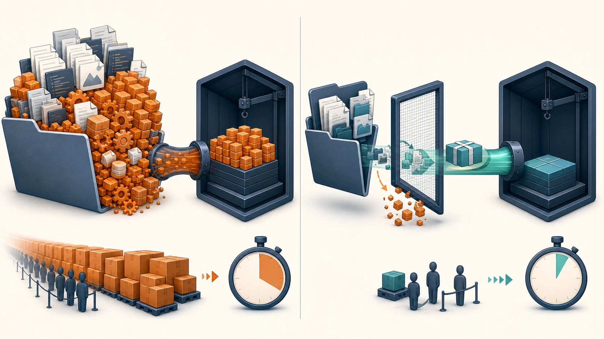
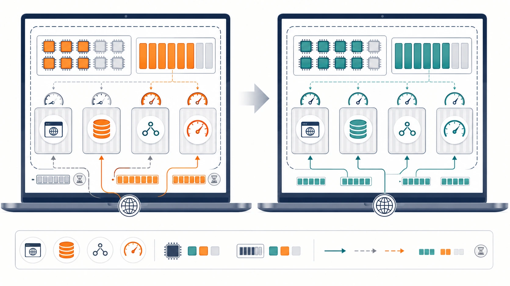
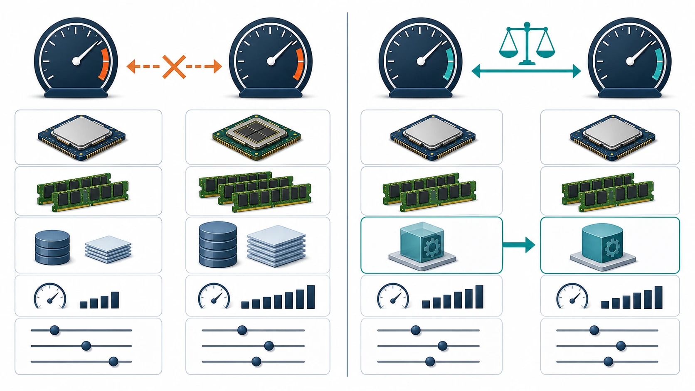

# ローカル環境の最適化

[チューニング目次へ戻る](../TUNING.md)

この記録はアプリのSQLやRust処理ではなく、Dockerイメージのビルド時間と、ベンチマークを実行するVMの条件を扱います。

## アプリ高速化と環境高速化を分ける

次の2つは別の指標です。

- アプリ高速化: 60秒ベンチで、正しく処理できるリクエストとスコアを増やす
- 環境高速化: コード変更後のbuild待ち、不要なファイル転送、VM資源不足を減らす

Docker buildが10秒速くなっても、負荷走行中のアプリが速くなったとは言えません。逆に、アプリのSQLを速くしても、毎回500MBをDockerへ送っていれば開発の反復は遅いままです。結果を混ぜずに記録します。

## 改善: Rustの `target/` をbuild contextから除外

### build contextとは

Dockerfileに `COPY` があるため、Dockerはビルドに使う可能性があるファイルをdaemonへ送ります。このファイル集合をbuild contextと呼びます。

たとえると、料理に必要な材料を作業台へ運ぶ工程です。使わない段ボールまで毎回運べば、調理前に時間がかかります。

### 何が起きたか

最初のDockerビルド時はホストにRustの `target/` がなく、contextは約32KBでした。その後、品質確認のためホストで `cargo test` とClippyを実行すると、コンパイル済み成果物が `target/` に約460MB生成されました。

`webapp` サービスのbuild contextは `webapp/rust/` です。リポジトリルートの `.dockerignore` は、この子contextには適用されません。そのため、次のDocker buildは `target/` を含む約467MBを送ろうとしました。

### 修正

`webapp/rust/.dockerignore` を追加しました。

```dockerignore
target/
```

Dockerfileはコンテナ内で `cargo build --release --locked` を行うため、ホストで作ったdebug/test成果物は使いません。除外しても生成されるアプリバイナリは変わりません。

### 効果

| 状態 | Rust build context |
|---|---:|
| ホストで `cargo test` 後、除外なし | 約467MB |
| `target/` 除外後 | 約32.5KB |

約14,000分の1になりました。転送時間、Colima VMのI/O、一時disk使用量を減らし、変更後のDocker再ビルドを早く開始できます。



*ホストの `target/` をfilterし、Dockerへ渡すcontextを約467MBから約32.5KBへ縮小します。*

### 他の選択肢

| 選択肢 | 問題 |
|---|---|
| 毎回ホストの `target/` を削除 | Cargoの増分ビルドcacheも失い、ローカルtestが遅くなる |
| リポジトリルートだけに `.dockerignore` を置く | build contextが `webapp/rust/` なので適用されない |
| ホストのバイナリをCOPY | macOSとLinux、CPU architecture、依存ライブラリの差で動かない |

## 改善: BuildKitでRustの再コンパイル結果を保持

build contextを小さくしても、legacy builderではRust source変更時にアプリcrateの過去の `target/` を再利用できませんでした。実際に `cargo build --release` が30分52秒かかりました。

プロジェクト専用 `DOCKER_CONFIG` がHomebrewのCLI plugin directoryを見ていなかったため、ComposeはBuildxを発見できずlegacy builderへfallbackしていました。`cliPluginsExtraDirs` へ既存plugin directoryを追加し、グローバルDocker設定を変更せずBuildKitを有効にしました。

BuildKitのcache mountへCargo registry、Git checkout、release targetを保存し、release incrementalとLLDをDocker build内だけで有効にしています。詳しい仕組みは [80-rust-implementation.md](./80-rust-implementation.md) を参照してください。

| build | Cargo時間 | Docker全体 |
|---|---:|---:|
| cache初回作成 | 4分08秒 | 6分15.24秒 |
| Rust source変更後 | 7.03秒 | 11.02秒 |

cacheが削除されたfresh環境では初回作成時間が必要です。再buildの11.02秒だけを初回構築時間として案内しません。

## 改善: build中は前回のISUCON stackを停止

前回起動したmatcherは旧アプリへpollingを続け、実測で約141% CPUを使用していました。MySQLも約1.4GiBを保持していました。

`scripts/benchmark.sh` はこのCompose projectのmatcher、nginx、webapp、dbを正常停止してからbuildします。build後の `up.sh` がすべて再開し、healthcheck成功後にベンチマーカーを起動します。

Colima全体や他projectのコンテナは停止しません。`docker pause` はComposeのstartと衝突したため使用しません。

## ColimaのCPU・メモリ

ColimaはmacOS上にLinux VMを作り、その中でDockerを動かします。`--cpu 4 --memory 4` は各コンテナへ4 CPUずつ与える意味ではなく、すべてのコンテナが合計4 CPU / 4 GiBを共有する意味です。

今回の初期条件は次のとおりです。

```text
CPU: 4
Memory: 4 GiB
Disk: 100 GiB
Runtime: Docker
VM: macOS Virtualization.Framework
```

この一連のベンチマークが完了するまで、ホストおよびColimaのCPU・メモリ割り当ては変更しません。アプリ変更前後の比較条件を固定するためです。

同じVMで次が動きます。

- Rust/Axum
- MySQL
- nginx
- matcher
- Goベンチマーカー
- 決済モック

公式環境ではベンチマーカーが別マシンです。ローカル同居構成は、アプリが速くてもベンチマーカー自身とCPUを取り合います。



*各コンテナへ同じ資源が個別に与えられるのではなく、VM全体の上限を全サービスで共有します。*

### 将来、別の実験として増やす場合

ホストに余裕がある場合の例です。

```sh
./scripts/down.sh
colima stop
colima start --cpu 8 --memory 12 --disk 100
./scripts/up.sh
```

資源を変えたスコアは、4 CPU / 4 GiBのスコアと直接比較しません。チューニング効果を測る間は条件を固定します。

上のコマンドは参考例であり、今回の検証では実行しません。

### なぜ自動で変更しないか

Colimaは他プロジェクトのコンテナも共有している場合があります。停止するとそれらも止まり、CPU・メモリ変更はホスト全体へ影響します。また、搭載メモリ量によって安全な値が異なります。

そのため、リポジトリのスクリプトからグローバルなColima設定は変更しません。利用者が影響を確認して明示的に変更します。

## MySQL設定をすぐ緩めない理由

ローカル限定なら、`innodb_flush_log_at_trx_commit` など耐久性設定を緩めて書き込みを速くする選択肢があります。しかし、電源断時に直近データを失う可能性が増え、アプリの改善とDB設定の効果が混ざります。

まずSQL回数、全件走査、N+1、不要transactionを減らします。MySQL設定を変更する場合は別ベンチマークとして、設定値・耐久性の差・変更前後スコアを記録します。



*比較する2走行では、変更対象以外のCPU、メモリ、データ、負荷、設定を固定します。*

## 再現性チェック

ベンチ結果には最低限、次を残します。

- Colima CPU / memory
- 走行時間
- app revision
- MySQL設定変更の有無
- 静的ファイル検証の有無
- アプリとベンチマーカーが同居か別ホストか

条件を記録しないスコアは、別の日や別のマシンで比較できません。
