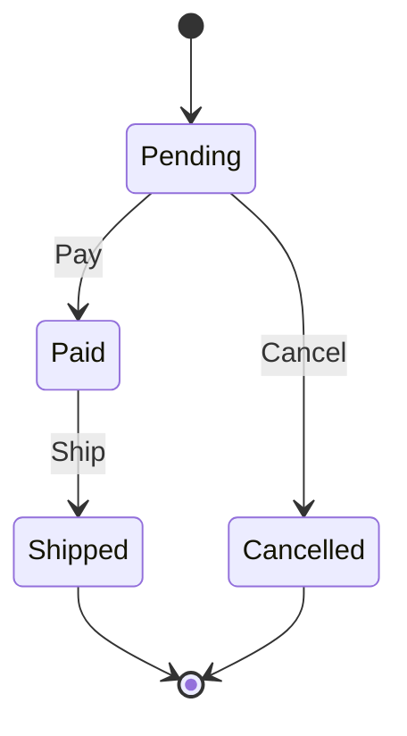

# Fundamentals of Software Engineering — Rust samples

`fundamentals-of-software` の `content/en/ch01.md`〜`ch15.md` の構成と、下記の節を確認して作った学習用サンプル集。
書籍の未定義メソッドを含むJava/Rubyの例と、設計・テストの考え方を、実行できるRustの例に具体化した。
翻訳用リポジトリの原文・翻訳ファイルは変更しない。

参照書籍: [Fundamentals of Software Engineering](https://learning.oreilly.com/library/view/fundamentals-of-software/9781098143220/)。
以下のRust実装と補足仕様は、このサンプル用に作成したもので、書籍の公式サンプルではない。

## 章と実装の対応

| 章・節 | 実装 | 確認できること |
|---|---|---|
| 第2章 Reading Tests for Insight、第3章 Write Code to Be Read、第6章 Add tests before refactoring | [pricing](src/pricing.rs) / [tests](tests/pricing.rs) | 500.00 → 450.00、明細35.00 → 31.50、境界値と整数オーバーフロー |
| 第3章 Favor Composition over Inheritance | [composition](src/composition.rs) / [tests](tests/composition.rs) | 車両が燃焼式・電動の動力部を持ち、航続距離の計算を委譲する |
| 第4章 Modeling、第5章 Automated Testing | [orders](src/orders.rs) / [tests](tests/orders.rs) | 注文を状態遷移として表し、未払いの出荷や支払い後のキャンセルを拒否する |
| 第8章 Repository pattern / Transactions / Prepared statements、第5章 Integration Tests | [storage](src/storage.rs) / [tests](tests/storage.rs) | 実際のSQLiteで口座間の送金を実行し、途中の失敗で残高が戻ることを確認する |
| 第10章 Environment-Specific Configurations / Error handling、第7章 The Importance of Good Error Messages | [config](src/config.rs) / [CLI tests](tests/cli.rs) | 環境変数の未設定と不正値を区別し、起動時の診断と終了コードを確認する |

全15章をコード化したものではない。第1章・第9章・第11〜15章の問題発見、設計判断、生産性、学習、対人スキル、キャリア、AI活用は、本サンプルの実装対象に含めていない。
第7章もGUI・アクセシビリティ全般を扱う例ではなく、CLIのエラー表示に限定している。

## 実行

Rust 1.90以上とCコンパイラが必要。Edition 2024を使用する。
`rusqlite` の `bundled` featureでSQLiteをビルドするため、DBサーバーやDockerは不要。

このディレクトリから実行する。

```sh
rtk cargo run --locked --bin pricing
rtk cargo run --locked --bin composition
rtk cargo run --locked --bin order_workflow
rtk cargo run --locked --bin transactions
rtk proxy env APP_PORT=3000 cargo run --locked --bin configuration
```

`transactions` の出力例:

```text
Committed: source=7000, destination=5000
Rejected: source account has insufficient funds
Unchanged: source=7000, destination=5000
Rolled back after debit: destination balance exceeds the supported amount
Source after rollback: 7000
```

設定の成功・失敗を比較するには次を実行する。設定例はポート番号を表示するだけで、HTTPサーバーは起動しない。

```sh
rtk proxy env -u APP_PORT cargo run --locked --bin configuration
rtk proxy env APP_PORT=0 cargo run --locked --bin configuration
```

未設定なら標準出力に `Configured port: 8080` を表示して終了する。
不正値なら標準エラーに `APP_PORT` の許容範囲を表示し、終了コード1を返す。入力された値自体は診断に含めない。

## 補った仕様とRustでの選択

1. **価格計算**: 金額は単一通貨の最小単位（例ではcent）の整数。第2章の割引開始額は500.00以上と定め、10%引き後の金額を最小単位で切り捨てる。顧客種別による割引は追加しない。第6章の明細計算は明示的な0〜100%の割引で、まとめ買い割引とは独立している。明細の積・合計を検査し、割引の途中計算には `u128` を使う。
2. **合成**: `Vehicle` が `Powertrain` を持つ。動力部の選択肢は閉じているため `enum` にする。燃料・電力量と一定の効率から計算する簡易モデルで、現実の走行条件や充放電を再現しない。
3. **注文モデル**: `Pending → Paid → Shipped` と `Pending → Cancelled` だけを許可する。不正な操作でも状態は変わらない。第4章のモデル化を実践するために作った題材で、決済処理、配送サービス、返金は実装していない。
4. **データ処理**: `accounts(id, balance_cents)` をSQLiteのSTRICT tableに保存する。IDは正の `i64`、残高は `0..=i64::MAX`。`10000 / 2000` から3000を送ると `7000 / 5000` になる。パラメータ付きSQLとImmediate transactionを使い、送金先がない場合、残高不足、入金先の桁あふれ、SQL実行失敗を扱う。SQLをrepository内に置き、複製したDBモックは使わない。
5. **設定管理**: `APP_PORT` は1〜65535。未設定時だけ8080を採用し、空文字、不正値、非Unicode値はエラーにする。純粋な解析関数と環境変数を読む入口を分け、テストは子プロセスの環境だけを変更する。

SQLiteは実際にSQLを実行するが、DBはメモリ内にあり、終了時に消える。既存のDBやユーザー設定を書き換えない。
送金例はトランザクションの学習用で、認証、監査、複数通貨、再試行時の重複防止、永続DBの運用は扱わない。

注文の状態図は [orders.rs](src/orders.rs) と対応する。



## 検証

```sh
rtk cargo fmt --check
rtk cargo clippy --locked --all-targets --all-features -- -D warnings
rtk cargo test --locked --all
rtk cargo test --locked --all --all-targets
rtk proxy cargo +1.90 test --locked --all --all-targets
```

価格計算は書籍の具体的な期待値、注文は正常・不正な遷移、SQLiteはコミットとロールバック、設定は解析とCLIの終了コードを検証する。
SQLエラーのテストでは入金側のUPDATEをSQLiteのトリガーで失敗させ、先に実行された出金も取り消されることと、元のDBエラーが保持されることを確認する。

2026-10-03、macOS / Apple Siliconで検証した結果:

- Rust 1.99.0: fmt・Clippy成功、26テスト成功。
- Rust 1.90.0: 同じlockfileで26テスト成功。
- 5つのバイナリ: 上記の実行コマンドで正常終了と表示内容を確認。
- 設定エラー: CLIテストで空文字・範囲外・非Unicode値の終了コード1を確認。
- 構造診断: 11ソースファイルを対象に、指定の閾値で重複関数と顕著なhotspotを検出しなかった。

構造診断:

```sh
rtk proxy similarity-rs src --skip-test --threshold 0.90 --min-lines 10
rtk proxy cargo coupling . --exclude-tests --hotspots=10
```

読み進める際は `tests/pricing.rs → src/pricing.rs → src/bin/pricing.rs` の順に、期待する動作から入口まで追える。
次に `tests/storage.rs` と `src/storage.rs` で、アプリケーション側の検証とDB側の制約、トランザクションの境界を比較する。

利用したAPIの資料: [rusqlite](https://docs.rs/rusqlite/0.40.2/rusqlite/) / [thiserror](https://docs.rs/thiserror/2.0.21/thiserror/)。
