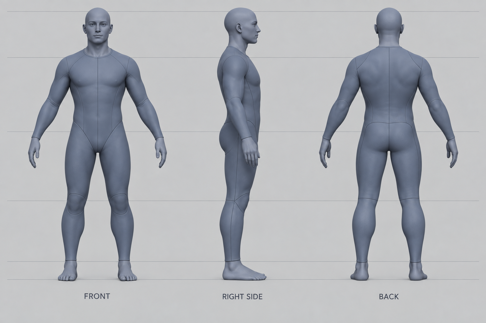

# モデル構造設計

## 3面図の確認

組み込みの画像生成ツールで [プロンプト](02-three-view-prompt.txt)を実行した。頭頂・肩・腰・膝・足裏の高さは概ねそろい、側面の頭蓋と上背部、背面の腰の絞りが読み取れる。指や布の縫い目は造形の必須要素にしない。生成図の指や左右対称性は測定用の資料ではない。

## 実装する構造

| 部分 | 形状と接続 | 動作中に保つもの |
|---|---|---|
| 胸郭・腹・骨盤 | 高さごとの楕円断面を接続した単一の胴体。側面の前後幅を別々に指定する | 骨盤を原点にした胸と肩の関節位置、既存の身体の外形範囲 |
| 頭・首 | 顎から頭頂までの断面、前後で異なる厚み。小さい鼻と目で前方向を示す | 頭・首のランドマーク、寝技中の接地範囲 |
| 上腕・前腕・太腿・すね | 長さ方向に太さが変わる回転面。肘・膝・肩の接続部へ重ねる | 二節IKの骨長と先端目標。関節部の丸みは外形の連続を補う |
| 手・足 | 手掌は簡略化。足は踵を絞り、足裏を平らにした丸い外形 | 手と足の厚み。すねが立っている足は身体の前へ向ける |
| 骨格 | 既存の脊柱・肋骨・骨盤・四肢を共通ランドマークから表示 | 身体との位置関係、透過・骨格の切り替え |

表示用の身体を、実在の組織が連続して変形する皮膚とは扱わない。胴体は一つの剛体、四肢は骨に沿う部品で、関節表面は重なりで接続する。肩甲骨の独立運動、指、筋肉の収縮、布の変形は追加しない。

骨長と保存済みルートの互換性を優先し、基準立位の高さは既存リグに合わせて約1.61mになる。生成時の約1.68mという目安を拡大率として既存ポーズへ適用しない。座標はm、+Y上、顔はローカル+Z。

## 工程を確認できる形にする

`/_model-audit.html` で同じモデルの正面・右側面・背面を並べ、骨格とワイヤーフレームを確認する。姿勢は基準立位とマウント・ハーフガード・タートル・腕十字を選ぶ。同じ画面に三角形数・geometry数・描画呼び出し数を表示し、変更前、造形後、最適化後の結果を残す。

最適化は造形を確認した後に行う。固定部分の結合、共通形状の再利用、曲面の分割数を検討する。必要な輪郭と接地検査を落とさず、実測した量だけを報告する。
