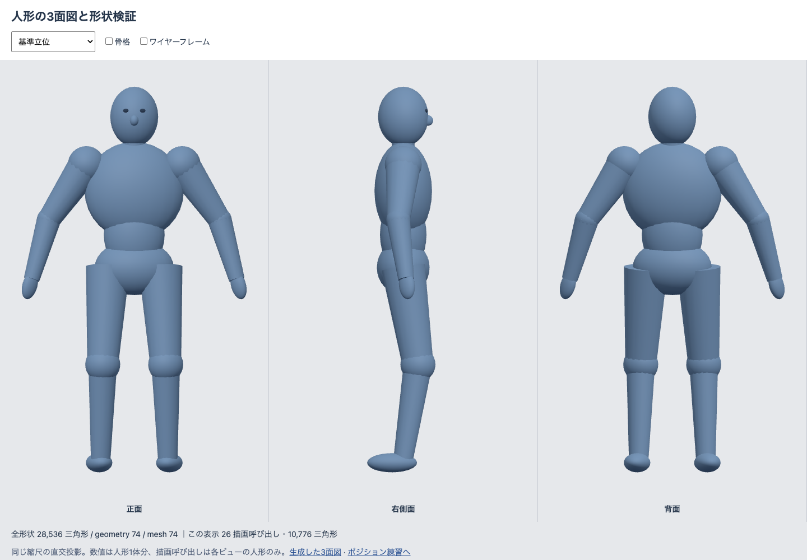
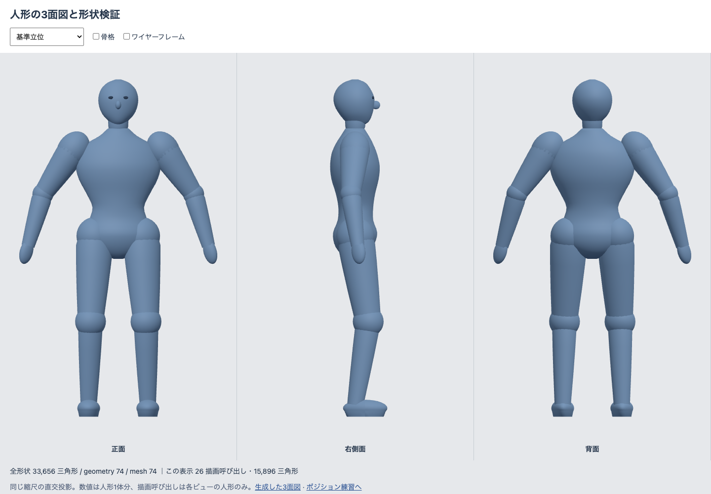
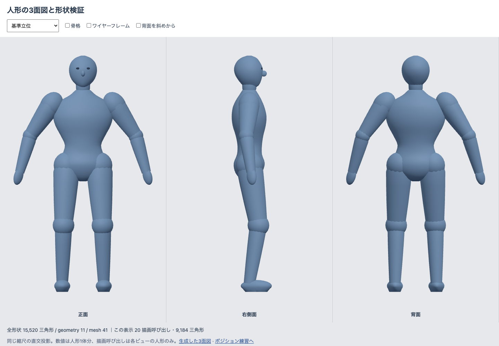

# モデリングと比較

生成した3面図から、胸郭→腰→骨盤の輪郭、頭蓋の奥行きと顎、四肢の太さの変化、踵から足先への形を採用した。断面を曲線で補間し、周方向の面をつなぐ。顔は前方向を示す小さい鼻と目、手は手掌の模式図にする。

胴体を3つの楕円体から一つの連続した断面形状へ変更した。頭は顎側を絞り、前側と後頭部の奥行きを別々に指定した。肩と股関節には接続部の丸みを置き、上腕・前腕・太腿・すねは長さ方向に太さを変えた。

比較用の基準立位で、以前の足先が後ろを向いていることを確認した。すねが立つ姿勢では身体の前へ足を向けるように修正し、足裏の高さと一緒にテストした。新しい股関節の外形も床の検査へ加え、寸法は描画と検査で共通にした。

## 同じカメラ・縮尺での比較

変更前：

造形後・最適化前：

最適化後：

## 寝技と骨格で確認

[骨格](assets/optimized-skeleton.png)、[ワイヤーフレーム](assets/optimized-wireframe.png)、[斜め後ろ](assets/optimized-oblique.png)も保存した。確認画面は立位、マウント、ハーフガード、タートル、腕十字に対応する。寝技ではカメラの基準をマットの軸で表示し、反転した身体の背面を「正面」と呼ばない。

モデル単体に加え、練習画面の二人とマットでも接地・重なりを確認する。幾何検査では全練習ポーズと既存ロールポーズのメッシュ頂点を床と比較し、骨長と相手の体幹中心への侵入も検証する。

[ハーフガードの変更前](assets/before-half-side.png)と[更新後](assets/optimized-half-side.png)は、同じ練習状態・側面カメラで比較できる。
